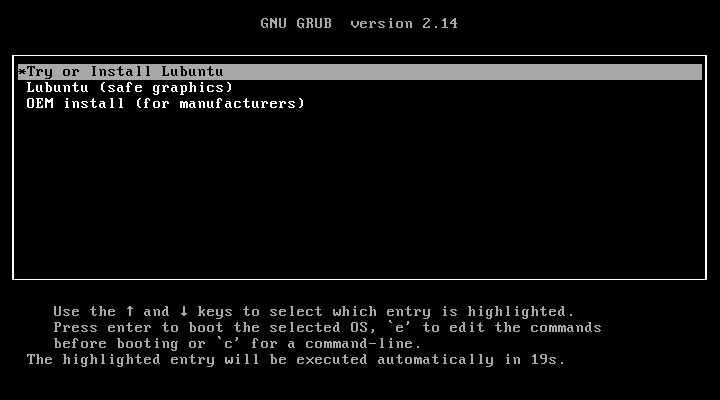
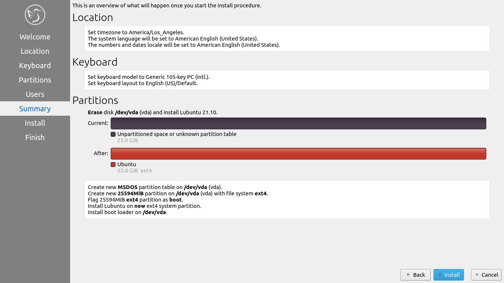
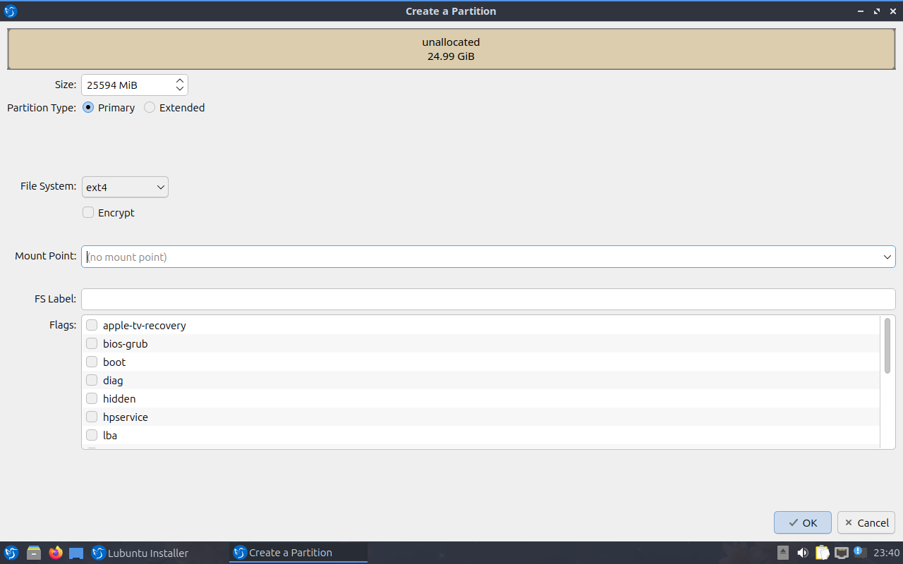

Chapter 1.3 Installation
========================
This is a guide through the installation process of Lubuntu.

Starting the installer
----------------------

At the start of the boot process a grub splash screen will be shown. To install select :menuselection:`Try or Install Lubuntu`. If Lubuntu has a problem with your graphics card like newer nvidia cards select :menuselection:`Lubuntu (safe graphics)`. To test your ram select :menuselection:`Test memory`.

Once you have booted into the live session, feel free to explore Lubuntu and make sure all your hardware works. Once you are ready to install Lubuntu, double click the icon in the top-left corner of the desktop :guilabel:`Install Lubuntu 22.04`.

.. image:: live_session.png

You will be taken to the Lubuntu installer Welcome screen. You can change the installer language in the :guilabel:`Language` drop down box. After selecting the language the :guilabel:`Next` button will move you on to the next task. To cancel an installation press the :guilabel:`Cancel` button.

.. image:: welcome_installer.png

Selecting Your location
-----------------------

The next screen will show you a map of the world where you can choose your location. Your location will be used to set your time zone and download server. To see what region you have chosen use the :guilabel:`Region` drop down menu. The :guilabel:`Zone` field should have a major city with the same time as you. If you want to get to the your time zone manually faster you can type in the name of a big city in the same time zone. Towards the bottom you can to change your system language by pressing the upper :guilabel:`Change` button. To change the how numbers and dates appear on your system press the lower :guilabel:`Change` button. To move to the next step once again press the :guilabel:`Next` button. To move back to selecting your language to change your language press the :guilabel:`Back` button.

.. image:: location.png

Selecting Keyboard Layout
-------------------------

Next select your keyboard layout, you can check your keyboard matches the keyboard shown picture shown. The :guilabel:`Keyboard Model` menu lets you choose different variants, the left column lets you change language, and the right column gets different variants. At the bottom you can type to make sure your layout is correct. When you have selected your keyboard layout press the :guilabel:`Next` button to move on.

.. image:: keyboard.png

Setting up partitions
---------------------

If all you want is Lubuntu on your machine, you can select the :guilabel:`Erase disk` button. This will format the disk and **delete all data on the disk**,  which is why having your data backed up before this point is extremely important. If you choose to do this you can continue on to user setup. To change the storage device to install Lubuntu on use the :guilabel:`Select Storage device` drop down menu. To choose to use a swap file under :guilabel:`Erase disk` keep :menuselection:`Swap to file` or to not use swap choose :menuselection:`No Swap`. If you want to encrypt your drive press the :guilabel:`Encrypt system` checkbox and then you will need to enter the encryption passphrase twice make sure you have it typed in correctly. It is strongly advised to write down this passphrase and keep it somewhere safe.

.. warning::
   Erasing your entire disk or partition may cause you to lose data so please backup beforehand.

.. image:: partitioning.png 

.. note:: 
   If you had a previous Linux install with swap you will need to unmount the swap. To do this run 
.. code:: 

   sudo swapoff -a
  
which will unmount them and any swap partitions. This will not work if you have data partition mounted open PCManFM-Qt and press the upward pointed arrow on each partition in the :guilabel:`Places` sidebar to unmount all data partitions. 

To move back to Selecting your keyboard layout press the :guilabel:`Back` button. To advance to the setting up users press the :guilabel:`Next` button.

User Setup
----------
The user setup section creates a user profile, consisting of typing your name into the :guilabel:`What is your name?` field. Next type your username in the :guilabel:`What name do you want to use to log in?`. Put what you want your hostname of your computer to be in the :guilabel:`what is the name of this computer?` field. The last thing you need to enter is your password in the :guilabel:`Choose a password to keep your account safe`.  Enter your password twice to make sure you have not mistyped it. If a name can actually be used as a username or hostname a green checkmark will appear to the right of it if you cannot a red x will appear. Pressing the :guilabel:`Next` button will give you a summary screen, showing you the settings before the install begins. Once you have checked the summary click the :guilabel:`Install` button to begin the installation. 

.. image::  user_setup.png

After pressing the :guilabel:`Install` button a dialog will pop up to confirm installation. To actually install press the :guilabel:`Install now` button. To not start installing and go back press the :guilabel:`Go back` button.

The Install
-----------
The Lubuntu installer provides some useful information while the installer is running. On the bottom of the window is a progress bar. On the right end of the progress bar is the percentage of the installation complete. Once Lubuntu is installed you have a checkbox :guilabel:`Reboot now` after your Lubuntu is installed and is now finished. There is a slideshow while you install and to move to the next slide left click and to move to the previous slide right click.

.. image:: installer_screen.png

Rebooting into the finished install
-----------------------------------

After the install is finished you will need to reboot your system into your new install. If you want to continue using the live system but end the installer uncheck the :guilabel:`Reboot now` checkbox. To close the installer press the :guilabel:`Done` button. After this your computer will reboot and you should remove your install media.

Manual partitioning
-----------------------
.. Warning::
   Trying to use nonlinux filesystems such as NTFS or FAT as your root filesystem will result in a broken system.

If you wish to manual set up partitions, as an advanced option you will have to choose which file-system you want. A file-system controls how your files are accessed at lower levels on the disk. If you are booting your computer in UEFI mode a more modern firmware compared to BIOS you will need to create an EFI system partition (see `efi system partition Wikipedia <https://en.wikipedia.org/wiki/EFI_System_partition>`_ for more detail). To create this partition you will need a FAT32 file-system with the ESP flag to be mounted at /boot/efi/ under the mount point. You will also need a root (/) file-system, several file-systems included for Lubuntu are Ext4, XFS, and Btrfs. Lubuntu 22.04 has bug with installing BTRFS and `This guide on Lubuntu discourse <https://discourse.lubuntu.me/t/getting-lubuntu-22-04-to-install-with-btrfs/3273/>`_

.. image:: manpartitioning.png

.. Warning::
    Creating a new partition table will erase all data on the drive and deleting a partion will delete all data on the partition.

If you have a new hard disc or solid state drive press the :guilabel:`New Partition table` button but this will delete the whole disc if you have any data on it. After pressing this button you will get a dialog saying what kind of partition table to use. The :guilabel:`Master Boot Record` button will create an old partition table but will only allow 4 primary partitions and partitions up to 2 Terabytes. The :guilabel:`GUID Partition Table` button works for large discs but may not be recognized by legacy operating systems. To get back to your main partitioning window press the :guilabel:`OK` button.

To change what disc you are partitioning use the :guilabel:`Storage device` drop down menu.

You can create partition by clicking the :guilabel:`Create` button which will bring up a dialog. The file system field is a drop down menu, select which file-system you want. You also need to select where you want to mount the partition in the :guilabel:`Mount Point` drop down menu. To change how big to make the partition change the :guilabel:`Size` field. To change the size or type of a partition after initially creating it press the :guilabel:`Edit` button. To delete a partition press the :guilabel:`Delete` button. You will need at least one root (/) partition and if you are booting an EFI system you will also need a /boot/efi mounted partition. Another common option is to have all your data on its own partition, which can even be on its own separate physical disk this can be mounted at /home. If you want to encrypt your your filesystem check the :guilabel:`Encrypt` checkbox. Then two fields will appear to get write type your encryption passphrase twice to confirm it. To add a label for this partition enter it into the :guilabel:`FS Label` field.

To go back on all your changes to the previous state press the :guilabel:`Revert All Changes` button. To change what device your computer will boot off of you will need to use the :guilabel:`Install boot loader on` drop down menu to select which disc to boot off of. 

In the center of the manual partitioning window shows you what name of the partition is. What type of filesystem is displayed in the :guilabel:`File System` column. To see where your partition is mounted are shown in the :guilabel:`Mount Point` column. The size of the system is shown in the :guilabel:`Size` Column.

The top of the manual partitioning window shows a visual bar showing size of your partitions on top. Below it shows each partition on your drive with the color it is in the bar graph and the size of the partition.
