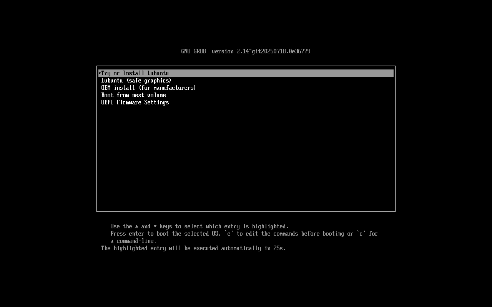
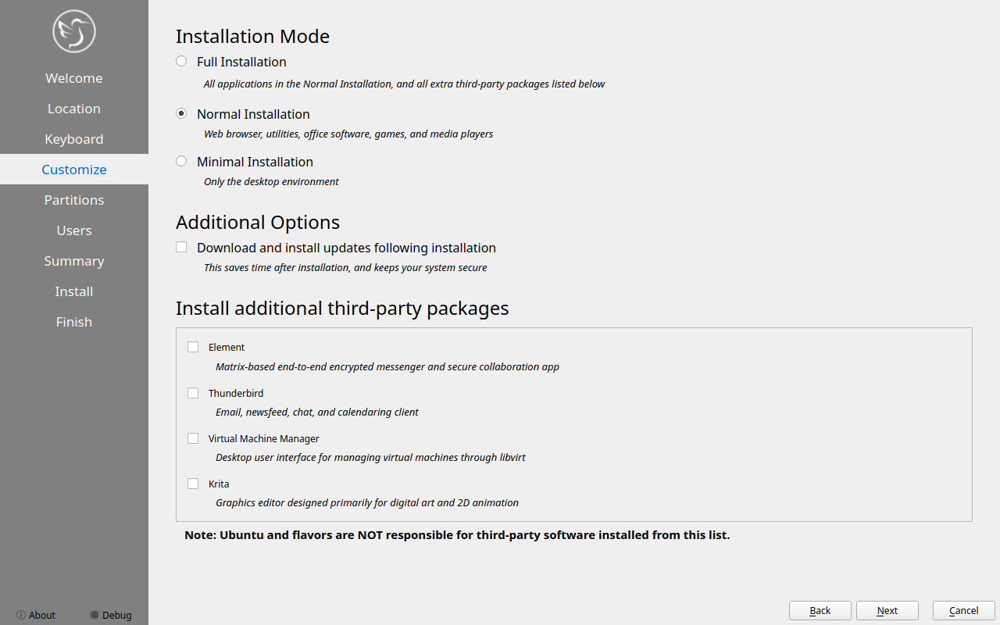
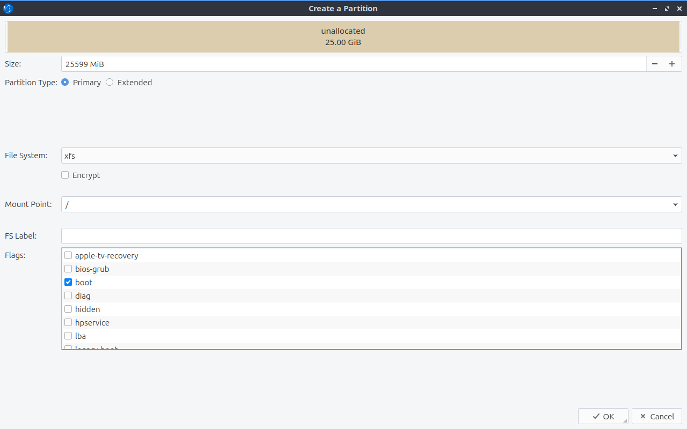
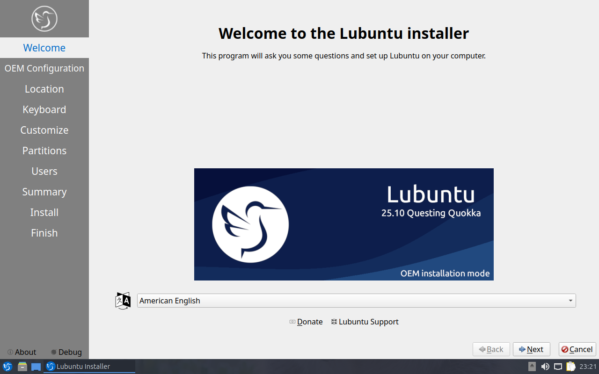
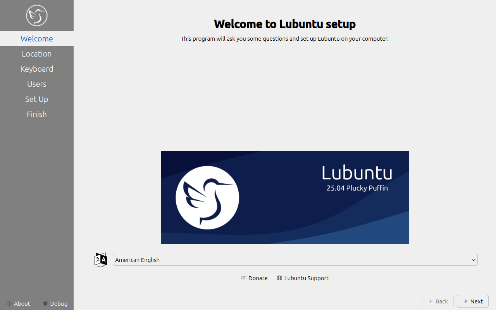

Chapter 1.3 Installation
========================
This is a guide through the installation process of Lubuntu.

Starting the installer
----------------------

At the start of the boot process, a GRUB splash screen will be shown. To install select :menuselection:`Try or Install Lubuntu`. If you have a problematic graphics card, select :menuselection:`Lubuntu (safe graphics)` (for example, some NVIDIA cards will need this.) To test your RAM, select :menuselection:`Test memory`.

The next screen will present a choice between :guilabel:`Try Lubuntu`, which will give you a live session to run Lubuntu as you see fit, or run the installer directly with :guilabel:`Install Lubuntu`. Above this there is a field to select which language you want to install in the :guilabel:`Select Your Language` drop down. To get this screen in your language, select one then press the :guilabel:`Confirm` button. If you need more advanced network settings to install Lubuntu than just connecting to Wi-Fi use the :guilabel:`Try Lubuntu` choice. If choose :guilabel:`Install Lubuntu` the installer will start right away and install in your language. At the bottom of your screen if you are connected to the internet automatically like with an ethernet cable it will say :guilabel:`Connected` at the bottom. If you are not connected to the internet at the bottom it will say :guilabel:`Not Connected`.

.. image:: installer-prompt.png

Once you have booted into the live session, feel free to explore Lubuntu and make sure all your hardware works. Once you are ready to install Lubuntu, double click the icon in the top-left corner of the desktop :guilabel:`Install Lubuntu 24.04 LTS` or :menuselection:`System Tools --> Install Lubuntu 24.04 LTS`.

.. image:: live_session.png

You will be taken to the Lubuntu installer Welcome screen. You can change the installer language in the :guilabel:`Language` drop down box. After selecting the language the :guilabel:`Next` button will move you on to the next task. To cancel an installation press the :guilabel:`Cancel` button. On the left side of the installer is a sidebar that shows what installation step you are on.

.. image:: welcome_installer.png

Selecting Your location
-----------------------

The next screen will show you a map of the world where you can choose your location. Your location will be used to set your time zone and download server. To see what region you have chosen use the :guilabel:`Region` drop down menu. The :guilabel:`Zone` field should have a major city with the same time as you. If you want to get to the your time zone manually faster you can type in the name of a big city in the same time zone. Towards the bottom you can to change your system language by pressing the upper :guilabel:`Change` button. To change the how numbers and dates appear on your system press the lower :guilabel:`Change` button. To switch certain keys on your keyboard use the :guilabel:`Switch Keyboard` drop down. To move to the next step once again press the :guilabel:`Next` button. To move back to selecting your language to change your language press the :guilabel:`Back` button.

.. image:: location.png

Selecting Keyboard Layout
-------------------------

Next select your keyboard layout, you can check your keyboard matches the keyboard shown picture shown. The :guilabel:`Keyboard Model` menu lets you choose different variants, the left column lets you change language, and the right column gets different variants. At the bottom you can type to make sure your layout is correct. To test your keyboard is working type in :guilabel:`Type here to test your keyboard` field. When you have selected your keyboard layout press the :guilabel:`Next` button to move on. To view a preview of what this keyboard layout looks like look at the top of the window.

.. image:: keyboard.png

Customize
---------

Next will bring a choice of what applications to install, additional third party drivers, or to install updates with the installation. To choose to install all applications and the list of the third party applications choose :guilabel:`Full Installation`. To choose the normal applications included in Lubuntu select the :guilabel:`Normal Installation` button. To choose a minimal installation of just the desktop environment select the :guilabel:`Minimal Installation` button. To install updates while installing check the :guilabel:`Download and install updates following installation` checkbox. To install third party and maybe proprietary drivers check the :guilabel:`Install third-party software for graphics, WiFi hardware, and additional media formats` checkbox.

Pick which particular additional applications you wish to install there are checkboxes for each program under :guilabel:`Install additional third party packages`. To install Element for encrypted Matrix chat check the :guilabel:`Element` checkbox. To install the Thunderbird email and calendering client check the :guilabel:`Thunderbird checkbox`. To install virt-manager to manage running virtual machines on Lubuntu check the :guilabel:`Virtual Machine Manager` checkbox. To make digital art check the checkbox for :guilabel:`Krita`.

To go to the next part of installation press the :guilabel:`Next` button. To go to selecting your keyboard again press the :guilabel:`Back` button.

Setting up partitions
---------------------

If all you want is Lubuntu on your machine, you can select the :guilabel:`Erase disk` button. This will format the disk and **delete all data on the disk**,  which is why having your data backed up before this point is extremely important. If you choose to do this you can continue on to user setup. To change the storage device to install Lubuntu on use the :guilabel:`Select Storage device` drop down menu. To see whether you are installing in uefi or bios mode is shown in the top left corner of this window. To choose to use a swap file under :guilabel:`Erase disk` keep :menuselection:`Swap to file` or to not use swap choose :menuselection:`No Swap`. To choose which filesystem to use the drop down on the right to choose which filesystem you want to use. If you want to encrypt your drive press the :guilabel:`Encrypt system` checkbox and then you will need to enter the encryption passphrase twice to make sure you have it typed in correctly. It is strongly advised to write down this passphrase and keep it somewhere safe. 

.. warning::
   Erasing your entire disk or partition may cause you to lose data so please backup beforehand.

.. image:: partitioning.png 

.. note:: 
   If you had a previous Linux install with a swap partition you will need to unmount the swap. To do this run 
.. code:: 

   sudo swapoff -a; sudo swapon /dev/zram0
  
which will unmount them and any swap partitions while still leaving zram enabled. This will not work if you have data partition mounted open PCManFM-Qt and press the upward pointed arrow on each partition in the :guilabel:`Places` sidebar to unmount all data partitions. 

To move back to Selecting your keyboard layout press the :guilabel:`Back` button. To advance to the setting up users press the :guilabel:`Next` button.

User Setup
----------
The user setup section creates a user profile, consisting of typing your name into the :guilabel:`What is your name?` field. Next type your username in the :guilabel:`What name do you want to use to log in?`. Put what you want your hostname of your computer to be in the :guilabel:`what is the name of this computer?` field. The last thing you need to enter is your password in the :guilabel:`Choose a password to keep your account safe`.  Enter your password twice to make sure you have not mistyped it. If a name can actually be used as a username or hostname a green checkmark will appear to the right of it if you cannot a red x will appear. Pressing the :guilabel:`Next` button will give you a summary screen, showing you the settings before the install begins. Once you have checked the summary click the :guilabel:`Install` button to begin the installation. 

.. image::  user_setup.png

The summary screen shows what settings will be installed and you can double check everything is how you want it. After pressing the :guilabel:`Install` button a dialog will pop up to confirm installation. To actually install press the :guilabel:`Install now` button. To not start installing and go back press the :guilabel:`Go back` button.

The Install
-----------
The Lubuntu installer provides some useful information while the installer is running. On the bottom of the window is a progress bar. On the right end of the progress bar is the percentage of the installation complete. To see command line output of the install press the :guilabel:`Magnifying glass` button. Once Lubuntu is installed you have a checkbox :guilabel:`Reboot now` after your Lubuntu is installed and is now finished. There is a slideshow while you install and to move to the next slide left click and to move to the previous slide right click.

.. image:: installer_screen.png

Rebooting into the finished install
-----------------------------------

After the install is finished you will need to reboot your system into your new install. If you want to continue using the live system but end the installer uncheck the :guilabel:`Reboot now` checkbox. To close the installer press the :guilabel:`Done` button. After this your computer will reboot and you should remove your install media.

Manual partitioning
-----------------------
.. Warning::
   Trying to use nonlinux filesystems such as NTFS or FAT as your root filesystem will result in a broken system.

If you wish to manual set up partitions, as an advanced option you will have to choose which file-system you want. A file-system controls how your files are accessed at lower levels on the disk. If you are booting your computer in UEFI mode a more modern firmware compared to BIOS you will need to create an EFI system partition (see `efi system partition Wikipedia <https://en.wikipedia.org/wiki/EFI_System_partition>`_ for more detail). To create this partition you will need a FAT32 file-system with the ESP flag to be mounted at /boot/efi/ under the mount point. You will also need a root (/) file-system, several file-systems included for Lubuntu are Ext4, XFS, and Btrfs. Lubuntu 22.04 has bug with installing BTRFS and `This guide on Lubuntu discourse <https://discourse.lubuntu.me/t/getting-lubuntu-22-04-to-install-with-btrfs/3273/>`_

.. image:: manpartitioning.png

.. Warning::
    Creating a new partition table will erase all data on the drive and deleting a partition will delete all data on the partition.

If you have a new hard disk or solid state drive press the :guilabel:`New Partition table` button but this will delete the whole disc if you have any data on it. After pressing this button you will get a dialog saying what kind of partition table to use. The :guilabel:`Master Boot Record` button will create an old partition table but will only allow 4 primary partitions and partitions up to 2 Terabytes. The :guilabel:`GUID Partition Table` button works for large discs but may not be recognized by legacy operating systems. To get back to your main partitioning window press the :guilabel:`OK` button.

To change what disk you are partitioning use the :guilabel:`Storage device` drop down menu.

You can create partition by clicking the :guilabel:`Create` button which will bring up a dialog. The file system field is a drop down menu, select which file-system you want. You also need to select where you want to mount the partition in the :guilabel:`Mount Point` drop down menu. To change how big to make the partition change the :guilabel:`Size` field. To change the size or type of a partition after initially creating it press the :guilabel:`Edit` button. To delete a partition press the :guilabel:`Delete` button. You will need at least one root (/) partition and if you are booting an EFI system you will also need a /boot/efi mounted partition. Another common option is to have all your data on its own partition, which can even be on its own separate physical disk this can be mounted at /home. If you want to encrypt your your filesystem check the :guilabel:`Encrypt` checkbox. Then two fields will appear to get write type your encryption passphrase twice to confirm it. To add a label for this partition enter it into the :guilabel:`FS Label` field.

To go back on all your changes to the previous state press the :guilabel:`Revert All Changes` button. To change what device your computer will boot off of you will need to use the :guilabel:`Install boot loader on` drop down menu to select which disc to boot off of. 

In the center of the manual partitioning window shows you what name of the partition is. What type of filesystem is displayed in the :guilabel:`File System` column. To see where your partition is mounted are shown in the :guilabel:`Mount Point` column. The size of the system is shown in the :guilabel:`Size` Column.

The top of the manual partitioning window shows a visual bar showing size of your partitions on top. Below it shows each partition on your drive with the color it is in the bar graph and the size of the partition.

OEM Installs
------------

To install Lubuntu in an OEM mode for distributing to someone else on the grub boot splash select :menuselection:`OEM install (for manufacturers)` or from the panel menu :menuselection:`System Tools --> Install Lubuntu 24.04 LTS (OEM mode)`. Then you will be asked if you are sure you want to install in OEM mode and to actually install in OEM mode press the :guilabel:`Yes` button. Then the installer will say have a welcome screen that will say it is in OEM mode will show up. To change what language to use for installation use the drop down bar under :guilabel:`OEM installation mode`. To move to the next step of installation press the :guilabel:`Next` button.

To set a name for what to call this preinstalled system you are installing to ship to someone enter that in the :guilabel:`Batch` field. To move to the next part press :guilabel:`Next` To go back to welcome press the :guilabel:`Back` button. Then the :guilabel:`Location`, :guilabel:`Keyboard`, :guilabel:`Customize`, and :guilabel:`Partitions` sections are the same as a normal installation. Then for the OEM install you will not be able to make a username as the end user you ship to will use that. To choose a hostname enter in the :guilabel:`What is the name of this computer?` field. Then you will enter a password twice with :guilabel:`Choose a Password to keep your account safe` field. To have your OEM install log in automatically check the :guilabel:`Log in automatically without asking for the password` checkbox. To move to the next part of installation press the :guilabel:`Next` button.

Then a summary screen shows what settings are for your users. To actually begin installing press the :guilabel:`Install` button and then to confirm that this is what you want press the :guilabel:`Install Now` button.

Oem User Setup
--------------

To setup your user setup for an oem preinstalled system :menuselection:`System Tools ---> Finish OEM prepartion`. Then you will be asked if you want to finish oem setup and then a wizard will be run next boot. Then press :guilabel:`Yes` to confirm this. Then you will need to reboot to run the user setup.

The first section of user setup will ask you what language to continue in at the very bottom. To go to the next part of Lubuntu setup press the :guilabel:`Next` button.

Next you will need to select your time zone in the :guilabel:`Region` and :guilabel:`Zone` fields with a world map above them to tell you what time it is set to. To set what language the system will boot into press the :guilabel:`Change` button next to :guilabel:`The system language will be set to` field. To change how date and number formatting press the :guilabel:`Change` button next to :guilabel:`The numbers and dates locale will be set to` field. To go to the next part of Lubuntu setup press the :guilabel:`Next` button.

The next part of setup will have be selecting your keyboard layout. To change the what kind of keyboard model you are using change the :guilabel:`Keyboard model` field. The left column sets the language of your keyboard while the right column selects a layout for that keyboard. In the bottom left hand corner you type to make sure what you think you are typing matches what is being input. To set a key to change keyboard layout select one from the :guilabel:`Switch keyboard` field. To move on to setup your users press the :guilabel:`Next` button.

Next is to set up your users for your computer. To then enter your name in the :guilabel:`What is your name` field. To enter your username in the :guilabel:`login` field. Enter your hostname in :guilabel:`What is the name of your computer`. Then type your password twice to make sure you didn't mistype in in the fields under :guilabel:`Choose a password to keep your account safe` field. To login automatically check the :guilabel:`Log in automatically without asking for the password` checkbox. 

Next step to finalize creating users and keyboard and language settings press the :guilabel:`Set Up` button. At this point you will be asked to confirm because you cannot undo after this step. To continue with all your settings press the :guilabel:`Set Up Now`. Then the users will set up with a slideshow and you will then reboot and then can login to reboot and use Lubuntu is ready to use.
