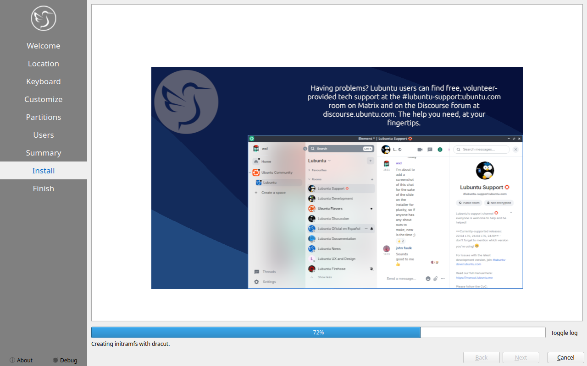

Chapter 1.3 Installation
========================
This is a guide to through the installation process of Lubuntu.

Starting the installer
----------------------

Once you have booted the Lubuntu image, you will be greeted by a screen with the following options: Start Lubuntu, Check disk for defects, Test RAM, and Boot from first hard disk. To start the install select :guilabel:`Start Lubuntu`, you will now be booting into a live session. The :guilabel:`Check disk for defects` option offers a way to check integrity of the disk image once it is burned to the media please use this if you have problems installing it could be bad media. 

.. image:: boot_installer.png

Once you have booted into the live session, feel free to explore Lubuntu and make sure all your hardware works. Once you are ready to install Lubuntu, double click the icon in the top-left corner of the desktop :guilabel:`Install Lubuntu 19.04`. 

.. image:: live_session.png

You will be taken to the Lubuntu installer Welcome screen. You can change the installer language in the :guilabel:`Language` drop down box. After selecting the language the :guilabel:`Next` button will move you on to the next task.

.. image:: welcome_installer.png

Selecting Your location
-----------------------

The next screen will show you a map of the world where you can choose your location. Your location will be used to set your time zone and download server. On the bottom of the window there is a place to change your system language.  To move to the next step once again press the :guilabel:`Next` button. To move back to selecting your language to change your language press the :guilabel:`Previous` button.

.. image:: location.png

Selecting Keyboard Layout
-------------------------

Next select your keyboard layout, you can check your keyboard matches the keyboard shown picture shown. At the bottom you can type to make sure your layout is correct. The :guilabel:`Keyboard Model` menu lets you choose different layouts and the right column gets different variants. When you have selected your keyboard layout press the :guilabel:`Next` button to move on.

.. image:: keyboard.png

Setting up partitions
---------------------

If all you want is Lubuntu on your machine, you can select the :guilabel:`Erase disk` button. This will format the disk and **delete all data on the disk**,  which is why having your data backed up before this point is extremely important. If you choose to do this you can continue on to user setup. To change the storage device use the :guilabel:`Select Storage device` drop down menu. 

.. warning::
   Erasing your entire disk or partition may cause you to lose data so please backup beforehand.

.. image:: partitioning.png 

.. info:: 
   If you have had  a previous linux install and want to put the entire disk or just replace an entire partition you will need to unmount them. In this case running  

.. code:: 

   sudo swapoff -a
  
will unmount them and any partitions with data mounted can be unmounted through pcmanfm-qt.

If you wish to perform advance partitioning please refer the Advanced partitioning section.

User Setup
----------
The user setup section creates a user profile, consisting of your own name and the username you will use to log in. The next input field is the hostname of your computer. The final field is your password. Enter your password twice to make sure you have not mistyped it. Pressing the next button will give you a summary screen, showing you the settings before the install begins. Once you have checked the summary click the :guilabel:`Next` button to begin the installation.

The Install
-----------
The Lubuntu installer provides some useful information while the installer is running. Once Lubuntu is installed you have a checkbox :guilabel:`Reboot now` after your Lubuntu is installed and is now finished.

Manual partitioning
-----------------------

If you wish to manual set up partitions, as an advanced option you will have to choose which file-system you want. A file-system controls how your files are accessed at lower levels on the disk. If you are booting your computer in UEFI mode a more modern firmware compared to BIOS you will need to create an EFI system partition see  `efi system partitionwikipedia <https://en.wikipedia.org/wiki/EFI_System_partition>`_ for more detail to create this partition you will need a FAT32 file-system with the ESP flag with to be mounted at /boot/efi/ under the mount point. You will also need a root (/) file-system, several file-systems included for Lubuntu are Ext4, XFS, and Btrfs. 

.. image:: manpartitioning.png

If you have a new hard disc or solid state drive press the :guilabel:`New Partition table` button but this will delete the whole disc if you have any data on it. After pressing this button you will get a dialog saying what kind of partition table to use. The :guilabel:`Master Boot Record` button will create an old partition table but will only allow 4 primary partitions and partitions up to 2 Terabytes. The :guilabel:`GUID Partition Table` button works for large discs but may not be recognized by legacy other operating systems. To get back to your main partitiong window press the :guilabel:`OK` button.

To change what disc you are partioning use the :guilabel:`Storage device` drop down menu.

You can create partition by clicking the :guilabel:`Create` button which will bring up a dialog. The file system field is a drop down menu, select which file-system you want. You also need to select where you want to mount the partition in the :guilabel:`Mount Point` drop down menu. To change how big to make the partition change the :guilabel:`Size` field. To change the size or type of a partition after initially creating it press the :guilabel:`Edit` button. To delete a partition press the :guilabel:`Delete` button. You will need at least one root (/) partition and if you are booting an EFI system you will also need a /boot/efi mounted partition. Another common option is to have all your data on its own partition, which can even be on its own separate physical disk this can be mounted at /home. If you want to encrypt your your filesystem press the :guilabel:`Encrypt` checkbox. Then a two fields will appear to get write type your encryption passphrase twice to confirm it.  

.. image::  manpartition-create.png

To go back on all your changes to the previous state press the :guilabel:`Revert All Changes` button. To change what device your computer will boot off of you will need to use the :guilabel:`Install boot loader on` drop down menu to select which disc to boot off of. 

In the center of the manual partitioning window shows you what name of the partition is. What type of filesystem is displayed in the :guilabel:`File System` column. To see where your partition is mounted are shown in the :guilabel:`Mount Point` column. The size of the system is shown in the :guilabel:`Size` Column.
