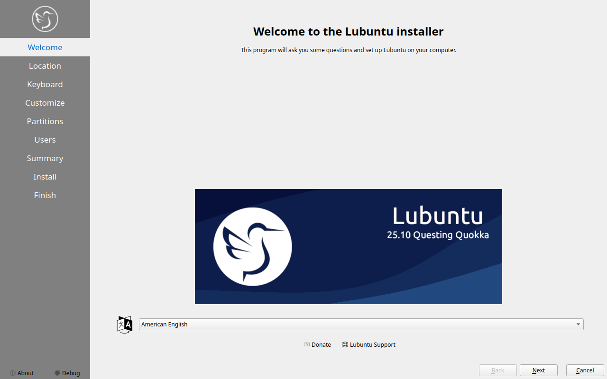
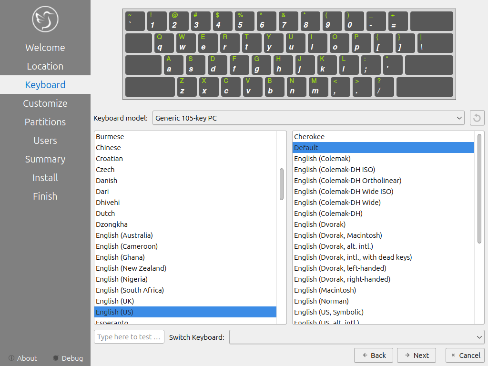
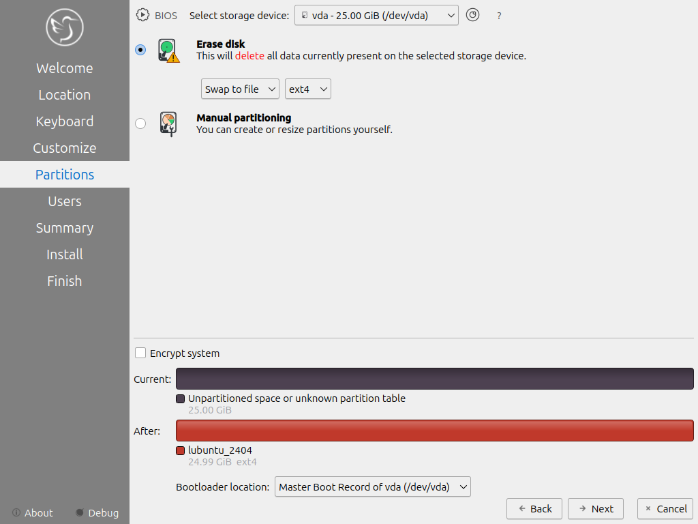

Chapter 1.3 Installation
========================
This is a guide to through the installation process of Lubuntu.

Starting the installer
----------------------

Once you have booted the Lubuntu image, you will be greeted by a screen with the following options: Start Lubuntu, Check disk for defects, Test RAM, and Boot from first hard disk. To start the install select Start Lubuntu, you will now be booting into a live session. The Check disk for defects offers a way to check integrity of the disk image once it is burned to the media please use this if you have problems it could be bad media. 

.. image:: boot_installer.png

Once you have booted into the live session, feel free to explore Lubuntu. Once you are ready to install Lubuntu, double click the icon in the top-left corner of the desktop "Install Lubuntu 18.10". 

.. image:: live_session.png

You will be taken to the Lubuntu installer Welcome screen. You can change the installer language in the drop down box. After selecting the language the next button will move you on to the next task.

Selecting Your location
-----------------------

The next screen will show you a map of the world where you can choose your location. You location will be used to set your time zone and download server. On the bottom of the window there is a place to change your system language. 

Selecting Keyboard Layout
-------------------------

Next select your keyboard layout, you can check your keyboard matches the keyboard shown picture shown. At the bottom you can type to make sure your layout is correct. The keyboard model version lets you choose different layouts and the right column gets different variants. When you have selected your keyboard layout, move on to the next stage of the installation.

Setting up partitions
---------------------

If all you want is Lubuntu on your machine, you can select the erase disk. This will format the disk and **delete all data on the disk**,  which is why having your data backed up before this point is extremely important. IF you choose to do this you can continue on to user setup. 

.. warning::
   Erasing your entire disk or partition may cause you to lose data so please backup beforehand.

If you wish to perform advance partitioning please refer the Advanced partitioning section.

User Setup
----------
The user setup section creates a user profile, consisting of your own name and the username you will use to log in. The next input field is the hostname of your computer. The final field is your password. Enter your password twice to make sure you have not mistyped it. Pressing the next button will give you a summary screen, showing you the settings before the install begins. Once you have checked the summary click the install button to begin the installation.

The Install
-----------
The Lubuntu installer provides some useful information while the installer is running. Once Lubuntu is installed you have a checkbox to reboot now after your Lubuntu is installed and is now finished.

.. image:: installer_screen.png

Advanced partitioning 
-----------------------
If you have had  a previous linux install and want to put the entire disk or just replace an entire partition you will need to unmount them. In this case running  

.. code:: 

   sudo swapoff -a
  
will unmount them and any partitions with data mounted can be unmounted through pcmanfm-qt.

Manual partitioning
-----------------------

If you wish to manual set up partitions, as an advanced option you will have to choose which file-system you want. A file-system controls how your files are accessed at lower levels on the disk. If you are booting your computer in UEFI mode a more modern firmware compared to BIOS you will need to create an EFI system partition see  `efi system partitionwikipedia <http://en.wikipedia.org/wiki/EFI_System_partition>`_ for more detail to create this partition you will need a FAT32 file-system with the ESP flag with to be mounted at /boot/efi/ under the mount point. You will also need a root (/) file-system, several file-systems included for Lubuntu are Ext4, XFS, and Btrfs. 

You can create partition by clicking the button which will bring up a dialog. The file system field is a drop down menu, select which file-system you want. You also need to select where you want to mount the partition. which you need at least one root (/) partition and if you are booting an EFI system you will also need a /boot/efi mounted partition. Another common option is to have all your data on its own partition, which can even be on its own separate physical disk this can be mounted at /home.

