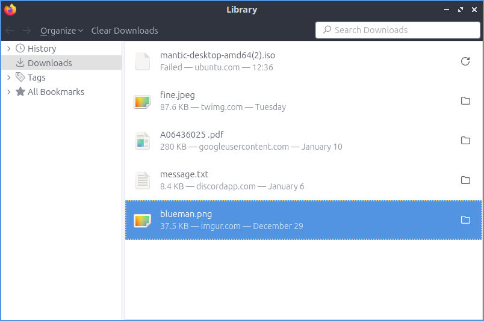

Chapter 2.1.1: Firefox
==============================

Description
---------------
Firefox is a highly-rated, and secure web browser that is installed by default in Ubuntu.
It is a decent choice if one wants a secure, fast, yet relatively less resource-heavy browser. 

Firefox has features of other web browsers and its own ones, such as:
 - Tabbed browsing
 - Scroll through tabs
 - Great plugins and add-ons
 - Favorites, bookmarks, pocket
 - Firefox account sync
 - Master password
 - UI customization with themes and toolbars
 - Advanced customization with about:config
 - Open source

Screenshot
--------------
.. image:: firefox-screenshot.png
   :width: 80%

Usage
------
To open a new tab in Firefox press the plus button on the right of the tab bar or press :kbd:`Control + t`. To close a tab press the button with an :guilabel:`x` on the right side of the tab or press :kbd:`Control +W`. To Open a new window in browsing press :kbd:`Control +N`. To view your browsing history press the hamburger menu :menuselection:`Library --> History` or press :kbd:`Control +H`. When you have the history sidebar you can search through your history where it says :guilabel:`Search History`. To view your downloaded files press the button that looks like three stacked books with a fourth leaning over :menuselection:`--> Downloads`.

To go back to a previous page in Firefox press the button pointing to the left or press :kbd:`Alt + Left arrow`. To open the page you were previously browsing in a new tab middle click the back button. To go forward to a page you have visited before but have now gone back from press the button with the arrow pointing to the right or :kbd:`Alt + Right arrow`. Middle click on the forward button to open the page you went back from in a new tab. To download a file directly to your local disk right click :menuselection:`Save Link As` file as and then you will get a dialog box to show where to save it. To save an image to your computer right click the image and select :menuselection:`Save Image As`.

To open a window with all of your downloads on it press :kbd:`Control+Shift+Y`. To open PCManFM-Qt in the folder where you downloaded things right click and select on the download and select :menuselection:`Open Containing Folder`. To get a link for someone else to download something right click on the downloaded content right click and select :menuselection:`Copy Download Link`.

To open a window with all of your downloads press :kbd:`Control+Shift+Y`. To open PCManFM-Qt in the folder where you downloaded things right click and select on the download and select :menuselection:`Open Containing Folder`. To get a link for someone else to download something right click on the downloaded content right click and select :menuselection:`Copy Download Link`. To open a downloaded file double click on it. To not have a download show in your history right click on it and select :guilabel:`Remove from History`. To clear all your download history right click and select :menuselection:`Clear Downloads` or press the :guilabel:`Clear Downloads` button at the top.

To have a list of all of your tabs press the downward pointing arrowhead button however this only appears if you have more tabs than fit on your screen normally. To switch the view of your tabs if you have more than on the screen press the right ward pointed arrowhead to move the visible part of the tab bar to the right. To move the visible part of the tab bar to the left press the leftward pointed arrowhead. To open a new tab press the :guilabel:`+` button. To search through all your tabs you can click on the downward pointed arrow and select :menuselection:`Search Tabs`. To move a tab to where you want it left click the tab and drag it to the position you want the tab.

To scroll down using the keyboard press :kbd:`Page Down`. To scroll up the page with the keyboard press :kbd:`Page Up`. To scroll all the way back up to the top press the :kbd:`Home` key. To move all the way to the bottom of the page press the :kbd:`End` key.

To go to a specific URL in the address bar you can type it in the main bar in the middle. If you have a URL in your clipboard you can paste it here or into the address bar right click :menuselection:`Paste & Go`. Or if you right click into the clipboard and not immediately go to the page and type in a sub page right click :menuselection:`Paste` and then type to go a specific sub page of the same site and then press :kbd:`Enter` to go to the page. If you press :kbd:`F6` the cursor will select the address bar. If you want to search through the tabs you have open type % and then what you want to type in the address bar.

To bookmark a page press :kbd:`Control +D` or Press the button with three vertical lines and slanted one and then the submenu of bookmarks and bookmark this page. To access the bookmark again press that looks like three vertical lines and a slanted one and bookmarks and then select the bookmark you want. If you want a toolbar with your bookmarks on it right click on the address bar and select :menuselection:`Bookmarks Toolbar`.

To copy text in Firefox select it with the mouse and press :kbd:`Control +C` or right click on it and select :menuselection:`Copy`. To paste text into Firefox press :kbd:`Control+ V` or right click  and select :menuselection:`Paste`. To cut text in Firefox select the text and press :kbd:`Control+X` or right click and select :menuselection:`Cut`.

To view info on your webpage press :kbd:`Control+ I`.

To zoom in if you find the text on a web page to small press :kbd:`control + +`. If you want to zoom out on the text or pictures press :kbd:`control + -`. To reset to the original zoom press :kbd:`control + 0`. To make Firefox fullscreen press :kbd:`F11` and to leave fullscreen simply press :kbd:`F11` again or in the hamburger menu press the two button with two diagonal arrows. While in fullscreen the tab bar will be hidden to change tab while you have Firefox in fullscreen move your mouse to the top of the  monitor and the tab bar will popup. You can also type your zoom into Firefox from the hamburger menu :menuselection:`Zoom` field and press the :guilabel:`+` and :guilabel:`-`.

To print a webpage such as directions you can click the button with horizontal bars and select :menuselection:`Print` from the menu. You can also print by pressing :kbd:`Control+P`. 

If you want a menubar for Firefox right click the main toolbar and click the checkbox for :menuselection:`Menu Bar`. To reload a tab even one you are not on right click on the tab bar :menuselection:`Reload Tab`, press :kbd:`F5`, or :kbd:`Control+R`. To mute a tab even when you are not on it you can right clicking on the tab and then select :menuselection:`Mute Tab` or by pressing :kbd:`Control+m`. To unmute a tab right click :menuselection:`Unmute tab` or press :kbd:`Control+m` or press the speaker button with the line through it. To open a new copy of a tab right click on the tab bar and then select :menuselection:`Duplicate Tab`. To move a tab all the way to the left right click on the tab :menuselection:`Move Tab --> Move to start`. To move a tab all the way to the right right click on tab :menuselection:`Move Tab --> Move to end`. To move a tab to a new window right click on the tab and :menuselection:`Move Tab --> Move to new Window`. To open a new private window press :kbd:`Control+Shift+P`. If you want to bookmark a tab right click the tab and :menuselection:`Bookmark tab`. To close tabs to the right of the current tab right click on the tab and :menuselection:`Close Multiple Tabs --> Close tabs to the right`. To undo closing a tab right click on a tab and :menuselection:`Reopen Closed Tab`.

.. image:: firefox-tab-context.png

Customizing
-----------

If you want to view your Firefox preferences you can type about:preferences into the address bar or :menuselection:`Hamburger menu --> Preferences`. To have your session restored each time you restart Firefox is to check  the :guilabel:`Restore previous session` checkbox. The checkbox for :guilabel:`Restore previous session` checkbox restores your previous session's tabs when you close Firefox. The tabs section has a checkbox to :guilabel:`Open links in new tabs instead of new windows` which is checked by default. The checkbox for :guilabel:`When you open a link a new tab switch to it immediately` switches to new tabs when you open them. To change your default fonts and colors use the :guilabel:`Fonts and Colors` section. To select the default font choose :guilabel:`Default font` from the field. To select a different font size change the :guilabel:`Size` field. To change the default zoom change the :guilabel:`Default zoom` field. To only zoom the text check the :guilabel:`Zoom text only` checkbox. The radio button group for :guilabel:`Downloads` lets you have a static location to save downloads or always ask to save files. To toggle drm controlled content check/uncheck the :guilabel:`Play DRM-controlled content` checkbox.

To tab on the left :guilabel:`Home` has settings for your home and opening of new tabs. The :guilabel:`Homepage and new windows` drop down lets you select the Firefox home or a blank page when you first open the browser. The :guilabel:`New Tabs` menu lets you choose :menuselection:`Firefox Home` or :menuselection:`Blank Page` when you open a new tab. The checkbox :guilabel:`Web Search` lets you toggle whether to show a web search on the Firefox homepage. To show the sites you visit the most check the checkbox :guilabel:`Top Sites`. To change how many rows of top sites to show use the drop down menu to the right of :guilabel:`Top Sites`. The checkbox :guilabel:`Recommend by Pocket` toggles links recommend by pocket. Uncheck the :guilabel:`Sponsored Stories` checkbox to not have sponsored stories from pocket. The :guilabel:`Highlights` checkbox allows site that you have saved or visited recently.  To change how many rows of highlights are shown use the drop down menu to the right of :guilabel:`Highlights`.

.. image:: prefrenceshome.png

To manage your search settings use the :guilabel:`Search` tab on preferences. The radio button for :guilabel:`Search Bar` changes whether you want a separate search bar or and integrated search bar for search and navigation. The :guilabel:`Default Search Engine` lets you change your default search engine. To toggle whether to search suggestions check/uncheck the :guilabel:`Provide search suggestions`. To end up showing search suggestions in the address bar when searching check the :guilabel:`Show search suggestions in address bar results` checkbox. To try to autocomplete searches before browsing history check the :guilabel:`Show search suggestions ahead of browsing history in address bar results` checkbox.

To change settings for How Firefox handles security and privacy settings use the :guilabel:`Privacy & Security` tab. To increase protection against trackers press the :guilabel:`Strict` button and to switch back press the :guilabel:`Standard` button. To send website you do not want to be track header always press the :guilabel:`Always` button. 

.. warning::

  Deleting Firefox user data will log you out of online accounts and if you do not know your password you will need to recover your password or you may lose access to online accounts.
  
To see what websites store data on you locally press the :guilabel:`Manage Data` button. To clear all Firefox data you currently have press the :guilabel:`Clear Data` button. To have Firefox get rid of all cookies when Firefox is closed check the :guilabel:`Delete cookies and site data when Firefox is closed` checkbox. To have Firefox not autofill logins and passwords uncheck the :guilabel:`Autofill logins and passwords` checkbox. To see your saved logins press the :guilabel:`Saved Logins` button. To chose what sites not to save passwords for certain websites press the :guilabel:`Exceptions` button. 

Version
----------
Lubuntu currently ships with the latest version of Firefox, Firefox 84.

How to Launch
----------------
To open Firefox, click on the Firefox icon (red/orange fox covering a blue sphere) in :menuselection:`Internet --> Firefox` Menu.
You can also type and run 

.. code:: 

   firefox

from the terminal to run Firefox. You can also from the command line have Firefox directly open this manual with 

.. code:: 

   firefox https://manual.lubuntu.me
   

You can also launch Firefox from the quick launch by left clicking on the Firefox icon. The icon for Firefox looks like a globe with a red fox circling around it. Yet another way to launch Firefox is to press the browser button on your keyboard.

