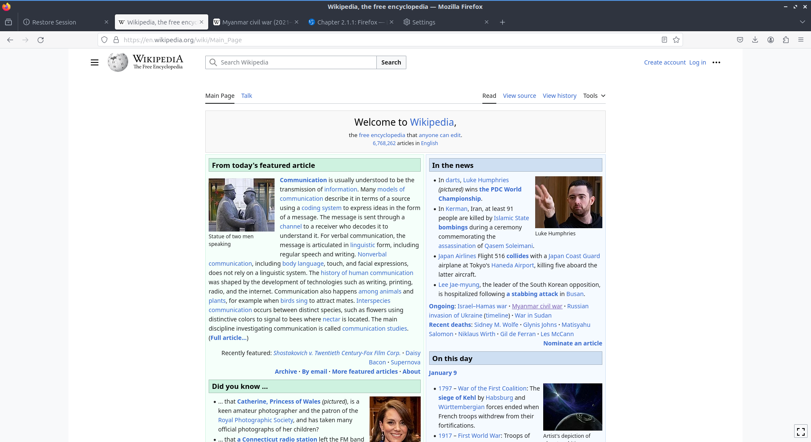

Chapter 2.1.1: Firefox
==============================

Description
---------------
Firefox is a highly-rated, and secure web browser that is installed by default in Ubuntu.
It is a decent choice if one wants a secure, fast, yet relatively less resource-heavy browser. 

Firefox has features of other web browsers and its own ones, such as:
 - Tab browsing
 - Scroll through tabs
 - Great plugins and add-ons
 - Favorites, bookmarks, pocket
 - Firefox account sync
 - Master password
 - UI customization with themes and toolbars
 - Advanced customization with about:config
 - Open source

Screenshot
--------------

Useage
------
To open a new tab in firefox press the plus button on the right of the tab bar or press :kbd:`Control + t`. To close a tab press the button with an x on the right side of the tab or press :kbd:`Control +W`.  To Open a new window in browsing press :kbd:`Control +N`. To view your browsing history press the button that looks like a stack of books with the last one at the end the third item down will show you history or press :kbd:`Control +H`. To view your downloaded files press the button that looks like three stacked books with a fourth leaning over :menuselection:`--> Downloads`.

To go back to a previous page in firefox press the button pointing to the left or press :kbd:`Control + Left arrow`. To open the page you were previously at in a new tab middle click the back button. To go forward to a page you have visited before but have now gone back from press the button with the arrow pointing to the right or :kbd:`Control+ Right`. Middle click on the forward button to open the page you went back from in a new tab. To download a file directly to your local disk right click :menuselection:`Save Link As` file as and then you will get a dialog box to show where to save it.

To go to a specific url in the address bar you can type it in the the main bar in the middle. If you have a url in your clipboard you can paste it here or into the address bar right click :menuselection:`paste and go`. Or if you right click into the the clipboard and not immediately go to the page and type in a sub page right click :guilabel:`paste` and then type to go a specific sub page of the same site and then press enter to go to the page. If you press :kbd:`F6` the cursor will select the address bar. 

To bookmark a page press :kbd:`Control +D` or Press the button with three vertical lines and slanted one and then the submenu of bookmarks and bookmark this page. To access the bookmark again press that looks like three vertical lines and a slanted one and bookmarks and then select the bookmark you want.

To view info on your webpage press :kbd:`Control+ I`.

To zoom in if you find the text on a web page to small press :kbd:`control + +`. If you want to zoom out on the text or pictures press :kbd:`control + -`. To reset to the original zoom press :kbd:`control + 0`. To make firefox fullscreen press :kbd:`F11`. 

To print a webpage such as directions you can click the button with horizontal bars and select :menuselection:`Print` from the menu. You can also print by pressing :kbd:`Control+P`. 

If you want a menubar for firefox right click the main toolbar and click the checkbox for :guilabel:`menu bar`. To reload a tab even one you are not on right click on the tab bar :menuselection:`reload tab`. To mute a tab even when you are not on it you can right click on the tab and then select :menuselection:`mute tab` or by pressing :kbd:`Control+m`. To open a new copy of a tab right click on the tab bar and then select :menuselection:`duplicate tab`. To move a tab all the way to the left right click on the tab :menuselection:`Move tab --> Move to start`. To move a tab all the way to the right right click on tab :menuselection:`Move tab --> Move to end`. To move a tab to a new window right click on the tab and :menuselection:`Move tab --> Move to new Window`. If you want to bookmark a tab right click the tab and :menuselection:`Bookmark tab`. To close tabs to the right of the current tab right click on the tab and :menuselection:`Close tabs to the right`. To undo closing a tab right click on a tab and :menuselection:`Undo Close Tab`.   

If you want to view your firefox prefrences you can type about:preferences into the address bar. To have your seession restored each time you restart firefox is on the general tab of firefox prefrences is to press restore previous session. The checkbox for :guilabel:`Restore previous session` checkbox restores your tab when you close firefox. The tabs section has a checkbox to :guilabel:`open links in new tabs` instead of new windows which is checked by default. The checkbox for When :guilabel:`you open a link a new tab switch to it immediately` switches to new tabs when you open them. The radio button group for :guilabel:`Downloads` lets you have a static location to save downloads or always ask to save files. 

To tab on the left :guilabel:`Home` has settings for your home and opening of new tabs. The :guilabel:`Homepage and new windows` drop down lets you select the firefox home or a blank page when you first open the browser. The :guilabel:`New Tabs` menu lets you choose firefox home or blank page when you open a new tab. The checkbox :guilabel:`Web Search` lets you toggle whther to show a web search on the firefox homepage. The checkbox :guilabel:`Top Sites` shows the sites you visit the most. The checkbox :guilabel:`Recommend by Pocket` toggles links recommend by pocket. Uncheck the :guilabel:`Sponsored stories` checkbox to not have sponsoerd stories from pocket. The :guilabel:`Highlights` checkbox allows site that you have saved or visited recently.  

.. image:: prefrenceshome.png

To manage your search settings use the :guilabel:`search` tab on prefrences. The radio button for :guilabel:`Search Bar` changes whether you want a seperate search bar or and integrated search bar for search and navigation. The :guilabel:`Default Search Engine` lets you change your default search engine. To toggle whether to search suggestions check/uncheck the :guilabel:`Provide search suggestions`.

To copy text in firefox press :kbd:`Control +C`. To paste text into firefox press :kbd:`Control+ V`. To cut text in firefox press :kbd:`Control+X`.

Version
----------
Lubuntu currently ships with the latest version of Firefox, Firefox Quantum.

How to launch
----------------
To open Firefox, click on the Firefox icon (red/orange fox covering a blue sphere) in :menuselection:`Internet --> Firefox` Menu.
You can also type and run 

.. code:: 

   firefox

from the terminal to run firefox. You can also from the command line have firefox directly open this manual with 

.. code:: 

   firefox https://manual.lubuntu.me
