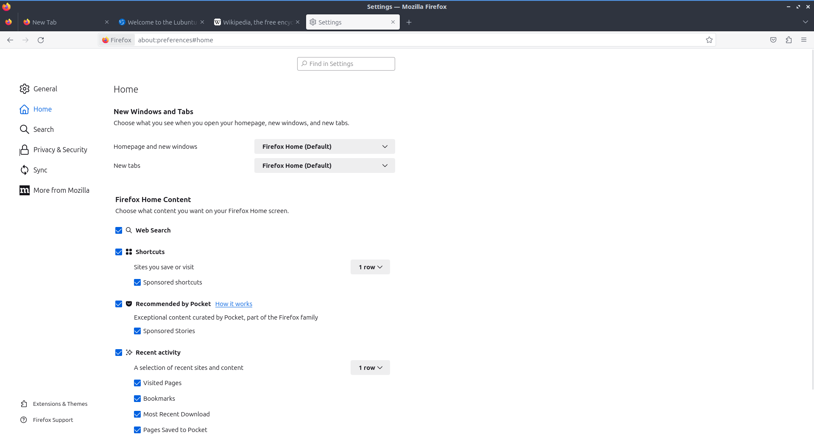
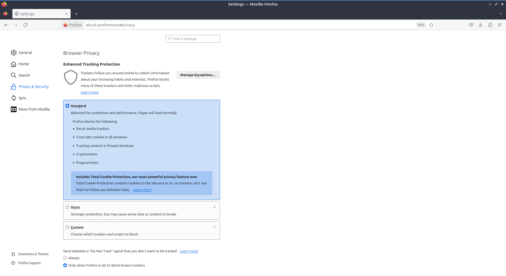

Chapter 2.1.1: Firefox
==============================

Description
---------------
Firefox is a highly-rated, and secure web browser that is installed by default in Ubuntu.
It is a decent choice if one wants a secure, fast, yet relatively less resource-heavy browser.

Firefox has features of other web browsers and its own ones, such as:
 - Tabbed browsing
 - Scroll through tabs
 - Great plugins and add-ons
 - Favorites, bookmarks, pocket
 - Firefox account sync
 - Master password
 - UI customization with themes and toolbars
 - Advanced customization with about:config
 - Open source

Screenshot
--------------
.. image:: firefox-screenshot.png
   :width: 80%

Usage
------
To open a new tab in Firefox press the :guilabel:`+` button on the right of the tab bar, right click the tab bar :menuselection:`New tab`, or press :kbd:`Control + t`. To close a tab press the button with an :guilabel:`x` on the right side of the tab or press :kbd:`Control +W`. To Open a new window in browsing press :kbd:`Control +N`. To view your browsing history press the hamburger menu :menuselection:`Library --> History` or press :kbd:`Control +H`. When you have the history sidebar you can search through your history where it says :guilabel:`Search History`. To change how to sort your history click the :guilabel:`View` label and select how you want to search your history. To view your downloaded files press the button that looks like three stacked books with a fourth leaning over :menuselection:`--> Downloads`.

To go back to a previous page in Firefox press the button pointing to the left or press :kbd:`Alt + Left arrow`. To open the page you were previously browsing in a new tab middle click the back button. To go forward to a page you have visited before but have now gone back from press the button with the arrow pointing to the right or :kbd:`Alt + Right arrow`. Middle click on the forward button to open the page you went back from in a new tab. To download a file directly to your local disk right click :menuselection:`Save Link As` file as and then you will get a dialog box to show where to save it. To save an image to your computer right click the image and select :menuselection:`Save Image As`. 

When you are downloading something a circle will show up showing progress of the download. The more shown in blue the more of the file has been downloaded. To view what you are downoloading press the left click the circled graph showing what you have downloaded. Then you can see how much data has been downloaded, time remaining to download, and how big a file it is and a bar graph of the status of different files downloading. To pause downloading a file right click and select :menuselection:`Pause`. To then continue downloading again right click and select :menuselection:`Resume`. To cancel the download press the :guilabel:`X` button on the right hand side of this menu. When the download if finished it will show you a blue arrow pointing down that is underlined. After you have downloaded something it will return to gray. 

To open a window with all of your downloads on it press :kbd:`Control+Shift+Y`. To open PCManFM-Qt in the folder where you downloaded things right click and select on the download and select :menuselection:`Open Containing Folder`. To share a link with someone else for something you downloaded right click on the downloaded content right click and select :menuselection:`Copy Download Link`.

To open PCManFM-Qt in the folder where you downloaded things right click and select on the download and select :menuselection:`Open Containing Folder`. To open a downloaded file double click on it. To not have a download show in your history right click on it and select :guilabel:`Remove from History`. To clear all your download history right click and select :menuselection:`Clear Downloads` or press the :guilabel:`Clear Downloads` button at the top. To search through your downloads in the top right enter your search into :guilabel:`Search Downloads`.

.. image:: firefox-downloads.png

To have a list of all of your tabs press the downward pointing arrowhead button. To close a tab from this list press the :guilabel:`x` button. To restore your session when first opening a Firefox press :guilabel:`Restore Session` or press the downward pointing arrow and select :guilabel:`Restore Session`. To switch the view of your tabs if you have more than on the screen press the right ward pointed arrowhead to move the visible part of the tab bar to the right. To move the visible part of the tab bar to the left press the leftward pointed arrowhead. To move a tab to where you want it left click the tab and drag it to the position you want the tab. To search through all your tabs you can click on the downward pointed arrow and select :menuselection:`Search Tabs`. 

To view extensions to firefox prss the :guilabel:`puzzle piece` button in the top right corner, press :kbd:`Control + shift +A`, :menuselection:`Hamburger menu --> Add on and themes`, or type about:addons into the address bar.

To scroll down using the keyboard press :kbd:`Page Down`. To scroll up the page with the keyboard press :kbd:`Page Up`. To scroll all the way back up to the top press the :kbd:`Home` key. To move all the way to the bottom of the page press the :kbd:`End` key.

To go to a specific URL in the address bar you can type it in the main bar in the middle. If you have a URL in your clipboard you can paste it here or into the address bar right click :menuselection:`Paste & Go`. Or if you right click into the clipboard and not immediately go to the page and type in a sub page right click :menuselection:`Paste` and then type to go a specific sub page of the same site and then press :kbd:`Enter` to go to the page. To select the entire text of the address bar press :kbd:`Control+A` or right click and :menuselection:`Select All`. If you press :kbd:`F6` the cursor will select the address bar. If you want to search through the tabs you have open type % and then what you want to type in the address bar.

To bookmark a page press :kbd:`Control +D`, press the star button to the right of the address bar, right click on the tab and select :menuselection:`Bookmark Tab`, or Press the button with three horizontal lines and select :menuselection:`Bookmarks --> Bookmark Current tab` or  right click on the tab and select :menuselection:`Bookmark Tab`. To access the bookmark again press that looks like three vertical lines and a slanted one and :menuselection:`Bookmarks --> Your Bookmark`. If you want a toolbar with your bookmarks on it right click on the address bar and select :menuselection:`Bookmarks Toolbar` or the three horizontal lines button :menuselection:`Bookmarks --> Show bookmark toolbar`.

To manage your bookmarks press :kbd:`Control+Shift+O` or three horizontal bars :menuselection:`Bookmarks -->Manage Bookmarks`. To switch to different categories of bookmarks on the left hand side to switch categories. To search through your bookmarks type in :guilabel:`Search Bookmarks` box in the top right hand corner. To open a bookmark in this park double click on it or right click and select :menuselection:`Open`. To open a bookmark in a new tab right click on it and select :menuselection:`Open in New Tab`. To delete a bookmark right click on it and select :menuselection:`Delete Bookmark`. To rename your bookmark something you will remember use the :guilabel:`Name` field. To change where a bookmark points to change the :guilabel:`URL` field. To add tags to your bookmark type them in the :guilabel:`Tags` field.

To copy text in Firefox select it with the mouse and press :kbd:`Control +C` or right click on it and select :menuselection:`Copy`. To paste text into Firefox press :kbd:`Control+ V` or right click  and select :menuselection:`Paste`. To cut text in Firefox select the text and press :kbd:`Control+X` or right click and select :menuselection:`Cut`. To select all of the text on a page press :kbd:`Control+ A` or right click and select :menuselection:`Select All`.

To view info on your webpage press :kbd:`Control+ I`. To take a screenshot of a webpage right click and select :menuselection:`Take Screenshot`. Then select the part of the webpage you want by left clicking and dragging to select which part of the webpage to take a picture of. To save your screenshot press the :guilabel:`Download` button. To copy the screenshot to a clipboard press the :guilabel:`Copy` button. To cancel taking the screenshot press the :guilabel:`Cancel` button, the :guilabel:`x` button that appears after selecting an area, or press :kbd:`Escape`. To take a screenshot of the whole webpage press the :guilabel:`Save full page` button. To save the visible portion of the page press the :guilabel:`Save visible` button.

.. image:: screenshot-taking.png

To zoom in if you find the text on a web page to small press :kbd:`control + +`. If you want to zoom out on the text or pictures press :kbd:`control + -`. To reset to the original zoom press :kbd:`control + 0`. To make Firefox fullscreen press :kbd:`F11` and to leave fullscreen simply press :kbd:`F11` again or in the hamburger menu press the two button with two diagonal arrows. While in fullscreen the tab bar will be hidden to change tab while you have Firefox in fullscreen move your mouse to the top of the  monitor and the tab bar will popup. You can also type your zoom into Firefox from the hamburger menu :menuselection:`Zoom` field and press the :guilabel:`+` and :guilabel:`-`. To see the current zoom on a webpage read the zoom from the right hand side of the address bar. To restore your zoom to 100% left click on the the zoom on the right hand side of the address bar.

To search for text in your tab press :kbd:`Control +F` or use the three horizontal lines and select :menuselection:`Find in page`. A search bar at the bottom of the window will appear. To move to the next result click the downward arrow on the screen or click the upward arrow on the screen to move to the previous result. To toggle highlighting every match check/uncheck the :guilabel:`Highlight All` checkbox. To make the search not necessarily need to match capitalization uncheck the :guilabel:`Match Case` checkbox. To check if diacritical marks are the same check the :guilabel:`Match Diacritics` checkbox. To only match entire words check the :guilabel:`Whole Words` checkbox. To close out searching press the :guilabel:`X` button.

To print a webpage such as directions you can click the button with horizontal bars and select :menuselection:`Print` from the menu. To see how many pages the website you would print is read :guilabel:`sheets of paper` in the top right corner. You can also print by pressing :kbd:`Control+P`. To choose which printer to use use the :guilabel:`Destination` field. To change how many copies you are printing change the :guilabel:`Copies` field. To change the orientation of your webpage press either the :guilabel:`Portrait` or :guilabel:`Landscape` buttons. To choose which pages to print use the :guilabel:`Pages` field. To change where to print in color or black and white change the :guilabel:`Color mode` menu. To cancel printing press the :guilabel:`Cancel` button. To start printing press the :guilabel:`Print` button.

If you want a menubar for Firefox right click the main toolbar and click the checkbox for :menuselection:`Menu Bar`. To toggle showing a sidebar press the :guilabel:`book` button to the right of the address bar. To reload a tab even one you are not on right click on the tab bar :menuselection:`Reload Tab`, press :kbd:`F5`, right click and press :guilabel:`ciruclar arrow`, or :kbd:`Control+R`. To mute a tab even when you are not on it you can right clicking on the tab and then select :menuselection:`Mute Tab` or by pressing :kbd:`Control+m`. To unmute a tab right click :menuselection:`Unmute tab` or press :kbd:`Control+m` or press the speaker button with the line through it. To open a new copy of a tab right click on the tab bar and then select :menuselection:`Duplicate Tab`. 

.. image:: firefox-tab-context.png

To move a tab all the way to the left right click on the tab :menuselection:`Move Tab --> Move to start`. To move a tab all the way to the right right click on tab :menuselection:`Move Tab --> Move to end`. To move a tab to a new window right click on the tab and :menuselection:`Move Tab --> Move to new Window`. To pin a tab to have it open in Firefox every time you close and reopen Firefox right click on the tab and select :menuselection:`Pin Tab`. To have a tab not be pinned anymore right click on the pinned tab and select :menuselection:`Unpin Tab`. To open a new private window press :kbd:`Control+Shift+P` or press the three horizontal lines and select :menuselection:`New Private Window`. If you want to bookmark a tab right click the tab and :menuselection:`Bookmark Tab`. To close tabs to the right of the current tab right click on the tab and :menuselection:`Close Multiple Tabs --> Close tabs to the right`. To close tabs to the left of the current tab :menuselection:` Close Multiple Tabs --> close tabs to the left`. To close all tabs but the one you opened on right click :menuselection:`Close Multiple Tabs --> Close Other Tabs`. To undo closing a tab right click on a tab and :menuselection:`Reopen Closed Tab`.

To search for a word in a webpage press :kbd:`Control+F` and then type what you want to search for in the searchbar that pops up. At the right of this bar will show :guilabel:`x of y matches` to see how many matches are on your search. To jump to the next result press the :guilabel:`Down arrow`. To Move to the previous result press the :guilabel:`Up arrow`. To see everything that matches the search result check the :guilabel:`Highlight All`. To have Firefox match the capitalization of searches check the :guilabel:`Match Case` checkbox. To have Firefox search to only match the entire word check the :guilabel:`Whole Words` checkbox.

Firefox offers to save passwords of websites with a popup when you enter in a password and press :guilabel:`Save`. This will have Firefox remember the password so you do not have to remember it. Firefox however stores these in your browser and you can access them from the three bars :menuselection:`Passwords`. To search what sites you have saved logins for type in the :guilabel:`Search Logins` bar at the top. On the left hand side bar lists each saved login for each site and to get to one login left click on the site. Once on a login click the :guilabel:`Copy` button to copy the password to login to a site. To view a password of what you have saved click the :guilabel:`eyeball` button which will show your saved passwords. To hide your password again press the :guilabel:`crossed out eyeball`. To stop storing a login in Firefox press the :guilabel:`Remove` button. To change a saved password you can press the :guilabel:`Edit` button.

Customizing
-----------

If you want to view your Firefox preferences you can type about:preferences into the address bar or :menuselection:`Hamburger menu --> Settings`. To find something in settings search in the :guilabel:`Find in settings` box. The :guilabel:`General` tab has settings for opening Firefox after closing and the appearance of Firefox. To have your session restored each time you restart Firefox is to check  the :guilabel:`Open previous windows and tabs` checkbox. To switch between which tabs you were recently using by pressing control and tab at the same time check the :guilabel:`Ctrl + Tab cycles through tabs in recently used order`. The tabs section has a checkbox to :guilabel:`Open links in new tabs instead of new windows` which is checked by default. The checkbox for :guilabel:`When you open a link, image or media in a new tab switch to it immediately` switches to new tabs when you open them. To confirm closing multiple tabs check the :guilabel:`Confirm before closing multiple tabs` checkbox. To not confirm when quitting by :kbd:`control + q` uncheck the :guilabel:`Confirm before quitting with ctrl+Q`.

To tell websites what theme to use use the themes under :guilabel:`Website appearance`. To use your system theme for Firefox check the :guilabel:`Automatic` button. To switch to always using a light theme on Firefox press the :guilabel:`Light` button. To always use a dark theme for Firefox press the :guilabel:`Dark` button. To switch back to the default Firefox theme press the :guilabel:`Firefox theme` button. To change your default fonts and colors use the :guilabel:`Fonts and Colors` section. To change colors for Firefox press :guilabel:`Manage Colors` button. To select the default font choose :guilabel:`Default font` from the field. To select a different font size change the :guilabel:`Size` field. To change the default zoom change the :guilabel:`Default zoom` field. To only zoom the text check the :guilabel:`Zoom text only` checkbox. To choose where to download files change where to download in the :guilabel:`Save files to` field. To always ask to save files check the :guilabel:`Always ask you where to save files` checkbox. To choose what program Firefox should use to open files use the options in Applications menu. To search for a particular file type type in the :guilabel:`Search file types or applications` field. To see which file type read the :guilabel:`Content Type` column. To chose what to do with this filetype change what you are doing in the :guilabel:`Action` column. To always save other files press the :guilabel:`Save files` button. To have Firefox ask what to do with other files press the :guilabel:`Ask whether to open or save files` button. To change  To toggle DRM controlled content check/uncheck the :guilabel:`Play DRM-controlled content` checkbox. 

To middle click and then scroll by moving the mouse check the :guilabel:`Use autoscrolling` checkbox. To turn off smooth scrolling in Firefox uncheck the :guilabel:`Use smooth scrolling` checkbox. To have Firefox always show scrollbars check the :guilabel:`Always show scrollbars` checkbox. To always use the cursor keys for navigation check the :guilabel:`Always use the cursor keys to navigate within pages` checkbox. If you want to turn off picture in picture mode for videos uncheck the :guilabel:`Enable picture in picture video controls`.

To tab on the left :guilabel:`Home` has settings for your home and opening of new tabs. The :guilabel:`Homepage and new windows` drop down lets you select the Firefox home or a blank page when you first open the browser. The :guilabel:`New tabs` menu lets you choose :menuselection:`Firefox Home` or :menuselection:`Blank Page` when you open a new tab. The checkbox :guilabel:`Web Search` lets you toggle whether to show a web search on the Firefox homepage. To show the sites you visit the most check the checkbox :guilabel:`Top Sites`. To change how many rows of top sites to show use the drop down menu to the right of :guilabel:`Top Sites`. The checkbox :guilabel:`Recommend by Pocket` toggles links recommend by pocket. Uncheck the :guilabel:`Sponsored Stories` checkbox to not have sponsored stories from pocket. The :guilabel:`Highlights` checkbox allows site that you have saved or visited recently.  To change how many rows of highlights are shown use the drop down menu to the right of :guilabel:`Highlights`.

To enable Firefox showing recent activity on the page for new tabs check the :guilabel:`Recent activity` checkbox. To change how many rows of recent sites change the :guilabel:`A selection of recent sites and content` checkbox field. To not show recently visited pages uncheck the :guilabel:`Visited Pages` checkbox. To not show recently saved bookmarks uncheck the :guilabel:`Bookmarks` checkbox. To not show things you recently saved to your computer uncheck the :guilabel:`Most Recent Download` checkbox. To not show pages you recently saved to pocket uncheck the :guilabel:`Pages Saved to Pocket` checkbox.

To manage your search settings use the :guilabel:`Search` tab on preferences. The radio button for :guilabel:`Add search bar in toolbar` changes whether you want a separate search bar or and integrated search bar for search and navigation. The :guilabel:`Default Search Engine` lets you change your default search engine. To toggle whether to search suggestions check/uncheck the :guilabel:`Provide search suggestions`. To end up showing search suggestions in the address bar when searching check the :guilabel:`Show search suggestions in address bar results` checkbox. To try to autocomplete searches before browsing history check the :guilabel:`Show search suggestions ahead of browsing history in address bar results` checkbox. To get search suggestions in private windows check the :guilabel:`Show search suggestions in Private Windows` checkbox.

To change settings for How Firefox handles security and privacy settings use the :guilabel:`Privacy & Security` tab. To increase protection against trackers press the :guilabel:`Strict` button and to switch back press the :guilabel:`Standard` button. To send website you do not want to be track header always press the :guilabel:`Always` button. To choose which sites data to clear out you can press :guilabel:`Manage Data`. If asking to save passwords is something you wish to turn off uncheck the :guilabel:`Ask to save logins and passwords for websites` checkbox.

.. warning::

  Deleting Firefox user data will log you out of online accounts and if you do not know your password you will need to recover your password or you may lose access to online accounts.
  

  
To see what websites store data on you locally press the :guilabel:`Manage Data` button. To clear all Firefox data you currently have press the :guilabel:`Clear Data` button. To have Firefox get rid of all cookies when Firefox is closed check the :guilabel:`Delete cookies and site data when Firefox is closed` checkbox. To have Firefox not autofill logins and passwords uncheck the :guilabel:`Autofill logins and passwords` checkbox. To see your saved logins press the :guilabel:`Saved Logins` button. To chose what sites not to save passwords for certain websites press the :guilabel:`Exceptions` button.

To set a password to access your logins on Firefox check the :guilabel:`Use a Primary Password` checkbox and then press the :guilabel:`Change Primary Password` button. To do this next you will need to enter the password twice to make sure you don't not accidentally make a typo and then press :guilabel:`OK`. To have Firefox not automatically save your address uncheck the :guilabel:`Autofill addresses` checkbox. To view which addresses are saved press the :guilabel:`Saved Addresses`. To have Firefox not save credit cards uncheck the :guilabel:`Autofill credit cards` checkbox. To view or delete saved credit cards press :guilabel:`Saved Credit Cards` button.

To change how Firefox saves history change the menu next to :guilabel:`Firefox will`. To clear your browsing history right now press the :guilabel:`Clear History` button.

To stop any of the following from showing up in search suggestion uncheck the checkbox for :guilabel:`Browsing history`, :guilabel:`Bookmarks`, :guilabel:`Open tabs`, :guilabel:`Shortcuts`, or :guilabel:`Search engines`. To not have search suggestion from the web make the :guilabel:`Suggestions from the web` button grayed out. To turn off Firefox sponsored search suggestions press the button to gray out the :guilabel:`Suggestions from sponsors` button.

To change how Firefox deals with websites wanting permissions for Location, Camera, Microphone, Notifications, Autoplay, or Virtual Reality use the :guilabel:`Permissions` section. For each of these settings there is a :guilabel:`Settings` button that you can press to get settings for each. To see in the settings window which sites have a permission read under :guilabel:`Website` column. To change if a website can use something change the :guilabel:`Status` column. To remove a website from having permissions for something press the :guilabel:`Remove Website` button. To remove all websites from this permission press the :guilabel:`Remove All Websites` button. To search for one website in the list type in :guilabel:`Search Website` bar. To block all new requests for this permission check the :guilabel:`Block new requests` checkbox. To save the changes that you have made press the :guilabel:`Save Changes` button. To cancel your changes press the :guilabel:`Cancel` button.

Version
----------
Lubuntu currently ships with the latest version of Firefox, Firefox 117.

How to Launch
----------------
To open Firefox, click on the Firefox icon (red/orange fox covering a blue sphere) in :menuselection:`Internet --> Firefox` Menu.
You can also type and run 

.. code:: 

   firefox

from the terminal to run Firefox. You can also have Firefox directly open this manual from the command line with 

.. code:: 

   firefox https://manual.lubuntu.me
   
You can also launch Firefox from the quick launch by left clicking on the Firefox icon. The icon for Firefox looks like a globe with a red fox circling around it. Yet another way to launch Firefox is to press the browser button on your keyboard.

