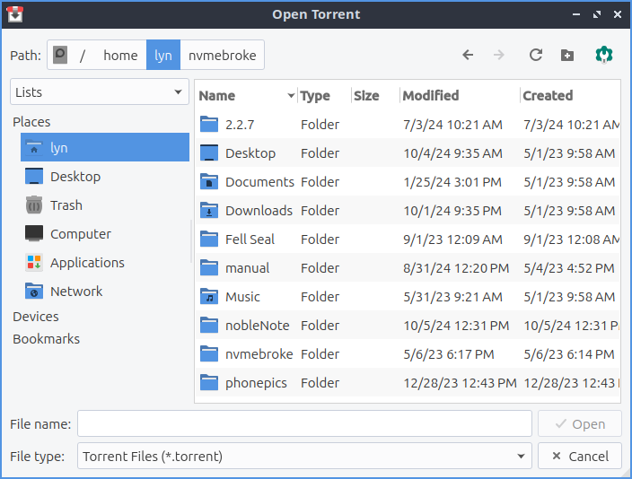

Chapter 2.1.2 Transmission
===========================

Transmission is a bit-torrent client.

Screenshot
----------

Version
-------

Lubuntu ships with version 2.94 of Transmission.

Usage
------
To open a torrent file press the open or simply double clicking the torrent file from a web browser after opening it will start Transmission. The torrent file will start download and using your connection to upload to others in a so called peer to peer network. At the bottom you will see an arrow pointing downward to show how fast you are downloading. The up arrow shows how fast you are seeding or uploading the file to others. 

While you download your file a progress bar with will show your download for each file once you have it entirely you have see how many people you are seeding to each person and how fast you are uploading to that person. 

The button with two || circled is a pause button that can pause all downloads and uploads. To start downloading and uploading again to press a button with a triangle to start uploading and downloading again. 

To remove a torrent from the list of torrent files right click on it or :kbd:`Delete` and click remove. To delete the files and remove the torrent from the list right click Delete files and remove or press :kbd:`Shift +Delete`.

If you want have a move compact view :menuselection:`View --> Compact View` or press :kbd:`Alt + C`. 

To sort your torrents by activity :menuselection:`View --> Sort by Activity`. To sort your torrents by age :menuselection:`View --> Sort by Age`. To sort your torrents by name :menuselection:`View --> Sort by Name`. To sort your torrents by Progress :menuselection:`View --> Sort by Progress`. To reverse the sort order :menuselection:`View --> Reverse sort order`. 

How to launch
-------------

To launch Transmission go to menu :menuselection:`Internet --> Qtransmission` bittorent client or run 

.. code:: 
 
   transmission-qt 

from the terminal. The icon looks like a silver box outlined in red with a double pointed vertical arrow. 
