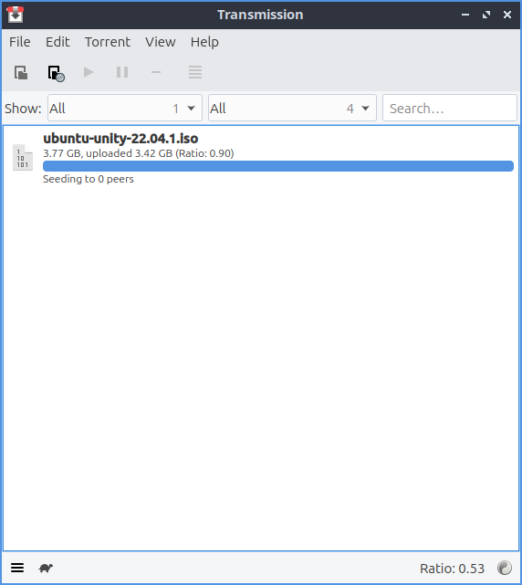
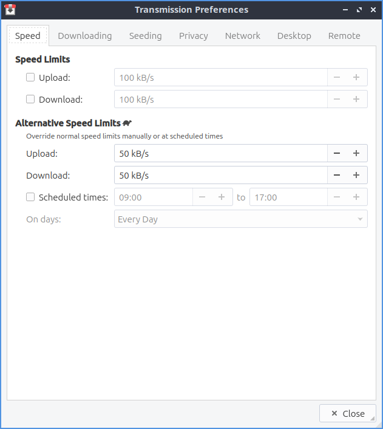
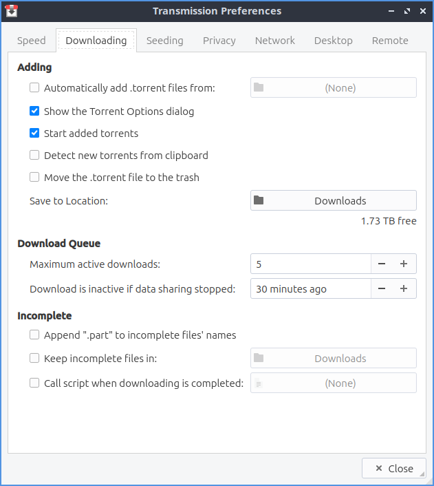
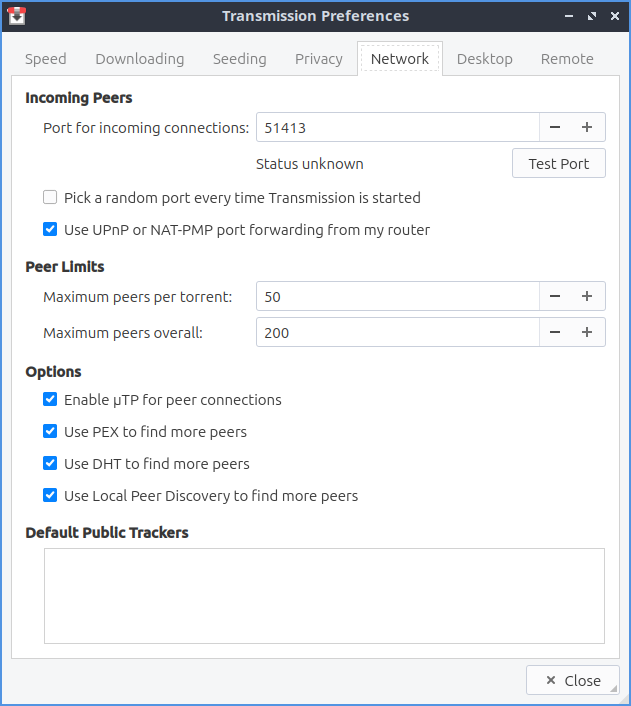
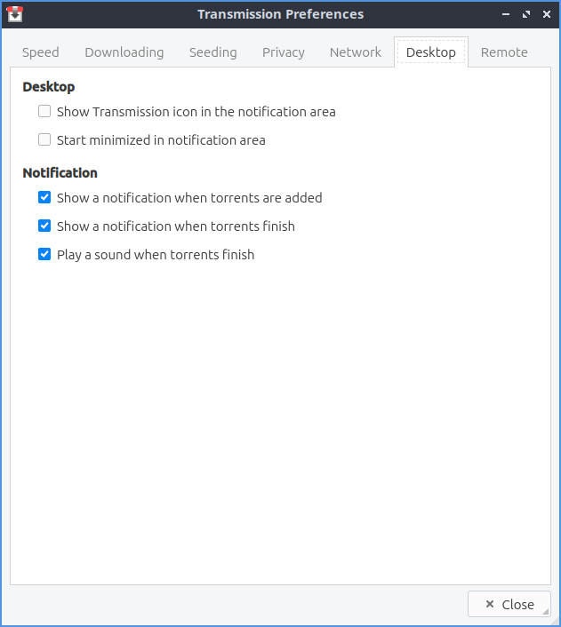

Chapter 2.1.2 Transmission
===========================

Transmission is a bit-torrent client.

Screenshots
-----------

.. image:: transmission.png

Usage
------
To open a torrent file press the open or simply double clicking the torrent file from a web browser after opening it will start Transmission. The torrent file will start download and using your connection to upload to others in a so called peer to peer network. At the bottom you will see an arrow pointing downward to show how fast you are downloading. The up arrow shows how fast you are seeding or uploading the file to other people downloading that file. 

While you download your file a progress bar with will show your download for each file once you have it entirely you have see how many people you are seeding to each person and how fast you are uploading to that person. 

The button with two || circled is a pause button that can pause all downloads and uploads or :menuselection:`File --> Pause All`. To start downloading and uploading again to press a button with a triangle to start uploading and downloading again or :menuselection:`File --> Start All`. 

To remove a torrent from the list of torrent files right click on it or :kbd:`Delete` and click remove. To delete the files and remove the torrent from the list right click Delete files and remove or press :kbd:`Shift +Delete`.

If you want have a move compact view :menuselection:`View --> Compact View` or press :kbd:`Alt + C`. 

To bring a up a properties dialog window press :kbd:`Alt +Enter` or :menuselection:`Torrent --> Properties`. To show how much of the file you have on that torrent is under the :guilabel:`Have` row which shows both the size and the percentage of the file. The :guilabel:`Location` row shows you where the file is saved on your system. The :guilabel:`State` row shows what the torrent is currently doing. The :guilabel:`Peers` tab shows you what other peers that also have the torrent open. The :guilabel:`Tracker` tab shows information of where the torrent is being tracked.

To sort your torrents by activity :menuselection:`View --> Sort by Activity`. To sort your torrents by age :menuselection:`View --> Sort by Age`. To sort your torrents by name :menuselection:`View --> Sort by Name`. To sort your torrents by Progress :menuselection:`View --> Sort by Progress`.  To sort your torrents by Queue :menuselection:`View --> Sort by Queue`. To sort your torrents by ratio uploaded to downloaded :menuselection:`View --> Sort by ratio`. To sort your torrents by size :menuselection:`View --> Sort by Size`. To sort your torrents by State :menuselection:`View --> Sort by State`. To sort your torrents by time to finish downloading :menuselection:`View --> Sort by time left`. To reverse the sort order :menuselection:`View --> Reverse sort order`.

To move a torrent down on where it appears on the screen and the queue :menuselection:`Torrent --> Queue --> Move Down`. To move a torrent up in the queue :menuselection:`Torrent --> Queue --> Move Up`. To Move a torrent file to the top :menuselection:`Torrent --> Queue --> Move to Top`. To move a torrent file to the bottom :menuselection:`Torrent --> Queue --> Move to Bottom`.

If you do not want to prioritize the speed of your torrents press the button on the bottom of transmission that looks like a turtle. To change the ratio view on the bottom to your total changes :menuselection:`Globe button --> Total Transfer`. To view your upload/download ratio in the current session :menuselection:`Globe button --> Session Ratio`. To view your transfer from the current session only :menuselection:`Globe button --> Session Transfer`. 

To open the file manager in the folder of your torrent press :kbd:`Control+E` or :menuselection:`Torrent --> Open Folder`.

Version
-------

Lubuntu ships with version 2.94 of Transmission.

How to launch
-------------

To launch Transmission go to menu :menuselection:`Internet --> Qtransmission Bittorent Client` or run 

.. code:: 
 
   transmission-qt 

from the terminal. The icon looks like a silver box outlined in red with a double pointed vertical arrow. 

Customizing
-----------
To open your preferences for transmission :menuselection:`Edit --> Preferences`. To limit upload speed check the :guilabel:`Upload` checkbox and select the limit of upload speed you want. To limit download speed check the :guilabel:`Download` checkbox and select the limit of download speed you want. To change the slower speed limits with the turtle button for uploading change the :guilabel:`Upload` field. To change the slower download speed change the :guilabel:`Download` field. To schedule a time to throttle your torrents check the :guilabel:`Scheduled times:` checkbox and to the right choose the time to start throttling your torrents and the time to stop throttling your torrents. The :guilabel:`On days:` drop down is where you select which days of the week to throttle torrenting. 

The :guilabel:`Downloading` tab of your preferences has settings for downloading torrents. To choose where to save torrents is in the :guilabel:`Save to Location:` button to bring up a dialog to show where to save the torrent. To set a maximum number of torrents downloading at the same time change the :guilabel:`Maximum active downloads:` field. To stop trying to download a file after no more file to download change the :guilabel:`Download is inactive if data sharing stopped` and choose how many minutes to choose if it is inactive. To add .part to the end of incomplete downloaded files check the :guilabel:`Append ".part" to incomplete files' names` checkbox. To choose if you want a different file to choose the incomplete files check the :guilabel:`Keep incomplete files in:` checkbox and bring a dialog to choose it where to be on the button to the right. To automatically add torrent files to transmission check the :guilabel:`Automatically add .torrent files from:` and then press the button to the right to choose where to add .torrent files from. To start the added torrents automatically check the :guilabel:`Start added torrents` checkbox.

To have the settings for uploading torrents or seeding them use the :guilabel:`Seeding` tab. To stop seeding after you have uploaded a certain size of the file check the :guilabel:`Stop seeding at ratio:` checkbox and then select the ratio to stop seeding. To stop seeding if the torrent has not been seeded recently check the :guilabel:`Stop seeding if idle for:` checkbox and then choose how long to select if the torrent is idle.

To have settings with privacy and encryption use the :guilabel:`Privacy` tab. To change whether to prefer encryption mode, allow encryption, or to require encryption use the :guilabel:`Encryption mode` drop down menu. 

To change your settings on how transmission interacts with the network use the :guilabel:`Network` tab. To choose the port for incoming connections to transmission use the :guilabel:`Port for incoming connections:`. To see if that port is open press the :guilabel:`Test Port` button. To open a random port each time you open transmission check the :guilabel:`Pick a random port every time Transmission is started` checkbox. To change the greatest number of peers you can have for each individual torrent change the :guilabel:`Maximum peers per torrent` field. To change the greatest number of peers you can have across all of you different torrents in the :guilabel:`Maximum peers overall` field.

To change things about your desktop interface use the :guilabel:`Desktop` tab of transmission. To show an icon for transmission in the system tray check the :guilabel:`Show Transmission icon in the notification area` checkbox. To start transmission started in the notification area :guilabel:`Start minimized in notification area` checkbox. To toggle showing a notification when new torrents are added check/uncheck the :guilabel:`Show a notification when torrents are added` checkbox. To show a notification when torrents finish check/uncheck the :guilabel:`Show a notification when torrents finish` checkbox. To toggle playing a sound when the torrents finish check/uncheck the :guilabel:`Play a sound when torrents finish` checkbox.

