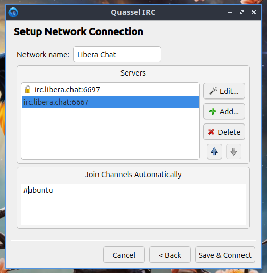
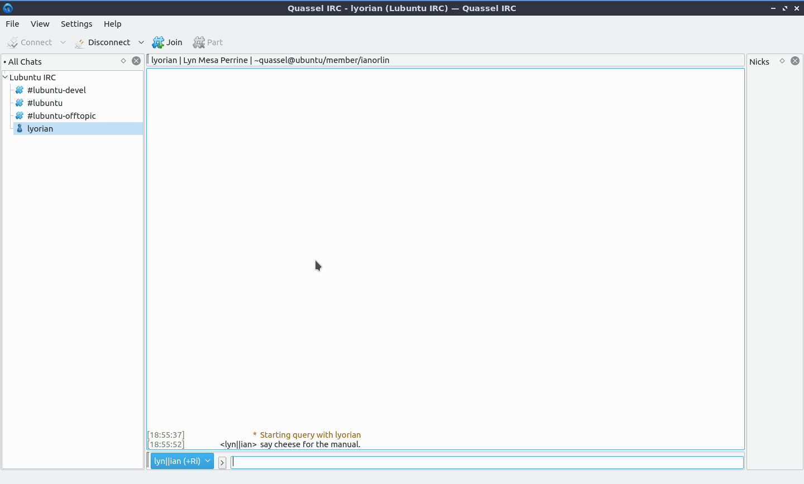
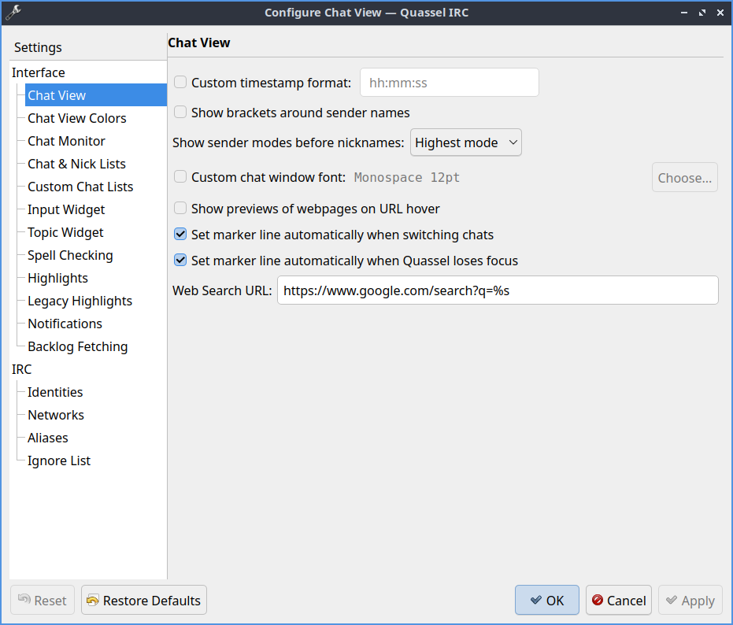
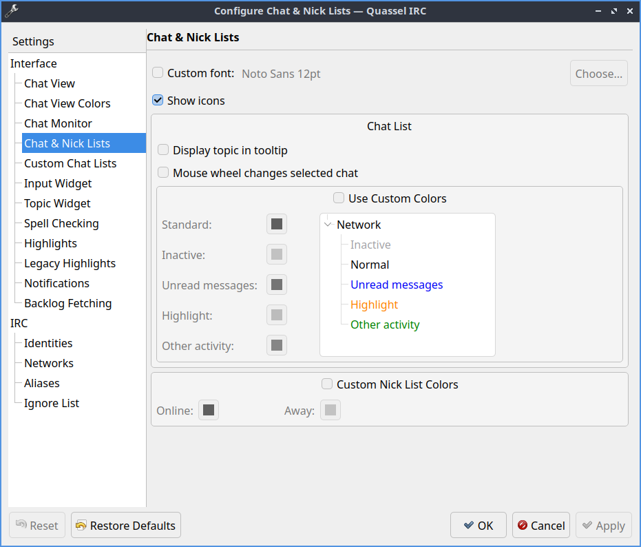
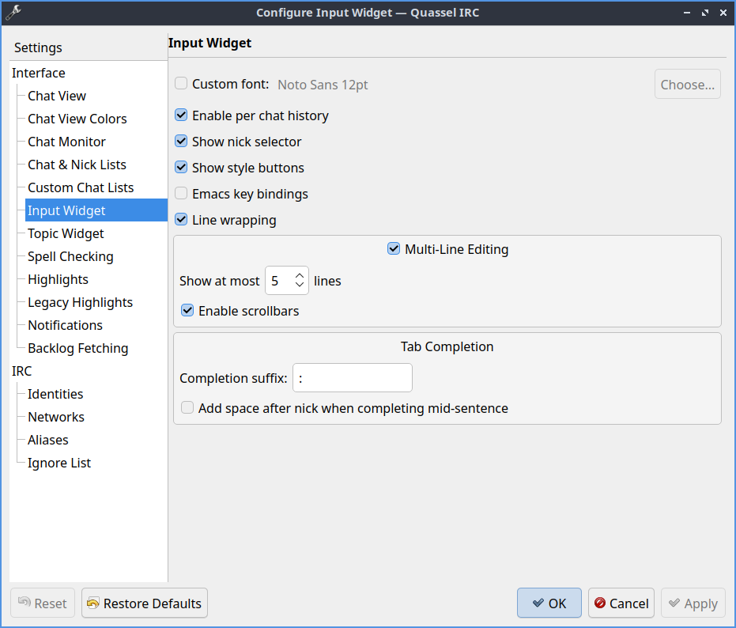
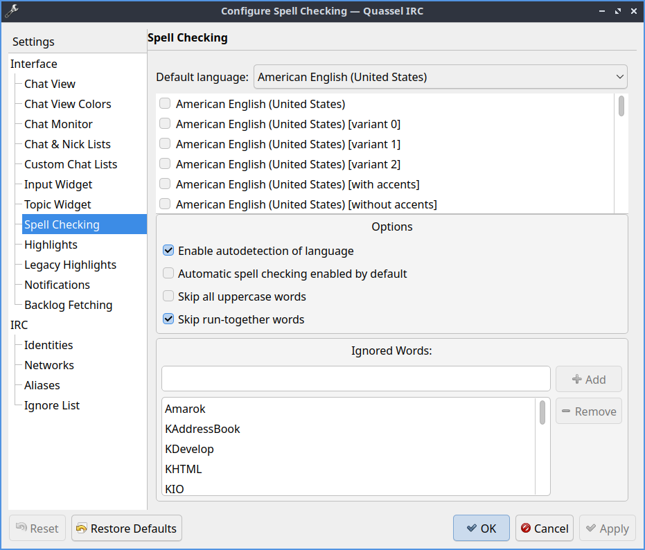
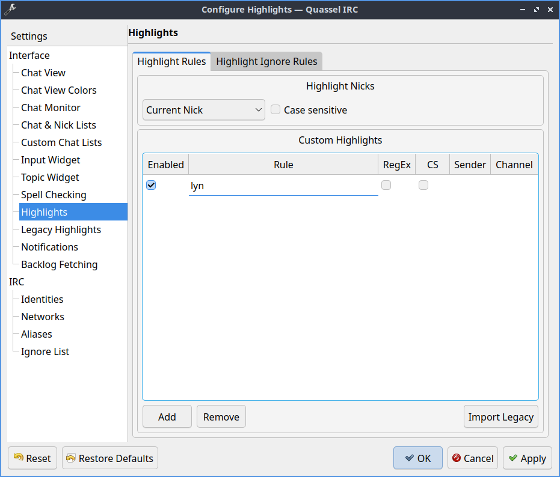
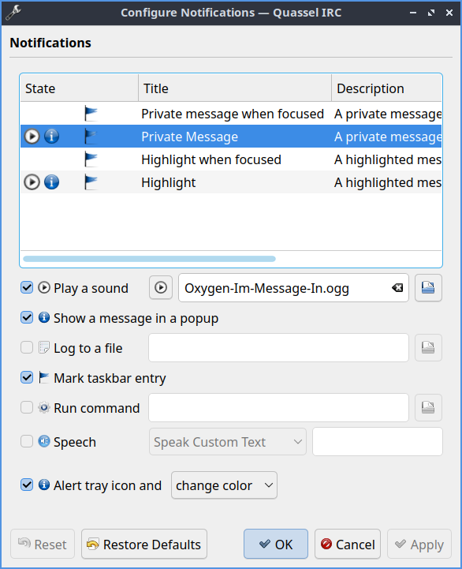
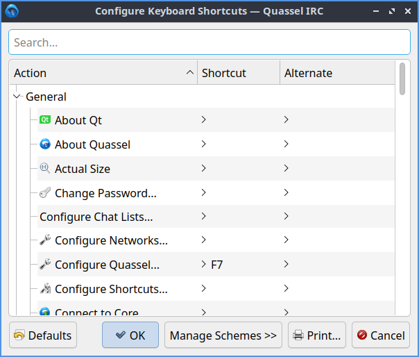

Chapter 2.1.3 Quassel IRC
=========================

Quassel IRC is a modern, cross-platform, distributed chat client. Quassel aim to bring a pleasurable, comfortable chatting experience to all major platforms (including Linux®, Windows®, and MacOS X® as well as Android smartphones), making communication with your peers not only convenient, but also ubiquitous available. 

Features:
 - Remember Channels and servers
 - SASL authentication
 - Notifications, including sounds
 - Aliases
 - Ignore lists

Usage
------
To chat on IRC you need to connect to a server and join a channel. This can be done with the join button or by typing "/join [channel]". To send a query or private message directly to someone type "/query" username or right click on the user list and select start query. If you wish to view older messages just scroll up with the mouswheel or the scrollbar to the right. Scroll down to view newer messages.

To add the Lubuntu IRC chat network click :menuselection:`File --> Networks --> Configure_Networks`. To add a new network  :guilabel:`+Add`. To connect to a common public network :guilabel:`Use preset` dropdown, select :guilabel:`Lubuntu IRC` and then click :guilabel:`OK`.

To join a channel simple type "/join 1" (where 1 is the channel name), right click the network and select join channel or use the join button. To leave a chanel right click on the channel name on the right hand side and select :menuselection:`Part` from the context menu. If you want to join the channel again after leaving it right click on the channel and select :menuselection:`Join`. To have your chat be hidden until you rejoin it again right click on the channel and select :menuselection:`Hide Chats(s) Temporirarily`. To hide the chat forever right click on the channel and select :menuselection:`Hide Chats(s) Permananetly`.

To hide all people joining or leaving a chat right click on the channel list :menuselection:`Hide Events --> Joins/Parts/Quits`. To only hide people joining right click on the list of channel list :menuselection:`Hide Events --> Joins`. To hide people parting the channel right click on the channel list :menuselection:`Hide Events --> Parts`. To hide people quiting the channel right click on the channel list :menuselection:`Hide Events --> Quits`. To hide people changing their nickname :menuselection:`Hide Events --> Name Changes`. To hide when someone changes the topic of a channel :menuselection:`Hide Events --> Topic Changes`. To hide people changing the mode of a channel right click on the list of channels :menuselection:`Hide Events --> Mode Changes`. To hide when Quassel tells you it is tommorow right click on the list of channels :menuselection:`Events --> Day Changes`. However while hiding these may result in less busy traffic it can leave you trying to communicate with people no longer on irc.	 

To leave all servers and disconnect press the :guilabel:`Disconnect` button in the top toolbar. If you have multiple servers configured to disconnect from one press the downward pointed arrow and select the server you want to disconnect from. To connect to the servers again press the :guilabel:`Connect` button. To connect to a specific server press the downward pointing arrow and select the server you want to connect to. 

To switch between multiple channels left click on the channels on the left hand side. You also can switch between multiple channels with :kbd:`Alt + up arrow` to move up or :kbd:`Alt + Down arrow` to move down. To go to the next active chat press :kbd:`Alt + Right` or to go to the previous active chat :kbd:`Alt + Left`. To jump to a hot chat press :kbd:`Meta +A`. 

In Quassel if someone says your name you are said to be highlighted which in Quassel will make a sound and in a goldenrod color over the line of text with your name on it. The notification will also be shown on your desktop if you are in another window. Also when it becomes midnight Quassel will tell you when midnight happens and it is the next day.

If you want to enable automatically spell checking your input left click on the input bar and select :menuselection:`Auto Spell Check`. To change your languge for spellcheck right click in the input bar and select :menuselection:`Spell Checking language`. If you make a mistake when typing in your input you can press :kbd:`Control+Z` or right click on the input bar and select :menuselection:`Undo`. To redo tpying and action press :kbd:`Control+Shift+Z` or :menuselection:`Redo`. To clear the text you input right click the input bar and select :menuselection:`Clear`.

To zoom in to get to your chat more right click and select :menuselection:`Zoom In`. To zoom out in quassel press :kbd:`Control+-` or right click and select :menuselection:`Zoom Out`. To go back to your original size right click quassel and select :menuselection:`Actual Size`.

To use Sasl authentication to autologin to an account no matter which nickname you want to use :menuselection:`File --> Networks --> Configure networks` to bring up a network configuration dialog. Click on the autoidentify tab and press the checkbox for :guilabel:`Use SASL Authentication`. Enter your username on the IRC network in the :guilabel:`Account` text field. Input your password into the :guilabel:`Password` field so that you know how to auto identify. You can also autoidentify without  using sasl by clicking the Top checkbox. Nickserv is a sensible default for what the services is but it may be different on different servers and put your password in where you autoidentify. 

If you want to have settings for automatic reconnecting :menuselection:`File --> Network --> Configure network` and select the :guilabel:`Connection` tab. The checkbox  :guilabel:`Automatic Reconnect` will automatically rejoin chats if you get disconnected. The :guilabel:`Wait` field shows how long to between the retries between each try. The checkbox for :guilabel:`Rejoin all channels after reconnect` lets you rejoin all of your channels without having to manual rejoin each. The :guilabel:`Number of retries` is how many times to retry to connect before stopping. To have an unlimited number of retries click the :guilabel:`Unlimited` number of checkboxes.     

To ignore a really annoying user you can on the nicks bar on the right hand side right click ignore and then select a user to ignore so you will not see what they type. If you realize you want to talk to them again Right click the same username and uncheck the checkbox for the ignore rule you created.  

To type a message to an entire channel type into the bar at the bottom and press enter. To complete typing someone's nickname press the :kbd:`Tab` key to complete their name. To paste text into the channel such as a link press :kbd:`Control + V` or right click paste. If you see a hyperlink in chat you can left click on the link to open in your webbrowser or you can copy the link by right clicking on it and :menuselection:`Copy Link Address`.   

To add close the list of nicknames or channels press the X button or :menuselection:`View --> Nicks`. To reopen the view of nicks :menuselection:`View --> Nicks`. To close the list of all chats press the X button to close a list of all channel and private messages you are in. To reopen it press the :menuselection:`View --> Chat lists --> All chats`. 

To make your chat full screen :menuselection:`View --> Full Screen Mode` or :kbd:`Control + Shift +F`. Press the keyboard shortcut or use the menu again to get out of fullscreen. If you want to quit quassel press :kbd:`Control+Q`.
 
To see all the nicknames of someone in a channel are located in a sidebar labeled :guilabel:`Nicks`. The lists of all channels you are in is labeled :guilabel:`All chats`. To switch between different channels left click on the channel name.

Customizing
-----------
To change your preferences for quassel press :kbd:`F7` or :menuselection:`Settings --> Configure Quassel`. To choose a language for your chat change the :guilabel:`Language` drop down menu. To change the client style for the widget of quassel choose a widget style from the :guilabel:`Widget style` drop down menu. To toggle showing tray icon check/uncheck the :guilabel:`Show system tray icon` checkbox. If you want to be able to close the quassel window and still have quassel running in the system tray to bring it back up check the :guilabel:`Hide to tray on close button`. To change which icon theme you use for quassel use the :guilabel:`Fallback icon theme` drop down menu and to have it replace your system icon theme press the :guilabel:`Override system theme`.

The :guilabel:`Chat view` tab has settings for colors timestamps and hyperlinks. To toggle showing brackets around everyone's nicknames check the :guilabel:`Show brackets around sender names`. To chose a custom chat window font press the :guilabel:`Custom chat window font` checkbox and then press the :guilabel:`choose` button to choose a new font. To toggle if you want colored text press/unpress the :guilabel:`Allow colored text` checkbox.  To toggle previews of hyperlinks in chat check/uncheck the :guilabel:`Show previews of webpages on URL hover`. To toggle setting marker line when switching chats check/uncheck the :guilabel:`Set marker line automatically when switching chats`. To toggle the set marker line automatically when you switch windows check/uncheck :guilabel:`Set marker line automatically when Quassel loses focus` checkbox. 

To change your colors of chat use the :guilabel:`Chat View Colors` tab. To change the Colors of your user interface on Quassel check the :guilabel:`Custom Colors` checkbox. Then there are many buttons for each different kind of message which you can press the buton that all bring up the specific color for that kind of message. 

The :guilabel:`Chat & Nick Lists` has settings for the lists of nickname lists. The :guilabel:`Custom font` checkbox lets you chose a custom font on the lists of nicks and the :guilabel:`Choose` button lets you choose the font you want. The :guilabel:`Display topic in tooltip` shows the channel topic in a tooltip if you move the mouse over it. If you want to be able to switch channels from the mouse wheel check the :guilabel:`Mouse wheel changes selected chat` checkbox. The checkbox :guilabel:`Use Custom Colors` enables the settings for different colors for the different channels. The buttons next to :guilabel:`Standard`, :guilabel:`Inactive`, :guilabel:`Highlight`, or :guilabel:`Other activity` all change what color the channel appears when you are in a list of channels. The :guilabel:`Custom Nick List colors` checkbox lets you change the color of nicks in the list. The :guilabel:`Online` button changes the color of nicks of online users. The :guilabel:`Away` button changes the color of nicks of Away users.  

The :guilabel:`Input widget` has settings for what you tab to type into chanels or private messages. The :guilabel:`Custom Font` checkbox has a thing to activate your own custom font for just input and press the :guilabel:`Choose` button to the font. To have per chat history check the :guilabel:`Enable per chat History` checkbox. The checkbox :guilabel:`Show nick selector` puts a widget in the lower left corner of the window to select different nicks. The checkbox :guilabel:`Show style buttons` shows buttons that style your text hidden in an arrow under an arrow. To enable line wrapping when you type a long line in the input box check the :guilabel:`Line Wrapping`  checkbox. To enable multiple line editing if you have a really long thing you want to type into the irc channel check the :guilabel:`Multi-Line Editing` checkbox. To edit the largest number of lines shown change the :guilabel:`Show at most X lines` field. To have a scrollbar on inputting text if long enough check the :guilabel:`Enable scrollbars` checkbox. After tab completeing someone's nick if you want something after it in the :guilabel:`Completion suffix` field. To add a space afterward tab completing someone's nick by checking the :guilabel:`Add space after nick when completing mid-sentence` checkbox.

To change how quassel displays the topic of each channel use the :guilabel:`Topic Widget` tab. To use a custom font for your topic press the :guilabel:`Custom font` checkbox and to choose a different font press the :guilabel:`Choose` button. To choose to resize to fit the topic check the :guilabel:`Resize dynamically to fit contents`. To only do this when you hove over the topic check the :guilabel:`On hover only` checkbox. 

To view settings for spellcheck use the :guilabel:`Spell Checking` tab. To change the default language for you spell check use the :guilabel:`Default language` drop down menu. To toggle autodetecting language check the :guilabel:`Enable autodetection of language` checkbox. To have Automatic spell checking by default check the :guilabel:`Automatic spell checking enabled by default` checkbox. To have spell check not spellcheck on words starting with capital letters check the :guilabel:`Skip all uppercase words` checkbox. To not spellscheck two words right next to each other check the :guilabel:`Skip run-together words` checkbox. To add words to be the dictionary type in the :guilabel:`Ignored Words` field and then press the :guilabel:`Add` button. To remove a word from your dictionary left click on it and press the :guilabel:`Remove` button. 

To have additional settings on highlights use the :guilabel:`Highlights` tab. To add other words or names to highlight you can press the :guilabel:`Add` button. To change what you want a name or word to be highlighted double click on the :guilabel:`Name` column. To toggle enabling being highlighted by the name check or uncheck the checkbox in the :guilabel:`Enabled` column. To make being highlighted case sensitive check the checkbox in the checkbox in the :guilabel:`CS` column. To use a regular expression for the rule to highlight check the checkbox in the :guilabel:`RegEx` column. To remove this highlight rule press the :guilabel:`Remove` button.

To change your settings Quassel getting and displaying backlogs can be set from :guilabel:`Backlog Fetching` tab. To change modes of backlog fetching to unread messages or a fixed number per chat use the :guilabel:`Backlog request method` drop down menu. If you choose a fixed amount you can change the :guilabel:`Initial backlog amount` to change how many lines you get. If you change the amount unread messages choose the :guilabel:`Limit` to get that many unread messages and then the :guilabel:`Additional Messages` will be shown for context.

To change your settings on your notifications :menuselection:`Settings --> Notificiations`. You can also get to this from the :guilabel:`Notifications` tab from the notifactions tab. To select which event to change your settings left click on :guilabel:`Private message when focused`, :guilabel:`Highlight`, :guilabel:`Highlight When Focused`, or :guilabel:`Private Message`. If you do not know what highlight is it is when someone mentions your name in a channel. The checkbox :guilabel:`Play a Sound` allows you to to toggle playing a sound in the context. The checkbox :guilabel:`Show message in a popup` creates a popup notification when someone else mentions you. The :guilabel:`Log to file` puts the message in a file. The :guilabel:`Mark taskbar entry` makes the taskbar entry appear highlighted.  

To change your shortcut :menuselection:`Settings --> Configure Shortcuts`. To see what shortcut does look at the :guilabel:`Action` column in the table. To see what keyboard shortcut to press see the :guilabel:`Shortcut` column. To set a second keyboard shortcut to do something use the :guilabel:`Alternate` column.  To switch to a custom keyboard shortcut left click on the action in the action column press the :guilabel:`Custom` and then press the button to the right and input your keyboard shortuct. To restore your keyboard shortcuts to the defaults press the :guilabel:`Defaults` bottom at the bottom. To not make your changes for keyboard shortcuts press the :guilabel:`Cancel` button. To apply your changes to keyboard shortcuts and close the window press the :guilabel:`OK` button.

Version
-------
Lubuntu ships with version 1:0.13.1 of Quassel IRC.

How to Launch
-------------
In the menu go to :menuselection:`Internet --> Quassel` IRC or type 

.. code:: 

 quassel 
 
in the terminal.
