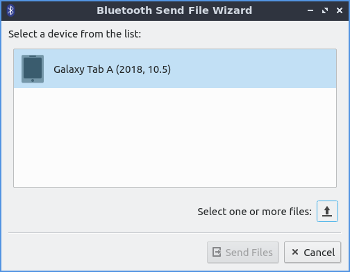

Chapter 2.1.4 Bluedevil
=======================

Bluedevil is the default application to manage bluetooth devices for lubuntu.

Version
-------
Lubuntu ships with version 5.14.4 of bluedevil. 

Pairing
-------
To launch bluedevil to pair with a device from the menu :menuselection:`Internet --> Bluedevil Wizard`. If bluetooth is disabled you will be asked to enable it. In the main part of the window will show detected bluetooth devices under the heading :guilabel:`Select a device`. To choose a device to pair with left click on it. Click on the device you wish to add and press :guilabel:`Next`.  

Next you will be asked if your pin matches on your device to pair it. If the pin matches press the :guilabel:`Matches` button. If the the pin does not match press the :guilabel:`Does not match button`.

Sending files
-------------
To send a file to another device after pairing with the device :menuselection:`Internet --> Bluedevil Send File` to open the file sending dialog. Then select the device you want to send a file to. Press the button with the upward pointing arrow to to bring a dialog of which files to transfer.  To choose which device to sent a file select the device under :guilabel:`Select a device from the list`.

Screenshot
----------

.. image:: bluedevilwizard.png
