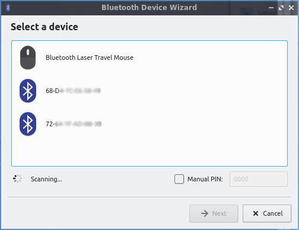

Chapter 2.1.4 Bluedevil
=======================

bluedevil is the default application to manage bluetooth devices for lubuntu.

Version
-------
Lubuntu ships with version 5.13.5 of bluedevil. 

Pairing
-------
To launch bluedevil to pair with a device from the menu -> Internet -> Bluedevil Wizard. If bluetooth is disabled you will be asked to enable it. In the main part of the window will show detected bluetooth devices. Click on the device you wish to add and press next.  

Screenshot
----------

