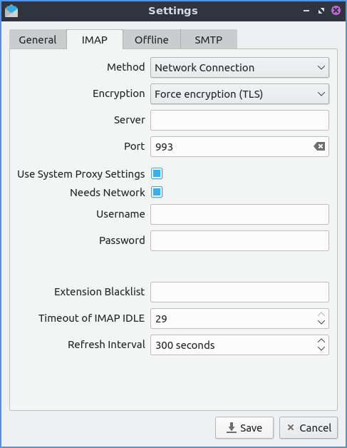
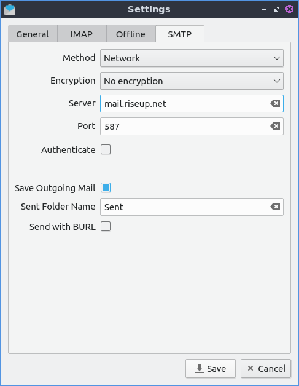
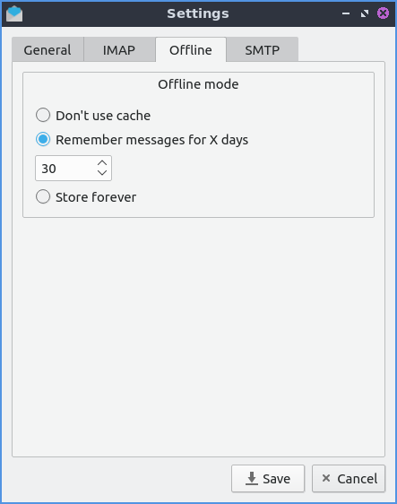
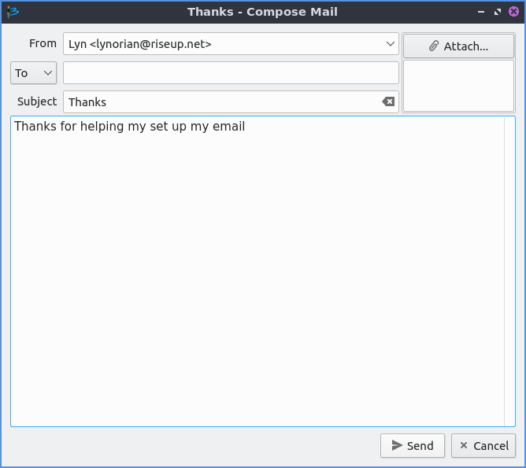
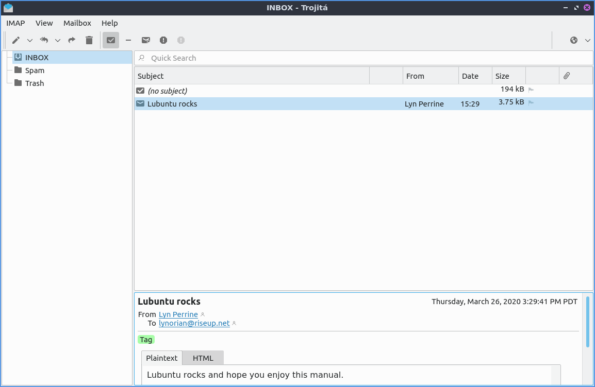

Chapter 2.1.5 Trojita
=====================

Trojita is the default IMAP email client of Lubuntu.

.. note::

  Trojita does not do POP3 so you cannot access your email that way with Trojita.

Usage
------
To use Trojita you will need to input your account information. You will need to type in your name so people know what call you and the email address so Trojita needs to know what address to get information from. The :guilabel:`IMAP` tab has settings for how to get messages to your machine. The :guilabel:`Encryption` method tells what kind of encryption to use when accessing your mail as needed for your mail provider. The :guilabel:`Server` field is where you input what server to get your email from. The :guilabel:`Port` tells Trojita which network port to access the server on. The :guilabel:`Username` tells Trojita which username to send to the email server.  

After entering this in you will be asked to check the certificate for your server and will need to select the :guilabel:`yes` for the first time. If you did not insert your password to be stored on your computer a dialog box will popup and you will need to input it.

After you have set everything up a set of folders will appear on the left hand side.

To change how long Trojita stores messages in offline mode from the settings from :menuselection:`IMAP --> Settings` and use the :guilabel:`Offline` tab. To not store messages offfline select the :guilabel:`Don't use cache` button. To keep your email messages indefinetly press the :guilabel:`Store forever` button.

To send an email to someone press :kbd:`Control +N` or :menuselection:`IMAP --> Compose Mail --> New Message`. Then you will bring up a compose mail window. Type the email address of the person you want to type the address where it says :guilabel:`To`. Put the subject of your message in the :guilabel:`Subject` line. In the main part of the message called the body is where you will add most of your message. If you want to attach a file to your email press the button with the paperclip on it that says :guilabel:`Attach`. To send your message press the :guilabel:`Send` button. To save a draft of your message press the :guilabel:`Cancel` button and then press the :guilabel:`Save` button to actually save the draft. If you don't want to save a message press the :guilabel:`Cancel` button and then press the :guilabel:`Discard` button. To reopen a saved draft of a message :menuselection:`IMAP --> Compose Mail --> Edit Draft...`.

To view your messages on Trojita to see new messages you have received in your inbox left click on the word :guilabel:`Inbox`. In the center of the window will show a list of all messages in your inbox. Unread messages will appear in bold. To view a message left click on the title and subject of the window and it will appear at the bottom. If you want to open this email in a popup window of its own double click the message title. If you receive an email with an attachment a paperclip will appear on the message and click that to download the attachment or open it directly. To switch from text to HTML view click the :guilabel:`HTML` tab. To switch back to text click on the :guilabel:`Text` tab. Sometimes HTML email needs to be load external things to view the email and Trojita does not load them by default for privacy but to actually load the content press the :guilabel:`Load` button.

Your different folders are on a sidebar on the left hand side of Trojita. To switch to another folder such as sent mail to view your sent messages left click on the :guilabel:`Sent Mail` folder in this case. To switch to the drafts folder left click where it says :guilabel:`Drafts`. To remember messages for only a specified numbers of days press the :guilabel:`Remember messages for X days` button and use the below field to select the number of days.

To move to the next unread message press the :kbd:`n` key or to move to the previous message press the :kbd:`p` key. To manually toggle marking a message as read press the :kbd:`m` key.

To reply to a message to just the person that sent it press :kbd:`Control + Shift +A` or :menuselection:`IMAP --> Private Reply`. To forward an email to someone else press :kbd:`Control +Shift+F` or :menuselection:`IMAP --> Forward`.  

In the center of the window there are several different columns that show you information about each different email you have received. The :guilabel:`Subject` line shows you a subject that should tell you what each message is about. The :guilabel:`From` column shows who is sending you this email. The :guilabel:`Date` Column show when the email was sent to you. The :guilabel:`Size` column shows you how much space the email takes up on your account on the email server. To see if there is an attachment to a message a column has what looks like a paperclip and it has a paperclip in it if that email has an attachment.

When writing a reply message a window will pop up to write your message in. To send the message press the :guilabel:`Send` button. If you change your mind about sending this message press the :guilabel:`Cancel`. 

To manually check for new messages :menuselection:`Mailbox --> Check for new messages`. To hide read messages :menuselection:`View --> Hide read messages` and uncheck this to see read messages again. To view newest messages in Trojita first :menuselection:`View --> Sorting --> Descending`. To switch back to your old view of oldest message first :menuselection:`View --> Sorting --> Ascending`. 

To launch an address book of saved contacts :menuselection:`IMAP --> Address Book`. To add a new message to contacts press the :guilabel:`Add` button. Once on the new contact double click on the fields which are all optional. If you press the X button and have changes you will bring up a dialog to save the changes. 

To change your view of Trojita to view only one message at a time or the view of your inbox :menuselection:`View --> Layout --> One At Time` which is quite useful on small screens. To view you message in a three column format with your folders to the list of message in each folder in the center and then the message itself on the right :menuselection:`View --> Layout --> Wide`. To return to your original view :menuselection:`View --> Layout --> Compact`. To hide the menubar press :kbd:`Control+M` or :menuselection:`View --> Show Main Menu Bar` and do the same thing again to see the menubar again. To toggle showing your menubar :menuselection:`View --> Show Toolbar`.

To take Trojita into an offline mode where it will not try to access the internet :menuselection:`IMAP --> Network Access --> Offline` however you will need to switch it back to expensive access or free access to send or receive emails again. To switch back to an mode where you have no worry about data caps or how much network traffic is used :menuselection:`IMAP --> Network Access --> Free Access`. To throttle the amount of data used from Trojita to not use up a data cap :menuselection:`IMAP --> Network Access --> Expensive Connection`. 

If you want to quit Trojita press :kbd:`Control+Q` or from the system tray right click there and select :menuselection:`Quit`. In the bottom right there is a system tray icon on the panel. When you receive a new message the system tray icon will become blue and have the number of unread messages on it.

Version
-------
Lubuntu Ships with version 0.7-0 of Trojita.

How to Launch
--------------
To launch Trojita from the menu :menuselection:`Internet --> Trojita` with the icon that looks like an envelope or run

.. code::

   trojita 
 
from the command line. 
