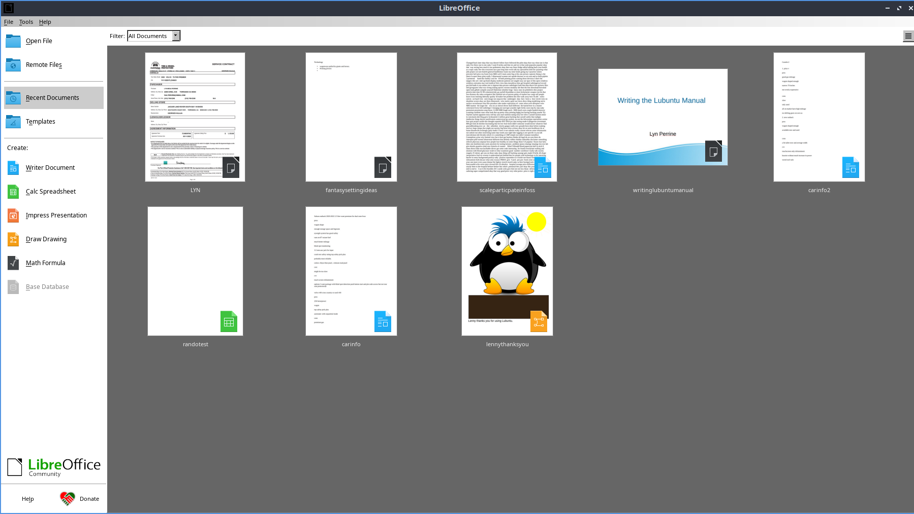

Chapter 2.2.1 Libreoffice
=========================

Libreoffice is an open source full office suite. In the menu there are shortcuts to different libreoffice applications and your recently used files. 

Useage
------
To open a recently used file in libreoffice they are shown in the main part of the window. To open a program or to create a file from a file dialog are along the left hand column. 

Libreoffice all of the different components have a window menu that lets you switch between a document in libreoffice writer and libreoffice calc. To do this go to :menuselection:`Window` and select the window that you want to switch to. 

Libreoffice if you shutdown without saving your work libreoffice will automatically recover the document. If you do not want to recover a document press the :guilabel:`discard` button. If you want to automatically recover the document press the :guilabel:`start` button. If recovery keeps on failing and won't launch run 

.. code:: 

   libreoffice --norestore

from the command line to be able to launch libreoffice if it keeps crashing at startup.

Screenshot
----------

Version
-------
Lubuntu ships with version 6.2.2.2 of libreoffice.

How to launch
-------------
From the menu :menuselection:`Office --> Libreoffice` to launch libreoffice or run 

.. code::

   libreoffice 
   
from the command line. 
