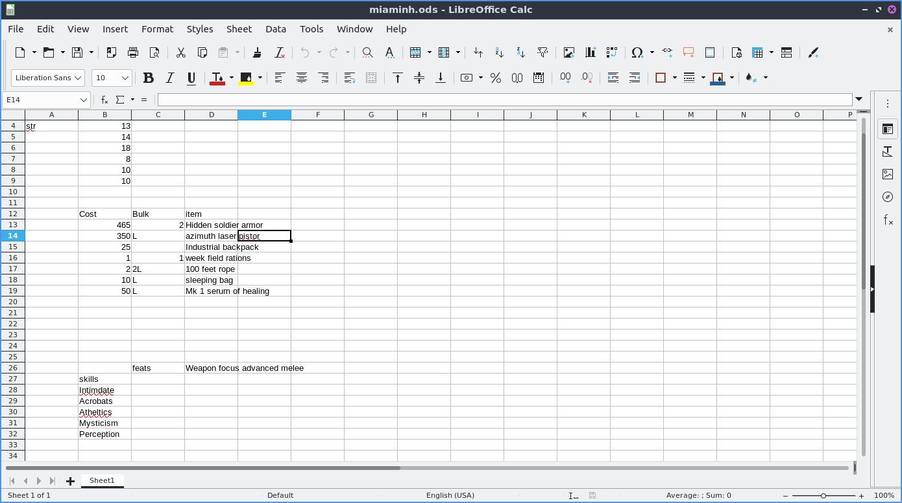
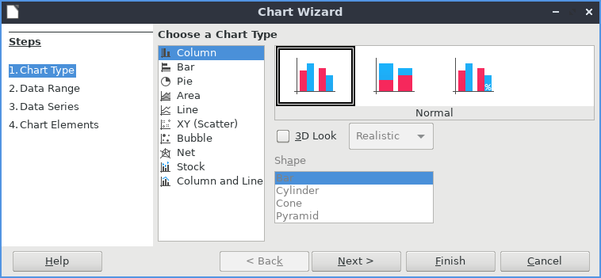

Chapter 2.2.2 Libreoffice Calc
==============================

Libreoffice Calc is a spreadsheet program included by default in Lubuntu.

Usage
------
To move between cells press the arrow keys. To enter data into cells type in the keyboard. To select cells left click and drag to select the cells you want. To sum data from cells in the cell where you want the sum is to press the button that looks like Σ character and then drag the mouse over the cells you want to add. To sort your cells in descending order press the button with bullet points and an arrow going down. To sort in ascending order press the button with bullet points and an arrow pointing upwards.   

To save your spreadsheet you need to press the button that looks like a floppy disk, press the keyboard shortcut or go to :menuselection:`File --> Save`. To save with a different file name :menuselection:`File --> Save as`. To open a file press the button that looks like a brown folder and add select the file you want from the dialog or :menuselection:`File --> Open`. To open a recent document :menuselection:`File --> Recent Documents`.

To copy data you can right click copy, press the button with two pieces of paper or press :kbd:`control + c`. To paste data press control :kbd:`control +v`, :menuselection:`edit -->  paste`, right click paste or press the button that is a clipboard with a piece of paper on it. To cut text press :kbd:`control+x` or press the scissors button to cut text. If you want to paste your text unformatted press :kbd:`Control+Shift + Alt+V` or :menuselection:`Edit --> Paste Unformatted Text`.

To change to showing currency for the number press :kbd:`Control+Shift+4` or :menuselection:`Format --> Number Format --> Currency`. To change to percentage press :kbd:`Control+Shift+5` or :menuselection:`Format --> Number Format --> Percentage`. To switch back to a normal number press :kbd:`Control+Shift+1` or :menuselection:`Format --> Number Format --> Number`. 

To view values highlighted in another color to see them easier press :kbd:`Control+F8` or :menuselection:`View --> Value Highlighting`.

To insert an image press :menuselection:`Insert --> Image`. To get to the dialog of how to insert a chart :menuselection:`Insert --> Chart`. The first selection is to choose a column, bar, Pie, Area, Line, XY(Scatter), Bubble, Net, Stock, or Column and Line chart. To change the subtype of graph click the picture of a chart that looks like the type you want.

If you want to insert a new column to the left of a column right click on the letter for the column :menuselection:`Insert Column Before`. If you want the new column to the right is right click on the letter and :menuselection:`Insert Column After`. To insert a row above the current row right click on the number and :menuselection:`Insert Row Above`. To insert a row below the current row right click on the number and :menuselection:`Insert Row Below`. To delete a row or column right click the number  and select :menuselection:`Delete rows` or :menuselection:`Delete Column`.  

To change the size of a row or column of cells click in between the border of that particular row or column and drag with the mouse to give yourself room. 

To sort your data like a bunch of names first select all the cells with the mouse :menuselection:`Data --> Sort Ascending`. If you want the reverse order to this you can have :menuselection:`Data --> Sort Descending`.  

To undo a selection press :kbd:`control +z` or press the button with the arrow looping around and pointing to the left. To redo an operation press :kbd:`Control +y` or the number looping to the right and exiting to the left.  

To zoom to view a full page on your spreadsheet in the menu :menuselection:`View --> Zoom --> Entire Page`. To view the whole width of your page on the menu :menuselection:`View --> Zoom --> Page Width`.   

To select all cells in your spreadsheet press :kbd:`Control+A`. To select an entire column press :kbd:`Control+Space` or :menuselection:`Edit --> Select --> Select Column`. To select an entire row press :kbd:`Shift +Space` or :menuselection:`Edit --> Select --> Select Row`.

To create a new spreadsheet in the same file press the button on the bottom that looks like a :guilabel:`+` or :menuselection:`Sheet --> Insert Sheet`. To switch between each sheet press the button on each sheet at the bottom near the button to add a new sheet.

To insert a special character not on your keyboard :menuselection:`Insert --> Special Character`. To select what character to insert left click in the center of the inserting character window. To actually insert the symbol press the :guilabel:`Insert` button.

To quit Libreoffice Calc press :kbd:`Control+Q`.

Version
-------
Lubuntu ships with version  6.2.2.2 of libreoffice Calc. 

How to launch
-------------
To launch libreoffice calc from the menu go to :menuselection:`Office --> Libreoffice Calc` or run 

.. code::

   localc 
   
from the command line. 
