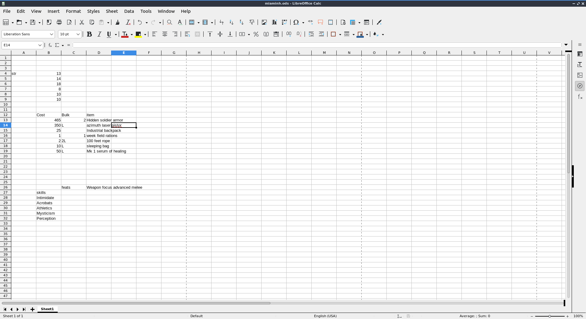
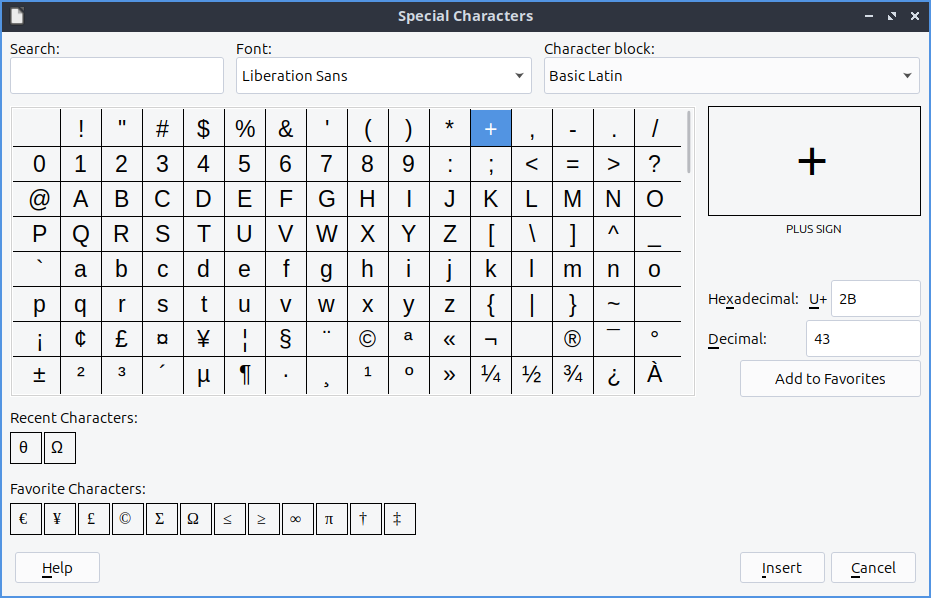
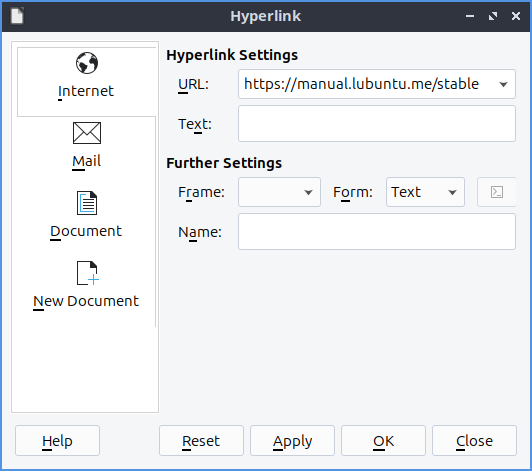
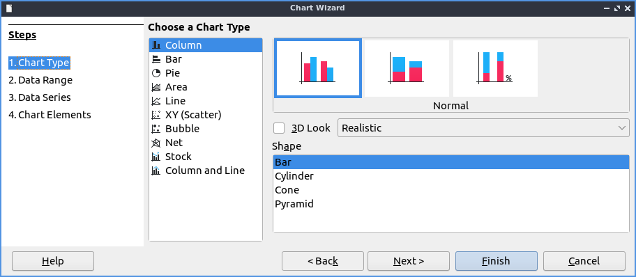

Chapter 2.2.2 LibreOffice Calc
==============================

LibreOffice Calc is the default spreadsheet program for Lubuntu.

Usage
------
To move between cells press the arrow keys in the direction you want to move. To enter data into cells type in the keyboard. To select cells left click and drag to select the cells you want. To sum data from cells in the cell where you want the sum is to press the button that looks like :guilabel:`Σ` character and then drag the mouse over the cells you want to add. To sort your cells in descending order press the button with bullet points and an arrow going down. To sort in ascending order press the button with bullet points and an arrow pointing upwards.

To save your spreadsheet you need to press the button that looks like a floppy disk, press the keyboard shortcut or go to :menuselection:`File --> Save`. To save with a different file name :menuselection:`File --> Save as`. To open a file press the button that looks like a brown folder and add select the file you want from the dialog or :menuselection:`File --> Open`. To open a recent document :menuselection:`File --> Recent Documents`.

To copy data you can right click :menuselection:`Copy`, press the button with two pieces of paper or press :kbd:`control + c`. To paste data press control :kbd:`control +v`, :menuselection:`Edit -->  Paste`, right click :menuselection:`Paste`, or press the button that is a clipboard with a piece of paper on it. To cut text press :kbd:`control+x`, right click :menuselection:`Cut`, or press the scissors button to cut text. If you want to paste your text unformatted press :kbd:`Control+Shift + Alt+V` or :menuselection:`Edit --> Paste Unformatted Text`.

To change to showing currency for the number press :kbd:`Control+Shift+4` or :menuselection:`Format --> Number Format --> Currency`. To change to percentage press :kbd:`Control+Shift+5` or :menuselection:`Format --> Number Format --> Percentage`. To switch back to a normal number press :kbd:`Control+Shift+1` or :menuselection:`Format --> Number Format --> Number`.

To view values highlighted in another color to see them easier press :kbd:`Control+F8` or :menuselection:`View --> Value Highlighting`.

To view a long list of functions to use :menuselection:`View --> Function List`. To select different functions left click on the function name in the column. To insert a function press the :guilabel:`fx` button. To sort by different categories of functions use the drop down menu to the right of the :guilabel:`fx` button. To close this function sidebar press the :guilabel:`x` button.

To see a gallery of stock images for your spreadsheet :menuselection:`View --> Gallery`. To get a list of different categories of images beneath :guilabel:`Galleries` and left click to select your image. To move an image in from the gallery to your spreadsheet left click on the image and drag the image to where you want.

To style part of your spreadsheet to bring lots of attention to a cell :menuselection:`Styles --> Accent 1`. To bring slightly less attention to a cell :menuselection:`Styles --> Accent 2`. To bring even less attention to a cell :menuselection:`Styles --> Accent 3`. To style a cell like a heading :menuselection:`Styles --> Heading 1`. To have a slightly smaller heading :menuselection:`Styles -->  Heading 2`. To switch back to your original style :menuselection:`Styles --> Default`.

To insert an image press :menuselection:`Insert --> Image`. To select an image to change how it appears in your spreadsheet left click on it. To resizing your image while keeping the same aspect ratio click on the box on a corner of your image. To stretch or shrink an image horizontally left click on the boxes on the left or right hand side and then release when in the giant position. To stretch on shrink your image vertically click on the box on the top or bottom and drag to your desired position. To change what image shows on the spreadsheet right click on the image and select :menuselection:`Replace`. To save an image in a spreadsheet right click on the image and select :menuselection:`Save`. To remove an image from your spreadsheet press the :kbd:`Delete` key.

If you want to insert a new column to the left of a column right click on the letter for the column :menuselection:`Insert Column Before`. If you want the new column to the right is right click on the letter and :menuselection:`Insert Column After`. To insert a row above the current row right click on the number and :menuselection:`Insert Row Above`. To insert a row below the current row right click on the number and :menuselection:`Insert Row Below`. To delete a row or column right click the number  and select :menuselection:`Delete rows` or :menuselection:`Delete Column`.

To change the size of a row or column of cells click in between the border of that particular row or column and drag with the mouse to give yourself room.

To sort your data like a bunch of names first select all the cells with the mouse :menuselection:`Data --> Sort Ascending`. If you want the reverse order to this you can have :menuselection:`Data --> Sort Descending`.

To undo a selection press :kbd:`control +z` or press the button with the arrow looping around and pointing to the left. To redo an operation press :kbd:`Control +y` or the number looping to the right and exiting to the left.

To zoom to view a full page on your spreadsheet in the menu :menuselection:`View --> Zoom --> Entire Page`. To view the whole width of your page on the menu :menuselection:`View --> Zoom --> Page Width`. To zoom to a particular percentage :menuselection:`View --> Zoom` and select the percentage you want. Another way to change your zoom is the slider in the bottom right hand corner. To zoom in move the slider to the right and to zoom out move the slider to the left.

To select all cells in your spreadsheet press :kbd:`Control+A`. To select an entire column press :kbd:`Control+Space` or :menuselection:`Edit --> Select --> Select Column`. To select an entire row press :kbd:`Shift +Space` or :menuselection:`Edit --> Select --> Select Row`.

To create a new spreadsheet in the same file press the button on the bottom that looks like a :guilabel:`+` or :menuselection:`Sheet --> Insert Sheet`. To switch between each sheet press the button on each sheet at the bottom near the button to add a new sheet.

To insert a special character not on your keyboard :menuselection:`Insert --> Special Character`. To select what character to insert left click in the center of the inserting character window. To search for a symbol type your search term into the :guilabel:`Search` field. To chose which group of symbols to choose from use the :guilabel:`Subset` drop down menu. To actually insert the symbol press the :guilabel:`Insert` button.

To insert a hyperlink in LibreOffice Calc :menuselection:`Insert --> Hyperlink` or press :kbd:`Control+K`. To actually type the address in the :guilabel:`URL` field. To switch to a button for the hyperlink use the :guilabel:`Form` button. To switch back to text use the :guilabel:`Form` drop down and select :guilabel:`Text`.

To make text bold in LibreOffice Calc press :kbd:`Control + B` or :menuselection:`Format --> Text --> Bold`. To make text italic press :kbd:`Control + I` or :menuselection:`Format --> Text --> Italic`. To have your text have a single underline :menuselection:`Format --> Text --> Single Underline`.

To align text in the center of the cells press :kbd:`Control +E` or :menuselection:`Format --> Align Text --> Centered`. To align text in the cells to the right of the cell press :kbd:`Control +R` or :menuselection:` Format --> Align Text --> Right`. To switch the text back to being on the left press :kbd:`Control +L` or :menuselection:`Format --> Align Text --> Left`. To align text so that the edges of each cell all line up with being stretched in the center press :kbd:`Control + J` or :menuselection:` Format --> Align Text --> Justified`. To align text to the top of the cell :menuselection:` Format --> Align Text --> Top`. To center thee text vertically in the cell :menuselection:`Format --> Align Text --> Center`. To align text to the bottom of a cell :menuselection:`Format --> Align Text --> Bottom`.

To format your cells for a number with two decimal places press :kbd:`Control+Shift+1` or :menuselection:`Format --> Number Format --> Number`. To format a number as a percent press :kbd:`Control+ Shift+ 5` or :menuselection:`Format --> Number Format --> Percent`. To format a cell as currency press :kbd:`Control + Shift + 4` or :menuselection:`Format --> Number Format --> Currency`. To format a cell as a date press :kbd:`Control+ Shift+ 3` or :menuselection:`Format --> Number Format --> Date`. To format a cell as time :menuselection:`Format --> Number Format --> Time`. To format the cell in scientific notation press :kbd:`Control + Shift + 2` or :menuselection:`Format --> Number Format --> Scientific`. To switch your formatting back to the general default press :kbd:`Control+ Shift +6` or :menuselection:`Format --> Number Format --> General`. To add a thousands separator to your number :menuselection:`Format --> Number Format --> Thousands Separator`.

To toggle hiding the formula bar :menuselection:`View --> Formula Bar`. To toggle viewing the status bar at the bottom :menuselection:`View --> Status Bar`. To toggle showing the headers that show what each cell is like a4 :menuselection:`View --> View Headers`. To toggle viewing gridlines :menuselection:`View --> View Grid Lines`.

To add a new spreadsheet quickly at the end press the :guilabel:`+` button at the bottom. To switch between different sheets left click on the sheet name at the bottom bar. To delete a sheet you added right click on it :menuselection:` Delete Sheet` and then confirm you are deleting that sheet. To rename a sheet right click on the sheets name and :menuselection:`Rename Sheet`. To see which sheet you are on it will be underlinded at the bottom bar and also say how many sheets along the bottom bar.

To quit LibreOffice Calc press :kbd:`Control+Q`.

Charts
------
To get to the dialog of how to insert a chart :menuselection:`Insert --> Chart`. The first selection is to choose a :guilabel:`Column`, :guilabel:`Bar`, :guilabel:`Pie`, :guilabel:`Area`, :guilabel:`Line`, :guilabel:`XY(Scatter)`, :guilabel:`Bubble`, :guilabel:`Net`, :guilabel:`Stock`, or  :guilabel:`Column and Line` chart. To change the subtype of graph click the picture of a chart that looks like the type you want. To switch to the next step of making a graph press the :guilabel:`Next` button.

The :guilabel:`Data Range` tab controls what data will be in the chart and how present it. To switch to basing the bottom axis of your chart on rows of data press the :guilabel:`Data series in rows` button. To choose to switch your bottom axis of your chart on columns press the :guilabel:`Data series in columns` button. To use the first row as a label on each item on the chart check the :guilabel:`First row as label` checkbox. To input a custom title on the first column of your chart check the :guilabel:`First column as Label` checkbox.

.. image:: chart-data-range.png

The :guilabel:`Chart Elements` tab controls labels and displaying legends on your chart. To add a title to your chart type your title in the :guilabel:`Title` field. To add a subtitle to your chart type it in the :guilabel:`Subtitle` field. To add a label to your horizontal axis type your label in the :guilabel:`X axis` field. To label your vertical axis type your label in the :guilabel:`Y axis` field. To have a vertical grid lines on your chart check the :guilabel:`X axis` checkbox. To have horizontal lines on your grid check the :guilabel:`Y axis` checkbox. To toggle displaying a legend on your graph check the :guilabel:`Display legend` checkbox. To move the legend to the left hand side press the :guilabel:`Left` button. To move the legend to the right hand side press the :guilabel:`Right` button. To move the legend to the top of the chart press the :guilabel:`Top` button. To move the legend to the bottom of the chart press the :guilabel:`Bottom` button.

.. image:: chart-elements.png

Version
-------
Lubuntu ships with version 7.5.6 of LibreOffice Calc.

How to Launch
-------------
To launch LibreOffice Calc from the menu go to :menuselection:`Office --> LibreOffice Calc` or run 

.. code::

   localc 
   
from the command line. The icon for LibreOffice Calc is a piece of paper with a green icon with a spreadsheet on it.
