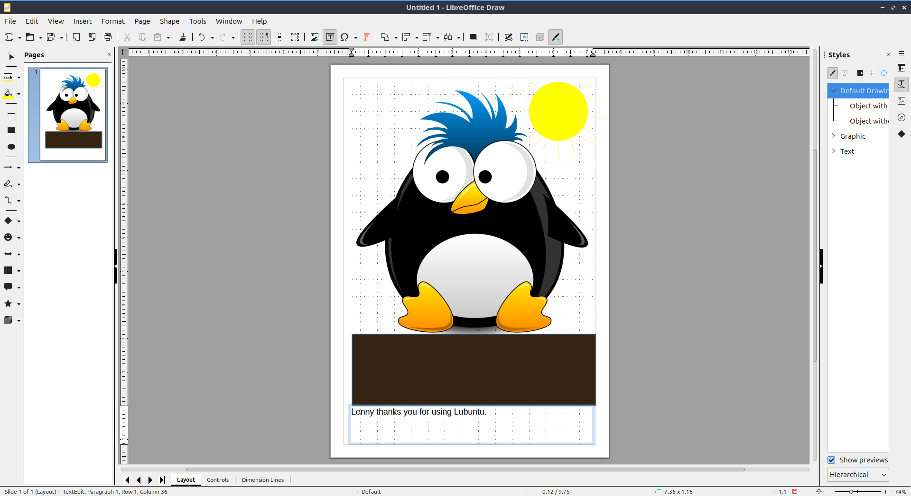

Chapter 2.2.3 LibreOffice Draw
==============================

LibreOffice Draw is the drawing portion of LibreOffice.

Usage
-----
To draw a line left click on the :guilabel:`single line` button on the toolbar on the left or :guilabel:`Shape --> Line`. Then click at one point where you want the line to start and move with the mouse to where you want it to end. To draw a rectangle left click on the :guilabel:`rectangle` button on the left bar or :guilabel:`Shape --> Rectangle`. Then click on one corner of the rectangle and then more the mouse to the other corner diagonally of where you want the rectangle. To draw an ellipse left click on the :guilabel:`ellipse` button on the left bar or :guilabel:`Shape --> Ellipse`. Then left click on one side of the ellipse and move the mouse to where you want the other side of the ellipse to end. At the end of drawing something it will be selected and you can move and resize it as you wish. 

To switch to a selection tool left click on the :guilabel:`mouse cursor` image on the left bar. To move what you have selected left click and drag it to where you want it. To resize an item keeping its proportion left click on a corner of the boxes that show up and click and drag to the desired side. To squish or stretch while resizing something click on corner on the side and the click and drag to the desired size. To delete an selected part press :kbd:`delete` while you have it selected.

To draw an arrow click on the :guilabel:`Left Pointing Arrow` button on the left bar. To choose among many different arrows :menuselection:`Shape --> Insert --> Block Arrows`. To change which type of arrow click on the drop down and left click on the arrow  to select that kind. Then left click where to put one end of the arrow and then move the mouse to the other end of the arrow. To draw a few different shapes click the :guilabel:`Shape` button on the left bar.  To choose a different shape click on the drop down next to the shape. The click where you want the shape and move the mouse to choose how big to make the shape. More shapes can also be chosen from :menuselection:`Shape --> Insert --> Basic Shapes`.

To change the color of your line press the :guilabel:`lines, dots, and drops` dropdown menu to choose many different colors. To choose your color for things filled in press the dropdown :guilabel:`underlined bucket button` on the left bar. To switch to a color left click on it. To switch to a recently used color click on the color under :guilabel:`Recent`. To select a custom color click on :guilabel:`Custom color`.

To insert a textbox press :kbd:`F2`, press the button :guilabel:`with a T in a box`, or :guilabel:`Insert --> Text box`. Drag the text box into what shape you want it. Then type the text you want in the text box.

To save your drawing press :kbd:`Control+s`, press the :guilabel:`Floppy disk` button, or :menuselection:`File --> Save`. To save your file as a separate name press :kbd:`Control+ shift + s` or :menuselection:`File --> Save As`. To open a file press :kbd:`Control +O`, the :guilabel:`Folder` button, or :menuselection:`File --> Open`. To save your file in a different format press the :guilabel:`rectangle with the rightward pointing arrow` or :guilabel:`File --> Export`. To export the file into a PDF directly press the button with the :guilabel:`black rectangle and a bent corner on a piece of paper` or :guilabel:`File -->  Export As --> Export Directly as PDF`.

To undo if you make a mistake press :kbd:`Control + Z`, press :guilabel:`the u shaped arrow pointing to the left` button, or :menuselection:`Edit --> Undo`. If you want to redo something you undid press :kbd:`Control+ Y`, press :guilabel:`the u shaped arrow pointing to the right` button, or :menuselection:`Edit --> Redo`.

To cut or copy something first select it. Then to copy press :kbd:`Control+C` or :menuselection:`Edit --> Copy`. To cut press :kbd:`Control+ X` or :menuselection:`Edit --> Cut`. To paste press :kbd:`Control+ V` or :menuselection:`Edit --> Paste`.

To toggle showing a grid press the :guilabel:`Grid` button on the toolbar or :guilabel:`View --> Grid and Helplines --> Display Grid`. To bring the grid to the front of the drawing :menuselection:`View --> Grid and Helplines --> Grid to Front`.

To zoom in and out there is a zoom bar on the bottom right. To zoom in move the zoom bar towards the :guilabel:`+`. To zoom out move the zoom bar towards the :guilabel:`-`. The current zoom is displayed to the right of the zoom bar. To zoom to see the entire page :menuselection:`View --> Zoom --> Entire Page`. To zoom to the width of the page :menuselection:`View --> Zoom --> Page Width`. To return to your previous level of zoom :menuselection:` View --> Zoom --> Zoom Previous`. On the bottom right hand corner there is a bar to adjust the zoom. In the right of this bar shows the current zoom. Move the bar to the right to zoom and to the left to zoom out. To set the zoom back to your default view press the :guilabel:`four arrows in different directions` button. To choose to switch your current zoom right click on your current zoom and select a new zoom.

On the left there is a sidebar that shows your a summary of each page of a drawing. To add a new page right click on the page sidebar and select :menuselection:`New Page` or :menuselection:`Page --> New Page`. To swtich bewtewwen pages left click on the page you want to switch to on the left hand side. To delete a page right click on the page sidebar and select :menuselection:`Delete Page`.

To toggle showing rulers in LibreOffice Draw press :kbd:`Control+ Shift + R`, :menuselection:`View --> Rulers`, or right click and select :menuselection:`Rulers`.

Version
-------
Lubuntu ships with version 7.5.6 of LibreOffice Draw.

How to Launch
-------------

To launch LibreOffice Draw :menuselection:`Office --> LibreOffice Draw` or run 

.. code::

    lodraw
    
from the command line.
