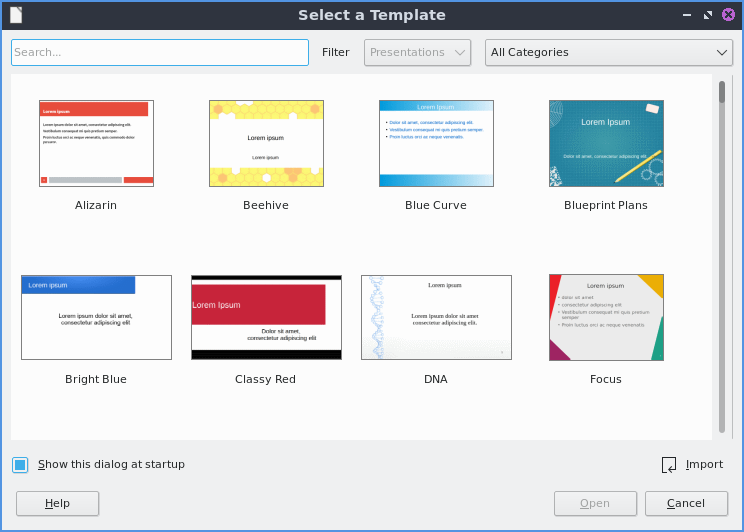
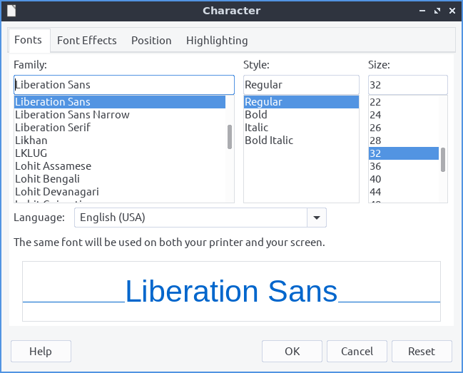
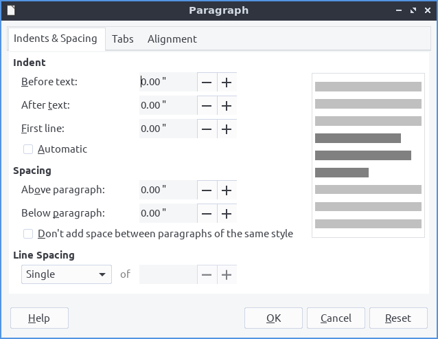
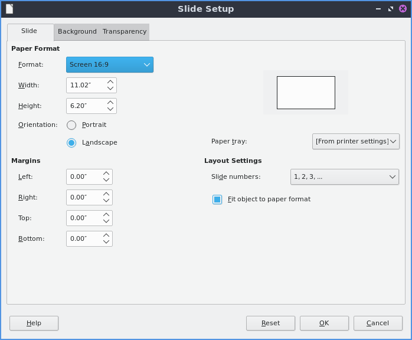
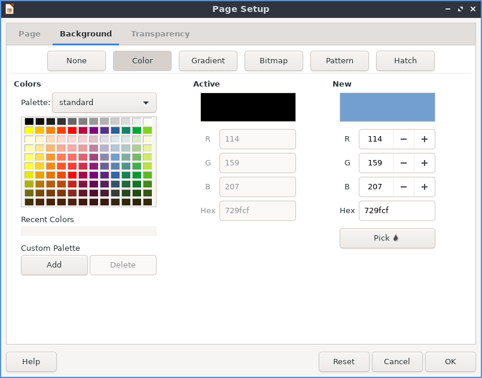
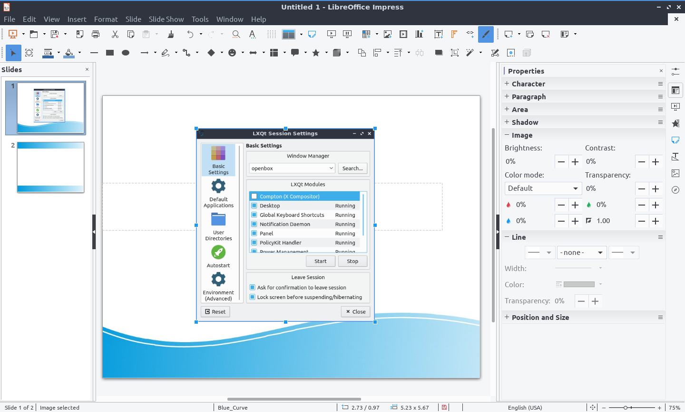
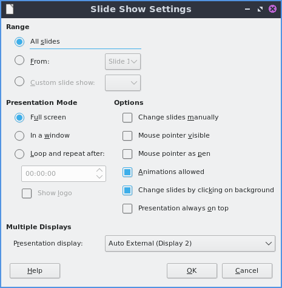

Chapter 2.2.3 Libreoffice Impress
=================================

Libreoffice Impress is a program to present presentations. 

Features include:
 - in built themes
 - spell check
 - pdf export
 - images

Usage
------
When you open libreoffice impress you will get a dialog to select a template with a preview select which one you want to use by left clicking and then click :guilabel:`Open`. If you want to search for a theme type into the :guilabel:`Search` towards the upper left. To not show this window at the start uncheck the :guilabel:`Show this dialog at startup` checkbox. To add a title to a slide click where it says click to add title. 

To open a previous presentation you have been working on press the button that looks like a folder with a piece of paper in it and navigate to the file you want and open it or :menuselection:`File --> Open`. To view your recently opened files press :menuselection:`File --> Recent Documents`. To save your presentation press the button that looks like a floppy disk or :menuselection:`File --> Save`. To save a new copy under a custom file name :menuselection:`File --> Save As`. To save a file as a pdf :menuselection:`File --> Export as PDF`.  

To type text into a presentation click in one of the boxes for your theme and type in the text with controls for the text on the right hand side. To insert a picture press the button with what looks like a photograph of a tree and select the file you want to insert or :menuselection:`Insert --> Image...`. To insert audio or video to your presentation :menuselection:`Insert --> Audio or video`.

To change the layout of your slide :menuselection:`Slide --> Layout --> Your prefred layout`. To set an image as the background of your slide :menuselection:`Slide --> Set Background Image`.

To apply a bold effects on your fonts select the text with the mouse and then press :kbd:`Control+ B` or :menuselection:`Format --> Text --> Bold`. To make text italic with first select it and then press :kbd:`Control + I` or :menuselection:`Format --> Text --> Italic`. To underline your text select it and then press :kbd:`Control+U` or :menuselection:`Format --> Text --> Underline`. 

To increase your font size press :kbd:`Control + ]` or :menuselection:`Format --> Text --> Increase Size`. To decrease your font size press :kbd:`Control + [` or :menuselection:`Format --> Text --> Decrease Size`. To make text superscript select it and press :kbd:`Shift + Control +P` or :menuselection:`Format --> Text --> Superscript`. To make text subscript select it and press :kbd:`Shift + Control + B` or :menuselection:`Format --> Text --> Subscript`.

To spell check your presentation press :kbd:`F7` or :menuselection:`Tools --> Spellcheck`. If you want to print your slides you can press :kbd:`Control + p` or :menuselection:`File --> Print`. To open up your printer settings :menuselection:`File --> Printer Settings`. 

If you want to paste text into a slideshow press :kbd:`Control + V` or :menuselection:`Edit --> Paste`. To copy text select it first and then press :kbd:`Control + C` or :menuselection:`Edit --> Copy`. To cut text select it first and the press :kbd:`Control +X` or :menuselection:`Edit --> Cut`. To paste text without formatting pres :kbd:`Control +Shift + Alt +V` or :menuselection:`Edit --> Paste Unformatted Text`. 

To insert a special character :menuselection:`Insert --> Special Character`. To center your text press :kbd:`Control + E` or :menuselection:`Format --> Align --> Center`. To have your text aligned to the right press :kbd:`Control +R` or :menuselection:`Format --> Align --> Right`. To align text to the left press :kbd:`Control + L` or :menuselection:`Format -->Align --> Left`.

To bring up a dialog to customize the character or your text :menuselection:`Format --> Character` or right click on a textbox and select :menuselection:`Character` from the context menu. The :guilabel:`Family` lets you choose the font family for your text. The :guilabel:`Style` is where you can select the of your font. The :guilabel:`Size` Lets you change the font size. The :guilabel:`Font effects` tab has even more effects for fonts. The drop down :guilabel:`Font Label` changes your font color. The :guilabel:`Overlining` menu lets you make a style for how to draw lines over the text. The :guilabel:`Overline Color` brings up a drop down menu to choose what color to draw a line over something. The :guilabel:`Effects` has effects for your text. To have many different strikethrough effects to your text select the one you want from the dropdown :guilabel:`Strikethrough` menu. To change whether the font appears to be sunken or raised from the presentation use the menu for :guilabel:`Relief`. To choose how you want your text underlined choose an option from the :guilabel:`Underlining` menu. To change the color of your underline use the :guilabel:`Underline color` menu. To have effects with how your is vertically with the rest of the line select the :guilabel:`Position` tab. To make your text superscript press the  :guilabel:`Superscript` button. To make your text subscript press the :guilabel:`Subscript` button. The menu for :guilabel:`Scale width` changes how much to scale the width of the font. 

To format the paragraphs and spacing of text :menuselection:`Format --> Paragraph`. The :guilabel:`Indents & Spacing` Tab has settings for indenting your text and the space between lines. To increase the indent right before the text starts increase the :guilabel:`Before text` field. To change the indentation after your text change the :guilabel:`After text` field. To have a different indent for your first line change the :guilabel:`First Line` filed. To change the amount of space above a paragraph change the :guilabel:`Above paragraph` field. To change the space below a paragraph change the :guilabel:`Below paragraph` field. To change the line spacing from this dialog window select the drop down menu :guilabel:`Line Spacing`. To reset your changes in this window press the :guilabel:`Reset` button. To not apply your changes press the :guilabel:`Cancel` button. To apply your changes and exit the window press the :guilabel:`Ok` button. To change settings on the alignment of text is on the :guilabel:`Alignment` tab. To choose which way you want your text aligned choose the :guilabel:`Left`, :guilabel:`Right`, :guilabel:`Center`, or :guilabel:`Justified`. To switch between left to right or right to left text switch the :guilabel:`Text direction` menu.   

To toggle bulleted lists on your points :menuselection:`Format --> Lists --> Bulleted List`. To toggle a numbered list for your points :menuselection:`Format --> Lists --> Numbered Lists`.

To change your line spacing on your presentation :menuselection:`Format --> Spacing --> Line spacing` and select the spacing you want. To increase your spacing between paragraphs :menuselection:`Format --> Spacing --> Increase Paragraph Spacing`. To decrease your spacing between paragraphs :menuselection:`Format --> Spacing --> Decrease Paragraph Spacing`. 

To move settings with a box of text left click on the border of the box of text. To move the text box click and drag on the border. To resize both vertical and horizontal size together left click on the corner and resize the text box. To resize how tall the text box is click the box at the top or bottom and drag to the desired size. To resize the horizontal size only select the box on a vertical size of the box.

To search for text press :kbd:`Control + F` or :menuselection:`Edit --> Find` to search for text. To find and replace text press :kbd:`Control + H` or :menuselection:`Edit --> Find and Replace`.

To move a text box around you can left click on the text box and drag it to the desired position. To resize a text box click on the corner and drag to resize to the desired size.

To insert the number of your slide :menuselection:`Insert --> Slide Number`.

To change the zoom of you presentation :menuselection:`View --> Zoom --> Zoom` to bring up a window to manage your zoom. If you just want to zoom to fit the page width :menuselection:`View --> Zoom --> Page Width`. To change your zoom to 100 percent :menuselection:`View --> Zoom --> 100%`. 

To bring up a dialog for the properties of your slides controlling background and shape with :menuselection:`Slide --> Properites`. To change the format for a different aspect ratio of projector or print format change the :guilabel:`Format` drop down menu. To select a custom width and height change the :guilabel:`Width` or :guilabel:`Height`. To switch to a portrait orientation press the :guilabel:`Portrait` button to the right of :guilabel:`Orientation`. To add margins to slides enter a margin in the :guilabel:`Left`, :guilabel:`Right`, :guilabel:`Top`, and :guilabel:`Bottom`. 

To change and choose a custom background use the :guilabel:`Background` tab. To choose a solid color background for your slide press the :guilabel:`Color` button. To choose a different backgound color choose a color below the :guilabel:`Color` heading. To change to a different color pallet change the :guilabel:`Pallete` drop down menu. To see what your current background color of the slide is shown under the :guilabel:`Active` label. To see what color you want to change is under :guilabel:`New` as a preview of the new background color. To the individual red, green, and blue of your colors change the :guilabel:`R`. :guilabel:`G`, and :guilabel:`B` fields respectively. To change the hexadecimal code for the color change the :guilabel:`Hex` field.  To actually change the color press the :guilabel:`OK` button. To cancel your change of background use the :guilabel:`Cancel` button. 

To choose a smooth transition use the :guilabel:`Gradient` button. To choose a preset gradient left click on the gradient on :guilabel:`Gradient` menu. To change the type of gradient use the :guilabel:`Type` and select it from the drop down menu. To see a picture of your background it is under the :guilabel:`Preview` text. To switch to manuully changing the number of steps in the gradient uncheck :guilabel:`Automatic` checkbox and then change the :guilabel:`Increment` field. To change the center of the graident change the two fields for :guilabel:`Center(X/Y)` to change the X and Y coordinates of the center. To rotate the  gradient use the :guilabel:`Angle` field. To change your first color of your gradient change the :guilabel:`From Color` drop down menu. To change the second color of the gradient change the :guilabel:`To Color` drop down menu. To change the opacity of either color change the field that is a :guilabel:`Percent` for changing opacity. To change where the color starts change the :guilabel:`Border` field. To choose a bitmap image as your background use the :guilabel:`Bitmap` tab. The :guilabel:`Bitmap` to the left shows you the bitmap pictures you can choose. The :guilabel:`Preview` shows you what your background will look like. To change what the bitmap does if it does not fit perfectly use :guilabel:`Style` drop menu. To scale as a percent of the image press the :guilabel:`Scale` checkbox. To change the where to start the bitmap change the :guilabel:`Position` drop down menu.

To change to a geometric pattern for the background of your slide press the :guilabel:`Pattern` button. To select a preset pattern left click on a pattern under the :guilabel:`Pattern` heading. To preview your pattern view in under the text :guilabel:`Preview`. To change the foreground color of your pattern change the :guilabel:`Foreground Color` drop down menu. To change the background color of your pattern change the :guilabel:`Background Color` drop down menu. To customize your pattern by a grid  left click on the grid under :guilabel:`Pattern Editor`. 

To choose a series of lines as your background press the :guilabel:`Hatch` button. To change how far between each line change the :guilabel:`Spacing` field. To view what your background will look like it is under the :guilabel:`Preview` window. To rotate the lines change the :guilabel:`Angle` field or move the slider. To change the type of lines use the :guilabel:`Line type` drop down menu. To change the color of lines use the :guilabel:`Line Color` drop down menu. To choose a particular background color of your background check the :guilabel:`Background Color` checkbox. Then use the :guilabel:`Background Color` drop down menu to choose your background color.

To have your slides be transparent use the :guilabel:`Transparency` tab. To change your slides to be transparent click the :guilabel:`Transparency` button and to the right to change how transparent to make it.

To move a slide down :menuselection:`Slide --> Move --> Slide Down`. To move a slide up :menuselection:`Slide --> Move --> Slide Up`. To move a slide to the start :menuselection:`Slide --> Move --> Slide to start`. To move a slide to the end :menuselection:`Slide --> Move --> Slide to end`.

To view your slides right next to each other :menuselection:`View --> Slide Sorter`. To rearrange your slides click and hold a slide and drag the slide between the slides you want to move to. To switch to an outline view of just text :menuselection:`View --> Outline`. To switch to an outline :menuselection:`View --> Outline`. To switch back to your normal view :menuselection:`View --> Normal`. 

Screenshot
----------
.. image:: libreoffice_impress.png

Images
------
To insert an image click :menuselection:`Insert --> Image`. To drag your image to where you want it left click and drag the mouse to where you want the image. To resize the image without distorting it click one of the boxes on the corner and resize to the size you wish. If you want to delete an image press :kbd:`Delete`. To replace an image right click the image and :menuselection:`Replace` will bring a file picker up to pick a new image. To crop an image right click on the image and select :menuselection:`Crop`. To save an image out of a presentation right click on the image and select :menuselection:`Save ...`.  

Slideshows/Presentations
------------------------
To start a slideshow press :kbd:`f5` or the button the looks like a tv with a triangle on it or :menuselection:`Slide Show --> Start from First Slide.` To start a slideshow from the current slide press :kbd:`Shift + f5` or :menuselection:`Slide Show --> Start from current slide`. To exit the slideshow press :kbd:`escape`. To get to the next slide of the slideshow  left click or press the :kbd:`right arrow key`. to get to a previous slide in presentation mode press the :kbd:`left arrow key` or right click previous. To move back to your first slide press the :kbd:`Home` key. To move to your last slide press the :kbd:`End` key. 

To bring up custom settings for your settings :menuselection:`Slide Show --> Slide Show Settings`. To change the presentation to in a window press the :guilabel:`In a window` button. To have the slideshow or presentation repeat afterwards press the :guilabel:`Loop and repeat after:`. To change options on your presentation are under the :guilabel:`Options` heading. To toggle showing the mouse pointer check/uncheck the :guilabel:`Mouse pointer visible` checkbox. To toggle allowing animations check/uncheck the :guilabel:`Animations allowed` checkbox. To toggle chaning slides by clicking with the mouse check/uncheck the :guilabel:`Change slides by clicking on background` checkbox. To toggle the presentation always on top check/uncheck the :guilabel:`Presentation always on top` checkbox. 
  

Version
-------
 Lubuntu ships with version 6.2.2.2 of libreoffice impress.

How To launch
-------------
To launch go to the menu :menuselection:`Office --> Libreoffice Impress` or run  

.. code:: 

   loimpress 

from the command line. 
