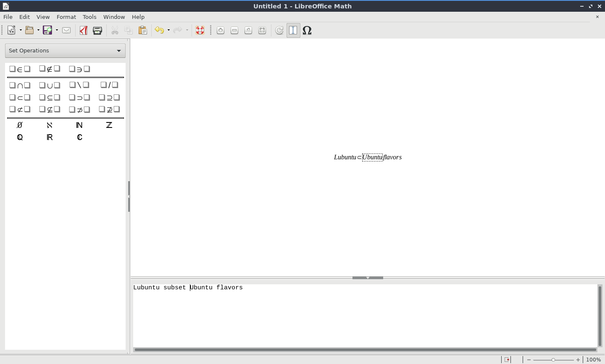

Chapter 2.2.4 Libreoffice Math
==============================

Version
-------
Lubuntu ships with Version 6.2.2.2 of libreoffice math. 

Screenshot
----------

Usage
------
To save your formula you have written in libreoffice math press :kbd:`Control +S` or :menuselection:`File --> Save`. To open a file press :kbd:`Control +O` or :menuselection:`File --> Open`.  To print your formula press :kbd:`Control +P` or :menuselection:`File --> Print`. To view your printer settings :menuselection:`File --> Printer settings`. To save a file as a different name press :kbd:`Control+Shift+S` or :menuselection:`File --> Save As`. To view your recent files :menuselection:`File --> Recent Documents`. 

To paste text into libreoffice math press :kbd:`Control +V` or :menuselection:`Edit --> Paste`. To copy text from libreoffice math press :kbd:`Control+C` or :menuselection:`Edit --> Copy`. To cut text from libreoffice math press :kbd:`Control +X` or :menuselection:`Edit --> Cut`.

To undo changes in libreoffice math press :kbd:`Control +Z` or :menuselection:`Edit --> Undo`. To redo a change you have undone press :kbd:`Control +Y` or :menuselection:`Edit --> Redo`.

The left hand side has many symbols you can use for say set relations and other operators. To insert even more symbols :menuselection:`Tools --> Symbols`.

To change the fonts of your formulas :menuselection:`Format --> Fonts` which brings up a window for fonts for different contexts. To change your font size :menuselection:`Format --> Font sizes`. To bring up a menu to change your alignment :menuselection:`Format --> Alignment`.

How to launch
-------------
To launch libreoffice math in the menu :menuselection:`office --> libreoffice math` or run 

.. code:: 

   lomath 
   
from the command line. 
