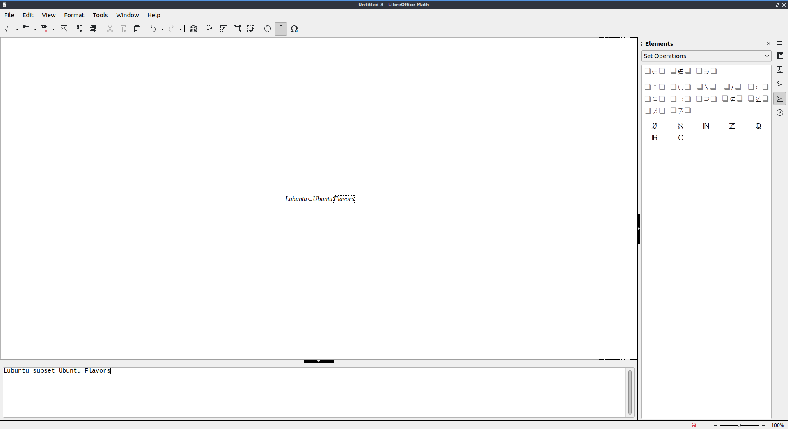
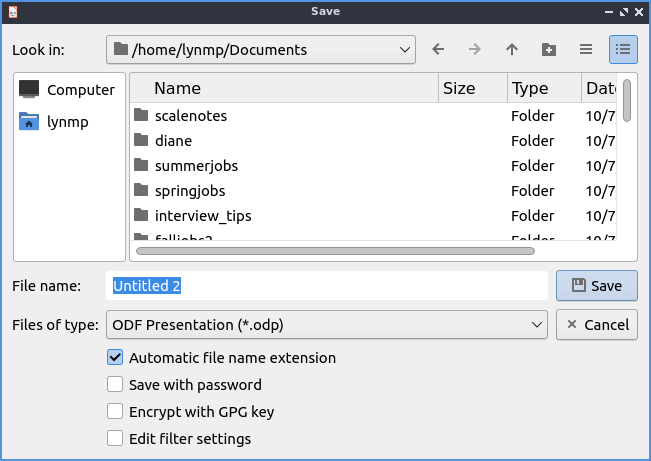

Chapter 2.2.4 LibreOffice Math
==============================

LibreOffice Math is the default application for typesetting equations on Lubuntu.

Screenshot
----------

Usage
------
To save your formula you have written in LibreOffice math press :kbd:`Control +S` or :menuselection:`File --> Save`. To open a file press :kbd:`Control +O` or :menuselection:`File --> Open`.  To print your formula press :kbd:`Control +P` or :menuselection:`File --> Print`. To view your printer settings :menuselection:`File --> Printer settings`. To save a file as a different name press :kbd:`Control+Shift+S` or :menuselection:`File --> Save As`. To export your formula as a PDF file :menuselection:`File --> Export as PDF`. To view your recent files :menuselection:`File --> Recent Documents`. 

To paste text into LibreOffice math press :kbd:`Control +V`, right click :menuselection:`Paste`, or :menuselection:`Edit --> Paste`. To copy text from LibreOffice math press :kbd:`Control+C`, select text right click and select :menuselection:`Copy`, or :menuselection:`Edit --> Copy`. To cut text from LibreOffice math press :kbd:`Control +X` or :menuselection:`Edit --> Cut`. To select all text press :kbd:`Control+A` or :menuselection:`Edit --> Select All`.

To undo changes in LibreOffice math press :kbd:`Control +Z` or :menuselection:`Edit --> Undo`. To redo a change you have undone press :kbd:`Control +Y` or :menuselection:`Edit --> Redo`.

The right hand side has many symbols you can use for say set relations and other operators. To change which groups of symbols you are currently using change the menu to the top of the sidebar with symbols on the right. If the symbol usually has a variable or operand on on a side or something it will have a box to that side. To view a description of the symbol simply mouseover the symbol. To toggle hiding this sidebar check/uncheck :menuselection:`View --> Elements`. To temporarily collapse a sidebar click the arrows pointing towards the edge of the window. To expand the windows again press the arrow to go back towards the outside. To insert even more symbols :menuselection:`Tools --> Symbols`.

To type into a formula the bottom part of the window has what is inserted into the formula. You can also insert many operators or brackets by right clicking and then selecting the symbol.

To refresh the display afterwards press :kbd:`F9` or :menuselection:`View --> Update`.

To change the fonts of your formulas :menuselection:`Format --> Fonts` which brings up a window for fonts for different contexts. To change your font size :menuselection:`Format --> Font sizes`. To bring up a menu to change your alignment :menuselection:`Format --> Alignment`. To change the spacing between lines and characters :menuselection:`Format --> Spacing`. To align text to the left press the :guilabel:`Left` button. To center text press the :guilabel:`Centered` button. To change alignment to the right press the :guilabel:`Right` button.

To change zoom :menuselection:`View --> Zoom` and select the zoom you want. In the bottom right hand corner there is a zoom slider. To zoom in move the slider to the right and to zoom out move the slider to the left. To see your current zoom is on the bottom right hand corner.

To quit LibreOffice Math press :kbd:`Control+Q`.

Version
-------
Lubuntu ships with Version 7.5.6 of LibreOffice Math.

How to Launch
-------------
To launch LibreOffice Math in the menu :menuselection:`Office --> LibreOffice Math` or run 

.. code:: 

   lomath 
   
from the command line. The  icon for LibreOffice Math looks like a piece of paper with the math symbol for square root of x.
