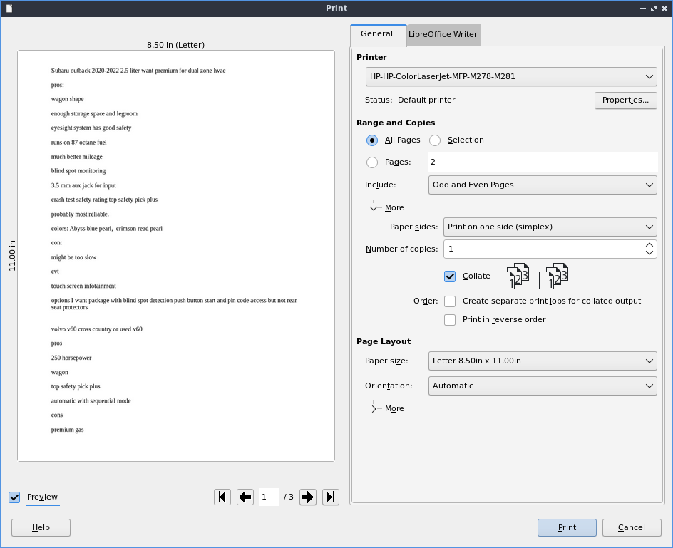
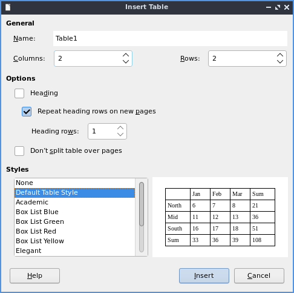

Chapter 2.2.5 Libreoffice Writer
================================

Libreoffice Writer is a word processing application that is the default on Lubuntu.

Features:
 - no ribbon
 - one button pdf export
 - many file formats to output
 - spellcheck
 - wordcount
 
Version
-------
Lubuntu ships with libreoffice writer 6.2.2.2

Usage
------
To use libreoffice writer type what you wish to type into the main part of the window. If you wish to save your data press the icon that looks like a floppy disk or press :kbd:`control + s`. To open a previously saved document press the button that looks like a folder or press :kbd:`control + o`. To load or save a file from the menu :menuselection:`File --> Open` to open a file or :menuselection:`File --> Save`. To save your file as a new file name :menuselection:`File --> Save As`. To view your recent documents :menuselection:`File --> Recent Documents`. To have save your file as a pdf press the button that is a sheet of paper with curved red lines on it or go :menuselection:`File --> Export` and select the file type as pdf. To export as a PDF file :menuselection:`File --> Export AS --> Export as PDF`. This same export menu will let you save in formats for other programs for compatibility with microsoft word.

.. image::     writer-save.png

To change the font size there is a drop down box with a number in it you can type the font size you want in this box or select from the dropdown menu. You can change the font with the drop down box to the left of the font size which you can type and it autocompletes the fonts or select from the drop down menu. To make your text bold you can select the text with the mouse and press the button that looks like **B** or press :kbd:`control + B`. To make the font italic press the button that looks like  *I* or press :kbd:`control + I` after selecting the text or keep typing with it to be italic. To have an underlined text select the text and press :kbd:`Control +U`. To make strikethrough press the button that is a s with a line through it. If you want a floating window on how to style your text :menuselection:`Format --> Character`.

To copy text select it with the mouse or :kbd:`Shift + arrow key` then press :kbd:`Control +C` or :menuselection:`Edit --> Copy`. To cut text select it first and then press :kbd:`Control +X` or :menuselection:`Edit --> Cut`. To paste text press :kbd:`Control +V` or :menuselection:`Edit --> Paste`. To paste with no formatting press :kbd:`Control + Alt + Shift+ V` or :menuselection:`Edit --> Paste Unformatted Text`.

To change your spacing around your character :menuselection:`Format --> Paragraph`. To manage your indentation and spacing between paragraphs and lines use the :guilabel:`Indents & Spacing` tab. The :guilabel:`Before text` field is how much indentation before each line of text. The :guilabel:`After text` is how much of an indent to put after the text. The :guilabel:`First line` field shows how you want the first line indented. To add a space above each paragraph increase the :guilabel:`Above paragraph` field. To add a space below a paragraph change the :guilabel:`Below paragraph` field. To change line spacing in this window change the :guilabel:`Line Spacing` field. 

.. image::   indents-spacing.png

To change alignment from this window use the :guilabel:`Alignment` tab. To change the alignment choose the :guilabel:`Left`, :guilabel:`Right`, :guilabel:`Center`,  or :guilabel:`Justified` radio button to align text that way. The :guilabel:`Borders` tab has settings for your border. The :guilabel:`Style` menu lets you change what kind of line is used for the border. To change the width of your border change the :guilabel:`Width` field. To choose a different presets of border type press the buttons under :guilabel:`Presets` and will be previewed in the box below. The buttons under :guilabel:`Position` change where the shadow is relative to the text. The field :guilabel:`Distance` is how far the shadow is offset from the border. To change the color of your shadow change the :guilabel:`Color` menu. 

.. image:: lowriter_paragraph.png

To change what how the text deals with page breaks and paragraphs use the :guilabel:`Text Flow` tab. To automatically use hyphens check the :guilabel:`Automatically` checkbox. To change how many characters to leave before the hyphen change the :guilabel:`Characters at line end` field. To change how many character after the hyphen on the next line change the :guilabel:`Characters at line begin`. To set a maximum number or hyphens change the :guilabel:`Maximum number of consecutive hyphens` field. To toggle not putting a short bit of text at the bottom of a page or column check the :guilabel:`Orphan control` checkbox. To stop a few lines of text alone at the top check the :guilabel:`Widow control` checkbox.

To change font color press the button that has a T with a drop on it and a red underline this will bring down several different colors you can change your text to a color you want. You can also change your font color through the :menuselection:`Format --> Character` window.

To make text superscript press the button with A and a smaller B located above it as if it in superscript. To make text subscript press the button that is an A with a smaller B located slightly below it. 

If you want text in a text box that can be moved with the mouse press the button that looks like a T with a box around it or :menuselection:`Insert --> Text box`. To insert a hyperlink press :kbd:`Control + K` or :menuselection:`Insert --> Hyperlink`. 

.. image:: libreoffice_writer.png

To check the spelling of your document press the ABC button with a checkmark, from the :menuselection:`Tools --> Spelling` or press :kbd:`f7`. When you have the spellcheck window open to change what language you are checking the spelling for change the :guilabel:`Text language` field. When you have what spell check thing is a typo it will be highlighted in red with context of where that appears in your document. If you think this is not an error just for this time press the :guilabel:`Ignore Once` button. To not change this at every time this occurs in the document press the :guilabel:`Ignore All` button. If what you wrote is correct and never want it marked wrong again press the :guilabel:`Add to Dictionary` button. Below what spellcheck thinks is an error will show :guilabel:`Suggestions` on what you it thinks it should correct. To select a different suggestions left click on it to select that suggestion. To replace what spellcheck thinks is an error with the suggestion press the :guilabel:`Correct` button. To replace the supposed error with the suggestion in the entire document press the :guilabel:`Correct All` button. To have this error be autocorrected press the :guilabel:`Always Correct` button. 

To view how your document looks before printing it :menuselection:`File --> Print preview` or :kbd:`Control +Shift +O`. To get back to editing your document press the same thing again or click the close preview button. After you are done writing your document you can press the button that looks like a printer to print, press :kbd:`control+ p` or :menuselection:`File --> Print`. To change view or change your printer settings :menuselection:`File --> Printer settings`. To view your word count of how many words are currently in the document is with nothing selected at the bottom of the libreoffice writer window. If you select text with the mouse you can also see the word count of selection from the same spot.  

To insert special symbols or characters press the button with the Ω symbol or from the menu :menuselection:`Insert --> Special character`. To insert a page break press :kbd:`control + enter` or from the menu :menuselection:`Insert --> Page Break`.  

.. image:: specialcharacters.png

To undo a mistake you make press :kbd:`control + z` or press the yellow arrow pointing to the left. If you accidentally undid code redo or press the green arrow pointing to the right or press :kbd:`control + y`. Under the arrow buttons there is a drop down button that brings up a menu for which steps to undo and redo.     

To center your text is press the button with the horizontal lines centered or :menuselection:`Format --> Align --> Centered`. To have your text justified to the right press the button with the lines on the right or :menuselection:`Format --> Align --> Right`. To have your text aligned to left press the lines on the left with or :menuselection:`Format --> Align --> Left`. To center justify your text which will add spaces in between words to make it appears at both orders press the button that has solid horizontal lines all of equal length to center justify the text or :menuselection:`Format --> Align --> Justified`. 

If you want to change your line spacing of your document :menuselection:`Format --> Spacing --> Line spacing: 2` for double spacing or :menuselection:`Format --> Spacing --> Line spacing: 1.5` for one and a half line spacing. To change back to single line spacing of your document :menuselection:`Format --> Spacing --> Line Spacing: 1`. 

To add a list of bullet points press :kbd:`Shift +F12` or :menuselection:`Format --> Lists --> Bulleted Lists`. To start a numbered lists press :kbd:`F12` or :menuselection:`Format --> Lists --> Numbered List`. To move an item up in your list :menuselection:`Format --> Lists --> Move Up`. To move an item down in your list :menuselection:`Format --> Lists --> Move Down`. To demote a point to a subpoint :menuselection:`Format --> Lists --> Demote One Level`. To promote this point back up to its previous level :menuselection:`Format --> Lists --> Promote One Level`.

To Insert a page number :menuselection:`Insert --> Field --> Page number`. To insert the current time into the document :menuselection:`Insert --> Field --> Time`. To insert the current date into the document :menuselection:`Insert --> Field --> Date`.  To insert the number of pages in the document :menuselection:`Insert --> Field --> Page count`.

To have a header shown at the top of each page :menuselection:`Insert --> Header and footer --> Header --> Default style`. To have a footer at the bottom of each page :menuselection:`Insert--> Header and footer --> Footer --> Deafault style`. To get back to writing the main part of the document left click on the body of the document.  

To add a comment inline into the document press :kbd:`Control+Alt+C` or right click and select :menuselection:`Comment`. Type your comment in the yellow box to the right to leave a note on that comment. To leave a reply to this comment press the downward pointing arrow :menuselection:`Reply`.

To insert a mathematical formula into your document you are process :menuselection:`Insert --> Object --> Formula` and a user interface similar to libreoffice math will appear allowing you to insert the formula.

To select all text in the document press :kbd:`control + A` or :menuselection:`Edit --> Select All`. To jump to a specific page press :kbd:`Control + G` or :menuselection:`Edit --> Go to Page` and a dialog will pop up. To enter a page number in the :guilabel:`Page` field and click :guilabel:`OK` to go to that page.

To zoom for the entire page to be visible :menuselection:`View --> Zoom --> Entire Page`. To zoom so you can see the width of the page and everything is bigger :menuselection:`View --> Zoom --> Page width`. To zoom to 100 percent zoom :menuselection:`View --> Zoom --> 100%`.

To have a view of the document with no margins shown like on a webpage :menuselection:`View --> Web` or To get back to the original view :menuselection:`View --> Menu`. To toggle a vertical scrollbar :menuselection:`View --> Scrollbars --> Vertical Scroll bar`. To have a horizontal scrollbar :menuselection:`View --> Scrollbars --> Horizontal Scroll bar`. 

To toggle your view of rulers press :kbd:`Control + Shift +R` or :menuselection:`View --> Rulers --> Rulers`.  

To bring up a window with properties of your document :menuselection:`File --> Properties`. The :guilabel:`General` tab shows metadata about the file including creation or modification time. The :guilabel:`Descrption` tab has fields to input title subject and keywords and lets you also put in comments. The :guilabel:`Title` is where you can optionally put the title on. The :guilabel:`Subject` is a field to input the subject of the document. The :guilabel:`Keywords` is to input keywords on the document. The :guilabel:`Comments` is where you can have comments about the document. To embed any fonts you have in the document click the :guilabel:`Font` tab and check the :guilabel:`Embed fonts in the document` checkbox. 

.. image:: lowriter-doc-properties.png 

To insert a watermark on the background of the page :menuselection:`Format --> Watermark`. To change what the watermark says input that into the :guilabel:`Text` field. To change the font of the watermark change the :guilabel:`Font` field. To change the angle from horizontal text use the :guilabel:`Angle` field in degrees. To change your how transparent the water mark is change the :guilabel:`Transparency` has 100 as entirely clear and 0 as entirely opaque. To change the color of the watermark use the :guilabel:`Color` drop down pop up menu.

.. image:: lowriter_watermark.png

To leave libreoffice writer press :kbd:`Control+Q`.

Columns
-------
To add multiple columns to your document :menuselection:`Format --> Columns`. To have multiple columns in the field that says :guilabel:`Columns` and set to the number of columns you want. To change the spacing between the two columns change the :guilabel:`Spacing` field. To have a line to seperate your columns use the :guilabel:`Style` drop down menu to select the lines. To change the color of your lines change the :guilabel:`Color` drop down menu. When you are done with your settings press the :guilabel:`OK` button or if you decide you do not want to make changes to columns press the :guilabel:`Cancel` button.

.. image:: columns.png

To add a column break to the next column press :kbd:`Control+Shift+Enter` or :menuselection:`Insert --> More Breaks --> More Column Breaks`.

Find And Replace
----------------
To search for text in your document press :kbd:`Control +F` or :menuselection:`Edit --> Find` which pops up a toolbar on the bottom. To enter the text to search enter into the searchbar on the bottom. To go to the next result press the downward pointed arrow button. To go to the previous result press the upward pointing arrow button. To close out of finding text press red circle with the white x inside it. To not match case uncheck the :guilabel:`Match Case` checkbox. 

.. image:: lowriter_findbar.png 

To find and replace text press :kbd:`Control+ H` or :menuselection:`Edit --> Find & Replace`. To have what text you want to be find in the document to be replaced in the :guilabel:`Find` field. To have the end result of what you after replacing in the :guilabel:`Replace` field. To find and select all occurrences of the string in the :guilabel:`Find` field click the :guilabel:`Find All` button. To replace every occurrence of the word of find press the :guilabel:`Replace All` button to change everything.

Images
------
To insert an image into your go to :menuselection:`Insert --> Image` to insert an image directly to your word processing document. To move your image around left click on it and drag the image around. To resize the image while keeping the same aspect ratio click on one of the blue boxes around the corner to resize the image.  To remove an image you decide you do not want in your document press the :kbd:`Delete` key. To rotate an image to the right left click on it to select it and right click on the image :menuselection:`Rotate or Flip --> Rotate 90° Right`. To rotate an image to the left right click on the image :menuselection:`Rotate or Flip --> Rotate 90° Left`. To rotate an image to fix it appearing upside-down left click the image and right click :menuselection:`Rotate or Flip --> Rotate 180°`. To get an image back to its original position :menuselection:`Rotate or Flip --> Reset Rotation`.

.. image::  lowriterimageexample.png

Tables
------
To insert a table :menuselection:`Table --> Insert Table` and a table dialog window will popup. To change the number of columns change the :guilabel:`Columns` field. To change the number of rows change the :guilabel:`Rows` field. To view a different styles for your table are under the :guilabel:`Style` menu and you can see a preview to the right of the menu. To input text into a part of the table simply left click over that part of the table. To move to another part of the table with the arrow key with the direction you want to go. 

To add a row above your current row :menuselection:`Table --> Insert --> Rows Above`. To add a row below the current row :menuselection:`Table --> Insert --> Rows Below`. To add a column before the current one :menuselection:`Table --> Insert --> Columns Before`. To add a column after the current one :menuselection:`Table --> Insert --> Columns After`. To add multiple rows or columns :menuselection:`Table --> Insert --> Rows` or :menuselection:`Table --> Insert --> Column`. To switch how many of multiple rows or columns change the :guilabel:`Number` field. To switch to adding rows or columns above or below press the :guilabel:`Below Selection` button. To actually add the rows or columns press the :guilabel:`OK` button. To delete a row :menuselection:`Table --> Delete --> Rows`. To delete a column :menuselection:`Table --> Delete --> Columns`. To delete the whole table :menuselection:`Table --> Delete --> Table`.

How to Launch
-------------
To launch go to menu :menuselection:`Office --> Libreoffice Writer` or run 

.. code:: 

   lowriter 
   
from the command line.
