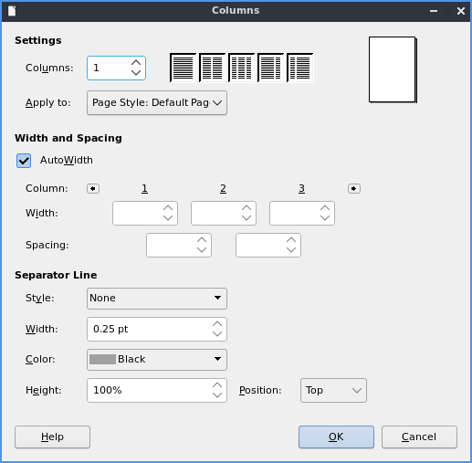

Chapter 2.2.5 Libreoffice Writer
================================

Libreoffice Writer is a word processing application that is the default on Lubuntu.

Features:
 - no ribbon
 - one button pdf export
 - many file formats to output
 - spellcheck
 - wordcount
 
Version
-------
Lubuntu ships with libreoffice writer 6.1.1.2

Useage
------
To use libreoffice writer type what you wish to type into the main part of the window. If you wish to save your data press the icon that looks like a floppy disk or press :kbd:`control + s`. To open a previously saved document press the button that looks like a folder or press :kbd:`control + o`. To load or save a file from the menu :menuselection:`File --> Open` to open a file or :menuselection:`File --> Save`. To save your file as a new file name :menuselection:`File --> Save As`. To view your recent documents :menuselection:`File --> Recent Documents`. To have save your file as a pdf press the button that is a sheet of paper with curved red lines on it or go :menuselection:`File --> Export` and select the file type as pdf. This same export menu will let you save in formats for other programs for compatibility with microsoft word.

.. image:: libreoffice_writer.png

To change the font size There is a drop down box with a number in it you can type the font size you want in this box or select from the dropdown menu. You can change the font with the drop down box to the left of the font size which you can type and it autocompletes the fonts or select from the drop down menu. To make your text bold you can select the text with the mouse and press the button that looks like **B** or press :kbd:`control + B`. To make the font italic press the button that looks like  *I* or press :kbd:`control + I` after selecting the text or keep typing with it to be italic. To have an underlined text select the text and press :kbd:`Control +U`. To make strikethrough press the button that is a s with a line through it. If you want a floating window on how to style your text :menuselection:`Format --> Character`.

To copy text select it with the mouse or :kbd:`Shift + arrow key` then press :kbd:`Control +C` or :menuselection:`Edit --> Copy`. To cut text select it first and then press :kbd:`Control +X` or :menuselection:`Edit --> Cut`. To paste text press :kbd:`Control +V` or :menuselection:`Edit --> Paste`. To paste with no formatting press :kbd:`Control + Alt + Shift+ V` or :menuselection:`Edit --> Paste Unformatted Text`.

To change font color press the button that has a T with a drop on it and a red underline this will bring down several differenent colors you can change your text to a color you want. 

To make text superscript press the button with A and a smaller B located above it as if it in superscript. To make text subscript press the button that is an A with a smaller B located slightly below it. 

If you want text in a text box that can be moved with the mouse press the button that looks like a T with a box around it or :menuselection:`Insert --> Text box`. To insert a hyperlink press :kbd:`Control + K` or :menuselection:`Insert --> Hyperlink`. 

To add multiple columns to your document :menuselection:`Format --> Columns`. To have multiple columns in the field that says :guilabel:`Columns` and set to the number of columns you want. When you are done with your settings press the :guilabel:`OK` button or if you decide you do not want to make changes to columns press the :guilabel:`Cancel` button.

To check the spelling of your document press the ABC button with a checkmark, from the :menuselection:`tools --> spelling` or press :kbd:`f7`. To view how your document looks before printing it :menuselection:`File --> Print preview` or :kbd:`Control +Shift +O`. To get back to editing your document press the same thing again or click the close preview button. After you are done writing your document you can press the button that looks like a printer to print, press :kbd:`control+ p` or :menuselection:`file --> print`. To view your word count of how many words are currently in the document is with nothing slected at the bottom of the libreoffice writer window. If you select text with the mouse you can also see the word count of selection from the same spot.  

To insert special symbols or characters press the button with the Ω symbol or from the menu :menuselection:`Insert --> Special character`. To insert a page break press :kbd:`control + enter` or from the menu :menuselection:`Insert --> Page Break`.  

.. image:: specialcharacters.png

To undo a mistake you make press :kbd:`control + z` or press the yellow arrow pointing to the left. If you accidently undid code redo or press the green arrow pointing to the right or press :kbd:`control + y`.     

To center your text is press the button with the horizontal lines centered or :menuselection:`format --> align --> centered`. To have your text justified to the right press the button with the lines on the right or :menuselection:`format --> align --> right`. To have your text aligned to left press the lines on the left with or :menuselection:`format --> align --> left`. To center justify your text which will add spaces in between words to make it appears at both orders press the button that has solid horizontal lines all of eqaul length to center justify the text. 

If you want to change your line spacing of your document :menuselection:`Format --> Spacing --> Line spacing: 2`.  

To insert an image into your go to :menuselection:`Insert --> Image` to insert an image directly to your word processing document. To move your image around left click on it and drag the image around. To resize the image while keeping the same aspect ratio click on one of the blue boxes around the corner to resize the image.    

To select all text in the document press :kbd:`control + A` or :menuselection:`Edit --> Select All`. 

To zoom for the entire page to be visible :menuselection:`View --> Zoom --> Entire Page`. To zoom so you can see the width of the page and everything is bigger :menuselection:`View --> Zoom ---> Page width`.  

To have a view of the document with no margins shown like on a webpage :menuselection:`View --> Web` or To get back to the original view :menuselection:`View --> Menu`. To toggle a vertical scrollbar :menuselection:`View --> Scrollbars --> Vertical Scroll bar`. To have a horizontal scrollbar :menuselection:`View --> Scrollbars --> Horizontal Scroll bar`. 

To toggle your view of rulers press :kbd:`Control + Shift +R` or :menuselection:`View --> Rulers --> Rulers`.  

How to Launch
-------------
To launch go to menu :menuselection:`office --> libreoffice writer` or run 

.. code:: 

   lowriter 
   
from the command line.
