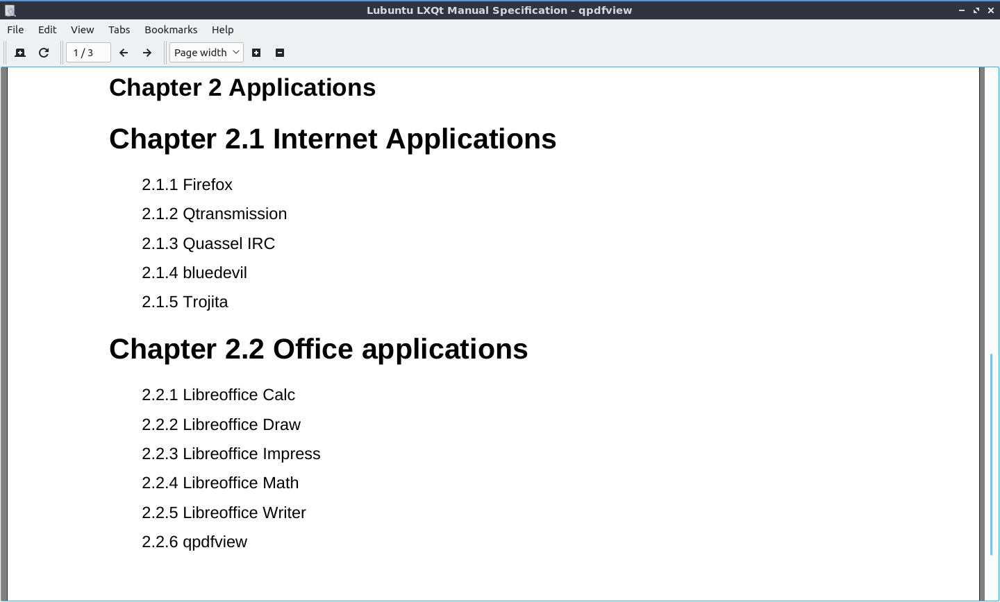
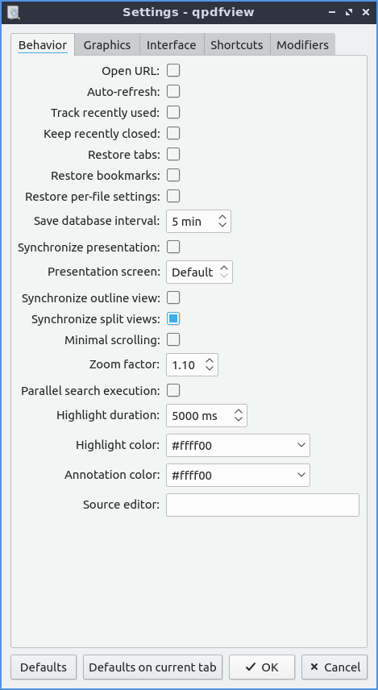
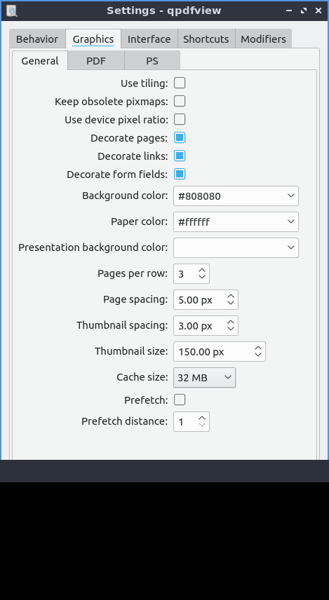

Chapter 2.2.6 qpdfview
======================

qpdfview is the default pdf viewer for Lubuntu.

Features:
 - tabs
 - presentation mode
 - zoom to entire page/ page width
 - rotating pages
 - outline, properties, thumbnail, and bookmark docks
 - printing support
 - annotation and highlighting 
 - bookmarks
 - customizable keyboard shortcuts

Usage
------
To open a pdf file use :menuselection:`File --> Open` from the menu or :kbd:`Control + O` on the keyboard. If you have a pdf open use :menuselection:`File --> Open` in new tab from the menu, click the Open in new tab button or press :kbd:`Control + T`. To refresh a pdf click the Refresh button, :menuselection:`File --> Refresh`, or press :kbd:`F5` just like most web browsers. To switch between tabs on the keyboard you can press control :kbd:`control + tab` or :menuselection:`Tabs --> Next Tab` to go the next tab or :kbd:`control + shift + tab` or :menuselection:`Tabs --> Previous Tab` to cycle through your tabs in the opposite direction. At the bottom of the tab menu will be a list of all your tabs you have open with the title of each document. To close the tab press the red X button on the tab or press :kbd:`Control +W`. To close all tabs on qpdfview press :kbd:`Control + Shift +W`. To restore the most recently closed tabs press :kbd:`Alt+Shift+W` or :menuselection:`Restore most recently closed tab`. To view a menu with your recently closed tab :menuselection:`Tabs --> Recently Closed` and select the file you want. To see a list of all your tabs in a menu they are at the bottom of the :menuselection:`Tabs` menu.

If you want a second copy of a pdf file open right click on the pdf file and :menuselection:`Open Copy in new tab`. If you want a copy of the current pdf open the pdf file and :menuselection:`Open Copy in new window`. To open your file manager in the current directory right click on the tab bar and :menuselection:`Open Containing Folder`. To close all tabs right click on the tab bar and :menuselection:`Close all tabs`. To Close all tabs but that one you right click on right click on a tab and :menuselection:`Close all tabs but this one`. To close all tabs to the right of the one you right click right click on a tab and :menuselection:`Close all tabs to right`. To close all tabs to the left right click on a tab and :menuselection:`Close all tabs to left`.  

If you want to view a particular page select the box (e.g. page 1/3) and type the page number (e.g. page 3/3). To move to the previous and next page use the left and right arrow buttons respectively. There are numerous zoom option, including percentage, page width, page size, continuous, and multiple pages. Another way to jump to a particular page is to press :kbd:`control + j` or :menuselection:`Edit --> Jump to Page`. To go back to page which you have just come from press :kbd:`control + enter` or :menuselection:`Edit --> Jump backward`. To jump forward a page press :kbd:`control + shift + enter` or :menuselection:`Edit --> Jump Forward`.  

To print your pdf press :kbd:`Control + P` or :menuselection:`File --> Print`. To change what printer you use use the :guilabel:`Name` drop down to select the name of the printer. To see more options press the :guilabel:`Options` button to see more options when you print. To select which pages to print use the :guilabel:`Pages From` button and then the fileds for the first page to print and then the last page to print. To change how many copies you print change the :guilabel:`Copies` field.

 If you are printing the pdf in black and white you can however  toggle previewing  the file in black and white by pressing :kbd:`Control + U` or :menuselection:`View --> Convert to grayscale`. To invert the colors of your pdf press :kbd:`Control +I` or :menuselection:`View --> Invert Colors`. To trim the margins off your pdf file press :kbd:`control +Shift +U` or :menuselection:`View --> Trim margins`. If you want to turn any of the alrenetes colors or trimmed margins off press or use the menu in the same thing again. 

To select text or an image from qpdfview press :kbd:`control+c` or :menuselection:`Edit --> Copy to clipboard`. Then the cursor will turn into a crosshair and you will be able to expand a box to select either text or an image and a menu to select copying the text, selecting the text, copying the image, or saving the image to file. Another way to copy text is to press :kbd:`Shift + Left Click`.  

To save your pdf file is to :menuselection:`File --> Save` or you can press :kbd:`Control + s`. You can save the file with a different name with :menuselection:`File --> Save as`. To save a copy of the document click :menuselection:`File --> Save a copy`.  

qpdfview also includes some very useful docks. To view the outline dock, in the menu select :menuselection:`View --> Docks --> Outline (make sure the button is checked)` or press :kbd:`F6` on the keyboard. It should appear on the left hand side of the pdf with collapsible sections. This is useful in navigating large pdfs. To view properties of your pdf file press :kbd:`F7` or :menuselection:`View --> Docks --> Properties`. To see a thumbnail of each page :menuselection:`View --> Dock --> Thumbnails` or press :kbd:`f8` to view a thumbnail of each page of the pdf file. If you want to close one of these docks click the X button on the dock to close it. To view the fonts embedded in the pdf :menuselection:`View --> Fonts`. 

To view two pages at once like if you want to see a two page spread of an illustration in a pdf of a book press :kbd:`Control + 6` or :menuselection:`View --> Two pages`. To get your view back to normal press :kbd:`Control +6` again or :menuselection:`View --> Two pages` again.  To toggle the view of three pages at a time press :kbd:`Control +4` or :menuselection:`View --> Multiple pages`. To view right to left languages on qpdfview press :kbd:`Control +Shift +R` or :menuselection:`View --> Right to left`. 

To search through your pdf file you can press :kbd:`control + f` or from the menu :menuselection:`Edit --> Search`. You will get taken to the results and will appear highlighted in yellow to see through the results you can press the down arrow to see results farther in the document and press the upward pointed arrow button to see results towards the start of the document. To exit the view to search dialog press :kbd:`Escape` or :menuselection:`Edit --> Cancel search`. 

To make qpdfview fullscreen you can press :kbd:`f11` or :menuselection:`View -->Fullscreen` . To enter presentation mode you can press :kbd:`f12` or :menuselection:`View --> Presentation` which makes the content of the pdf take up the fullscreen and gives you no menubars or toolbars. To exit presentation mode you can press :kbd:`f12` again. To advance to the next page in the presentation press the :kbd:`spacebar` or the :kbd:`right arrow`. To go back a page in presentation press the :kbd:`left arrow`. To exit the presentation press :kbd:`escape`.

To make an annotation press :kbd:`Control +A` or :menuselection:`Edit --> Add annotation`. To view the annotation you have made or edit it again press click on what looks like a sticky note with a pin in it. To remove your annotation right click on the annotation and click :menuselection:`Remove annotation`. If you just want to highlight something  right click on the text and select add highlight text.  

To select page width in zoom in qpdfview is a drop down menu with page width to show the width of the page on qpdfview, :menuselection:`View --> Fit to page width`, or press :kbd:`Control +9`. To view the whole page on qpdfview in this drop down menu select whole page, :menuselection:`View --> fit to page size`, or press :kbd:`Control + 8`. To return to the original zoom press :kbd:`Control + 0` or :menuselection:`View --> Original size`. To zoom in is press the magnifying glass with a + in it or press :kbd:`Control + +` or :menuselection:`View --> Zoom in`. To zoom out press the magnifying glass button with a - in it or press :kbd:`Control + -` or :menuselection:`View --> Zoom out`. To rotate the file to the left is press :kbd:`Control + Left arrow` or :menuselection:`View --> Rotate Left`. To rotate the file to the right is press :kbd:`Control + Right arrow` or :menuselection:`View --> Rotate Right`.Another way to zoom with the scrollwheel is to press :kbd:`Control` and zoom with the mousewheel.

If you want a second copy of a pdf open you can right click on the tabbar :menuselection:`Open Copy in new tab`. If you want a second copy of a pdf in a new window right click the tab bar :menuselection:`Open Copy in new window`. To open a file manager in the location of file right click on the tab bar :menuselection:`Open Containing Folder`. To only leave the tab you right click open and close all other right click the tab bar :menuselection:`Close all tabs but this one`. To close all tabs to the right of the one you click right click on the tab bar :menuselection:`Close all tabs to the right`. To close all tabs to the left of the one you click right click on the tab bar :menuselection:`Close all tabs to the left`.

If you have a particularly long pdf file you might want to make a bookmark to find a specific thing easily. To create a bookmark press :kbd:`control +b` or  :menuselection:`Bookmarks -->  Add Bookmark` and give the bookmark a memorable title and description so you can find it in this document again easily. If you later want to remove the bookmark go :menuselection:`Bookmarks --> Remove bookmark` or press :kbd:`control+ shift+ B`. 

To jump to the start of a pdf file press the :kbd:`home` key or :menuselection:`Edit --> First Page`. To jump to the last page of a pdf file press the :kbd:`end` key or :menuselection:`Edit --> Last Page`. To move to the next page with a keyboard press :kbd:`Spacebar` or press :kbd:`Backspace` to move back a page. 

Screenshot
----------

Customizing
-----------
To add your own settings to qpdfview you can get to a settings window with :menuselection:`Edit --> Settings`. The checkbox :guilabel:`Open URL` allows you to turn on or off Opening URLs or links within qpdfview. The :guilabel:`Auto-refresh` checkbox reloads the pdf whenever the file changes which is useful for authoring pdf files. To open the tabs you had open last time with qpdfview the next time you open the program check the :guilabel:`Restore tabs` checkbox. If you want to scroll once to change an entire page check the :guilabel:`Minimal scrolling` checkbox. To change the color of highlights tpye a hex number for a color or select one from the :guilabel:`Highlight Color` drop down menu. 

If you want to reset these settings to the defaults is to press the :guilabel:`Defaults` button. If you just want defaults on the current tab you can press the :guilabel:`Defaults on current tab` button. If you want to return to viewing your pdf with the same settings press the :guilabel:`OK` button. If you wish to discard your changes press the :guilabel:`Cancel` button.     

To deal with settings on graphics press press on the :guilabel:`Graphics` tab. The settings for paper color will has a drop down menu for previewing what it is like printing on colored paper. The checkbox :guilabel:`Prefetch` will preload pages not directly viewed by the pdf viewer not directly on the screen however this will use more resources. The drop down for :guilabel:`Cache size` will increase laoding speed but will use more resources. The :guilabel:`Prefetch` checkbox loads pages before you view them. The :guilabel:`Prefetch distance` tells you how many pages away from where you are to load. The field for :guilabel:`Presentation background color` sets the color of the background for presentations. The :guilabel:`Cache size` increases the size of the cache which will apply more system resorouces to run heavy pdfs like hundred of pages of full color artwork. 

 
The :guilabel:`PDF` subtab of the graphics tab has settings for font and paper color for viewing pdf files. To antialias images check the :guilabel:`Antialiasing` checkbox. To antialias text check the :guilabel:`Text antialiasing` checkbox. To use font hinting to view text easier to view change the :guilabel:`Text hinting` menu to Reduced or full.   

To change the interface settings click on the :guilabel:`Interface` tab.  If you want the tabs to be spread out press the spread tabs checkbox. The :guilabel:`Tab position` changes where the tabbar on the window. The :guilabel:`Tab visibility` menu can be set to as needed, always or never which will show or hide the tabbar. The checkbox for :guilabel:`New tab next to current tab` opens new tabs next to the current one. The field for recently used lets you set the maximum number of files to keep around in recently used. The :guilabel:`Spread tabs` checkbox spreads the tabs to take up the whole tab bar and they get smaller the more tabs you open. To have qpdfview close when the last tab in qpdfview is closed check the :guilabel:`Exit after last tab` checkbox. To change the number of recently used pdf files in the menu change the number in :guilabel:`Recently used count` field. To change how many recently closed tabs of pdfs are shown change the :guilabel:`Recently closed count` field. 

The :guilabel:`Shortcuts` tab provides the ability to customize keyboard shortcuts. The :guilabel:`Action` column is what is keyboard shortcut does. The :guilabel:`Key seqeunce` column shows the keyboard shortcut. Double click in the key sequence column and type in your desired keyboard shortcut to change the keyboard shortcut.

Version
-------
Lubuntu ships with version 0.4.17 of qpdfview.

How to launch
-------------
To launch qpdfview go to the Menu :menuselection:`Office --> qpdfview` or run  

.. code:: 

   qpdfview 

from the command line.
