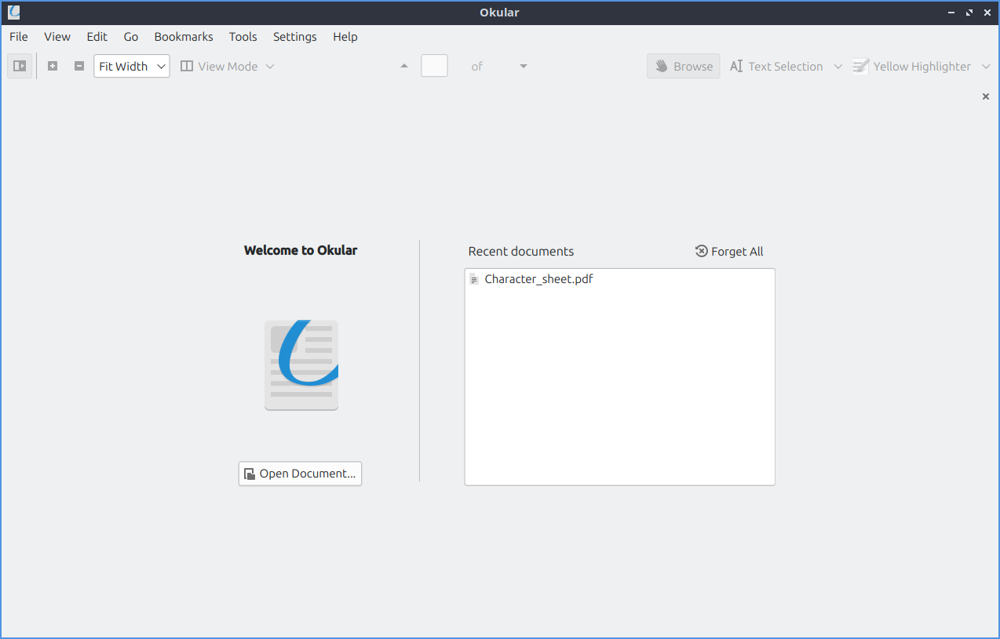
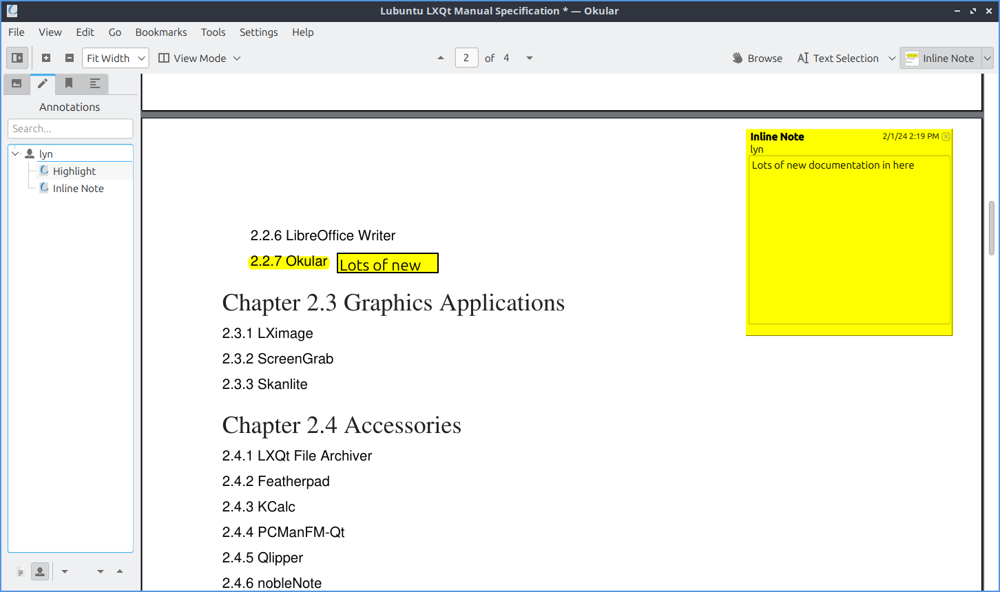
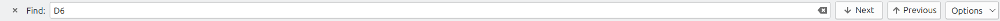
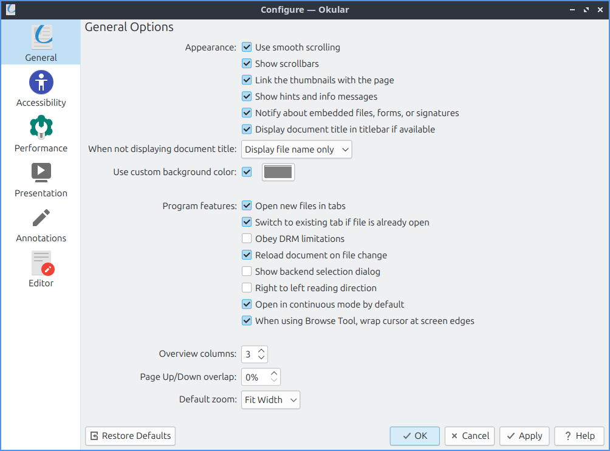
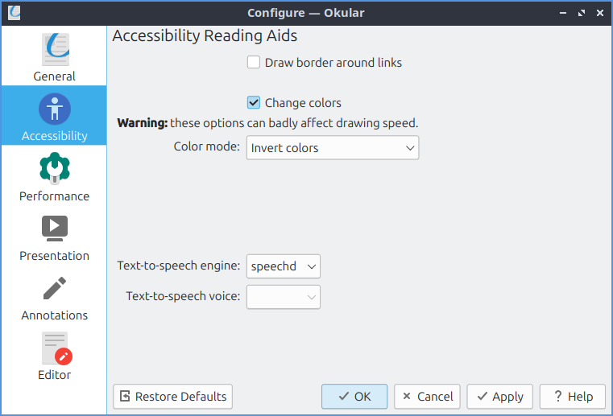
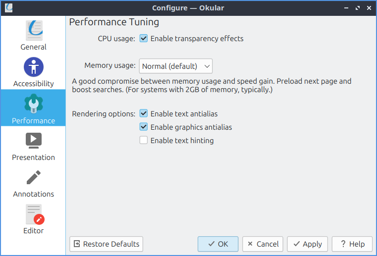
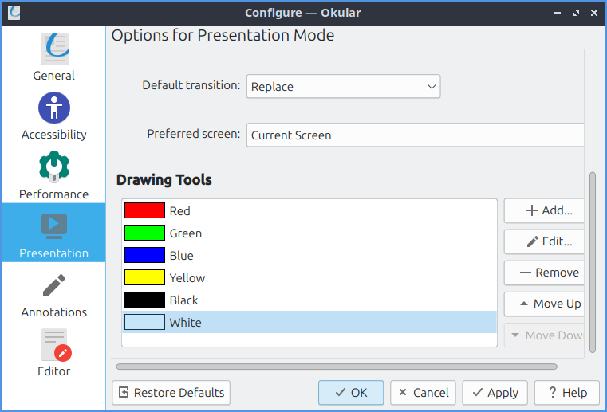

Chapter 2.2.7 Okular
====================
Okular is the pdf viewer for Lubuntu 24,04 

Usage
-----
To move the area shown on the screen down press :kbd:`Down arrow` and conversely to move it up use :kbd:`Up arrow`. You can also use the scrollwheel on your mouse to easily move up and down. To go to the next page press :kbd:`right arrow`, :menuselection:`Go --> Next Page`, or press press the downward pointing arrow on the toolbar. To go to the previous page press :kbd:`Up arrow`, :menuselection:`Go --> Previous Page`, or the upward pointing arrow on the toolbar. To see what page you are in is in a box between the button for next and previous page on the toolbar. To the right of this box it shows what page this is :guilabel:`of` the total number of pages of the document. To switch to a particular page type in the box in the center of the toolbar, press :kbd:`control +G`, or :menuselection:`Go --> Go to Page`.

When you first open Okular you can open a file with the :guilabel:`Open Document` button, :menuselection:`File --> Open`, or press :kbd:`Control + O`. If you have a recently opened document it will appear on the right under :guilabel:`Recent Documents` on first opening Okular or :menuselection:`File --> Open Recent`. To clear your recent documents click the :guilabel:`Forget All` button when you first open Okular or :menuselection:`File --> Clear List`. Open Recent -->  To reload your file if something is changed press :kbd:`F5` or :menuselection:`File --> Reload`. To save a PDF :menuselection:`File --> Save` or press :kbd:`Control +S`. To save a file with a separate name :menuselection:`File --> Save As` or press :kbd:`Control + Shift +S`. To see info on your file :menuselection:`File --> Properties` or press :kbd:`Alt + Enter`.

To zoom out press the :guilabel:`-` button on the toolbar, press :kbd:`Control + -`, or :menuselection:`View --> Zoom Out`. To zoom in press the :guilabel:`+` button on the toolbar, press :kbd:`Control + +`, or :menuselection:`View --> Zoom in`. To zoom to have the page zoom to have the width fill the whole window :menuselection:` View --> Fit width` or select :menuselection:`Fit Width` next to the :guilabel:`+` and :guilabel:`-`. To zoom to see a full page :menuselection:`View --> Fit Page` or select :menuselection:`Fit Page` next to the :guilabel:`+` and :guilabel:`-` button. To zoom to 100%  :menuselection:`View --> Zoom to 100%`, :kbd:`Control +0`, or select :menuselection:`100%` on the bar next to the :guilabel:`+` and :guilabel:`-` buttons.

To view pages facing each other like an open book select from :guilabel:`View Mode` :menuselection:`Facing Pages` or :menuselection:`View --> View Mode --> Facing Pages`. To see an open book view with the first page centered select :menuselection:`Facing Pages(center first page)` from :guilabel:`View Mode` or :menuselection:`View --> View Mode --> Facing Pages(center first page)`. To view multiple pages at once select :menuselection:`Overview` from :guilabel:`View Mode` or :menuselection:`View --> View Mode --> Overview`. To switch back to viewing one page select :menuselection:`Single Page` from :guilabel:`View Mode` or :menuselection:`View --> View Mode --> Single Page`. To choose to only view whole pages at once and not scroll to the top and bottom of a page uncheck :menuselection:`View --> View Mode --> Continuous`. To rotate your view to the left :menuselection:`View --> Orientation --> Rotate left`. To rotate your view to the right :menuselection:`View --> Orientation --> Rotate right`. To make your view back to how it was at the start :menuselection:`View --> Orientation --> Original Orientation`.

To select Text press :kbd:`Control + 4`, :menuselection:`Tools --> Text Selection`, or select :menuselection:`Text selection` from the right of the toolbar. To select an area press :kbd:`Control + 3`, :menuselection:`Tools --> Area Selection`, or select :menuselection:`Area Selection` for the right of the toolbar. To select tables press :kbd:` Control + 5`, :menuselection:`Tools --> Table Selection`, or select :menuselection:`Table Selection` from the right of the toolbar. To switch back to moving the view with mouse :menuselection:`Tools --> Browse`, press :kbd:`Control + 1`, or press the :guilabel:`Browse` button on the toolbar. 

To highlight something in yellow press :kbd:`1` or select :menuselection:`Yellow highlighter` from the drop down of the far right of the toolbar. To highlight in green press :kbd:`2` or select :menuselection:`Green Highlighter` from the menu on the far right of the toolbar. To underline something press :kbd:`3` or select :menuselection:`Underline` from the toolbar on the right. To insert a text note into your file press :kbd:`4` or select :menuselection:`Insert Text` from the menu on the right of the toolbar. Then you can click where you want the note and a window will popup you enter your text into. To insert a note inline and not have it be over text making it illegible press :kbd:`5` or select :guilabel:`Inline Note` from the right of the toolbar. Then left click on where you want the note and type the note in the yellow pop up. To have a pop up note press :kbd:`6` or select pop up note from the toolbar on the right. The left click where you want the note and type in the note as you want.

To undo an annotation press :kbd:`Control +Z` or :menuselection:`Edit --> Undo`. To redo something you undid press :kbd:`Control + Shift +Z` or :menuselection:`Edit --> Redo`. To select all press :kbd:`Control + A` or :menuselection:`Edit --> Select All`. To select all text on a current page :menuselection:`Edit --> Select all text on current page`. To copy something you have selected press :kbd:`Control + C` or :menuselection:`Edit --> Copy`.

On the left side of the window Okular has a sidebar. The leftmost tab has thumbnails of the pages of your document. The shaded part of the thumbnail shows the part of the page that is displayed. At the bottom of the thumbnail is a page number. To switch to a page with the sidebar left click on that page. The middle tab of the sidebar shows annotation. To search through your annotations look into :guilabel:`Search` bar. To have the page shown in the tree of what press the leftmost button on the bottom that looks like a page. To show who made the comment press the button that looks like a person. To jump to an annotation simply left click on it. To open all annotation press the downward pointing arrow on the bottom right. To collapse all annotations press the upward pointing arrow. The third tab of the sidebar shows your bookmarks. To hide bookmarks for other files uncheck :guilabel:`Show for all Documents` checkbox. To search your bookmarks enter in the :guilabel:`Bookmarks` bar. To open your bookmark double left click on it. To add a bookmark left click on the :guilabel:`Add Bookmark` button on the bottom. To remove a bookmark on the bottom left click on the :guilabel:`Remove Bookmark` button. The rightmost tab only shows up if your document has it is a Contents tab. To search through your contents type in the :guilabel:`Search` bar. To go to the part of the section of the table of contents simply left click on it. 

To search through your document press :kbd:`Control + F` or :menuselection:`Edit --> Find`. To type in the bar in the bottom what you want to search for. To get to the next result press :kbd:`F3`, the :guilabel:`Find` button on the bottom, or :menuselection:`Edit --> Find Next`. To go to your previous search result press :kbd:`Shift + F3`, the :guilabel:`Previous` button on the bottom, or :menuselection:` Edit --> Find Previous`. To make searching case sensitive press the :guilabel:`Options` button and check the :menuselection:`Case sensitive` checkbox. To start searching at your current page left click on the :guilabel:`Options` button and check the :menuselection:`From current page` checkbox. To start searching as you type press the :guilabel:`Options` button and check the :menuselection:`Find as you type` checkbox. To close find press the :guilabel:`x` button.

To go all the way to the beigining press :kbd:`Control + Home` or :menuselection:`Go --> Beginning of Document`. To go all the way to the end of the document :kbd:`Control + End` or :menuselection:`Go --> End of Document`. To go back after changing pages :menuselection:`Go --> Back`. 

Then to go forward from where you were :menuselection:`Go --> Forward`. To show a magnifier for Okular press :kbd:`Control +6` or :menuselection:`Tools --> Magnifier`. Then left click over where you want to have magnified. To zoom on a particular area press :kbd:`Control+6` or :menuselection:`Tools --> Zoom`. The left click and select which area you want to zoom in on. To zoom back out right click.

Version
-------
Lubuntu ships with version 23.08.4 of Okular.

How to Launch
-------------

To launch Okular :menuselection:`Internet --> Okular` or run 

.. code::

   okular
   
from the command line.

Customizing
-----------
To Congifure Okular press :kbd:`Control + Shift + ,` or :menuselection:`Setttings --> Configure Okular`. The :guilabel:`General` tab has settings for files and how to display things. To use smooth scrolling check the :guilabel:`Use smooth scrolling` checkbox. To hide scrollbars on Okular uncheck the :guilabel:`Show scrollbars` checkbox. To have clicking on thumbnails of a page link to that page check the :guilabel:`Link the thumbnails with the page` checkbox. To hide the hints and info messages uncheck the :guilabel:`Show hints and info messages` checkbox. To have notifications about embeded files forms or signatures check the :guilabel:`Notify about embeded files, forms, or signatures` checkbox. To show the document title in the window titlebar check the :guilabel:`Dispaly document title in titlebar if available` checkbox. To choose what to do when you don't have a document title use the :guilabel:`When not displaying document title` drop down menu. To choose a custom background color check the :guilabel:`Use custom background color` checkbox. Then left click on the to the right to pick your background color.

To have tabs for opening new files check the :guilabel:`Open new files in tabs`. checkbox. To switch to an existing tab if the file is already open check the :guilabel:`Switch to existing tab if file is already open` checkbox. To not obey DRM limitations uncheck the :guilabel:`Obey DRM limitations` checkbox. To reload a file if the file changes check the :guilabel:`Reload on file change` checkbox. To display right to left text check the :guilabel:`Right to left reading direction` checkbox. To not load in continous view by default uncheck the :guilabel:`Opn in continous mode by default` checkbox. To choose your default zoom change the :guilabel:`Default zoom` field.

The :guilabel:`Accessability` tab has settings making this easier to read. To draw borders around links check the :guilabel:`Draw borders around links` checkbox. To change how the colors appear check the :guilabel:`Change colors` checkbox. To change how the colors appear use the :guilabel:`Color mode` menu.

To change how Okular performs use the :guilabel:`Performance` tab. To use less CPU uncheck the :guilabel:`Enable transparency effects` checkbox. To change how much memory Okular uses change the :guilabel:`Memory usage` menu. To enable text antialiasing for Okular check the :guilabel:`Enable text antialias` checkbox. To have antialiasing on the graphics check the :guilabel:`Enable graphics antialias` checkbox. To have font hinting in the text check the :guilabel:`Enable text hinting` checkbox.

To have settings for your presentation use the :guilabel:`Presenetation` tab. To change the transition of Okular use the :guilabel:`Defualt transition` menu. To choose which screen to present on by default use the :guilabel:`Prefered Screen` menu. 

To change settings for Annotations in Okular sue the :guilabel:`Annotations` tab. To switch how many things to be on the annotations toolbar use the :guilabel:`Annotation toolbar` menu. To change your name for annotations change the :guilabel:`Author` field. To make a custom new annotation press the :guilabel:`Add button`. To change an existing annoatation press the :guilabel:`Edit` button. To delete and annotation press the :guilabel:`Remove` button. To move an annotation down press the :guilabel:`Move Down` button. To move an annoatation back up press the :guilabel:`Move Up` button.

 

