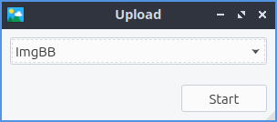
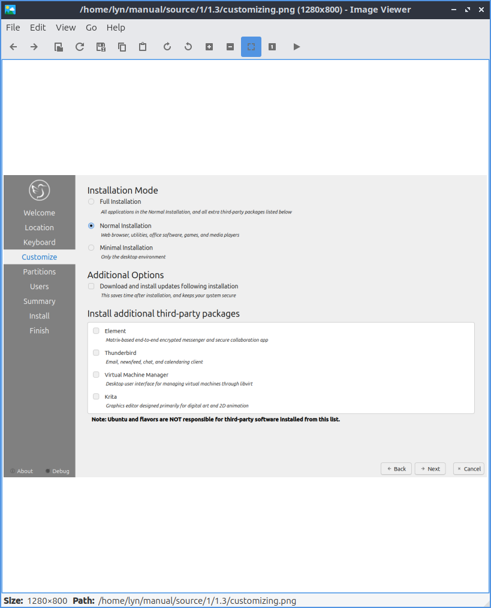

Chapter 2.3.1 lximage
=====================

Lximage is the default image viewer for lubuntu. 

Useage
------
To open a picture press :menuselection:`File --> Open`, :kbd:`Control + O`, or press the button that looks like a opening folder. If you do not like the picture press :kbd:`Del` or :menuselection:`File --> Delete`. To open a new window of lximage press :kbd:`Control +N` or :menuselection:`File --> New Window`. To view your property of your image is :menuselection:`File --> File Properties`. 

If you want to upload a picture to share it online press :menuselection:`Edit --> Upload` and a new window will pop up with a drop down menu to show where to upload the picture to. To actually uplaod the file press :guilabel:`Start`.

To use lximage use the arrow to the right to view the next file in the folder and the arrow to the left to view the previous folder. To open a new picture press the open button which looks like a blue folder with a piece of paper in it. To open an entire directory :menuselection:`File --> Open Directory` or press :kbd:`Control +D`. To save the file as something press the button that looks like a floppy disk or :menuselection:`File --> Save As`.

If you wish to print a picture after viewing it from the :menuselection:`file --> print` or press :kbd:`control+ p` to bring up a print dialog.

To rotate an image to the right press the circular arrrow that points to the right or go to :menuselection:`edit --> rotate clockwise`. To rotate conterclockwise use the circular arrow pointing to the left or :menuselection:`edit -->rotate conterclockwise`. To zoom in on a picture press the icon with a magnifying glass with a + symobol on it or press :kbd:`control + +`. To zoom out press the button of a magnifying glass with a - symbol in it or press :kbd:`control + -`.    

To flip your image on the vertical axis :menuselection:`Edit --> Flip Vertically`. To flip your image on the horizontal axis :menuselection:`Edit --> Flip Horizonatally`. 

To copy an image to the clipboard you can :menuselection:`Copy to Clipboard`. To paste an image to the clipboard :menuselection:`Paste from Clipboard`.  

To view the next picture on your image press the :kbd:`right arrow` and conversly to view the previous image press the :kbd:`left arrow`. To view thumbnials of the current directory you can toggle thumbnials and thumbnails will show at the buttom  with a scrollbar at the bottom of the window to view the whole folder. You can also scroll between different pictures with the mousewheel as well. To jump to the first picture press :kbd:`home` or :menuselection:`Go --> First File`. To jump to the last picture press :kbd:`end` or :menuselection:`Go --> Last File`.   

To view the picture entirely at its original size press :menuselection:`View --> Fit` or the button with a veritcial and horizontal arrow and a folded over buttom right corner. To return your image to its original size press the magnifying button with 1:1 inside it or :menuselection:`View --> Original Size`.

To view the picture as fullscreen press :kbd:`f11` or :menuselection:`View --> Fullscreen`. To have a slideshow of you pictures :menuselection:`View --> Slideshow`. Once you start the slideshow on the toolbar a play pause button will appear on the toolbar. 

Screenshot
----------

Customizing
-----------
To change the background color in a window press the button next to :guilabel:`Normal background color` and then a window will pop up showing your color choice. To change the background color when fullscreen press the button next to :guilabel:`Fullscreen background color` and the same color picker window will appear. To change how long it takes for a each slide show to change change the :guilabel:`Slide show interval (seconds):` field. To cancel your changes press the :guilabel:`Cancel` button. To apply your settings and exit the prefrence dialog by pressing the :guilabel:`OK` button.

Version
-------
Lubuntu ships with version 0.7.0 or lximage. 

How to launch
-------------
To launch lximage from the menu :menuselection:`graphics --> lximage` or run

.. code:: 

   lximage-qt 

from the command line. The icon for lximage-qt is an orange landscape scene of a sunset. 
