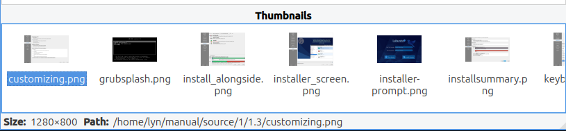
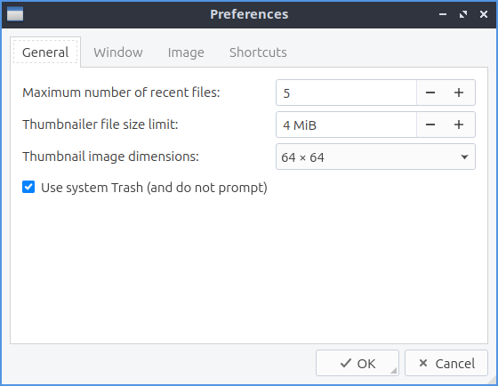

Chapter 2.3.1 LXImage
=====================

LXImage is the default image viewer for Lubuntu. 

Usage
------
To open a picture press :menuselection:`File --> Open File`, :kbd:`Control + O`, or press the button that looks like an upward pointing arrow. To open a directory full of images press :kbd:`Control+D` or :menuselection:`File --> Open Directory`. If you do not like the picture press :kbd:`Del` or :menuselection:`File --> Delete`. To open a new window of LXImage press :kbd:`Control +N` or :menuselection:`File --> New Window`. To view the properties of your image by :menuselection:`File --> File Properties`. To view your recently viewed pictures :menuselection:`File --> Recently Opened Files`. To reload your file after you save it again press :kbd:`Control +R`, press the circluar arrow button, or :menuselection:`File --> Reload file`.

If you want to upload a picture to share it online press :menuselection:`Edit --> Upload` and a new window will pop up with a drop down menu to show where to upload the picture to. To actually upload the file press :guilabel:`Start`. The URL of the image will then show up from after it is finished uploading. You can then copy the URL by selecting the text pressing :kbd:`Control+C`.

.. image:: lximage_upload.png

To use LXImage use the arrow to the right to view the next file in the folder and the arrow to the left to view the previous folder. To open an entire directory :menuselection:`File --> Open Directory` or press :kbd:`Control +D`. To save the file as something press :kbd:`Control+Shift+S`, the downward pointed arrow with an I on it, or :menuselection:`File --> Save As`. To save the file with the same file name press :kbd:`Control+S` or :menuselection:`File -->Save`.

If you wish to print a picture after viewing it from the :menuselection:`File --> Pint` or press :kbd:`control+ p` to bring up a print dialog. To exit the window with a keyboard shortcut press the :kbd:`Escape` key.

To rotate an image to the right press the circular arrow that points to the right, press :kbd:`R`, or go to :menuselection:`Edit --> Rotate Clockwise`. To rotate counterclockwise use the circular arrow pointing to the left, press :kbd:`L`, or :menuselection:`Edit -->Rotate Counterclockwise`. To zoom in on a picture press the icon with a magnifying glass with a + symbol on it, :menuselection:`View --> Zoom In`, or press :kbd:`control + +`. To zoom out press the button of a magnifying glass with a - symbol in it, :menuselection:`View --> Zoom Out` or press :kbd:`control + -`.    

To flip your image on the vertical axis press :kbd:`V` or :menuselection:`Edit --> Flip Vertically`. To flip your image on the horizontal axis press :kbd:`H` or :menuselection:`Edit --> Flip Horizontally`. 

To copy an image to the clipboard you can :menuselection:`Edit --> Copy to Clipboard`. To paste an image to the clipboard :menuselection:`Edit --> Paste from Clipboard`.  

To view the next picture on your image press the :kbd:`right arrow` or :kbd:`page down` and conversely to view the previous image press the :kbd:`left arrow` or :kbd:`page up`. You can also scroll between different pictures with the mousewheel or by pressing the right and left pointing arrow buttons on the toolbar. To jump to the first picture press :kbd:`home` or :menuselection:`Go --> First File`. To jump to the last picture press :kbd:`end` or :menuselection:`Go --> Last File`.  You can also go to the next or previous files with :menuselection:`Go --> Previous File` or :menuselection:`Go --> Next File`.

To view thumbnails of the current directory you can toggle thumbnails by pressing :kbd:`T` or :menuselection:`View --> Show Thumbnails` and thumbnails will show at the bottom  with a scrollbar at the bottom of the window to view the whole folder. To open the thumbnail of a picture in a another program such as one to edit that picture right click :menuselection:`Open click` and select the program you want to edit with. To rename an image after viewing it right click on the thumbnail select :menuselection:`Rename` and type the filename for the picture you want. To move a file to the trash can right click on it and select :menuselection:`Move to Trash`.

To view the picture entirely at its original size press :menuselection:`View --> Fit` or the button with a vertical and horizontal arrow and a folded over bottom right corner. To return your image to its original size press the magnifying button with 1:1 inside it or :menuselection:`View --> Original Size`. To show information about the settings on the camera :menuselection:`View --> Show EXIF Data`. 

To view the picture as fullscreen press :kbd:`f11`, right click :menuselection:`Fullscreen`, double click on the image, or :menuselection:`View --> Fullscreen`. To have a slideshow of you pictures in your current folder :menuselection:`View --> Slideshow`. Once you start the slideshow on the toolbar a play pause button will appear on the toolbar. 

Annotations
------------
To edit your images with LXImage there are several buttons on the right hand side of the toolbar. To draw and arrow press the button that looks like an arrow click once where you want the arrow to start and then drag the direction you want the arrow to point and click it where you want the arrowhead to be. To draw a hollow rectangle left click on the button with a hollow rectangle and click and drag to the size of the rectangle you want. To draw a hollow circle annotation press the button that looks like a hollow circle. To draw numbers on your pictures press the :guilabel:`3` button. To stop drawing annotations press the button with a circle with a slash through it.

Screenshot
----------
.. image:: LXImage.png

Customizing
-----------
To change the background color in a window press the button next to :guilabel:`Normal background color` and then a window will pop up showing your color choice. To change the background color when fullscreen press the button next to :guilabel:`Fullscreen background color` and the same color picker window will appear. To change how long it takes for a each slide show to change change the :guilabel:`Slide show interval (seconds)` field. To cancel your changes press the :guilabel:`Cancel` button. To apply your settings and exit the preference dialog by pressing the :guilabel:`OK` button.

Version
-------
Lubuntu ships with version 0.14.1 or LXImage. 

How to Launch
-------------
To launch LXImage from the menu :menuselection:`Graphics --> LXImage` or run

.. code:: 

   lximage-qt 

from the command line. The icon for LXImage is an orange landscape scene of a sunset. 
