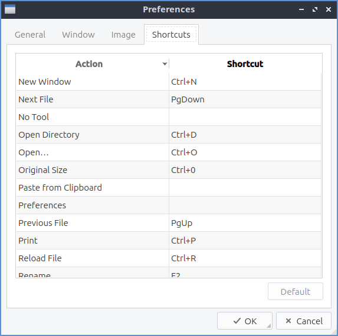

Chapter 2.3.1 LXImage
=====================

LXImage is the default image viewer for Lubuntu.

Usage
------
To open a picture press :menuselection:`File --> Open File`, :kbd:`Control + O`, or press the button that looks like an upward pointing arrow. To open a directory full of images press :kbd:`Control+D` or :menuselection:`File --> Open Directory`. If you do not like the picture press :kbd:`Del` or :menuselection:`File --> Delete`. To open a new window of LXImage press :kbd:`Control +N` or :menuselection:`File --> New Window`. To view the properties of your image by :menuselection:`File --> File Properties`. To view your recently viewed pictures :menuselection:`File --> Recently Opened Files`. To clear your recently opened files :menuselection:`Files --> Recently Opened --> Clear`. To reload your file after you save it again press :kbd:`Control +R`, press the circular arrow button, or :menuselection:`File --> Reload file`.

To have LXImage open the next file in a folder press :kbd:`Right arrow` and to view the previous image press the :kbd:`Left arrow`. To open an entire directory :menuselection:`File --> Open Directory` or press :kbd:`Control +D`. To save the file as something press :kbd:`Control+Shift+S`, the downward pointed arrow with an I on it, or :menuselection:`File --> Save As`. To save the file with the same file name press :kbd:`Control+S` or :menuselection:`File -->Save`. To rename a file press :kbd:`F2` or :menuselection:`Edit --> Rename`.

.. image:: LXImage.png

If you wish to print a picture after viewing it from the :menuselection:`File --> Pint` or press :kbd:`control+ p` to bring up a print dialog. To change the printer change the :guilabel:`Name` field. To toggle viewing more options for printing press the :guilabel:`Options` button. To change how many copies of an image you want to print change the :guilabel:`Copies` field. To collate the pages to print check the :guilabel:`Collate` checkbox. To reverse the order printed check the :guilabel:`Reverse` button. To exit the window with a keyboard shortcut press the :kbd:`Escape` key.

If you want to upload a picture to share it online :menuselection:`File --> Upload` or press :kbd:`Control + U` and a new window will pop up with a drop down menu to show where to upload the picture to. To actually upload the file press :guilabel:`Start`. The URL of the image will then show up from after it is finished uploading. You can then copy the URL by selecting the  text and then pressing :kbd:`Control+C` or pressing  the :guilabel:`Copy` button.

.. image:: lximage_upload.png

To rotate an image to the right press the circular arrow that points to the right, press :kbd:`R`, or go to :menuselection:`Edit --> Rotate Clockwise`. To rotate counterclockwise use the circular arrow pointing to the left, press :kbd:`L`, or :menuselection:`Edit -->Rotate Counterclockwise`. To zoom in on a picture press the icon with a magnifying glass with a + symbol on it, :menuselection:`View --> Zoom In`, or press :kbd:`control + +`. To zoom out press the button of a magnifying glass with a - symbol in it, :menuselection:`View --> Zoom Out` or press :kbd:`control + -`.

To change the order of pictures in a folder select :menuselection:`View --> Sorting` and select how you want images sorted.

To flip your image on the vertical axis press :kbd:`V` or :menuselection:`Edit --> Flip Vertically`. To flip your image on the horizontal axis press :kbd:`H` or :menuselection:`Edit --> Flip Horizontally`. To change the image to a different size :menuselection:`Edit --> Resize` and a dialog box will show up. To see how large your image currently is in pixels view the :guilabel:`Current size` dialog. To change how wide the image is change :guilabel:`Width` column in the :guilabel:`New size` row. To change the height of the image under :guilabel:`Height` and change to the desired size. To change which size your image is in percentage change the field with :guilabel:`%` under :guilabel:`Width`. To allowing stretching the image while resizing it uncheck the :guilabel:`Keep aspect ratio` checkbox. 

To see how big an image is on the bar at the bottom :guilabel:`Size` will tell you the size in pixels of an image. To see where the current image is saved read the path in the :guilabel:`Path` field.

To copy an image to the clipboard you can :menuselection:`Edit --> Copy to Clipboard`. To paste an image to the clipboard :menuselection:`Edit --> Paste from Clipboard`. To copy the path of an image to the clipboard :menuselection:`Edit --> Copy Path`.

To view the next picture on your image press the :kbd:`right arrow`, :kbd:`space`, or :kbd:`page down` and conversely to view the previous image press the :kbd:`left arrow`, :kbd:`Backspace`, or :kbd:`page up`. You can also scroll between different pictures with the mousewheel or by pressing the right and left pointing arrow buttons on the toolbar. To jump to the first picture press :kbd:`home` or :menuselection:`Go --> First File`. To jump to the last picture press :kbd:`end` or :menuselection:`Go --> Last File`. You can also go to the next or previous files with :menuselection:`Go --> Previous File` or :menuselection:`Go --> Next File`.

To view thumbnails of the current directory you can toggle thumbnails by pressing :kbd:`T` or :menuselection:`View --> Show Thumbnails` and thumbnails will show at the bottom with a scrollbar at the bottom of the window to view the whole folder. To open the thumbnail of a picture in a another program such as one to edit that picture right click :menuselection:`Open With` and select the program you want to edit with or you can do this by :menuselection:`File --> Open With`. To rename an image after viewing it right click on the thumbnail select :menuselection:`Rename` and type the filename for the picture you want. To move a file to the trash can right click on it and select :menuselection:`Move to Trash`.

To view the picture entirely press :menuselection:`View --> Fit` or the button with a vertical and horizontal arrow and a folded over bottom right corner. To return your image to its original size  :menuselection:`View --> Original Size` or press the :guilabel:`1` toolbar button. To show an outline around the image press :kbd:`O` or :menuselection:`View --> Show Outline`. To toggle showing information about the settings on the camera :menuselection:`View --> Show EXIF Data`. 

To view the picture as fullscreen press :kbd:`f11`, right click :menuselection:`Fullscreen`, double click on the image, or :menuselection:`View --> Fullscreen`. To exit fullscreen double click the image, press :kbd:`F11`, or right click :menuselection:`Fullscreen` again. To have a slideshow of you pictures in your current folder :menuselection:`View --> Slideshow` or right click and select :menuselection:`Slide Show`. Once you start the slideshow on the toolbar a play pause button will appear on the toolbar or you can stop the slideshow by right clicking and selecting :menuselection:`Slide Show`.

To close LXImage press :kbd:`Control+w` or :menuselection:`File --> Close`. 

Annotations
------------
To show annotations controls :menuselection:`View --> Annotations Toolbar` or right click and select :menuselection:`Annotations Toolbar`. To edit your images with LXImage there are several buttons on the right hand side of the toolbar. To draw and arrow press the button that looks like an arrow click once where you want the arrow to start and then drag the direction you want the arrow to point and click it where you want the arrowhead to be. To draw a hollow rectangle left click on the button with a hollow rectangle and click and drag to the size of the rectangle you want. To draw a hollow circle annotation press the button that looks like a hollow circle. To draw numbers on your pictures press the :guilabel:`3` button. To stop drawing annotations press the button with a circle with a slash through it.

.. warning:: Annotations in LXImage cannot be undone with an undo functionality. Also you will not be prompted to save your unsaved annotations when closing LXImage.

Customizing
-----------

To change preferences in LXImage :menuselection:`Edit --> Preferences`. The :guilabel:`General` tab has settings for recent files, thumbnails, and trash. To cancel your changes press the :guilabel:`Cancel` button. To not generate thumbnails for really large images change the :guilabel:`Thumbnailer size limit` field. To change how big thumbnails to use change the :guilabel:`Thumbnail image dimensions` field. To apply your settings and exit the preference dialog by pressing the :guilabel:`OK` button.

The :guilabel:`Window` tab manages how the window appears. To show the thumbnails dock by default check the :guilabel:`Show thumbnails dock by default` checkbox and choose where it is to the right. To show metadata about your pictures by default check the :guilabel:`Show Exif data dock by default` checkbox. To toggle showing the menubar check/uncheck the :guilabel:`Show menubar by default` checkbox. To toggle showing the main toolbar check/uncheck the :guilabel:`Show main toolbar by default` checkbox. To show the annotations toolbar by default check the :guilabel:`Show annotations toolbar by default`.

The :guilabel:`Image` tab has settings for how LXImage displays images. To change the background color in a window press the button next to :guilabel:`Normal background color` and then a window will pop up showing your color choice. To change the background color when fullscreen press the button next to :guilabel:`Fullscreen background color` and the same color picker window will appear. To change how long it takes for a each slide to change change in a slideshow change the :guilabel:`Slide show interval (seconds)` field. To show the image outline by default check the :guilabel:`Show image outline by default` checkbox. To fit images when navigating check the :guilabel:`Fit images when navigating` checkbox. To smooth images when you zooming check the :guilabel:`Smooth images on zooming` checkbox.

The :guilabel:`Shortcuts` tab has settings for changing keyboard shortcuts in LXImage. To see what a shortcut will do read the :guilabel:`General` column. To change a shortcut double click on the :guilabel:`Shortcut` column and press what you want the shortcut to be. To reset keyboard shortcuts to default press the :guilabel:`Default` button.

Version
-------
Lubuntu ships with version 1.2.0 or LXImage. 

How to Launch
-------------
To launch LXImage from the menu :menuselection:`Graphics --> LXImage` or run

.. code:: 

   lximage-qt 

from the command line. The icon for LXImage is an orange landscape scene of a sunset. 
