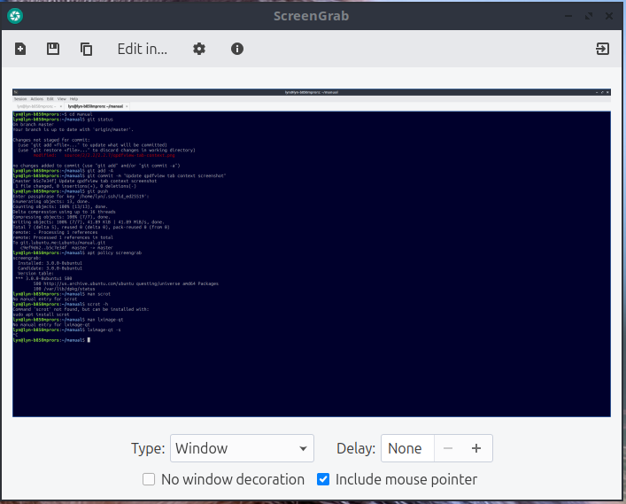
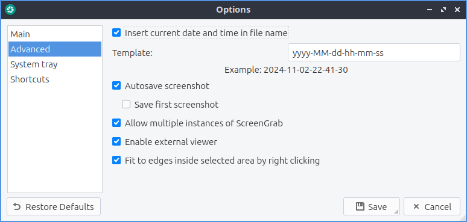
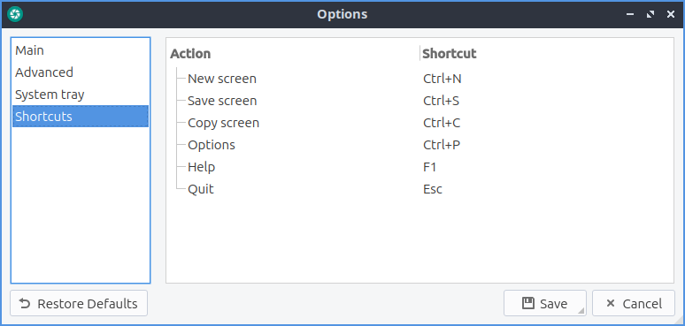

Chapter 2.3.2 ScreenGrab
========================

ScreenGrab is the default screenshot tool for Lubuntu 19.10 or later.

Usage
-----
To take a new screenshot press the button with a piece of paper with a :guilabel:`+` on it or press :kbd:`Control+N`. After doing this a preview will appear in the center of the window. If you want to save this screenshot press the save downward pointing arrow or press :kbd:`Control+S`. To copy your screenshot to a clipboard press the button with two pieces of paper or press :kbd:`Control+C`. To edit your screenshot in an image editor :menuselection:`Edit in` and select the program you want to use to edit. To quit ScreenGrab press :kbd:`Escape` or press the button to the right with a door and a rightward pointed arrow.

To change what mode to select what are of the screen to take a screenshot from change the :guilabel:`Type` drop down menu. The options in the :guilabel:`Type` menu are :menuselection:`Full screen` to take a picture of everything on all of your screens. From the :guilabel:`Type` menu select :menuselection:`Window` to select your last window. To change how long to delay before taking the screenshot change the :guilabel:`Delay` field. To include the mouse pointer in your screenshot check the :guilabel:`Include mouse pointer` checkbox.

If you have the system tray enabled ScreenGrab can do many things by right clicking it. To show ScreenGrab this way left click on the tray icon or right click the tray icon and select :menuselection:`Show`. To have ScreenGrab take a new screenshot from the system tray right click on the tray icon and select :menuselection:`New`. To save your screenshot from the tray icon right click on it and select :menuselection:`Save`. To copy your screenshot to the clipboard from the systray right click on the icon and select :menuselection:`Copy`. To open ScreenGrab preferences from the system tray right click on the system tray and select :menuselection:`Options`. To quit ScreenGrab from the system tray right click on the tray icon and select :menuselection:`Quit`. 

Screenshot
----------

Version
-------
Lubuntu ships with version 1.101 of ScreenGrab.

How to Launch
-------------
To launch ScreenGrab :menuselection:`Graphics --> ScreenGrab` or from the command line run

.. code::

   screengrab  
   
The icon for ScreenGrab looks like a teal camera shutter with a white layer on top.

Customizing
-----------
To change your settings on ScreenGrab press the :guilabel:`gear` button or press :kbd:`Control +P`. The :guilabel:`Main` tab has settings for how to your screenshot. To change where ScreenGrab saves files by default change the :guilabel:`Default save directory` field or press :guilabel:`Browse` button to pop up a dialog to choose where to save. To change the default file name for your screenshots change the :guilabel:`Name` field. To change what format to save as by default change the :guilabel:`Format` drop down menu. To choose to copy the file name to the clipboard change the :guilabel:`Copy file name to the clipboard when saving` menu. If you are saving a jpg image you can change the image quality with the :guilabel:`Image quality` slider.

To restore your options to default press the :guilabel:`Restore Defaults` button. To cancel making changes press the :guilabel:`Cancel` button. To save your changes press the :guilabel:`Save button`.

To change your settings on multiple windows and automatically saving use the :guilabel:`Advanced` tab. To automatically insert a time and date in the file name check the :guilabel:`Insert current date and time in file name` checkbox. To change how this date appears enter the date in the :guilabel:`Template` field that only shows if you insert the date and time. To automatically save each screenshot check the :guilabel:`Autosave screenshot` checkbox. To save the first screenshot check the :guilabel:`Save first screenshot` checkbox that only shows if you are saving the first screenshot. To allow more than one ScreenGrab window check the :guilabel:`Allow multiple instances of ScreenGrab` checkbox.

To changes with how ScreenGrab shows in the system tray use the :guilabel:`System tray` tab. To toggle showing ScreenGrab in the system tray check/uncheck the :guilabel:`Show ScreenGrab in the system tray` checkbox. To change when ScreenGrab shows notifications change the :guilabel:`Tray messages` field. To not close ScreenGrab when closing the window but keep it in the system tray check the :guilabel:`Minimize to tray when closing` checkbox.

To change what your keyboard shortcuts ScreenGrab uses select the :guilabel:`Shortcuts` tab. To see what each shortcut does is on the :guilabel:`Action` column. To see what key to press get have the action happen is listed in the :guilabel:`Shortcut` column. To change a keyboard shortcut and then press the button at the bottom of :guilabel:`Selected shortcut` and press the keyboard shortcut you want to use for that shortcut.

