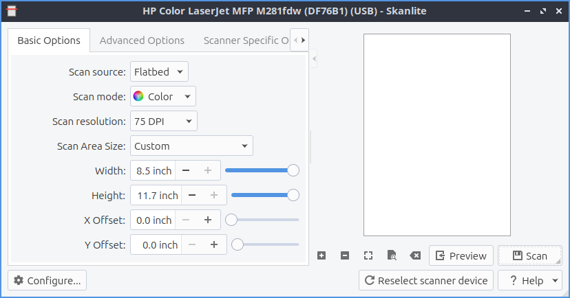

Chapter 2.3.3 Skanlite
======================

Skanlite is a scanning application. 

Version
-------
Lubuntu ships with version 2.1.0 of skanlite. 

Usage
------
To preview what you want to scan press the :guilabel:`Preview` button and you can make sure the scan is in a good position. With this done you can press the :guilabel:`Scan` button to scan the document after this a dialog will show up asking you were to save what you are scanning. If you want to cancel your scan midway through the scan or preview click on the red octagon with a white inside x button to cancel the scan while the scan is in progress. Then a file save dialog will pop up and type the file name you want in the :guilabel:`File name` field and then press the :guilabel:`Save` button.

If your scanner is not detected a you will get a device saying "Sorry no devices detected" while having a button for :guilabel:`Reload devices list` to try and find your scanner again. If you want to cancel press the :guilabel:`Cancel` button. 

To change the dpi or dots per inch is the dpi drop down menu for :guilabel:`Scan resolution` but keep in mind the higher the number of dpi the better the picture quality but the longer it will take to scan. Changing the :guilabel:`Scan mode` allows you to select color to select color scanning or gray to only show your scan in gray and not use color ink if you would want to print it out again.  

To zoom in press the magnifying glass button with a plus sign conversely to move out press the magnifying glass button with a minus sign. To change your resolution change the scan resolution drop down and select the dots per inch you want to use.    

To change the brightness of a scan slide the :guilabel:`Brightness` slider or input a positive or negative number into the numeric field. To change contrast slide the :guilabel:`Contrast` slider or input a positive or negative number in the numeric field. To toggle inverting your colors on the scan check/uncheck the :guilabel:`Invert colors` Checkbox. 

To select part of a scan you particularly want to save is to click over a preview of a scan and you will drag the selection with the mouse. To clear selections that can be automatically selected but canceled with a brown smudge with an x on it. If you want to zoom to your selection right click :guilabel:`Zoom to selection`. If you want to zoom to fit the whole entire page right click :guilabel:`Zoom to fit`. 

Screenshot
----------

How to launch
-------------
To launch skanlite turn on your scanner and that it is connected to your computer. To launch the application go to the menu :menuselection:`Graphics --> Skanlite` or run 

.. code:: 

   skanlite 
   
from the command line. 

Customizing
-----------
To customize your settings for Skanlite press the :guilabel:`Settings` button. To choose where to save your scans enter the path in the :guilabel:`Save Location` field or press the button to the right. To ask what to save what you are scanning change the :guilabel:`Save mode` menu :menuselection:`Open the save dialog for every image`. To ask for each scan in the :guilabel:`Save Mode` menu select :menuselection:`Open the save dialog for first image only` selection. To choose the default save name and format enter in the :guilabel:`Name & Format` filed with a drop down menu for scan format. To choose what quality to save your quality check the :guilabel:`Specify save quality` checkbox. Then drag the slider or percentage to change the quality. 
