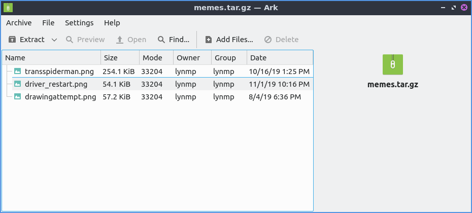
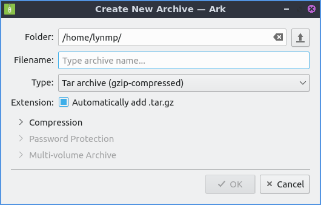
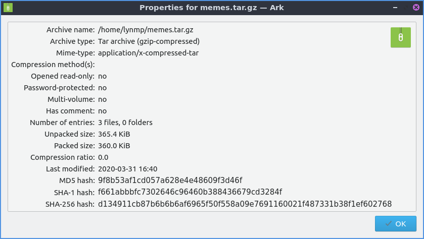
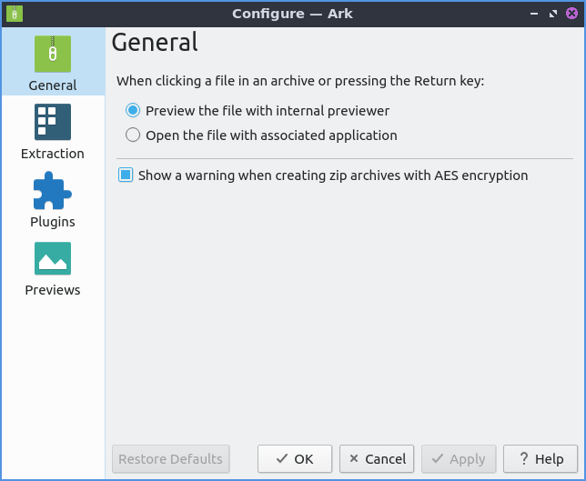
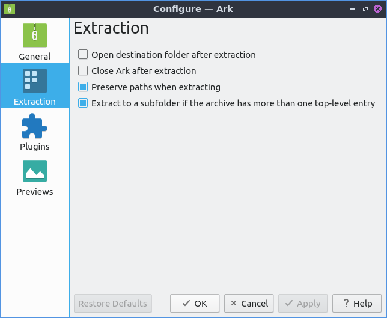
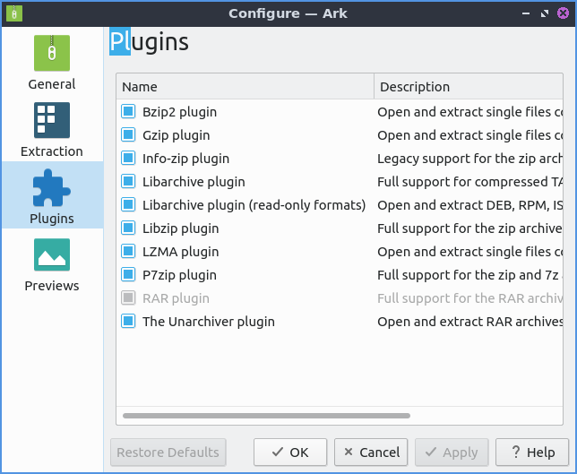
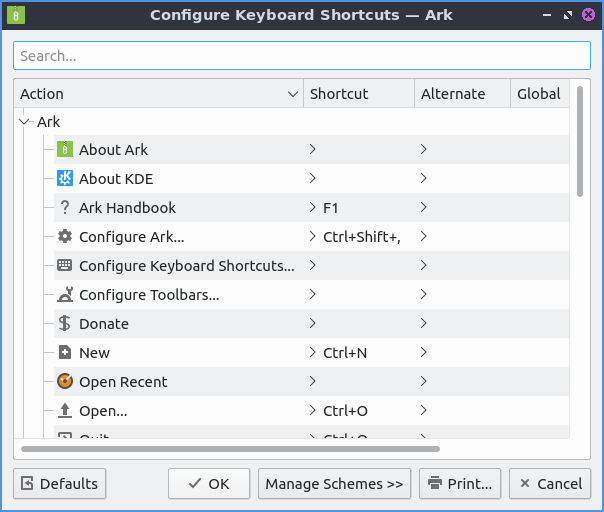

Chapter 2.4.1 ARK
=================

ARK is a file archive utility. It can be used to view, compress, combine multiple files into one archive, and decompress files.

Supported file formats include:

 - 7 zip archives
 - Java Archive
 - Tar Archives
 - Tar archives compressed with bzip, gzip, lzip, LZMA, XZ compressed 
 - Zip Archives

Screenshot
----------

Usage
------
To open a file in a archive, open the archive, then double click the :menuselection:`File --> Open` button. If you want to extract or move a file from the archive, use the extract button. After you have extracted to places and you have the file open it will appear in in the menu for quick areas to extract to in :menuselection:`Archive --> Extract All --> Quick Extract to`. To preview a file press :kbd:`Control +P` or :menuselection:`File --> Preview`. To open a file placed in an archive :menuselection:`File --> Open`. To rename a file in an archive press :kbd:`f2` or :menuselection:`File --> Rename`. To delete a file from an archive press :kbd:`Delete` or :menuselection:`File --> Delete` and you will have a confirmation so you do not accidentally lose data as this can't be undone. 

To create an archive press :kbd:`Control +N` or :menuselection:`Archive --> New` to bring up the create new archive dialog. Enter in the :guilabel:`Folder` you want to create this archive in the folder or press the folder button on the right to select where to create this archive. Type the :guilabel:`Filename` of the archive you want to name the file. To select which type of archive you get a drop down menu to select tar or zip archive with various different kinds of compression in the :guilabel:`Type` drop down menu. Some types of archives will allow to expand tunable settings of compression to change the compression with higher compression but will take more CPU usage to decompress. To automatically add a file extension based on what type of file you have check the :guilabel:`Automatically add format` checkbox.

To add a file to your archive :menuselection:`Archive --> Add Files` which brings up a file picker to choose how to add files. Once you add a file press the :guilabel:`Add` button to add a file. If you want to select multiple files to add at once you can hold down :kbd:`Control` and then left click on the files. 

To view recent archives :menuselection:`Archive --> Open Recent`. To clear the list of recent files :menuselection:`Archive --> Open Recent --> Clear List`. To search for files in an archive press :kbd:`Control+F` or :menuselection:`Archive --> Find`. To test your archive press :kbd:`Alt +T` or :menuselection:`File --> Test Integrity`.   

 To view the properties of your archive press :kbd:`Alt+ return` or :menuselection:`Archive --> Properties`. To see the namme of the archive opened read the :guilabel:`Archive Name` field. To see what kind of archive you have read the :guilabel:`Archive type` field. To see the mime-type of your archive read the :guilabel:`Mime-type` field. To see how the archive is compress read the :guilabel:`Compression method(s)` field. To see if you have opened something read only read the :guilabel:`Opened read-only` row. To see if the file is passowrd protected read the :guilabel:`Password-protected` row. To see the number of files and folder in your archive read the :guilabel:`Number of entries` row. To see the size of your archive once it is unpacked read the :guilabel:`Unpacked size` row. To see the size of your archive after compression view the :guilabel:`Packed size` row. To view the compression ratio on your archive read the :guilabel:`Compression ratio` row. To see the date the archive was last modified view the :guilabel:`Last modified` row. To see the different hashes of your archive see the :guilabel:`MD5 hash`, :guilabel:`SHA-1 hash`, and :guilabel:`SHA-256 hash` fields.

Version
-------
Lubuntu ships version 4:18.12.3 of ARK. 

Customizing
-----------
To access your preferences :menuselection:`Settings --> Configure Ark`. To show files in the associated program press the :guilabel:`Open file with associated application` radio button. To preview with internal previewer press the :guilabel:`Preview file with internal previewer` radio button. To have a warning when creating a zip file with AES encryption check the :guilabel:`Show a warning when creating zip files with AES encryption` checkbox. 

To cancel your changes to your settings press the :guilabel:`Cancel` button. To apply your changes and close the window press the :guilabel:`OK` button. To currently apply your settings press the :guilabel:`Apply` button.

The :guilabel:`Extraction Settings` tab has options for extracting files. To open the destination folder after extraction check the :guilabel:`Open destination folder after extraction` checkbox. To close ARK after extraction check the :guilabel:`Close ARK after extraction` checkbox. To have ARK extract to a subfolder if the archive has more than one file or directory at the of the file check the :guilabel:`Extract to subfolder if the archive has more than one top-level entry`.

The :guilabel:`Plugin Settings` tab has settings for each individual plugin. The :guilabel:`Name` column is the name of the plugin and the :guilabel:`Description` column is a description of the plugin. To toggle enabling  or disabling a plugin check or uncheck the checkbox next to the plugin name in the :guilabel:`Name` column.  

To toggle preview for files larger than a certain size check/uncheck the :guilabel:`Disable preview for files larger than` checkbox. To change the size of the amount to be previewed change the field to the right of :guilabel:`Disable preview for files larger than` field.

To see your keyboard shortcuts for ARK :menuselection:`Settings --> Configure Shortcuts`. To see what each individual shortcut does is in the :guilabel:`Action` column. To see what each keyboard shortcut is :guilabel:`Shortcut` column. To see what your alternate shortcut for each action see the :guilabel:`Alternate` column. To change to a custom keyboard shortcut left click on the item in the :guilabel:`Action` column and press the custom radio button. Then on the button to the right press and input the keyboard shortcut you desire. To restore your keyboard shortcuts to the defaults press the :guilabel:`Defaults` button.

To switch the language of ARK :menuselection:`Help --> Switch Application Language`. To change the main language change the :guilabel:`Primary language` drop down field. To then change to this language press the :guilabel:`OK` button.

How to Launch
-------------
To launch ARK go to the menu :menuselection:`Accessories --> ARK` or run 

.. code::

   ark
   
on the command line. The icon for ARK looks like a green box with a zipper. 

