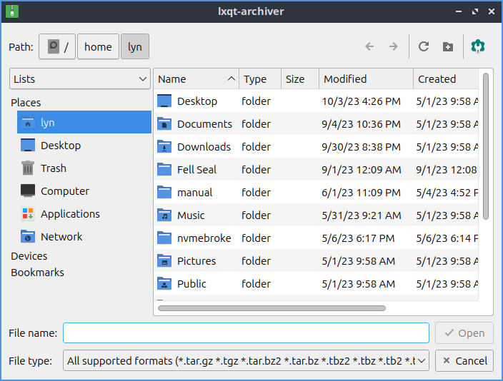
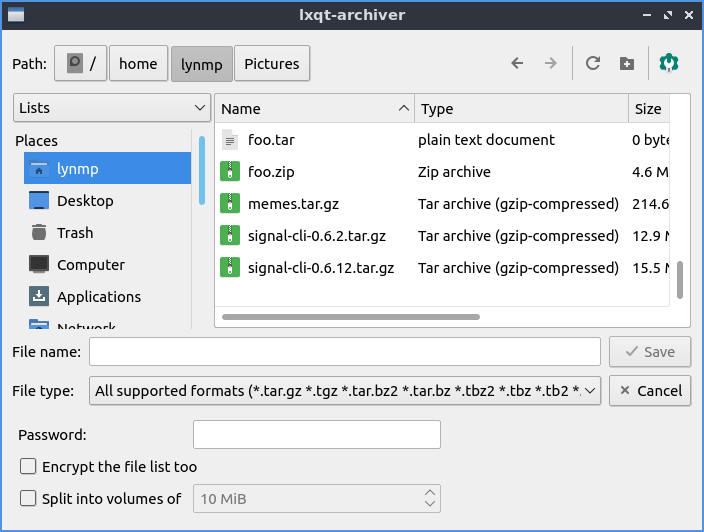
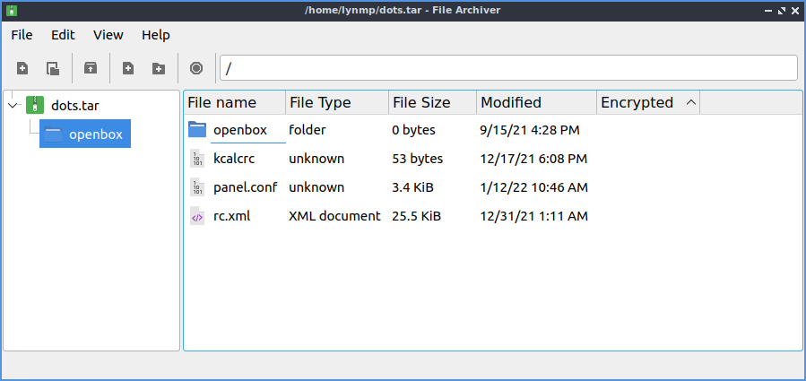

Chapter 2.4.1 LXQt File Archiver
================================

LXQt File Archiver is the default program for dealing with archives like tar or zip files in Lubuntu.

Usage
-----
To open an archive file :menuselection:`File --> Open` or press :kbd:`Control+O`. Once you have an archive opened you should see many lists of files under :guilabel:`File name`. To open a file double click on that file to open it or right click :menuselection:`View Selected Items`. To switch to a different folder in an archive double click the on the folder under the :guilabel:`File name`. To extract all of the file to copy them into a folder on your filesystem :menuselection:`File --> Extract` or press the :guilabel:`Extract` button which looks like a box with a with an upward pointing arrow. Then a dialog will open to show you where to save the extracted files navigate to thee desired path and press :guilabel:`Open`. To extract just one file right click on the file and select :menuselection:`Extract`. To Delete an unwanted file from an archive right click on it and select :menuselection:`Delete` or select it and press :kbd:`Delete`. To view properties of an archive press :kbd:`Alt+ Enter` or :menuselection:`File --> Properties`. To stop lxqt-archiver from doing something press :kbd:`Escape`, press the octagonal or stop sign shaped button, or :menuselection:`View --> Stop`.

To create a new archive press :menuselection:`File --> New` or press :kbd:`Control+N` and a dialog to create a file will be created. To choose what to name the file type the name in the :guilabel:`File name` field. To choose a password for your archive type in the :guilabel:`Password` field. Then to make the archive press :guilabel:`Save`. To add a file to the archive :menuselection:`Edit --> Add Files` or press the piece of paper button with a :guilabel:`+` on it. To select multiple files hold :kbd:`Control` and left click to select multiple files. To select which file to add navigate to it and press the :guilabel:`Open` button. To add an entire folder of files :menuselection:`Edit --> Add Folder` or press the :guilabel:`Folder button with +` and select the folder you want and then press :guilabel:`Open`. To add a password to an existing archive :menuselection:`Edit --> Password`. To show what password you currently have typed check the :guilabel:`Show password` checkbox. To also have the file list encrypted check the :guilabel:`Encrypt the file list too` checkbox. To split the archive into multiple different volumes check the :guilabel:`Split into volumes of` and select the size of volumes in the filed to the right.

To navigate to a folder inside of an archive double click on it in the center of the window or double click on the left side pane. To move back up in a directory double click on the folder :guilabel:`..`. To select all files press :kbd:`Control + A` or :menuselection:`Edit --> Select All`.

To reload the view of the archive press :kbd:`F5` or :menuselection:`View --> Reload`. To view the whole directory tree press :kbd:`Control+ Shift + E` or :menuselection:`View --> Expand`. To view just the top level of directory tree press :kbd:`Control + Shift + C` or :menuselection:`View --> Collapse`. To search for files press :kbd:`Control +F` or :menuselection:`View --> Filter`. Type what you want to search for in the textbox at the bottom. To hide searching press :kbd:`Control+F` or :menuselection:`View --> Filter` again.

To toggle showing the toolbar in LXQt File Archiver :menuselection:`View --> Toolbar`. To Toggle showing the Statusbar at the bottom :menuselection:`View --> Statusbar`. To toggle showing the directory tree on the left :menuselection:`View --> Directory Tree`. To change how big icons and text are select the size :menuselection:`View --> Icon Size`.

To close LXQt File Archiver press :kbd:`Control+Q`.

Version
-------
Lubuntu ships with version 0.9.1 of LXQt File Archiver.

How To Launch
-------------
To launch LXQt File Archiver :menuselection:`Accessories --> LXQt File Archiver` or run 

  .. code::
  
    lxqt-archiver

from the command line.
