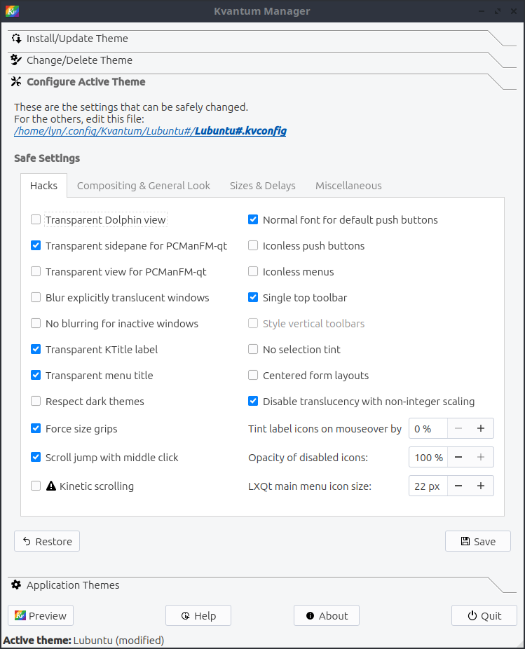

Chapter 2.4.10 Kvantum Manager
===============================

Kvantum Manager customizes your Qt style.

Usage
-----
The :guilabel:`Install/ Update Theme` lets you install an external theme and use it. To select a folder for this theme press the :guilabel:`Select a Kvantum theme folder` or type the path in the bar next to this. To install the theme press the :guilabel:`Install this theme` button. 

To preview the way the current theme looks press :guilabel:`Preview` button. After this a window will let you interact with all the different elements in your theme in several tabs to see how different window elements will look. To view interactive help about something press the :guilabel:`Help`. To Quit Kvantum manager press the :guilabel:`Quit` button.

To change your theme use the :guilabel:`Change/Delete Theme` tab. To select a theme you can search for one by name typing next to :guilabel:`Select a theme` or press the drop down button to select this theme. Then to apply it press the :guilabel:`Use this theme` button. To delete a theme press the :guilabel:`Delete this theme` button.

To change settings for your current theme use the :guilabel:`Configure Active Theme` tab. To change small things about your theme use the :guilabel:`Hacks` subtab. To have Dolphin be transparent add :guilabel:`Transparent Dolphin view` checkbox. To have the side pane of pcmanfm-qt be transparent use the :guilabel:`Transparent sidepane for PCManFm-Qt` checkbox. To have PCManFM-qt be transparent check the :guilabel:`Transparent view for PCManFM-Qt` checkbox. To blur transparent windows check the :guilabel:`Blur explicitly translucent windows` checkbox. To not blur inactive windows check the :guilabel:`No blurring for inactive windows` checkbox. To have Kvantum make dark themes for applications that don't want to use a dark theme check the :guilabel:`Respect dark themes` checkbox. To make grabbing grips as big as possible check the :guilabel:`Force size grips` checkbox. To jump your scolling with a middle click check the :guilabel:`Scroll jump with middle click` checkbox. 

To use a normal weight font for push buttons check the :guilabel:`Normal font for default push buttons` checkbox. To not use icon on push buttons check the :guilabel:`Iconless push buttons` checkbox. To not use icon for menus check the :guilabel:`Iconless menus` checkbox. To style only the top toolbar check the :guilabel:`Single top toolbar checkbox`. To not tint icons when you select them check the :guilabel:`No selection tint` checkbox. To center text in form check the :guilabel:`Centered form layouts` checkbox. To avoid bugs with scaling a non integer amount and transparency check the :guilabel:`Disable translucency with non-integer scaling` checkbox. To change how much to tint icons when you mouseover them change the :guilabel:`Tint label icons on mouseover by` field. To change how opaque to make disabled icons change the :guilabel:`Opacity of disabled icons` field. To change the size of the LXQt main menu icon size use the :guilabel:`LXQt main menu icon size` field.

To change composting settings use the :guilabel:`Composting & General Look` tab. To disable compositing use the :guilabel:`Disable composite effects` checkbox. To blur menus and tooltips use the :guilabel:`Blurring for menus and tooltips` checkboxes. To choose the radius of blurring on menus use the :guilabel:`Menu` field. To choose how much to blur tooltips use the :guilabel:`Tooltip` field. To have menus without shadows and use the :guilabel:`Shadowless menus and tooltips` checkbox. To choose to have windows be translucent use the :guilabel:`Translucent windows` checkbox. To choose to have certain windows opaque list them separated with commas in :guilabel:`Opaque apps` field. To choose how much to reduce windows by use :guilabel:`Reduce window opacity by` field. To choose how transparent to make menus use the :guilabel:`Reduce menu opacity by` field. To choose to blur translucent windows use the :guilabel:`Blurring for translucent windows` checkbox. To have a fading animation if the state of something changes on mouseover check the :guilabel:`Animation for state change under mouse` checkbox. To have inactive windows appear the same as your active windows check the :guilabel:`Ignore inactive state` checkbox. To always show scorllbars uncheck the :guilabel:`Transient scrollbars` checkbox. To change which contrast in ui elements use the :guilabel:`Contrast` field. To change how much color intesntiy on each ui change the :guilabel:`Intensity` field. To change how saturated colors on ui are change the :guilabel:`Saturation` field.

To choose the sizes for various part of user interfaces and how long for things to delay use the :guilabel:`Size & Delays` subtab. To change the size of small icons use :guilabel:`Small icon` field. To change the size of large icons use the :guilabel:`Large icon` field. to change the size of button icons use the :guilabel:`Button icon` field. To change the size of toolbar icons use the :guilabel:`Toolbar icon` field. To change how much spacing on the layout use the :guilabel:`Layout spacing` field. To changes the margins of layout use the :guilabel:`Layout margin` field. To choose how much to have a submenu overlap with the parent menu use the :guilabel:`Submenu overlap` field. To choose how big to make a spin button change the :guilabel:`Spin button width` field. To choose the minimum length of a scrollbar change the :guilabel:`Minimum scrollbar length` field. To choose how long to delay adding a tooltip change the :guilabel:`Tooltip delay` field. To choose how long to delay showing a submenu use the :guilabel:`Submenu delay` field. 

The:guilabel:`Miscellaneous` tab has other settings for how applications appear.  To have + and - buttons be drawn inline check the :guilabel:`Inline spin indiactors` checkbox. To have + and - buttons be shown vertically check the :guilabel:`Vertical spin indicators`. To have your combo boxes be editiable inline check the :guilabel:`Editable combo as line edit` checkbox. To have combo popups be showns as menus check the :guilabel:`Combo popup as menu` checkbox. To have combo boxes be a list of radio buttons uncheck :guilabel:`non-checkable combo menu` checkbox. To choose to have tabs aligned to the left by default check the :guilabel:`Left aligned tabs` checkbox. To have inactive tabs have no borders check the :guilabel:`Join inactive tabs` checkbox. To hide arrows on scrollbars check the :guilabel:`No arrows for scrollbars` checkbox. To draw scrollbars inside frames check the :guilabel:`Scrollbars inside frames` checkbox. To hide a rectangle showing where you are currently focusing with the mouse check the :guilabel:`Remove focus rectangles` checkbox. To have large menus be scrollable check the :guilabel:`scrollabel menus` checkbox.

 
To save your changes to your theme press the :guilabel:`Save` button. To change back to how your application themes were before press the :guilabel:`Restore` button.

To choose to launch a particular application in a certain theme use the :guilabel:`Application Themes` tab. To choose which theme to launch a particular application in select the theme under :guilabel:`Installed Theme`. Then list which applications you want the theme to be in in the :guilabel:`Application(s)` field. To clear what applications you have in a list press the :guilabel:`Remove List` button. To save your current list of applications to be launched with a theme press the :guilabel:`Save` button.

Version
-------
Lubuntu ships with version 1.1.2 of Kvantum Manager.

How to Launch
--------------

To launch Kvantum Manager from the menu :menuselection:`Accessories --> Kvantum Manager` or :menuselection:`Preferences --> LXQt Settings --> Kvantum Manager`.
