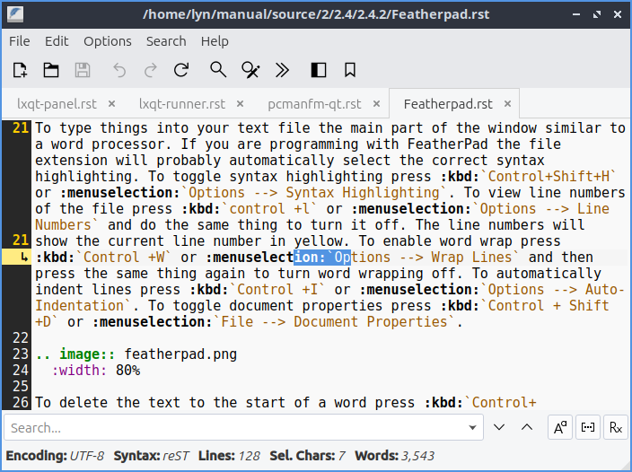

Chapter 2.4.2 Featherpad
========================

Featherpad is a lightweight text editor.

It supports:
 - tabs
 - syntax highlighting
 - autoindent
 - autobracket
 - line numbers
 - search with find/replace
 - undo and redo

Useage
------
If you wish to open a text file press the button that looks like a black and white folder or press :kbd:`control + o` to open a file. To view your recently modified files :menuselection:`File --> Recently modified`.  To open a new file press the button that looks like a piece of paper with a plus sign. To save your file after typing in the main part of the window press the button that looks like a floppy disk or press controlTo save your file after typing in the main part of the window press the button that looks like a floppy disk or press :kbd:`control +s`. To reload a file if something else has changed that file in featherpad press the arrow that loops back on itself to reload the page. 

To type things into your text file the main part of the window similar to a word porcessor. If you are programming with featherpad the file extension will probably automatically select the correct syntax highlighting. To view line numbers of the file press :kbd:`control +l` or :menuselection:`options --> line numbers`. To enable word wrap press :kbd:`Control +W` or :menuselection:`options --> wrap lines`. 

To open a new tab and empty text file press the button with a piece of paper with a plus symbol on it, or press :kbd:`Control + N`. If you wish to close a tab press the red x button. To switch between tabs click on the tab is not the close button. To switch to the next tab press :kbd:`Alt + Right arrow` or :menuselection:`File --> Next tab`. To switch to the previous tab press :kbd:`Alt + Left arrow` or :menuselection:`File --> Previous Tab`.  

If you make a mistake and want to undo it press :kbd:`control + z` or press the button that looks like a curved arrow pointing towards the left. To redo a change you have undone press the button with a curved arrow pointing towards the right. 

To search your text file press :kbd:`Control + f` or :menuselection:`search --> find` from the menu. Then in the bar on the bottom search for the text you want. Press the down arrow to move to the next result and the up arrow to move for the previous result in the text file. To jump to a particular line in a file press :kbd:`control +j` or search jump to or the button that looks like >>. Then in the bar at the bottom type in what line you want to jump to. To find and replace text press :kbd:`control +r` or :menuselection:`search --> Replace`. Type the text you want to Find in the find field and type what you want to put in with the Replace with field and then press enter to finish the finding and replacing through the whole file. 

To change what font you want select :menuselection:`option --> font` to change your font sizes. To change each font on the on the font level. To change the size type the size you or select it from the drop down menu. To select a font size simply use a font style of italic or oblique. To view a sample of your font :guilabel:`Sample` and will preview your text. 

To print a text :menuselection:`file --> Print` or press :kbd:`control + p`.  

Screenshot
----------

Version
-------
Lubuntu ships with version 0.9.0 of featherpad. 

How to Launch
-------------
In the menu go to :menuselection:`Acessories --> featherpad` or run 
.. code::

   featherpad

from the command line. The icon for Featherpad looks like a pad of paper with a feather on it.  
