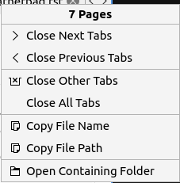
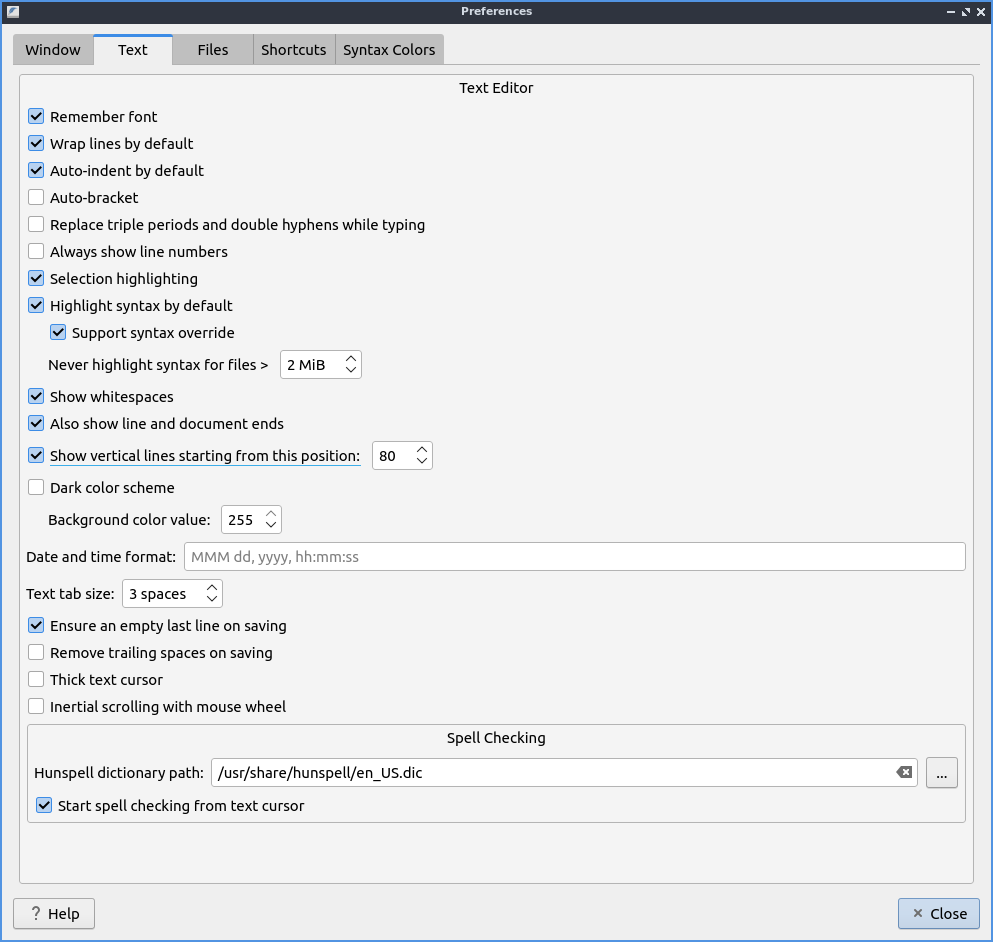
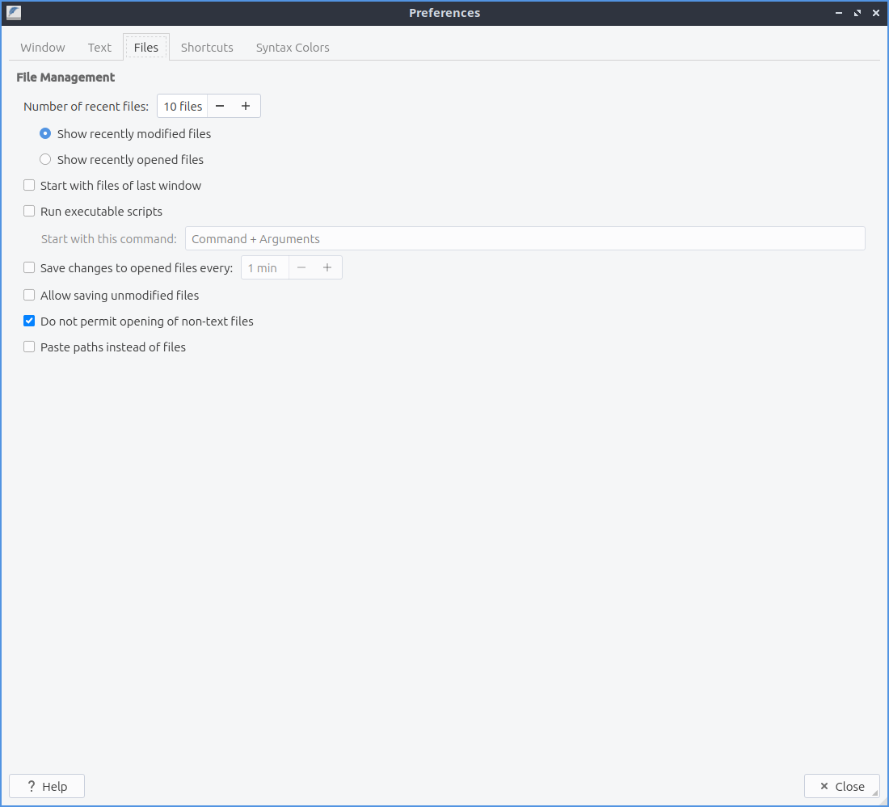
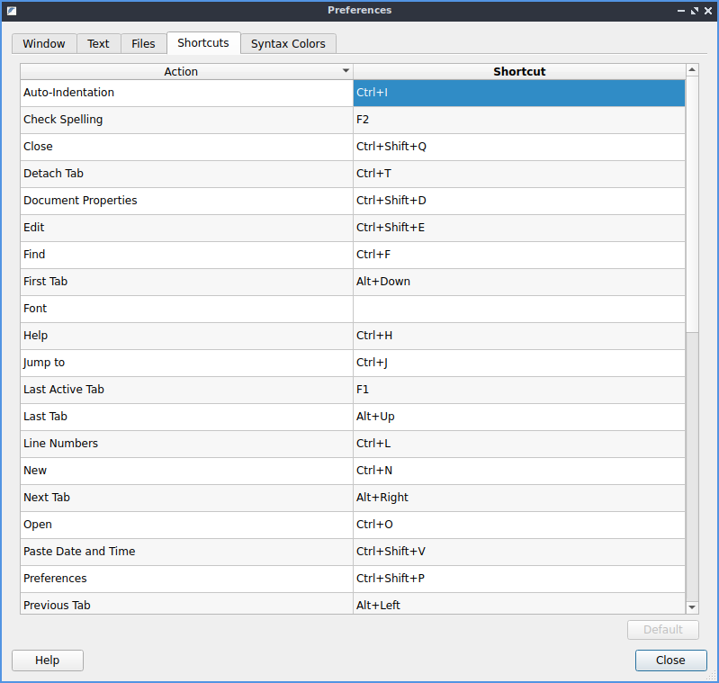

Chapter 2.4.2 Featherpad
========================

Featherpad is a lightweight text editor.

It supports:
 - tabs
 - syntax highlighting
 - autoindent
 - autobracket
 - line numbers
 - search with find/replace
 - undo and redo

Usage
------
If you wish to open a text file press the button that looks like a black and white folder, :menuselection:`File --> Open`, or press :kbd:`control + o` to open a file. To view your recently modified files :menuselection:`File --> Recently modified`.  To open a new file press the button that looks like a piece of paper with a plus sign. To save your file after typing in the main part of the window press the button that looks like a floppy disk, :menuselection:`File --> Save`, or press :kbd:`control +s`. To save a file with a different file name press :kbd:`Control+Shift+S` or :menuselection:`File --> Save As`. To show your  To reload a file if something else has changed that file in featherpad press the arrow that loops back on itself to reload the page, :kbd:`Control +Shift + R`, or :menuselection:`File --> Reload`. If you have unsaved changes to a file an * will show in the tab bar if you have unsaved changes. 

To type things into your text file the main part of the window similar to a word processor. If you are programming with featherpad the file extension will probably automatically select the correct syntax highlighting. To view line numbers of the file press :kbd:`control +l` or :menuselection:`Options --> Line Numbers` and press the same thing to turn it off. The line numbers will show the current line highlighted in yellow on the current line. To enable word wrap press :kbd:`Control +W` or :menuselection:`Options --> Wrap Lines` and then press the same thing again to turn word wrapping off. To automatically indent lines press :kbd:`Control +I` or :menuselection:`Options --> Auto-Indentation`. To toggle document properties press :kbd:`Control + Shift +D` or :menuselection:`File --> Document Properties`. 

To open a new tab and empty text file press the button with a piece of paper with a plus symbol on it, or press :kbd:`Control + N`. If you wish to close a tab press the red x button. To switch between tabs click on the tab is not the close button. To switch to the next tab press :kbd:`Alt + Right arrow` or :menuselection:`File --> Next Tab`. Another way to open a new document in a new tab double click to the right of all open tabs. To switch to the previous tab press :kbd:`Alt + Left arrow` or :menuselection:`File --> Previous Tab`. To close a tab press the :guilabel:`X` button. To move a tab into a new window press :kbd:`Control + T` or :menuselection:`File --> Detach Tab`. To open a side pane that replaces the tab bar press :kbd:`Control +Alt +P` or :menuselection:`File --> Side-Pane`. If have so many tabs they don't all fit in the window press the right and left arrows on the tab bar to move the tab bar that way or use the mousewheel to move the visible tabs in the tab bar. To move to the last text file you had visited press :kbd:`F1` or :menuselection:`File --> Last Active Tab`. To change to your last tab press :kbd:`Alt+Up arrow` or :menuselection:`File --> Last Tab`. To change to your first tab press :kbd:`Alt+Down arrow` or :menuselection:`File --> First Tab`.

.. image:: featherpad-sidebar.png

If you have multiple copies of the same file open in Featherpad it will be open read only and shown in yellow. If you want to edit the file even though you have it open you will need to press :kbd:`Control+Shift+E`, :menuselection:`Edit --> Edit`, or press the button that looks like a pencil to actually edit the file. You should be careful as the file may not have the contents you expect when editing it in two tabs.

If you want to close all tabs to the left right click on the tab bar :menuselection:`Close Previous Tabs`. To close all tabs to the right right click on the tab bar :menuselection:`Close Next Tabs`. To only leave open the tab you right clicked on right click and select :menuselection:`Close other tabs`. To copy the path to the file you have open right click on the tab bar and select :menuselection:`Copy File Path`. To copy the file name right click on the tab bar and select :menuselection:`Copy File Name`.

If you make a mistake and want to undo it press :kbd:`control + z`, :menuselection:`Edit --> Undo`, or press the button that looks like a curved arrow pointing towards the left. To redo a change you have undone press the button with a curved arrow pointing towards the right, :menuselection:`Edit --> Redo`, or press :kbd:`Control +Shift +Z`. 

To select all text in the text file press :kbd:`Control +A`, right click :menuselection:`Select All`,  or :menuselection:`Edit --> Select All`. To copy text from featherpad press :kbd:`Control +C` or :menuselection:`Edit --> Copy`. To paste text press :kbd:`Control+ V` or :menuselection:`Edit --> Paste`. To Cut text press :kbd:`Control+X` or :menuselection:`Edit --> Cut`. If you have text selected you can delete it by pressing :kbd:`Delete` or :menuselection:`Edit --> Delete`.  To paste  in the date and time press :kbd:`Control + Shift +V` or :menuselection:`Edit --> Paste Date and Time`. To go to the end of the current line in the editor press the :kbd:`End` key. To move to the start of the current line press the :kbd:`Home` key.

To search your text file press :kbd:`Control + f` or :menuselection:`Search --> Find` from the menu. Then in the bar on the bottom search for the text you want. Press the down arrow to move to the next result and the up arrow to move for the previous result in the text file. To jump to a particular line in a file press :kbd:`control +j` or :menuselection:`Search --> Jump to` or the button that looks like >>. Then in the bar at the bottom type in what line you want to jump to. To find and replace text press :kbd:`control +r` or :menuselection:`Search --> Replace`. Type the text you want to Find in the find field and type what you want to put in with the Replace with field and then press enter to finish the finding and replacing through the whole file. 

.. image:: featherpad-find-replace.png 

To change what font you want select :menuselection:`Options --> Font` to change your font sizes. To change each font on the on the font level. To change the size type the size you or select it from the :guilabel:`Size` drop down menu. To select a font style simply use the :guilabel:`Font style` menu of italic or oblique. To add an underlined font check the :guilabel:`Underline` checkbox. To view a sample of your font :guilabel:`Sample` and will preview your text. The input a number of spaces equal to a tab press :kbd:`Control +Tab`. To see what the font looks like look  in the box under :guilabel:`Sample`.

.. image:: featherpad-font.png

To save a file with a different encoding use the :menuselection:`Options --> Encoding` submenu. To save with the current encoding :menuselection:`File --> Save with Encoding`.

To make the text all lowercase first select it with the mouse press then :kbd:`Control + Shift +L` or :menuselection:`Edit --> To Lowercase`. To make the text all uppercase select it first then  press :kbd:`Control + Shift +U` or :menuselection:`Edit --> To Uppercase`. To alphabetize your lines first select it then :menuselection:`Edit --> Sort Lines`. To sort the opposite way first select the lines then :menuselection:`Edit --> Sort Lines Reversely`. 

To print a text :menuselection:`File --> Print` or press :kbd:`control + p`. To change which printer you use have use the :guilabel:`Name` field. To get more options for printing press the :guilabel:`Options` button. To change how many copies to print change the number in the :guilabel:`Copies` field. To print on a certain range of pages use the :guilabel:`Pages From` field to choose a range of pages.

.. image:: featherpad.png
  :width: 80% 

Customizing
------------
To view the preferences for featherpad press :kbd:`control +Shift +P` or :menuselection:`Options --> Preferences`. To change settings on the featherpad window itself are on the :guilabel:`Window` tab. To have featherpad be the same size as when you last closed it check the :guilabel:`Remember window size on Closing` checkbox. To start with the side-pane on Featherpad check the :guilabel:`Start with side-pane mode`. To toggle Featherpad using its own icons rather than your icon theme check/uncheck the :guilabel:`Use own icons` checkbox.  To hide the toolbar you can press the :guilabel:`do not show toolbar` checkbox. To not show the menubar by default check the :guilabel:`Do not show menubar` checkbox. The :guilabel:`Tab position` moves where the tab around on the screen. To hide the tabbar with only one tab check the :guilabel:`Do not show a single tab` checkbox. To have the searchbar hidden by default check the :guilabel:`Hide search bar by default` checkbox. To have the window close after closing the last tab check the :guilabel:`Close window on closing its last tab`. To have featherpad open a new window when you are on a different virtual desktop check the :guilabel:`Always open in seperate windows` checkbox. The checkbox :guilabel:`Native file dialog` uses the systems file dialog to integrate with the system.

.. image:: featherpadprefrences.png

To change preferences on how text is displayed choose the :guilabel:`Text` Tab. To have featherpad remember what font you want press the :guilabel:`Remember Font` checkbox. If you do not want featherpad to highlight syntax by default uncheck the :guilabel:`Highlight syntax by default` checkbox. If you want to change the be able to change the syntax highlight check the checkbox for :guilabel:`Support Syntax override`. The checkbox for :guilabel:`Always show line numbers` always shows line numbers. To have a dark color scheme for featherpad check the :guilabel:`Dark Color Scheme` checkbox. To change exactly how dark the value of this color is change the :guilabel:`Background color value` field. After changing the dark theme settings you will need to restart featherpad. The field for :guilabel:`Text tab size` is how wide to make the tab character. The checkbox for :guilabel:`Ensure an empty last line on saving` leaves a blank line whenever you save your document. The checkbox for :guilabel:`Remove trailing spaces on Saving` removes whitespace at the end of lines that is not needed. The checkbox for :guilabel:`Thick text Cursor` makes the text cursor wider so it much easier to see. To have your scrolling have inertia to keep scrolling the faster you scroll check the :guilabel:`Inertial scrolling with mouse wheel` checkbox. 

To modify changes to your files from the preferences dialog on :guilabel:`Files` tab. The :guilabel:`Number of recent files` field lets you change how many files show in recent files. The set of radio buttons for either :guilabel:`Show recently modified files` or :guilabel:`Show recently opened files` for recent files in the menu. .  If you want to repopen the files you had last time the next time you open Featherpad check the :guilabel:`Start with files of last window`. If you want Featherpad to run executable scripts check the :guilabel:`Run executable scripts` checkbox. If you want your executable commands to start with something such as an interpreter type the command in the :guilabel:`Start with this command` field. If you want to autosave files check the :guilabel:`Save changes to files every` checkbox and then enter how often you want your files to be automatically saved. If you do not want to be able to open non text files in featherpad check the :guilabel:`Do not permit opening of non-text files` checkbox.

To view all keyboard shortcuts of Featherpad switch to the :guilabel:`Shortcuts` tab. The :guilabel:`Action` column is what the shortcut does and the :guilabel:`Shortcut` column is the keyboard shortcut to change that shortcut. To change a shortcut double click on the shortcut column and press what you want the shortcut to become. If you changed a setting on a shortcut you can change it back to the default by pressing the :guilabel:`Default` button.  

Version
-------
Lubuntu ships with version 0.9.3 of Featherpad. 

How to Launch
-------------
In the menu go to :menuselection:`Acessories --> Featherpad` or run 

.. code::

   featherpad

from the command line. The icon for Featherpad looks like a pad of paper with a feather on it.  
