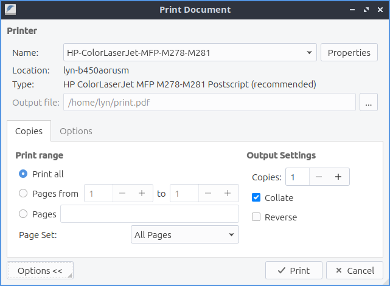
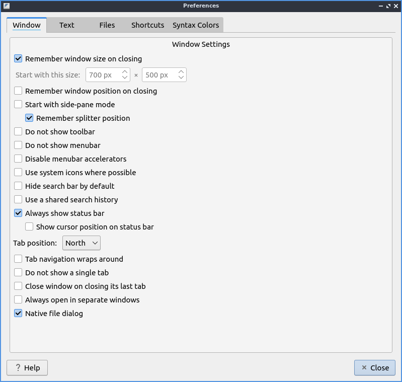

Chapter 2.4.2 Featherpad
========================

Featherpad is Lubuntu's default lightweight text editor.

It supports:
 - Tabs
 - Syntax highlighting
 - Autoindent
 - Autobracket
 - Line numbers
 - Search with find/replace
 - Undo and redo
 - Spellcheck

Usage
------

To open a new file press the button that looks like a piece of paper with a plus sign, press :kbd:`Control+N`, or :menuselection:`File --> New`. If you wish to open a text file press the button that looks like a folder, :menuselection:`File --> Open`, or press :kbd:`control + o`. To open your recently modified files :menuselection:`File --> Recently modified`.  To save your file after typing in the main part of the window press the button that looks like a floppy disk, :menuselection:`File --> Save`, or press :kbd:`control +s`. To save a file with a different file name press :kbd:`Control+Shift+S` or :menuselection:`File --> Save As`. To show your  To reload a file if something else has changed that file in Featherpad press the arrow that loops back on itself to reload the page, :kbd:`Control +Shift + R`, the button that looks like a browser refresh button, or :menuselection:`File --> Reload`. If you have unsaved changes to a file an :guilabel:`*` will show in the tab bar if you have unsaved changes. 

To type things into your text file the main part of the window similar to a word processor. If you are programming with Featherpad the file extension will probably automatically select the correct syntax highlighting. To toggle syntax highlighting press :kbd:`Control+Shift+H` or :menuselection:`Options --> Syntax Highlighting`. To view line numbers of the file press :kbd:`control +l` or :menuselection:`Options --> Line Numbers` and do the same thing to turn it off. The line numbers will show the current line number in yellow. To enable word wrap press :kbd:`Control +W` or :menuselection:`Options --> Wrap Lines` and then press the same thing again to turn word wrapping off. To automatically indent lines press :kbd:`Control +I` or :menuselection:`Options --> Auto-Indentation`. To toggle document properties press :kbd:`Control + Shift +D` or :menuselection:`File --> Document Properties`.

.. image:: featherpad.png
  :width: 80% 

To delete the text to the start of a word press :kbd:`Control+ Backspace`. To delete to the end of a word press :kbd:`Control + Delete`. To delete to the end of the line press :kbd:`Control+ K`. To move a line up press :kbd:`Control+ Shift + Up`. To move a line down press :kbd:`Control Shift + Down`. To select one word double click the left mouse button. To select a whole line tripple click the left mouse button.

To open a new tab and empty text file press the button with a piece of paper with a plus symbol on it, or press :kbd:`Control + N`. If you wish to close a tab press the red x button. To switch between tabs click on the tab is not the close button. To switch to the next tab press :kbd:`Alt + Right arrow` or :menuselection:`File --> Next Tab`. Another way to open a new document in a new tab double click to the right of all open tabs. To switch to the previous tab press :kbd:`Alt + Left arrow` or :menuselection:`File --> Previous Tab`. To close a tab press the :guilabel:`X` button. To move a tab into a new window press :kbd:`Control + T` or :menuselection:`File --> Detach Tab`. To open a side pane that replaces the tab bar press :kbd:`Control +Alt +P` or :menuselection:`File --> Side-Pane`. If have so many tabs they don't all fit in the window press the right and left arrows on the tab bar to move the tab bar that way or use the mousewheel to move the visible tabs in the tab bar. To move to the last text file you had visited press :kbd:`F1` or :menuselection:`File --> Last Active Tab`. To change to your last tab press :kbd:`Alt+ Up arrow` or :menuselection:`File --> Last Tab`. To change to your first tab press :kbd:`Alt+ Down arrow` or :menuselection:`File --> First Tab`.

If you have multiple copies of the same file open in Featherpad it will be open read only and shown in yellow. If you want to edit the file even though you have it open you will need to press :kbd:`Control+Shift+E`, :menuselection:`Edit --> Edit`, or press the button that looks like a pencil to actually edit the file. You should be careful as the file may not have the contents you expect when editing it in two tabs or editors.

To make text in Featherpad bigger press :kbd:`Control+ +` or hold :kbd:`Control` and move the mousewheel up. To make text in Featherpad smaller press :kbd:`Control+ -` or hold :kbd:`Control` and move the mousewheel down. To reset the zoom press :kbd:`Control+ 0`.

If you want to close all tabs to the left right click on the tab bar :menuselection:`Close Previous Tabs`. To close all tabs to the right right click on the tab bar :menuselection:`Close Next Tabs`. To only leave open the tab you right clicked on right click and select :menuselection:`Close Other Tabs`. To copy the file name right click on the tab bar and select :menuselection:`Copy File Name`. To copy the path to the file you have open right click on the tab bar and select :menuselection:`Copy File Path`. To reorder your tabs left click and drag the tab to where you want it. To open the folder the file is in a fire manager right click and select :menuselection:`Open Containing Folder`.

.. image:: featherpad-tab-context.png

If you make a mistake and want to undo it press :kbd:`control + z`, right click :menuselection:`Undo`, :menuselection:`Edit --> Undo`, or press the button that looks like a curved arrow pointing towards the left. To redo a change you have undone press the button with a curved arrow pointing towards the right, right click :menuselection:`Redo`, :menuselection:`Edit --> Redo`, or press :kbd:`Control +Shift +Z`. To input a number of spaces equal to a tab press :kbd:`Control +Tab`.

To select all text in the text file press :kbd:`Control +A`, right click :menuselection:`Select All`,  or :menuselection:`Edit --> Select All`. To copy text from Featherpad press :kbd:`Control +C`, right click :menuselection:`Copy`, or :menuselection:`Edit --> Copy`. To paste text press :kbd:`Control+ V`, right click :menuselection:`Paste` or :menuselection:`Edit --> Paste`. To Cut text press :kbd:`Control+X`, right click :menuselection:`Cut`, or :menuselection:`Edit --> Cut`. If you have text selected you can delete it by pressing :kbd:`Delete` or :menuselection:`Edit --> Delete`. To paste in the date and time press :kbd:`Control + Shift +V` or :menuselection:`Edit --> Paste Date and Time`. To go to the end of the current line in the editor press the :kbd:`End` key. To move to the start of the current line press the :kbd:`Home` key. To convert tabs to spaces :menuselection:`Edit --> Tabs to spaces` or right click and select :menuselection:`Tabs to spaces`.

To search your text file press :kbd:`Control + f`, the magnifying glass button, or :menuselection:`Search --> Find` from the menu. Then in the bar on the bottom search for the text you want. Press the down arrow to move to the next result and the up arrow to move for the previous result in the text file. To not make the search case sensitive press the :guilabel:`Aa` button or press :kbd:`F5`. To only match whole words press the :guilabel:`...` button or press :kbd:`F6`. To use a regular express press the :guilabel:`Rx` button or press :kbd:`F7`. To make the search not case sensitive, whole word, or use a regular expression press the same button to turn that off. 

.. image:: featherpad-find.png

To jump to a particular line in a file press :kbd:`control +j` or :menuselection:`Search --> Jump to` or the button that looks like :guilabel:`>>`. To select the text you jump to press the :guilabel:`Select Text` button. To jump to  a particular line type the line number in the :guilabel:`Go to line` field.

.. image:: featherpad-jump.png

To find and replace text press :kbd:`control +r`, the button with a magnifying glass and a pencil, or :menuselection:`Search --> Replace`. Type the text you want to Find in the find field and type what you want to put in with the Replace with field and then press enter to finish the finding and replacing through the whole file. 

.. image:: featherpad-find-replace.png 

To change what font you want select :menuselection:`Options --> Font` to change your font sizes. To choose a font that is not fixed width uncheck the :guilabel:`Programming Fonts` checkbox. To change the font use the :guilabel:`Font` field. To change font size change the :guilabel:`Size` field. To change the font weight use the :guilabel:`Weight` drop down menu. To make the font italic check the :guilabel:`Italic` checkbox. To view a sample of your font :guilabel:`Preview` and will preview your text. 

To save a file with a different encoding use the :menuselection:`Options --> Encoding` submenu. To save with the current encoding :menuselection:`File --> Save with Encoding`.

At the bottom of the window of featherpad the :guilabel:`Encoding` shows what encoding your file will be saved with. If featherpad is highlighting a syntax you can see what it is with :guilabel:`Syntax`.

To make the text all lowercase first select it with the mouse press then :kbd:`Control + Shift +L`, :menuselection:`To Lower Case`, or :menuselection:`Edit --> To Lowercase`. To make the text all uppercase select it first then  press :kbd:`Control + Shift +U`, right click :menuselection:`To Uppercase`, or :menuselection:`Edit --> To Uppercase`. To capitlize the first letter of each word select the text and :menuselection:`Edit --> To Start Case` or right click :menuselection:` To Start Case`. To alphabetize your lines first select it then :menuselection:`Edit --> Sort Lines`. To sort the opposite way first select the lines then :menuselection:`Edit --> Sort Lines Reversely`. 

To print a text :menuselection:`File --> Print` or press :kbd:`control + p`. To change which printer you use have use the :guilabel:`Name` field. To get more options for printing press the :guilabel:`Options` button. To change how many copies to print change the number in the :guilabel:`Copies` field. To print on a certain range of pages use the :guilabel:`Pages From` field to choose a range of pages. To get to even more printer options press the :guilabel:`Properties` button. To collate the printed pages check the :guilabel:`Collate` checkbox. To reverse the order pages are printed check the :guilabel:`Reverse` checkbox.

To run an executable script press :kbd:`Control+E`. To stop running the executable you ran press press :kbd:`Control + Alt +E`. To quit Featherpad press :kbd:`Control+Q`.

Spellcheck
----------

To open a spell check window press :kbd:`F2` or :menuselection:`Edit --> Check Spelling`. If the spell check does not find a what you typed that spellcheck does not recognize will be shown from :guilabel:`Unknown word` followed by what is typed. If this is correct press the :guilabel:`Add To Dictionary` button to never have to deal with spellcheck marking this wrong again. To see what is wanted as a replacement for a typo see :guilabel:`Replace with` for the first suggestion and beneath this is a list of things to replace with. To choose a different suggestion left click on the suggestion to switch to it. To correct this typo just once press the :guilabel:`Correct Once` button. To correct this spell check every single time in your file press the :guilabel:`Correct All` button. To not change what you have typed in just this case press the :guilabel:`Ignore Once` button. To ignore what you have typed press in the entire file press the  :guilabel:`Ignore All` button. If you do not have a spelling error on the bottom will appear a red bar saying :guilabel:`No misspelling from text cursor`.

To view what words you have added to your dictionary :menuselection:`Edit --> User Dictionary`.

Saving Sessions
---------------
To open all the files if you work on several together in a session press :kbd:`Control+M` or :menuselection:`File --> Save/Restore Session` and a dialog will appear. To save your first session type a name to remember this and then press the :guilabel:`Save` button. To open your saved session click the name of the session on the top of the dialog and then press :guilabel:`Open`.  To remove a saved session  press the :guilabel:`Remove` button. To remove all saved session press the :guilabel:`Remove All` button. To search for a particular session type in the :guilabel:`Filter` section. To include saving tabs from other windows in your session uncheck the :guilabel:`Save only in this window` checkbox.

Customizing
------------
To view the preferences for Featherpad press :kbd:`control +Shift +P` or :menuselection:`Options --> Preferences`. To change settings on how  Featherpad handles the window use the :guilabel:`Window` tab. To have Featherpad be the same size as when you last closed it check the :guilabel:`Remember window size on Closing` checkbox. If you choose for Featherpad not to remember size you can change :guilabel:`Start with this size` field for height and width to start Featherpad. To have Featherpad appear on the same position it was when Featherpad was closed check the :guilabel:`Remember window position on closing` checkbox. To start with the side-pane on Featherpad check the :guilabel:`Start with side-pane mode`. To hide the toolbar you can press the :guilabel:`Do not show toolbar` checkbox. To not show the menubar by default check the :guilabel:`Do not show menubar` checkbox. To turn of keyboard shortcuts with the :kbd:`Alt` keys for navigating menus check the :guilabel:`Disable menubar accelarators` checkbox. To use your system icons when possible check the :guilabel:`Use system icons when possible` checkbox. To have the searchbar hidden by default check the :guilabel:`Hide search bar by default` checkbox. To have the same search history across all tabs use the :guilabel:`Use a shared search history` checkbox. To show where your cursor is on the statusbar at the bottom check the :guilabel:`Show cursor position on status bar`.

The :guilabel:`Tab position` menu moves where the tab around on the screen. To hide the tabbar with only one tab check the :guilabel:`Do not show a single tab` checkbox. To have the window close after closing the last tab check the :guilabel:`Close window on closing its last tab`. To have Featherpad open a new window when you are on a different virtual desktop check the :guilabel:`Always open in separate windows` checkbox. The checkbox :guilabel:`Native file dialog` uses the systems file dialog to integrate with the system.

To change preferences on how text is displayed choose the :guilabel:`Text` Tab. To have Featherpad remember what font you want press the :guilabel:`Remember Font` checkbox.To have your Featherpad wrap lines if your line is too long by default check the :guilabel:`Wrap lines by default` checkbox. To have Featherpad automatically indent new lines by default check the :guilabel:`Auto-indent by default` checkbox. To have Featherpad automatically insert closing brackets check the :guilabel:`Auto-bracket` checkbox. To have Featherpad replace triple periods and double hyphens with other characters representing the same thing check the :guilabel:`Replace triple periods and double hyphens while typing` checkbox. The checkbox for :guilabel:`Always show line numbers` always shows line numbers.

When you select text if you want it to be highlighted check the :guilabel:`Selection highlighting` checkbox. If you do not want Featherpad to highlight syntax by default uncheck the :guilabel:`Highlight syntax by default` checkbox. If you want to change the be able to change the syntax highlight check the checkbox for :guilabel:`Support Syntax override`. To have Featherpad not highlight overly large text files change the :guilabel:`Never highlight syntax for files >` field. To have Featherpad show a dot for whitespace check the :guilabel:`Show whitespaces` checkbox. To show  formatting marks when there is a line and paragraph ends check the :guilabel:`Also who line and document ends` checkbox. To show  To have a dark color scheme for Featherpad check the :guilabel:`Dark Color Scheme` checkbox. To change exactly how dark the value of this color is change the :guilabel:`Background color value` field. After changing the dark theme settings you will need to restart Featherpad. 
 
To change how Featherpad will show dates type how you want the date in the :guilabel:`Date and time format` field. The field for :guilabel:`Text tab size` is how wide to make the tab character. The checkbox for :guilabel:`Ensure an empty last line on saving` leaves a blank line whenever you save your document. The checkbox for :guilabel:`Remove trailing spaces on Saving` removes whitespace at the end of lines that is not needed. The checkbox for :guilabel:`Thick text Cursor` makes the text cursor wider so it much easier to see. To have your scrolling have inertia to keep scrolling the faster you scroll check the :guilabel:`Inertial scrolling with mouse wheel` checkbox. To change where Featherpad looks for a dictionary for spell checking change the :guilabel:`Hunspell dictionary path` field. To start spell checking from your current text cursor check the :guilabel:`Start spell checking from text cursor` checkbox.

.. image:: featherpad-text-pref.png

To modify changes to your files from the preferences dialog on :guilabel:`Files` tab. The :guilabel:`Number of recent files` field lets you change how many files show in recent files. The set of radio buttons for either :guilabel:`Show recently modified files` or :guilabel:`Show recently opened files` for recent files in the menu. To clear your list of recent files :menuselection:`File --> Recently Modified --> Clear`.  If you want to reopen the files you had last time the next time you open Featherpad check the :guilabel:`Start with files of last window`. To have Featherpad open with the files you had open last time check the :guilabel:`Start with files of last window`. If you want Featherpad to run executable scripts check the :guilabel:`Run executable scripts` checkbox. If you want your executable commands to start with something such as an interpreter type the command in the :guilabel:`Start with this command` field. If you want to autosave files check the :guilabel:`Save changes to files every` checkbox and then enter how often you want your files to be automatically saved. If you do not want to be able to open non text files in Featherpad check the :guilabel:`Do not permit opening of non-text files` checkbox. To paste the path of the copied files into Featherpad instead of the file themselves check the :guilabel:`Paste Paths instead of files` checkbox.

.. image:: featherpad-files-pref.png

To view all keyboard shortcuts of Featherpad switch to the :guilabel:`Shortcuts` tab. The :guilabel:`Action` column is what the shortcut does and the :guilabel:`Shortcut` column is the keyboard shortcut to change that shortcut. To change a shortcut double click on the shortcut column and press what you want the shortcut to become. If you changed a shortcut you can change it back to the default by pressing the :guilabel:`Default` button.

.. image:: featherpad-shortcuts.png

To change what colors you use in syntax highlighting use the :guilabel:`Syntax Colors` tab. To change the color of built in functions click the color to the right of :guilabel:`Built-in Functions` and a window to pick your color will show up. To change the color of comments in syntax press the button next to :guilabel:`Comments` and a color picker window will pop up. To change how documents HTML or XML elements appear change the press the button next to :guilabel:`Document Blocks, XML/HTML Elements` button to have a color selection window appear. To change how extra elements are colors press the button next to :guilabel:`Extra Elements`. To change the color of functions and URLs in highlighting press the button next to :guilabel:`Functions, URLs`. To change how keywords of a programming language appear press the button next to :guilabel:`Keywords`. To change the color of markdown headings and CSS values press the button next to :guilabel:`Markdown Headings, CSS Values`. To change how numbers are highlighted press the button next to :guilabel:`Numbers`. To change how quotations are highlighted press the button next to :guilabel:`Quotations`. To change how you highlight regular expressions and code blocks press the button next to :guilabel:`Code Blocks`. To change how datatypes are highlighted press the button next to :guilabel:`Types`. To change how dark the whitespace appears in highlighting change :guilabel:`Whitespace color value`. To change how dark the currently highlighted line is change :guilabel:`Current line highlight value`. To restore syntax highlighting to default values press the :guilabel:`Default` button.

Version 
-------
Lubuntu ships with version 1.3.3 of Featherpad. 

How to Launch
-------------
To launch Featherpad from the menu go to :menuselection:`Accessories --> Featherpad` or run 

.. code::

   featherpad

from the command line. The icon for Featherpad looks like a blue circle for with a pencil on it. 
