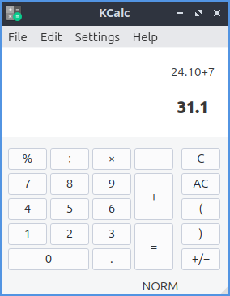
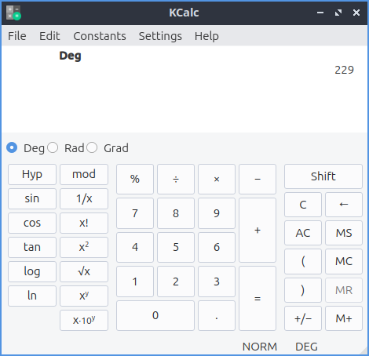

Chapter 2.4.3 Kcalc
===================

Kcalc is a scientific calculator application.

Features:

 - trignometric functions
 - factorials
 - built in mathematical and scientific constants.
 - memory
 - copy and paste

Useage
------
To do simple arithmetic click the numbers and then press the sign for addition, multiplication, subtraction,  or division. You can also type in the numbers and press :guilabel:`+` for addition, :guilabel:`-` for subtraction, :guilabel:`x` for multiplication and :guilabel:`/` for division. To view the answer press the button that is an :guilabel:`=`. 
 

To make a number negative press the button that looks like a :guilabel:`+/-`. To insert decimals press the decimal point button which looks like a :guilabel:`.` when you get to the part which is less than a whole number. To clear input from Kcalc Press the button with a :guilabel:`C` on it. To group operations so they happen together use the parenthesis to make things grouped to gether for example 2*(2+3) would give the result of 10 because it would add 2 and 3 and then multiply by two.

To copy and answer out of Kcalc press :kbd:`control + c` or :menuselection:`edit --> copy` from the menu. To paste a number into Kcalc you can press :kbd:`control + v` or :menuselection:`edit --> paste` from the menu. To cut the text from Kcalc press :kbd:`control +x` or :menuselection:`edit --> cut` from the menu.

To undo an operation press :kbd:`Control+Z` or :menuselection:`Edit --> Undo`. To redo an operation press :kbd:`Control+Shift+Z` or :menuselection:`Edit --> Redo`. 

Scientific calculator mode advanced fuctionality
------------------------------------------------

If you want even more functionality of Kcalc there is also scientific mode which is acessed from :menuselection:`settings --> scientific mode` radio button. The button :guilabel:`1/x` takes takes 1 and divides it by the number currently on the calculator also known as taking the reciprocal. :guilabel:`x!` read x factorial will take the number X you entered and multiple each number going down to 1 for example 5! would multiply 5*4*3*2*1. 

The x squared button will take a x*x and multiply it by itself. The button with x and a superscript y will take x the number you have in will exponeniate x to the power of y. The x 10 with a supercript y will end up multiplying x by 10 to the power of y so for example to multiply 5 by 10 to the power of 3 entering in will give the answer of 5,000. If you want your own custom constant buttons check the checkbox for :menuselection:`Settings --> Constants Button`.

To change the unit that angles are measured in for triginometric units in Kcalc. Degrees take 360 to form a full circle while, 2Π radians form a full circle and 400 gradians form a full circle. The radio button for Deg is to select Degrees as the unit for angles, Rad selects :guilabel:`radian` as the unit of measurment of angles and :guilabel:`Grad` selects Gradians as the unit of measurement for angles. The :guilabel:`Sin` button takes what you have as the input and takes the trigonometric sine function of that value measured in the unit for angles you have selected. The :guilabel:`cos` button takes the cosine of the vlaue in the unit of angle you have selected. The :guilabel:`tan` button takes the tangent of the angle in the current units.  

The Scientific mode also brings in a menu for many different predetermined comments under the :menuselection:`Constants`.
 
To store a value in memory press the :guilabel:`M+` Button. To retirve a value from memory press the :guilabel:`MR` button.

Numerical System mode
---------------------
The numerical system mode lets you change your numerical base instead of say the default base 10. To switch to a binary calculations click the :guilabel:`Bin` radio button. To switch the Octal or base 8 format click the :guilabel:`Oct` radio button. To switch to a hexadecimal format or base 16 format click the :guilabel:`Hexadecimal` radio button. For numbers greater than 10 for hexidecimal press the A-F buttons. When you are in number that are not part of a numerical base the button will get grayed out. To switch back to decimal or base 10 press the :guilabel:`Dec` radio button.   

Customizing
-----------
To open configruation for kcalc press :kbd:`Control+Shift+ +` or :menuselection:`Settings --> Configure Kcalc`. To change the maximum number of digits change the :guilabel:`Maximum number of digits` field. If you want to show the result in the window title check the :guilabel:`Show result in window title` checkbox.

The :guilabel:`Font` tab has settings to change settings with your fonts. To choose the font for your buttons on your calculator :guilabel:`Button font` and press the :guilabel:`Choose` button to the font for the buttons on your calculator. To change the font for the diplay of the calculator. :guilabel:`Display font` will change how the and the :guilabel:`Choose` button 

The :guilabel:`Colors` tab has the colors of your user interface. To change your foreground color will change how the display or the number in the interface is the color next to :guilabel:`Foreground` color area to select. To change the background color of your display choose a different color on :guilabel:`background` button. To change the background color of the function buttons press the button next to :guilabel:`Functions`. To a change the color of the function button press button next to :guilabel:`Statisical functions`. To change the background color for hexidecimal functions :guilabel:`Hexadecimals`. To change the backgrounds of the numbers buttons press the button next to  :guilabel:`Numbers`. To change the background of the memory keys press the button next to :guilabel:`memory`. To change the background of operations press the button next to :guilabel:`Operations`.

To change your settings for :guilabel:`constants` of to get contsants constants stored is in the constants tab. To input a constant you have in the field to the left is the name of the constant on the field to the left. The filed in the center is where you put the value of the constant. To select from predefined constants press on the :guilabel:`Predefined` to bring up a menu of predefined constants.

Version
-------
Lubuntu ships with version 18.04.3 of Kcalc.

How to launch
-------------
To launch kcalc go to :menuselection:`accessories --> Kcalc` or run

.. code::

   kcalc 
 
from the command line. The icon for kcalc looks like a box with a + sign a - sign a multipliucation sign and an equals sign.
