Chapter 2.4.3 Qalculate!
========================

Qalculate! is the default calculator shipped in Lubuntu since 25.04.

Usage
-----
To do simple arithmetic computations type the numbers into the field just below the toolbar. To start a calculation press :kbd:`enter` or press the :guilabel:`=` button. To add multiple numbers press :kbd:`+` or click the :guilabel:`+` button. To subtract two numbers press :kbd:`-` or click :guilabel:`-`. To multiply two numbers press :kbd:`*` or click :guilabel:`x`. To divide two numbers press :kbd:`/` or click the :guilabel:`/` button. To input decimals into Qalculate! type :kbd:`.` as the decimal point or click :guilabel:`.` To input the last answer you calculated click the :guilabel:`ANS` button. To delete the last character you typed press :kbd:`backspace` or click the :guilabel:`trash can` button. To clear all you have inputted left click the :guilabel:`Leftward pointing arrow with an x` button or press :kbd:`Escape`. To start doing an operation first use a parenthesis to do an operation first :kbd:`(` or click :guilabel:`(`. To close the operation you want to do first in order of operations use a close parenthesis so press :kbd:`)` or left click on :guilabel:`)`. To have both an open and close parentheses click the :guilabel:`(x)` button. If you have an error in your syntax an orange triangle will show up. To get more information on what your error is mouseover the orange triangle. To get more information on a button you can also mouseover that button.

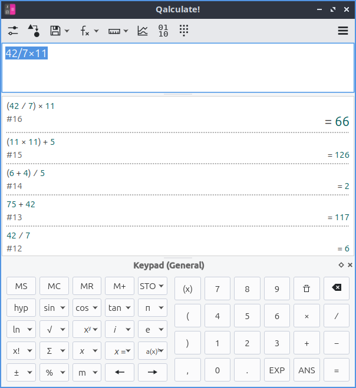

Below where you type in calculations is a history of your previous calculations. To go back in your history press the :kbd:`Down arrow` key. To go one step forward in your history press the :kbd:`Up arrow` key. To move the cursor one character to the left press the :kbd:`left arrow` key or left click the :guilabel:`left arrow`. To move the cursor one arrow to the right press the :kbd:`right arrow` key or left click the :guilabel:`right arrow` key. To move the cursor to the end press the :kbd:`End` key or right click the :guilabel:`right arrow` button. To move the cursor to the start press the :kbd:`Home` key or right click the :guilabel:`left arrow` button.

To copy text from Qalculate! select the text and press :kbd:`Control + C` or right click and select :menuselection:`Copy`. To cut the text from Qalculate! press :kbd:`Control +X` or right click and select :menuselection:`Cut`. To past text press :kbd:`Control +V` or right click and select :menuselection:`Paste`.

To store a value in calculator memory left click the :guilabel:`MS` button. To later get the same value out of the calculator left click the :guilabel:`MR` button. To clear the memory stored in the calculator press the :guilabel:`MC` button.

To view only Text for the toolbar menus right click on the toolbar and select :menuselection:`Text Only`. To have text beside icons on the toolbar menus right click on the toolbar and select :menuselection:`Text Beside Icons`. To have a text underneath iconns on the toolbar menus right click on the toolbar and select :menuselection:`Text under icons`. To switch back to only showing icons on the toolbar menus right click and select :menuselection:`Icons Only`. To toggle showing the toolbar right click on the toolbar and check/uncheck :menuselection:`Show Toolbar`.

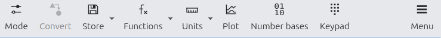

To take the reminder when dividing something you can type :kbd:`%` or left click :guilabel:`1` between two numbers like :kbd:`9%2` to get the remainder of 9/2. You can also type :kbd:`%` or left click :guilabel:`%` after a number as a percent of a number.  To insert the number π left click on the :guilabel:`π` button. To add e the base of the natural logarithm left type :kbd:`e`, left click :kbd:`EXP`, or left click the :guilabel:`e` button. You also can use e a shorthand for scientific notation by typing :kbd:`e`, left click :guilabel:`EXP`, or left clicking the :guilabel:`e` button for example:kbd:`6e2` to mean 6 \*10^2. To input i the square root of negative 1 the imaginary number type :kbd:`i` or left click the :guilabel:`i`.

To bring up a percent calculator your can left click on the arrow next to :guilabel:`%` and select :menuselection:`Percent Calculation Tool` or left click on the three bars to the right and select :menuselection:`Percent Calculation Tool`. Enter the first value in the :guilabel:`Value 1` field. Enter the second value in the :guilabel:`Value 2` field. Then you can see below your values the changes, percent change 1 to 2 and then the percentage of each number compared to each other. If you want to clear the values you have entered left click on the :guilabel:`Clear` button.

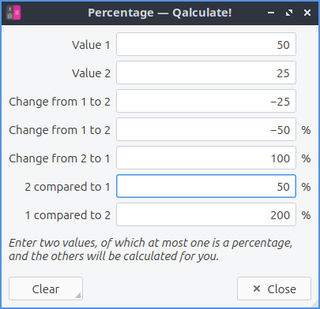

To view dates in many different calendars left click on the :guilabel:`three bars` on the right and select :menuselection:`Calendar Conversion`. To view a periodic table left click on the :guilabel:`three bars` on the right and select :menuselection:`Periodic Table`. To view a list of keyboard shortcuts left click on the :guilabel:`three bars` on the right and select :menuselection:`Keyboard shortcuts`.

To force a minimum nubmer of decimal points after the result left click on the left most :guilabel:`two sliders` button and enter how many numbers after the decimal point in :menuselection:`Min decimals`. To have a maximum number after the decimal point left click on the left most :guilabel:`Two sliders` in the :menuselection:`Max decimals` field. 

To test an test if two things are equal you can type :kbd:`=` between two expressions or left click :guilabel:`x=` and then get true or false on if there is equality. To test if something is not equal long left click on :menuselection:`x= --> ≠` or type in :kbd:`≠` between two expressions. To test if one expression is less than the other expression type in :kbd:`<` or long left click on :menuselection:`x= --> <` between two expression. To test if annother expresion is less than or equal type in :kbd:`≤` or long left click on :menuselection:`x= --> ≤` between two expressions. To test if one expression is greater than another type :kbd:`>` or long click on :menuselection:`x= --> >` between two expresssions. To test if one expression is greater than or equal to another type :kbd:`≥` or long left click on :menuselection:`x= --> ≥`. Many of these get their own button on the alegebra keypad which can be switched to with the menu with 10 points :menuselection:`Keypad --> Algebra`.

To select the general keypad left click the 10 numbers :menuselection:`Keypad --> General`. To switch to a programming Keypad left click the 10 numbers :menuselection:`Keypad --> Programming`. To switch to an Algebra keypad left click the 10 dots :menuselection:`Keypad --> Algebra`. To have a custom keypad left click the 10 digits :menuselection:`Keypad --> Custom`. To add something to your custom keypad right click on an empty button. To toggle having no keypad press :kbd:`Control +K` or left click :menuselection:`Keypad --> None`. To hide the numberpad buttons uncheck the :menuselection:`Keypad --> Always show numberpad`. To just have the numberpad when not always shown select :menuselection:`Keypad --> Numberpad`.

To have Qalculate! solve an equation type :kbd:`Solve()` or long click on :menuselection:`x= --> Solve Equation`. 

Trigonometry
-------------
Qalculate! offers many different trigonometric functions. When using these functions having the correct angle unit is important to have the angle unit set correctly or else you will get the wrong answer. To set the angle unit to degrees left click the left most button with two sliders and select :menuselection:`Degrees` in which 360 degrees make one full circle. To set the angle unit to radians in which 2π radians make one full circle left click the left most button on the toolbar and select :menuselection:`Radians`. To have the angle unit set to Gradians in which 400 gradians make a full circle left the leftmost button on the toolbar and select :menuselection:`Gradians`.

To take the sine function of something left click the :guilabel:`sin` button or type :kbd:`sin()`. To take the inverse sine function of something right click the :guilabel:`sin` button or type :kbd:`arcsin()`. To take the cosine of something left click the :guilabel:`cos` button or type :kbd:`cos()`. To take the tangent function of something left click on the :guilabel:`tan` button or type :kbd:`tan()`. To take the inverse tangent right click on the :guilabel:`tan` button or type :kbd:`arctan()`.

Exponents and Roots
-------------------
To exponentiate a base number to a power left click x :sup:`y` or type :kbd:`^`. To square a number right click x :sup:`y` or type :kbd:`sq()` around what you want to square. To raise e to a power middle click x :sup:`y` or type :kbd:`exp()` around what power you want to raise e to. To take the square root of something left click the :guilabel:`√` button or insert a :kbd:`√` character. To take the cube root of something right click the :guilabel:`√` button or type :kbd:`cbrt()`. To take the nth root of something middle click on the :guilabel:`√` button or type :kbd:`root( , )` where the first thing is what you are taking the root of and the second is which root to take.

To take a natural logarithm left click on the :guilabel:`ln` button or type in :kbd:`ln()`. To take a  logarithm on base 10 right click on the :guilabel:`ln()` button or type in :kbd:`log10()`. To take a logarithm with base n middle click on :guilabel:`ln` and then input your base.

Combinatorics
-------------
to take take a factorial of an integer type :kbd:`x!` after it or left click the :guilabel:`!` button. To take the number of permutations right click on the :guilabel:`x!` or type :kbd:`perm()`. To take the number of combinations fo something middle click on :guilabel:`x!` or type :kbd:`comb()`.

Summation/Products
------------------
To take a sum of several numbers left click the :guilabel:`Σ` button, type :kbd:`Σ()`, or type :kbd:`sum()`. To take the product of several things right click the :guilabel:`Σ` button, type :kbd:`Π()`, or type :kbd:`product()`.

Saving Variables
----------------
To save a new variable in Qalculate! press :kbd:`Control +S` or left click the :guilabel:`floppy disk` icon and a window will popup. Type a name for your variable in the :guilabel:`Name` field. The :guilabel:`Required` tab is for required fields for your variable. Type what you want your variable to be equal too in the :guilabel:`Value` field. To add additional description to your variable use the :guilabel:`Description` tab. Choose which category to put this variable in in :guilabel:`Category`. To give a descriptive name to your variable type that in :guilabel:`Descriptive name`. To toggle hiding a variable check/uncheck the :guilabel:`Hide variable` checkbox. To add more description to your variable type that in the :guilabel:`Description` field.

Functions
---------
To bring up an extensive list of functions left click the :guilabel:`fx` button or press :kbd:`Control + F`. On the left hand side of the window is a :guilabel:`Category` column and to choose functions from that category left click on the category name. To see a list of the actual function are under the :guilabel:`Function` column. To insert a function into the main window left click the :guilabel:`Insert` button. To calculate an answer in a popup left click the :guilabel:`Calculate` button. To search for a function type in the magnifying glass field. To save a function in your favorites check the :guilabel:`Favorite` checkbox.

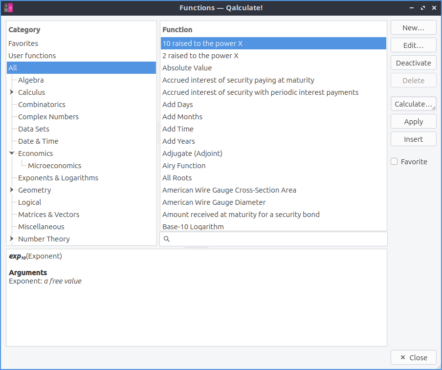

Units
-----
To have a large list of many different units you can open by pressing :kbd:`control +U` or left click on the :guilabel:`ruler` button. Under the left column labeled :guilabel:`Category` and left click on a category to select that category of unit. To search for a unit type in the :guilabel:`Magnifying glass` button. To select a unit left click on it on the right column. To insert the unit left click on the :guilabel:`Insert` button. To add a unit to your favorites check the :guilabel:`Favorite` checkbox. To convert between units enter the number in the bottom of the window and then type how many units to convert from in the second from the bottom field and then select the bottom right field what to convert to will show the  converted result.

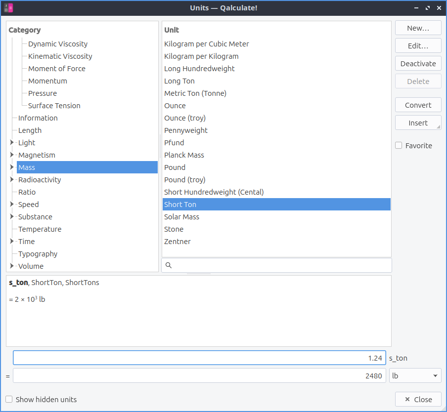

Qalculate also does many operations with fractions. To input 1/2 into something you can middle click on the :guilabel:`2` button. Similarly to input 1/3 middle click on :guilabel:`3` and for 1/4 middle click on :guilabel:`4` and so on. Qalculate will also simplify fractions if you type them in so if you type in 4/16 Qalculate! will reduce it to 1/4 and then also provide a decimal answer with a :guilabel:`=` sign for an exact value or an :guilabel:`≈` for an approximate solution if not exact. Qalculate! will also let you add, subtract, multiply, divide, or more advanced fractions with fractions and still show the result as fractions.

Plotting
--------
To plot functions in Qalculate! press :kbd:`Control + P` or left click on the :guilabel:`graph` button.  The :guilabel:`Data` tab will have info on what you want values to plot. To give your name to a function to plot enter that in the :guilabel:`Title` field. Type what you want to plot in the :guilabel:`Expression` field. To change what each variable is called change the :guilabel:`X variable` field. To change what style to draw the plot change the :guilabel:`Style` drop down. To change how to smooth your plot use the :guilabel:`Smoothing` drop down. To add another function to be plotted left click the :guilabel:`Add` button. To have the plot redrawn with your changes left click the :guilabel:`Apply` button. To remove something you want to plot left click the :guilabel:`Remove` button. On the bottom of this window is a list of everything you have to plot. The title of what you are plotting is listed in the :guilabel:`Title` column. The formula for what you are plotting is in the :guilabel:`Expression` column.

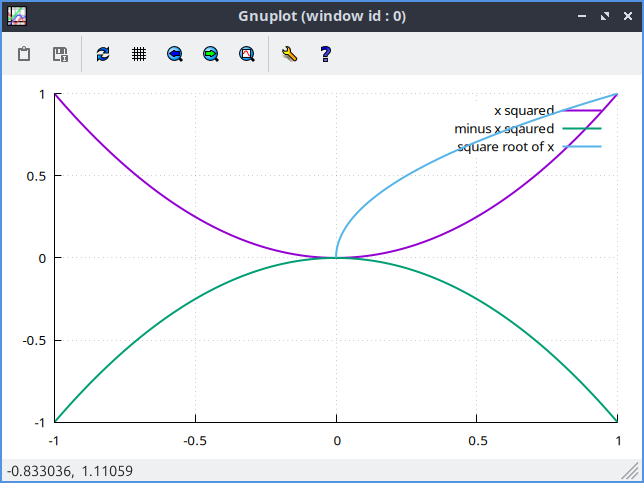

To change what values to take in the functions use the :guilabel:`Function Range` tab. To change what the lowest value for x to plot enter :guilabel:`Minimum x value` field. To change the highest value to plot use the :guilabel:`Maximum x value`. To change how many points to plot change the :guilabel:`Sampling rate` field. To only show the real part of functions uncheck the :guilabel:`Show real and imaginary parts` checkbox. To apply changes you make to your plot left click the :guilabel:`Apply` button.

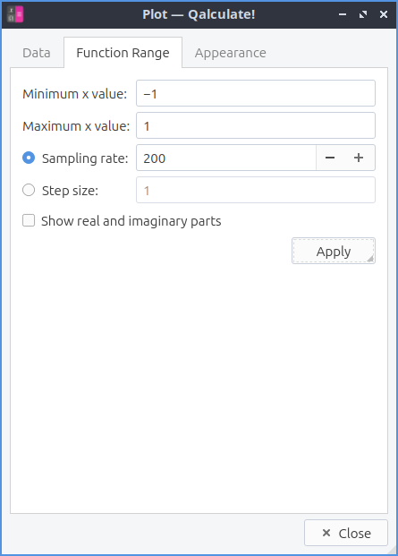

The :guilabel:`Appearance` tab changes how the plot you make will appear. To have a title for your plot type in the :guilabel:`Title` field. To choose to display a grid for your plot check the :guilabel:`Display grid` checkbox. To have a full border around your plot check the :guilabel:`Display full border` checkbox. To choose a lowest value to show on the y axis check the :guilabel:`Minimum y value` checkbox and select the minimum value you want to show. To have a logarithmic scale on the x axis check the :guilabel:`Logarithmic x scale` checkbox and then to the right input the logarithmic base. To have logarithmic scale on the y axis check the :guilabel:`Logarithmic y scale` checkbox and input the logarithmic base to the right. To put an label on your x axis type it in the :guilabel:`x-axis label` field. To have a label on your y axis type in in the :guilabel:`y-axis label` field. To change the width of your line change the :guilabel:`Line width` field. To change where to place the legend use the :guilabel:`Legend placement` drop down. To have your changes applied left click the :guilabel:`Apply` button. 

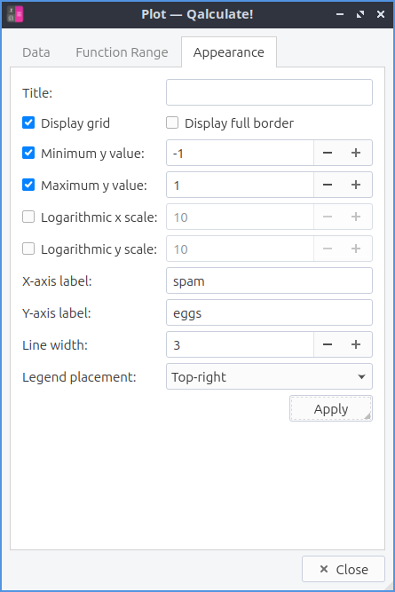

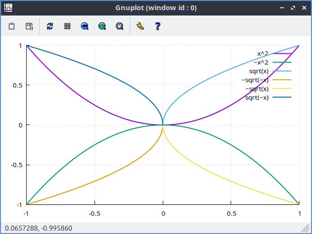

Number Bases
------------
To view numbers in something other than the default base 10 press :kbd:`Control +B` or left click the :guilabel:`0110` button. This will show the result in Binary, Octal, Deciamal, and Hexadecimal with the different digits of each numerical base. To hide numerical bases press :kbd:`Control+B` again or left click :guilabel:`0110`. 

To change what number base the answer is displayed in left click left most :guilabel:`slider button` and select the number base you want under :menuselection:`Result Base`. To change what numerical base to input expressions in left click the left most :guilabel:`slider button` and select a base under :menuselection:`Expression Base`.

The programing keybpad as menubutton for hexadecimal A-F and nubmer base switching which ccan get by the 10 point icon :menuselection:`Keypad --> Programming`.

Version
-------
Lubuntu ships with version 5.5.0 of Qalculate!

How to Launch
-------------
To launch Qalculate! :menuselection:`Accessories --> Qalculate! (Qt)` or run 

.. code :: 

  qualculate-qt
 
from the command line.

Customizing
-----------
To open the prefrences dialog for Qalculate! left click on the three bars :menuselection:`Menu --> Prefrences`. To change settings on how Qalculate! appears use the :guilabel:`Look & Feel` tab. To not use the system language check the :guilabel:`Ignore system language` checkbox and select the language in the :guilabel:`Language` menu. To allow multiple Qalculate! instances check the :guilabel:`Allow multiple instances` checkbox. To clear the history of Qalculate! on exit check the :guilabel:`Clear history on exit` checkbox. To change the maximum number of lines of history saved change the :guilabel:`Max history lines saved` field. To close Qalculate with the escape key check the :guilabel:`Close application with escape key` checkbox. To not use keyboard keys for Reverse Polish Notation uncheck the :guilabel:`Use keys for RPN` checkbox. To have the :kbd:`^` key be used for a bitwise XOR check the :guilabel:`Use caret for bitwise XOR` checkbox. To start Qalculate always on top of other windows check the :guilabel:`Keep above other windows` checkbox. To prevese the hieght of history in your window check the :guilabel:`Preserve history height` checkbox.

To change what to show in the window title use the :guilabel:`Window title` menu. To change what to show on tooltips use the :guilabel:`Tooltips` menu. To change what Qt style to show in Qalculate! use the :guilabel:`Style` menu. To enable dark mode on Qalculate! check the :guilabel:`Dark mode` checkbox. To disable cursor blinking check the :guilabel:`Disable cursor blinking` checkbox. To not colorize the result uncheck the :guilabel:`Colorize result` checkbox. To not format the result uncheck the :guilabel:`Format result` checkbox. To use a custom font for the result check the :guilabel:`Custom result font` checkbox and then click the button on the right to select a font. To have a custom font for your expression check the :guilabel:`Custom expression font` checkbox and then click the button to the right to select the font. To have a custom font for your keypad check the :guilabel:`Custom keypad font` checkbox and then click the button on the right to choose your font. To choose a custom font for the rest of the application use the :guilabel:`Custom application font` checkbox and then press the button on the right to channge the font.

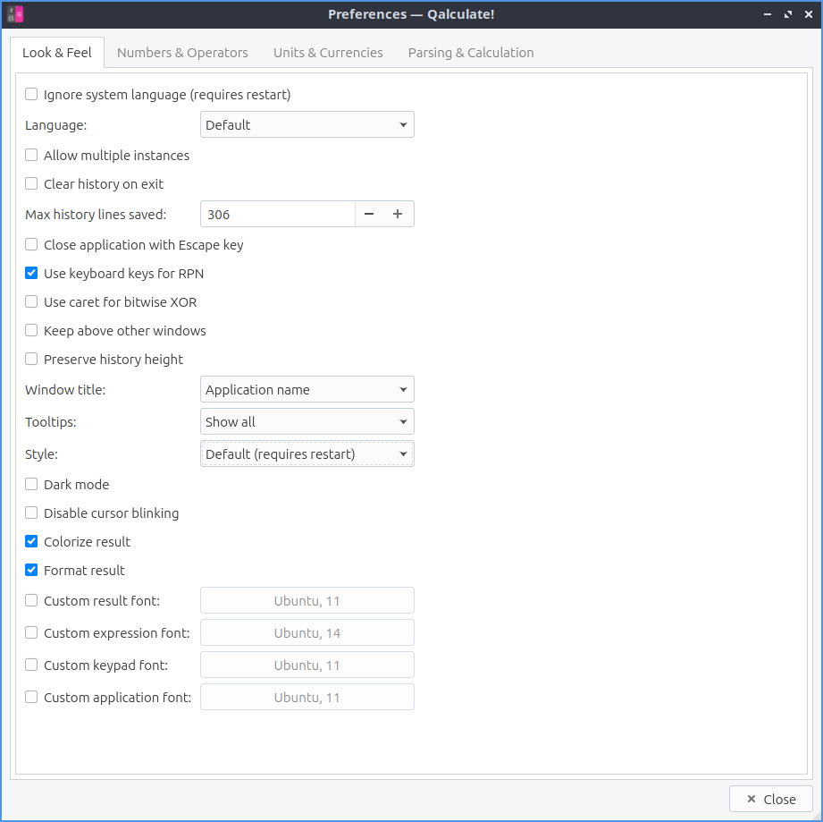

To have settings for how to format numbers use the :guilabel:`Numbers and Operators` tab. To output two complement in either binary or hexidecimal check the :guilabel:`Binary` checkbox or :guilabel:`Hexidecimal` checkbox next to :guilabel:`Two's complement output`. To change what input two's complement expects check the :guilabel:`Binary` or :guilabel:`Hexadecimal` checkbox next to :guilabel:`TWo complement input`. To change what bits to put in binary change the :guilabel:`binary bits` menu. To use lower case letters check the :guilabel:`Use lower case letters in non-decimal numbers` checkbox. To use special symbols for base 12 numbers check the :guilabel:`Use special duodecimal symbols` checkbox. To use a dot as a multiplication sign check the :guilabel:`Use dot as multiplication sign` checkbox.To use the unicode division slash chceck the :guilabel:`Use Unicode division slash in output` checkbox. To have logical operators spelled out in words check the :guilabel:`Spell out logical operators` checkbox. To display scientific notation with E instead of 10^n check the :guilabel:`Use E-notation instead of 10^n` checkbox. 

To switch imaginary units to j check the :guilabel:`Use j as imaginary unit` checkbox. To use a comma as a decimal separator check the :guilabel:`Use comma as decimal separator` checkbox. To ignore commas in number check the :guilabel:`Ignore comma in numbers` checkbox. To indicate repeating decimals check the :guilabel:`Indicate repating decimals` checkbox. To have what you copy be unformated ASCII check the :guilabel:`Copy unformatted ASCII by default` checkbox. To change how to group digits change the :guilabel:`Digit grouping` menu. To automatically group digits when inputting them check the :guilabel:`Automatically group digits in input` checkbox. To change how to display intervals change the :guilabel:`Interval display` menu. To change how to round numbers change the :guilabel:`Rounding` menu. To chnage what form complex numbers take use the :guilabel:`Complex number form` menu.

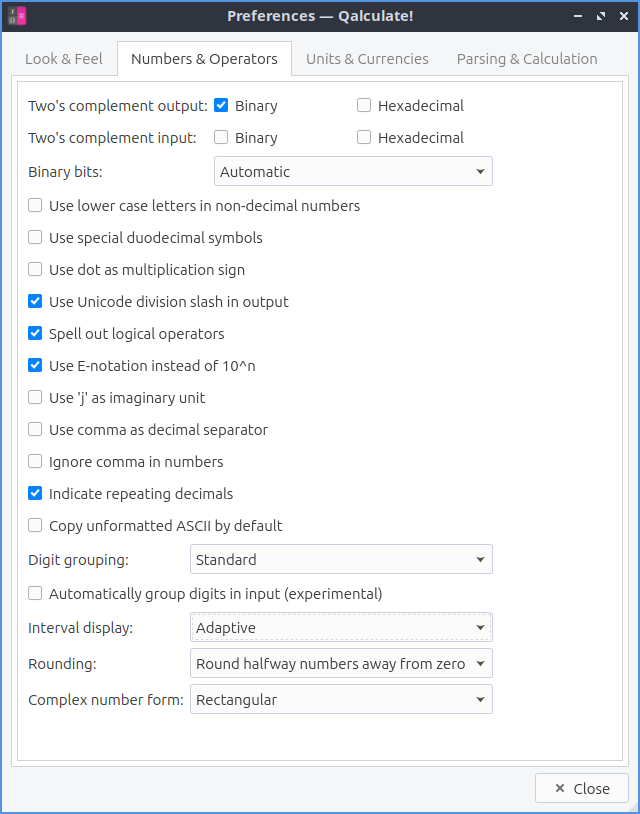

To change your settings with Units and Currencies use the :guilabel:`Units & Currencies` tab. To disable units uncheck the :guilabel:`Enable units` checkbox. To not abbreviate names uncheck the :guilabel:`Abbreviate names` checkbox. To use binary prefixes for inforamtion units check the :guilabel:`Use binary prefixes for information units` checkbox. To change how to automatically convert units use the :guilabel:`Automatic unit conversion` menu. To convert to mixed units check the :guilabel:`Convert to mixed units` checkbox. To use automatic unit prefrixes use the :guilabel:`Automatic unit prefixes` menu. To use SI prefixes for everything check the :guilabel:`Enable all SI-prefixes` checkbox. To enable prefixes in unit denominators check the :guilabel:`Enable denominator prefixes` checkbox. To enable units when using phsyical constants check the :guilabel:`Enable units in physical constants` checkbox. To copy text without the units check the :guilabel:`Copy unformatted ASCII without units` checkbox. To change how to calculate Temperature use the :guilabel:`Temperature calculation` menu. To channge when to update exchange rates change the :guilabel:`Exchange rates updates` field.

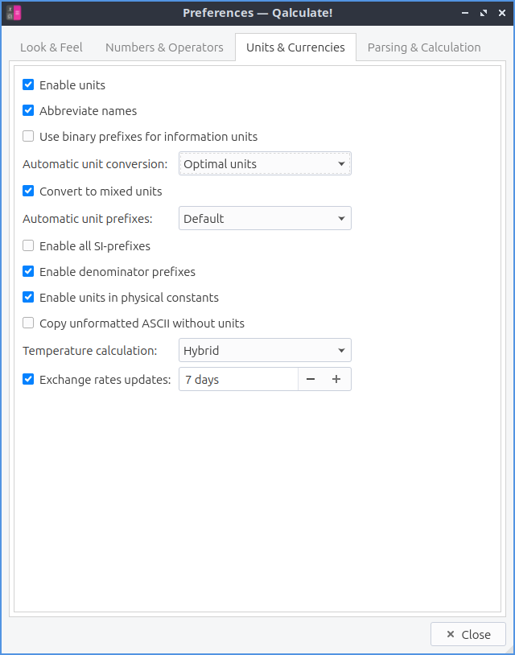

To change how Qalculate! parsing things use the :guilabel:`Parsing & Calculation` tab. To choose where to store expression status use the :guilabel:`Expression status` menu. To change how long it takes a tooltip to display change the :guilabel:`Status tooltip delay` menu. To change how long to delay calculating as you type use the :guilabel:`Calculate as you type delay` field. To change if you want to display parsed entries in the history change the :guilabel:`Expression in history` menu. To change in history the expression after calculation use the :guilabel:`Expression after calculation` menu. To automatically copy the result of your calcuations check the :guilabel:`Automatically copy result` checkbox. To change the parsing mode use the :guilabel:`Parsing mode` menu. To use simplified precentage calculation use the :guilabel:`Simplified percentage calculation` checkbox. To read precision check the :guilabel:`Read precision` checkbox. To use concise uncertainty input use the :guilabel:`Allow concise uncertainty input` checkbox. To limit implicit multiplication check the :guilabel:`Limit impliict multiplication` checkbox. To interpret any unrecognized symbol as a variable check the :guilabel:`Interpret unrecognized symbols as variables` checkbox. To change how to calculate interval change the :guilabel:`Interval calcuation` menu. To factor your answers check the :guilabel:`Factorize result` checkbox. 

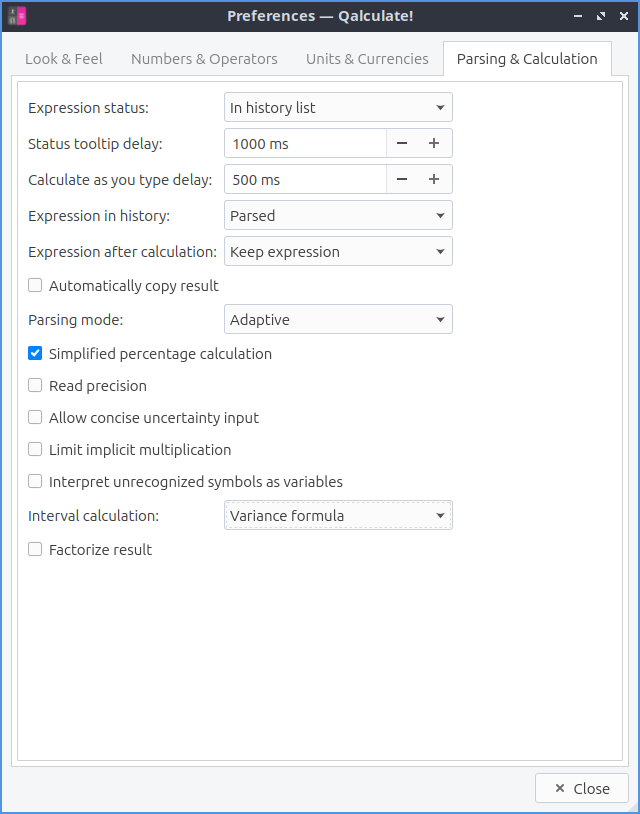
