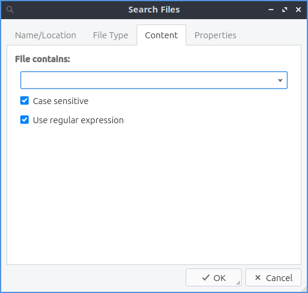
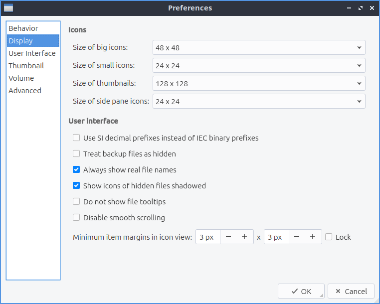
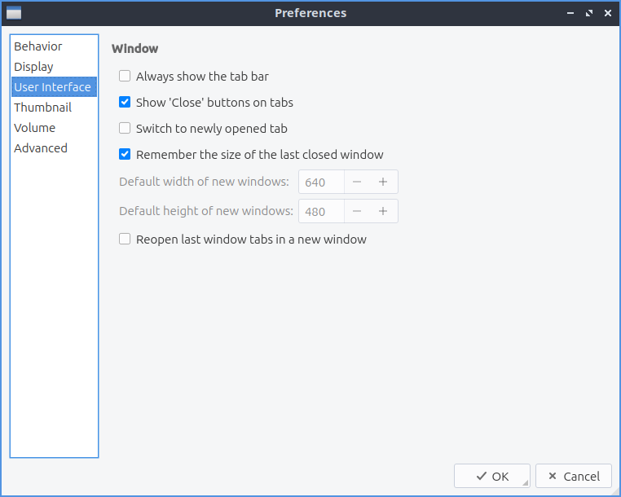
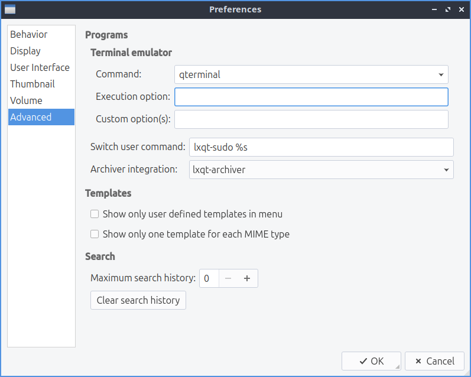

Chapter 2.4.4: PCManFM-Qt
=========================

Description
------------
PCManFM-Qt (PCMan File Manager) is a file manager application ported to Qt after the original developed by Hong Jen Yee from Taiwan which is meant to be a replacement for Nautilus, Konqueror and Thunar. 

Features:
 - tabs
 - bookmarks
 - places sidebar with removable media or directory tree
 - Ability to eject removable media
 - Ability to mount other filesystesms internally.

Usage
------
Along the top to create a new tab in pcmanfm-qt you can use the button with a file and a plus on it to open a new tab or press :kbd:`control +t`. The left pointing arrow button is a back button while the right pointing arrow button moves you forward in the directories that you have moved in the file manager. Another way to go back and forward is :kbd:`Alt + Left arrow` or :menuselection:`Go --> Go Back` and another way to go forward is :kbd:`Alt + Right Arrow` or :menuselection:`Go --> Go Forward`. The button for the arrow pointing upward is to go up one level in the directory tree to the so called parent directory or press :kbd:`Alt+Up arrow`. To rename your files right click on the file and click :menuselection:`Rename` or press :kbd:`f2`.  

If you double click on a folder you change pcmanfm-qt to that folder. If you want to open a folder in a new tab right click on that tab and select :menuselection:`Open in New Tab`. To open a folder in your terminal right click it and select :menuselection:`Open in terminal`. To open a folder in a new window right click it and select :menuselection:`Open in New Window`. 

To close a tab click on the :guilabel:`x` button on the tab bar. To close a tab using the keyboard press :kbd:`Control +W` or from the menu :menuselection:`File --> Close Tab`. To close all tabs but the current one right click on the tab bar and :menuselection:`Close other tabs`. To close all tabs to the right of this tab :menuselection:`Close next tabs`. To close tabs to the left right click on the tab bar and select :menuselection:`Close previous tabs`.

.. image:: pcmanfm-tab-context.png

If you have installed multiple programs that can open a file right click and select :menuselection:`Open With --> Program you want to launch`. 

To create a new empty text file press :kbd:`Control + Alt +N` or :menuselection:`File --> Create New --> Blank File` and type in the name of the file you want. To create a new folder or directory press :menuselection:`File --> Create New --> Folder` or press :kbd:`Control+ Shift +N` and input the new folder name. To delete your files from pcmanfm-qt will first put them in the trash so they are not gone forever. To move a file into the trash right click that file move to trash or press :kbd:`Delete`. To get a file out of the trash in places trash to get to your trash or :menuselection:`Go --> Trash`. To bring a file back from the trash right click :menuselection:`Restore`. To permanently delete all files from the trash can right click on :guilabel:`Trash` in the places sidebar :menuselection:`Empty Trash`. To go back to your home folder press :kbd:`Alt +Home` or :menuselection:`Go --> Home`. 

To view a directory tree on your side pane select :menuselection:`Directory tree` from the menu above the side pane. To expand into a folder press the :guilabel:`+` to expand the files and the :guilabel:`-` button to collapse the folder. To switch to a folder left click on the folder name. To have open a directory in a new tab right click on it and select :menuselection:`Open in new tab`. Top open a folder from the directory tree in a terminal :menuselection:`Open in terminal`. To switch to back to places from the menu above the side pane select :menuselection:`Places`. 

.. image:: directorytreesidepane.png

To toggle having a split view to be able to view two folders in press :kbd:`F6` or :menuselection:`View --> Split View`. This split view allows you to have two folders open which is quite useful for copying files. To switch between the two different folders left click on the half of the screen to move to the left hand side to manage files and click on the right hand side to manage files on the right on side.

.. image:: split_view.png

If you single click on a file you will select it. If you double click on it you will open it in the  default program to open that file. If you right click on a file you can select  which program to open a file with if you have multiple programs to open it. If you want to select multiple files you can hold down :kbd:`control+ Left click` to select each file. To copy files select the file right click :menuselection:`Copy`, :menuselection:`Edit --> Copy`, or press :kbd:`control +c`. To cut files select them right click :menuselection:`Cut`, :menuselection:`Edit --> Cut`, or press :kbd:`control + x`. After copying or cutting a file you can paste them with right click :menuselection:`Paste`, :menuselection:`Edit --> Paste`, or press :kbd:`control +v`. 

To select all files in a directory is to press :kbd:`Control+ A` or right click :menuselection:`Select All` for all of the files. To select multiple files with the mouse you can hold down :kbd:`Control` and left click to select all of the files. To bulk rename multiple files first select all the files you want to rename then :menuselection:`Edit --> Bulk Rename` and a dialog window will show up. To choose what to rename the files choose :guilabel:`Rename selected files to` as what to rename your files. To choose what number to start numbering your files change the :guilabel:`# will be replaced by numbers starting with` field. To rename all these files press the :guilabel:`OK` button or to not rename them press the :guilabel:`Cancel` button.

.. image:: bulk-rename.png

To connect to a remote server such as a NAS go to the :menuselection:`Go -->  Connect to server` and authenticate to your remote storage. If you want to plug in removable storage you can open the storage on the left sidebar with devices. To switch to the removable media left click on the device in the side pane. This same applies to other internal filesystems on your computer. To eject removable media press the button on the left with a circled up arrow to eject.  On the side pane you can right click to open a place in a new tab by right clicking :menuselection:`Open in New Tab` for places and mounted drives. If you want to return to your home folder :menuselection:`Go --> Home` or press :kbd:`Alt + Home`.

.. image::  pcmanfm-qt-connect-server.png 

pcmanfm-qt also supports transferring files to mobile devices plugged in with a usb cable. On the left hand side under devices the mobile device will appear. You may need on your device to allow it to transfer files. After you have done this You can see the files on mobile device and transfer files to them. To eject the mobile devices press the upward pointing arrow to unmount it.

At the bottom of the window is a filter bar that lets you show files only matching a pattern in the window of the current folder. To use it type what you want to search for in the bar that says :guilabel:`Filter`. How many result you match will show in the :guilabel:`item(s)` field. To return the filter back to seeing all files clear the text field and hide the filter bar by pressing :kbd:`Control +Shift+ K` or :menuselection:`View --> Filtering --> Clear All Filters`. If you still want to see the filter bar but to see all files hold the :kbd:`backspace` key to clear it out. 

On the very bottom of the pcmanfm-qt window when you have nothing selected it shows :guilabel:`X item(s) (y hidden)` showing how many items are in the current folder. To the right of this shows :guilabel:`Free space` showing how much free space you have. The :guilabel:`(Total)` shows the full size of the storage medium this is on. When you select one file on this bottom bar it will show the file name you have selected and the type of file it is. If you select multiple files the bottom bar to the left will show :guilabel:`X item(s) selected` where X is the number of files you have selected and how much disk space they take up.

To see hidden files press :kbd:`control +h`, right click show hidden, or go to  :menuselection:`View --> Show hidden`. Press the same thing again to hide hidden files again. To open a terminal in your current folder press :kbd:`f4`  or :menuselection:`Tool --> Open Terminal` from the menu.

To view the properties of a file or folder right click on it and select properties from the menu, :menuselection:`File --> File Properties` or press :kbd:`Alt +Enter`. To view a dialog that shows folder properties :menuselection:`File --> Folder Properties`. The :guilabel:`General` tab will show you the size of the file, where the file is, and when it was last modified or accessed. To change what program a file opens with use the :guilabel:`Open With` drop down menu and select the program to open the file.
 
 .. image::  file-prop.png 
 
The :guilabel:`Permissions` tab will show you who owns the file which if you can't change it will be grayed out and who has permission to read modify and execute the file. To change permission of files the :guilabel:`Owner`, :guilabel:`Group`, or :guilabel:`Other` drop down menu will allow you to choose whether you can read, read and write, or forbidden. To make something executable such as a script you wrote check the :guilabel:`Make the file executable`. At the bottom of the window is a bar graph showing disk usage of the parititon the file exists on. If you use folder properties on the top left hand corner click on the folder icon and a file dialog will open to choose the new icon with the path of the current icon theme. Left click on the icon you want and then press the :guilabel:`Choose` button.

Pcmanfm-qt can actually launch other applications in places Applications or :menuselection:`Go --> Applications` and then gets all the tasks in the menu in lxqt-panel. To view what files are on your desktop :menuselection:`Go --> Desktop` or on the places sidebar press the desktop item on the left.

To add a bookmark :menuselection:`Bookmarks --> Add to  Bookmarks`  and it will make a bookmark. To later access this bookmark it will be on the left hand side under :guilabel:`Bookmarks` and under the :menuselection:`Bookmarks` menu. To rename a bookmark you can right click on the bookmark on the left hand side :menuselection:`Rename Bookmark` and this does not have to match the filename nor will it change the filename on the filesystem. To remove a bookmark right click on the left hand side on the bookmark and select :menuselection:`Remove Bookmark`. To open a bookmark in the left hand side right click on the bookmark :menuselection:`Open in New Tab`. To open a bookmark in a new window on the left hand side right click on the bookmark :menuselection:`Open in New Window`. To move your bookmark up or down in the order right click on the bookmark :menuselection:`Move Bookmark Up` to move it up and :menuselection:`Move Bookmark Down` to move it down. 

To bring up a dialog to edit bookmarks :menuselection:`Bookmarks --> Edit bookmarks`. To Remove a bookmark from the edit bookmarks dialog press the :guilabel:`Remove Item` button. You can also add a bookmark from here with the :guilabel:`Add Item` button. To cancel your changes press the :guilabel:`Cancel` button. From the edit bookmarks you can reorder your bookmarks by left clicking and dragging to where you want the bookmark to go.

.. image:: edit-bookmarks.png 

If you want to run an executable script from pcmanfm double click and then click :guilabel:`Execute` on the execute file dialog window. If you wish to edit the script you can press the :guilabel:`Open` button. To cancel and not do anything press the :guilabel:`Cancel` button. If you plan on executing this file a lot you can right click on the file and then select :menuselection:`Trust this executable` to not have this dialog popup.

.. image::   execute_file.png

Pcmanfm-Qt has different view modes which can be changed in the view menu. To select a view that has bigger thumbnails to view pictures before deciding to open them :menuselection:`View --> View --> Thumbnail View`. If you want to view lists of move data about something like the file size the time it is modified select detailed list view by :menuselection:`View --> View --> Detailed list view`. If you really want to have see as many files in a small area use the compact view or :menuselection:`View --> View --> Compact View`. To return to the original view of pcmanfm-qt is to :menuselection:`View --> View --> Icon View`.  

To reverse the order that pcmanfm-Qt sorts files :menuselection:`View --> Sorting --> Descending` or conversly to switch back :menuselection:`View --> Sorting -->Ascending.` To sort by file name :menuselection:`View --> Sorting --> By file name`. To sort by modification :menuselection:`View --> Sorting --> By modification time`. To sort by file size :menuselection:`View --> Sorting --> By file size`. To sort by file type :menuselection:`View --> Sorting --> By file type`. To sort by owner :menuselection:`View --> Sorting --> By Owner`. To seperate all folders first in sorting check the checkbox in :menuselection:`View --> Sorting --> Folder First`. To sort with case sensitive check the checkbox in :menuselection:`View --> Sorting --> Case sensitive`.  You can also get to this sorting menu by rightclicking :menuselection:` Sorting --> Your Sorting Option`.

To change your path bar to buttons :menuselection:`View --> Pathbar --> Location` and to get back to a pathbar you can type into :menuselection:`View --> Pathbar --> Path Buttons`. To toggle showing the menubar :kbd:`Control +M` or :menuselection:`View --> Toolbars --> Menubar` and uncheck the checkbox.  To get the menubar back press :kbd:`Control +M` again. To toggle showing or hiding the permanent filter bar press :kbd:`Control+B` or :menuselection:`View --> Toolbars --> Permanent filter bar`.

.. image:: pathbar-location.png

pcmanfm-qt has options when right clicking has special options for dealing with archives such as tar or zip files. To extract the files in the current directory right click and select :menuselection:`Extract Here`. You can also extract to another location with right clicking and selecting :menuselection:`Extract to` and a dialog will pop up showing to where to extract the file. To select a file and compress it right click and select :menuselection:`Compress` will open up a dialog. To chose a file name for your new compressed archive enter in the :guilabel:`Filename` field. To choose what type of archive choose change the :guilabel:`Type` drop down menu.  To actually create the archive press the :guilabel:`OK` button.

To quit pcmanfm-qt press :kbd:`Control+Q`.

Searching for Files
-------------------

To search for files press :kbd:`f3` or :menuselection:`Tool --> Find Files`. To type part of name in the part where it says :guilabel:`File Name Patterns`. To make your search case insensitive check the :guilabel:`Case insensitive`. To toggle searching with regular expressions check/uncheck the :guilabel:`Use regular expression` checkbox. To add locations and places to search press the :guilabel:`Add` button and select the additional places to search. To remove an additional place to search press the :guilabel:`Remove` button. To toggle searching in Subdirectories check/uncheck the :guilabel:`Search in subdirectories`. To toggle searching for hidden files check/uncheck the :guilabel:`Search for hidden files`.

.. image:: filesearch.png 

To change what types of files you use choose the :guilabel:`File Type` tab. To choose to search for only certain file check/uncheck the files under the heading :guilabel:`Only search for files of following types:`. The options for which type of file include: :guilabel:`Text files`, :guilabel:`Image files`, :guilabel:`Audio files`, :guilabel:`Video files`, :guilabel:`Documents`, or :guilabel:`Folders`.

.. image::   search-file-type.png

To search for the actual content of the files you are searching for use the :guilabel:`Content` tab. To enter what you actually want to search for in your file in your :guilabel:`File contains` filed. To search for things not caring whether it is uppercase or lowercase letters check the :guilabel:`Case insensitive` checkbox. To choose to use a regualar expression to search for files check the :guilabel:`Use regualar expression` checkbox.

The :guilabel:`Properties` tab has more settings based on information about the file also called metadata. To only show results on files larger than this file check the :guilabel:`Larger than` checkbox and then in the field to the right for size. To only show files smaller than this check the :guilabel:`Smaller than` checkbox and to the field to the right select the size smaller than that. To change the units for file size use the drop menu on the far right. To search for files modified before a date check the :guilabel:`Earlier than` checkbox and select the date to the right. To search for a file modified after a date check the :guilabel:`Later than` checkbox and input the date to the right.

Custom Actions
--------------
To create custom actions you will need to create the folder that is not on your filesystem by default run this command

.. code:: 

    mkdir -p ~/.local/share/file-manager/actions

or create this path by creating new directories in this file manager. Then you will need to make a desktop file to make your action. To make for example an open in terminal  desktop run 

.. code::

   touch ~/.local/share/file-manager/actions/open_in_terminal.desktop

to create the file. To edit this file run

.. code:: 

   featherpad ~/.local/share/file-manager/actions/open_in_terminal.desktop
   
from the command line to edit the file and paste in the following contents

.. code:: 

   [Desktop Entry]
   Type=Action
   Name=Open in terminal
   Icon=utilities-terminal
   Profiles=profile-zero;

   [X-Action-Profile profile-zero]
   Exec=qterminal -w %f
   Name=Default profile

Screenshot
----------
.. image:: pcmanfm-qt.png 

Customizing
-----------
To open a dialog for preferences of pcmanfm-qt :menuselection:`Edit --> Prefrences`. The :guilabel:`Behavior` tab has settings for the way pcmanfm-qt manages files. The checkbox :guilabel:`Open files with single click` opens files by clicking on them once and you select the files by mousing over them. The :guilabel:`Bookmarks` drop down menu has options to either open bookmarks in the current tab, open bookmarks in a new tab, or open bookmarks in a new window. The :guilabel:`Confirm before deleting files` checkbox makes a confirm dialog before deleting files. The checkbox :guilabel:`Move deleted files to "trash bin" instead of erasing from disk` puts files in the trash bin instead of always deleting them. The :guilabel:`Erase files on removable media instead of "trash can" creation` erases files on removable media instead of creating a trash can on the removable media. The checkbox :guilabel:`Confirm before moving files into "trash can"` brings a confirmation dialog before moving files to the trash can. The checkbox :guilabel:`Launch executable files without prompt` will run executable files without bringing up a prompt asking what to do with the file however you will need to restart pcmanfm-qt for this to take effect. To select new files automatically check the :guilabel:`Select newly created files` checkbox.

.. image:: pcmanfm-qt-prefrences.png

The tab :guilabel:`Display` tab allows you to change icon sizes and changes size preferences hide backup files and settings for margins. The :guilabel:`Size of big icons` changes the size of big icons in pcmanfm-qt. The :guilabel:`Size of small icons` Changes the size of small icons for pcmanfm-qt. The :guilabel:`Size of thumbnails` changes the size of thumbnails in pcmanfm-qt. The :guilabel:`Size of side pane icons` changes the size of side pane icons. The checkbox :guilabel:`Use SI decimal prefixes instead of IEC binary prefixes` treats kilobytes, megabytes, and gigabytes as base 1000 instead of 1024. To toggle showing backup files as hidden check/uncheck the :guilabel:`Treat backup files as hidden` checkbox. To change the minimum margins in icon view for number of pixels change the numbers in :guilabel:`Minimum item margins in icon view`. To toggle locking the marings in places check/uncheck the :guilabel:`Lock` checkbox.

The tab :guilabel:`User Interface` changes how pcmanfm-qt appears in windows. To toggle always showing the tabbar even when you have only one tab check/uncheck the :guilabel:`Always show the tab bar` checkbox. The checkbox :guilabel:`Fullwidth tab bar` makes the tab bar take the full width of the window including over the side pane. To toggle showing the x on each tab to close each tab check/uncheck the :guilabel:`Show 'Close' buttons on tabs` checkbox. To have pcmanfm-qt open the window in the same size as the last time you closed the window by checking/unchecking the :guilabel:`Remember the size of the last closed window` checkbox. If you have the :guilabel:`Remember the size of the last closed window` you can change the :guilabel:`Default width of new Window` filed or :guilabel:`Default height of new windows` fields.

 
The tab :guilabel:`Thumbnail` tab has settings for thumbnails on files in pcmanfm-qt. To enable/disable thumbnails check/uncheck the :guilabel:`Show thumbnails of files` checkbox. If you want to only have thumbnails for local files not on another machine check  :guilabel:`Only show thumbnails for local files` checkbox. Unchecking the previous checkbox will result in a slower performance to get the thumbnails for the files. To put an upper limit on the file size for generating thumbnails which makes thumbnails change the :guilabel:`Do not generate thumbnails for image files execeeding the size` field. 

.. image::  perferences-thumbnail.png

The tab :guilabel:`Volume` manages flash drives other partitions on external disks and other external media. The :guilabel:`Auto Mount` section is settings for automatically mounting removable media. The :guilabel:`Mount mountable volumens automatically on program startup` mounts removable media when you start pcmanfm-qt. To automount removable media when you insert them into your computer check the :guilabel:`Mount removeable media automatically when they are inserted`. To show a menu for removable media when inserted check/uncheck the :guilabel:`Show available options for removable media when they are inserted`. To choose when you unmount a  removable volume you can choose to :guilabel:`Close tab containing removeable medium` or :guilabel:`Change folder in the tab to home folder`.    

.. image::    prefrencesvolume.png

The :guilabel:`Advanced` tab shows integration with other programs and advanced settings. To change your default terminal emulator from pcmanfm-qt preferences drop down change the :guilabel:`Terminal emulator` drop down menu. To change what pcmanfm-qt uses to change users to open things as root type that in the :guilabel:`Switch user command` field. To change your Archiver integration change the :guilabel:`Archiver integration` drop down.

Version
-------
Lubuntu currently ships with 0.14.1 of pcmfanfm-qt. 

How to Launch
-------------
To open PCManFM-qt in your current directory (in terminal), execute 

.. code::

   pcmanfm-qt

Feel free to append [lxqt-sudo] to run PCManFM-Qt as root.

You can also go to the Applications menu  :menuselection:`Accessories --> PCManFM-Qt File Manager`. There also is a keyboard shortcut for launching pcmanfm-qt of :kbd:`Control+ Alt + E`. The icon for pcmanfm-qt looks like a file cabinet drawer with files in it at the top.  Pcmanfm-qt is also in the quick launch and can be launched by left clicking on the file cabinet icon in the quick launch.
