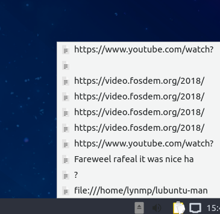
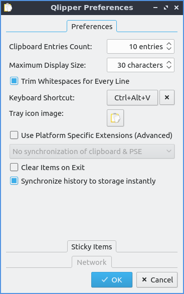

Chapter 2.4.5 Qlipper
=====================

Qlipper is a clipboard manager that is included by default on Lubuntu.

Usage
------

Qlipper is  a clipboard manager automatically started in the system tray. To view your clipboard history left click on the icon that looks like a clipboard or press :kbd:`Control+Alt+v`. To make your item from your history the selected one left click on the item of your history in the menu. If you temprarily wnat your clipboard history not to be saved or shown you can close qlipper by right clicking on the clipboard icon and selecting :menuselection:`Quit`. To clear your clipboard history like if you copied a password you can right click on the clipboard history and select :menuselection:`Clear clipboard history`.

Screenshot
-----------

Customizing
-----------
 If you really want an item to always show up right click on the clipboard and press the :menuselection:`Configure` then click on the :guilabel:`Sticky Items` divider and press the add button and add what you want always to be listed in qlipper. To change how many items get displayed in qlipper in total right click on qlipper and configure with the gear icon and change :guilabel:`Clipboard Entries Count` to your desired number of entries. To change how many characters show up on qlipper from the same configuration screen change :guilabel:`Maximum Display Size`. To change the tray icon image to something custom click on the tray icon right click on the tray icon :menuselection:`Configure` and then press the button next to :guilabel:`Tray icon image` which has an option to load a custom tray icon. To toggle having your clipboard saved to storage as soon as possible check/uncheck the :guilabel:`Synchornize history to storage instantly` checkbox. To have qlipper lose its stored history when you close qlipper check the :guilabel:`Clear Items on Exit` checkbox. To not have whitespace after pasting each line check the :guilabel:`Trim Whitespaces for Every Line` checkbox. To change your keyboard shortcut to bring up the menu from qlipper use the :guilabel:`Keyboard Shortcut` button. To clear this keyboard shortcut press the :guilabel:`x` button to the right.

Version
-------
Lubuntu ships with version 5.1.2 of Qlipper. 

How to launch
-------------
By default Qlipper should autostart and should be on the bottom right of your panel. If you need to get it running and it is not go to the menu :menuselection:`Accessories --> Qlipper`.
To launch it from the command line run 

.. code::

   qlipper

