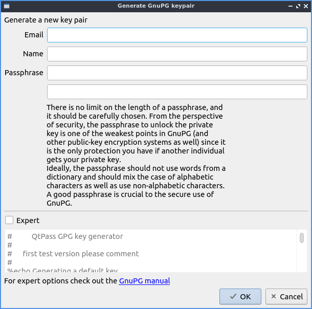
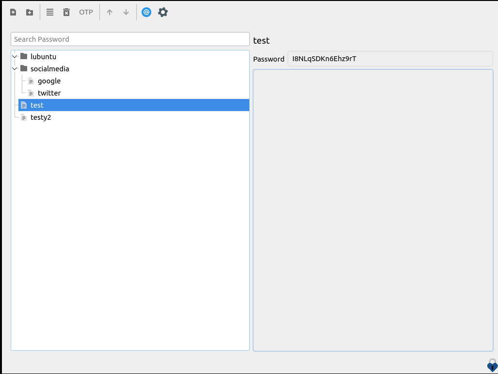
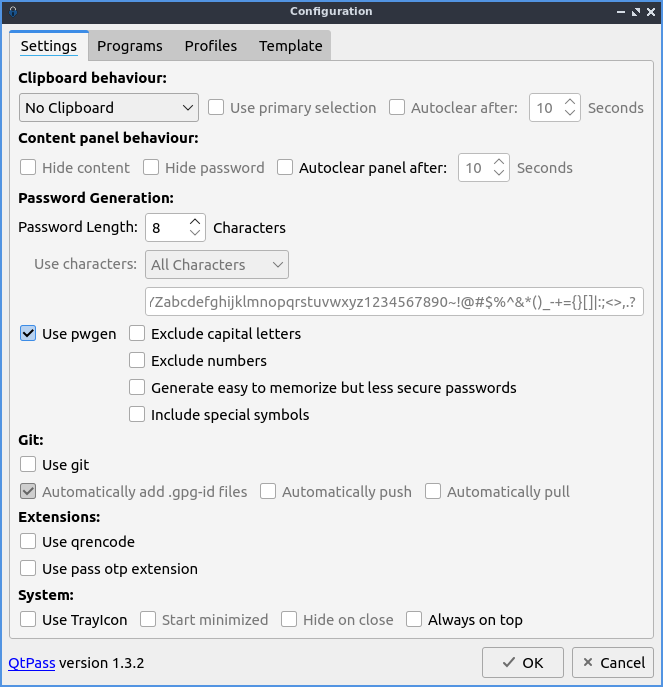

Chapter 2.4.7 QtPass
====================

QtPass is the default password manager for Lubuntu. 

Usage
------

On first launch you will be asked to generate a key to encrypt your passwords. The first field to generate the encryption key is to enter your email in the :guilabel:`Email` field. Next enter your name in the :guilabel:`Name` field. The next field is you need is the password twice in the :guilabel:`Passphrase` field twice to make sure you do not make a typo. To create the encryption key press the :guilabel:`OK` button.

To actually store a password press the button that looks like a piece of paper with a :guilabel:`+` button. Enter the name of the file to store your password in :guilabel:`New password file` and press the :guilabel:`OK` button. To type in your password for an already existing password type it in the :guilabel:`Password` field. To show your password that you have check the :guilabel:`Show password` checkbox. To randomly generate a password press the :guilabel:`Generate` button. To change the length of the generated password change the :guilabel:`Length` field.

To get the password out of a the password manager you will need to enter your encryption key passphrase in the :guilabel:`Password` field.

To add a folder to put passwords in press the folder button with a :guilabel:`+` on it. To get an existing password into a folder left click and drag that password into the folder on the main list. To add a password to a folder right click on the folder and select :guilabel:`Add password`.

To search for a particular password type the password you are searching for in the :guilabel:`Search Password` text box at the top. To end up looking at your password simply left click on it in the list of passwords on the left column of the window and read it in :guilabel:`Password` on the right column. 

To Edit a password left click on :guilabel:`4 horizontal lines button`.To make a new random password press the :guilabel:`Generate` button. To change the length of a randomly generated password change the :guilabel:`Length` field. To enter a new password with the keyboard type in the top left of the window. To type a description of your password type in the bottom field. To save changes to your password press the :guilabel:`OK` button and then enter your encryption passphrase to encrypt the passwords.

To delete a password you do not use anymore right click on it and select :menuselection:`Delete` or press the trash can button with an :guilabel:`X` button.

To manage what users can read these passwords press the :guilabel:`@` button.

To rename a password right click on it and select :menuselection:`Rename password`.

Customizing
-----------

To change your settings for QtPass press the :guilabel:`Gear Button`. To change if QtPass will copy passwords change the drop down under the :guilabel:`Clipboard behavior` drop down. To copy the password into primary selection check the :guilabel:`Use primary selection` checkbox. To have your password cleared from your clipboard after a while to not accidentally paste it anywhere check the :guilabel:`Autoclear after` checkbox and select how long in the field in the right. To hide everything on the right when you click on your password press the :guilabel:`Hide content` checkbox. To have the password hidden when you click on a password check the :guilabel:`Hide password` checkbox. To have the panel automatically clear itself check the :guilabel:`Autoclear panel after` checkbox and change how long on the right.

To change how long to make generated passwords change the :guilabel:`Password Length` field. To change what characters to use use the :guilabel:`Use characters` drop down message. To use a custom set of characters type in what characters in the :guilabel:`Use characters` and type in what characters you want to use. To toggle using the pwgen command line program check/uncheck the :guilabel:`Use pwgen` checkbox. To have autogenerated passwords not have capital letters check the :guilabel:`Exclude capital letters` checkbox. To have your generated passwords not have numbers check the :guilabel:`Exclude numbers` checkbox. To generate easier to memorize passwords check the :guilabel:`Generate easy to memorize but less secure passwords` checkbox. To have generated passwords include special symbols check the :guilabel:`Include special symbols` checkbox.

To use a tray icon for QtPass check the :guilabel:`Use Trayicon` checkbox. To start QtPass minimized check the :guilabel:`Start minimized` checkbox. To have the tray icon hidden when you close QtPass check the :guilabel:`Hide on Close` checkbox. To have QtPass be always on top check the :guilabel:`Always on top` checkbox.

To change profile settings on QtPass use the :guilabel:`Profile` tab. To create a new profile press the :guilabel:`Add` button.

Version
-------
Lubuntu ships with version 1.2.3 of QtPass.

How to Launch
-------------
To launch Qtpass from the menu run :menuselection:`Accessories --> QtPass` or from the command line run

.. code:: 

    qtpass
