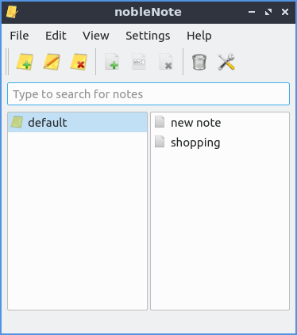
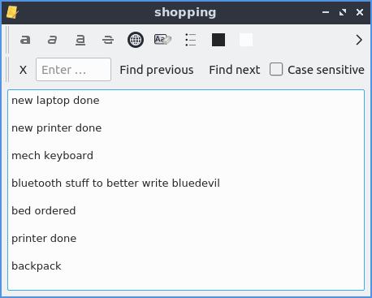
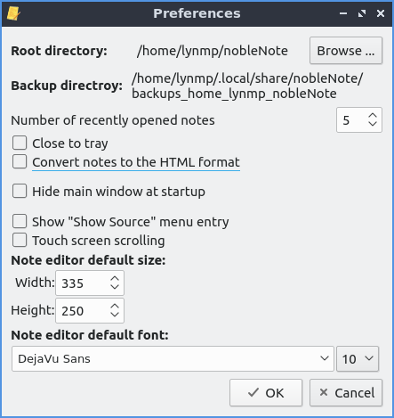

Chapter 2.4.7 nobleNote
=======================

nobleNote is the default application to take a notes on Lubuntu. nobleNote also automatically saves whatever you enter into a note.

Usage
------
To start a new note right click on the right hand column new note or :menuselection:`Edit --> New note`. Then enter a title for this note. To open a note double click on that note from the right hand column which will open a new window with your note in it. To input text in the note type in the main body of this window after clicking on it. To rename your not to something else press :kbd:`Control+Shift+R` or :menuselection:`Edit --> Rename note`.  

If you wish to delete a notebook right click on a notebook and :menuselection:`Delete notebook`, with the notebook highlighted press :kbd:`Control + D`, or :menuselection:`Edit --> Delete notebook`.  To add a new notebook press :kbd:`Control+N` or :menuselection:`Edit --> New notebook`.

To delete a note click on the note and press the button with a page X on it, press :kbd:`Control + Shift + D` or edit :menuselection:`Edit --> Delete note`. To get back a note you deleted press :kbd:`Control+T` or :menuselection:`File --> Trash`. You can then see your deleted notes and select them on the left hand column and then the content of the note on the right hand column. To restore a note press the :guilabel:`Restore` button.

To import notes from a file :menuselection:`File --> Import`.

To search through your notes for a particular string enter what you want to search for in the search bar which says :guilabel:`Type to search for notes`.

If you make a mistake typing and want to undo your changes press :kbd:`Control + z` or :menuselection:`Edit --> Undo`. If you wish to paste text into nobleNote press :kbd:`Control + v` or :menuselection:`Edit --> Paste`. To copy text from your note press :kbd:`Control+C` or right click and select :menuselection:`Copy`. To select all text in a note press :kbd:`Control +A`. 

To toggle showing the toolbar press :kbd:`Control +Shift +T` or :menuselection:`View --> Show toolbar`. 

To bring back up your note nobleNote will leave a notebook icon in the system tray on the lower right hand corner of the panel. To bring the notes backup after closing them left click on the tray icon. To fully close nobleNote right click on the tray icon :menuselection:`Quit` or press :kbd:`Control+Q`.

To search a note for something type into the bar to find something in your note. To go to your next result press the :guilabel:`Find next` button. To find the previous result press the :guilabel:`Find previous` button. To change your font first press the :guilabel:`>` button and then select your font from the drop down on the left. To change your font size of your notes first press the :guilabel:`>>` button and then select your font size from the drop down to the right. To hide searching for something press the :guilabel:`X` button to the far left. To make a case sensitive search press the :guilabel:`>` and check the :guilabel:`Case sensitve` checkbox.

To make the text on your note bold press :kbd:`Control+B` or the **a** button. To make your text on your note italic press :kbd:`Control+I` or the *a* button. To underline your text press my underlined a button. To clear all formatting press the :guilabel:`Aa` button. To insert a hyperlink press :kbd:`Control+K` or press the button looking like a globe. Then type or paste your link in the :guilabel:`Address` field and press the :guilabel:`OK` button. To change your font color for your notes press left click the color square to the left. To highlight your text first select the text andd then press the square to the right and choose the color you want. To strike things out press the button with the line through it. To make bullet points in a list press the button with bullet points and a horizontal line. 

Screenshot
----------

Version
-------
Lubuntu ships with version 1.2.0 of nobleNote.

How to Launch
-------------
To launch nobleNote go to the menu :menuselection:`Accessories --> nobleNote` or run 

.. code:: 
   
   noblenote 
   
on the commandline. The icon for nobleNote looks like a yellow pad of paper with a pencil.

Customizing
------------
To change preferences of nobleNote press :kbd:`Control +P` or :menuselection:`Settings --> Configure`. To keep nobleNote in your system tray after you close nobleNote check/uncheck the :guilabel:`Close to tray` checkbox. If you want to toggle showing notes in HTML format check/uncheck the :guilabel:`Convert notes to the HTML format`. If you want to toggle the menu entry to show source check/uncheck the :guilabel:`Show "Show source" menu entry`. To reverse the direction of scrolling in nobleNote check the :guilabel:`touch screen scrolling` checkbox.  

To change how wide to make the default for the new note editor :guilabel:`Width` field to how big to make the editor for the note. To change how high to make the editor size change the :guilabel:`Height` field. To change what the default font would be for editing is the large bar to the left under :guilabel:`Note editor default font`. To change the default font size change in the small to the right with a number.

