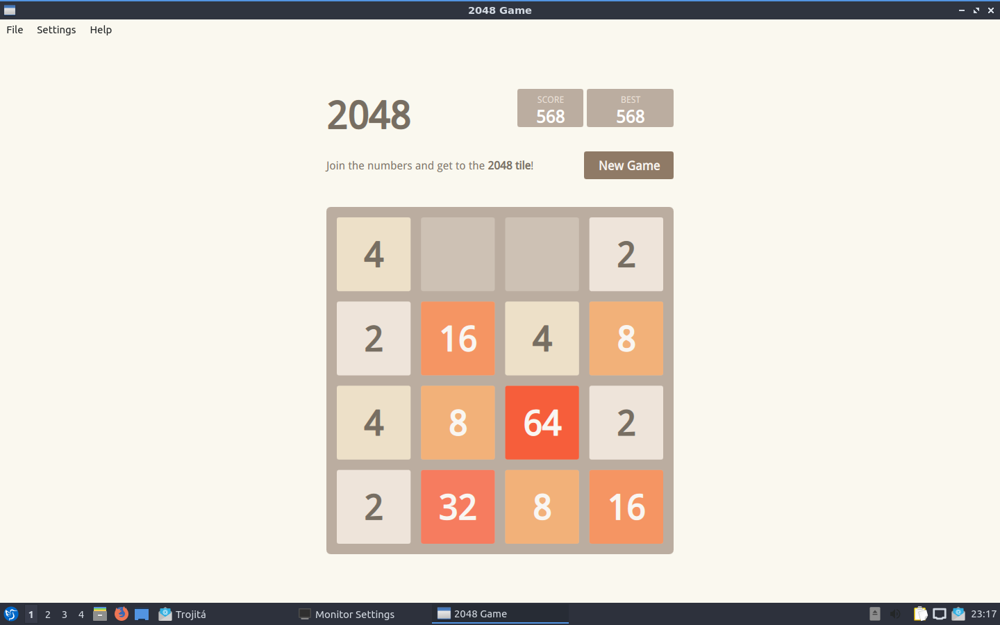

Chapter 2.4.8 2048-qt
=====================

2048 is a fun simple lightweight game included by default.

Useage
------
To play 2048-qt you use the arrows keys to combine blocks with the same number on them.

Screenshot
----------

Version
-------
Lubuntu ships with version 0.1.6 of 2048-Qt. 
How to launch
-------------
To launch 2048-qt go to the menu -> games -> 2048-qt or run 

.. code::
   
   2048-qt 
 
from the commanmd-line.
