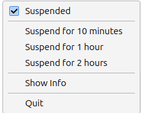
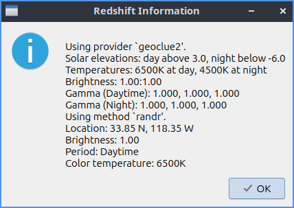

Chapter 2.4.8 Redshift
======================

Redhsift allows you to change your color temperature and have your color temperature change on time of day

Usage
-----
Redshift works by changing the color to be reder to reduce eye strain at night. To achive this Redshift uses geolocation to find when the sun rises and sets and thus works best when connected to the internet. To suspend using Redshift right click on the the tray icon that looks like a light bulb and check the :menuselection:`Suspended` checkbox or left click on the tray icon. If redshift is suspended the tray icon will appear grayed out and will be a brighter white if Redshift is active. To reactivate redshift left click on the tray icon again or right click and uncheck the :guilabel:`Suspended` checkbox.  To quit Redshift right click the tray icon and select :menuselection:`Quit`.

To suspend Redshift for an amount of time by right clicking on the tray icon. To suspend Redshift for 10 minutes right click on the tray icon and select :menuselection:`Suspend for 10 minutes`. To suspend Redshift for 1 hour right click and select :menuselection:`Suspend for 1 hour`. To suspend Redshift for 2 hours right click and select :menuselection:`Suspend for 2 hours`.

.. note:: 

   If you are using Lubuntu to make art or something that depends on how color appears on it it is recommended to suspend Redshift to not have the colors be shifted and appear different from what you see on your monitor.
   
To read information about your settings for color temperature and your location left click on the light bulb tray icon and select :menuselection:`Show info`. To see what color temperatures at day and night read the :guilabel:`Temperatures` field. To view the longitude and latitude Redshift is using read the :guilabel:`Location` field. To see your current brightness read the :guilabel:`Brightness` field. To see what what the current color temperature your display is using read the :guilabel:`Color temperature` field.

To view info on how to change more settings like a manual location setting or changing the color temperature more or less read the redshift man page. To view this manpage run 

.. code:: 

    man redshift
    
from the command line. 

Version
-------
Lubuntu ships with version 0.6.3 of Redshift

How to Launch
-------------

To launch Redshift :menuselection:`Accessories --> Redshift` or run 

.. code::

   redshift-qt
   
from the command line.
