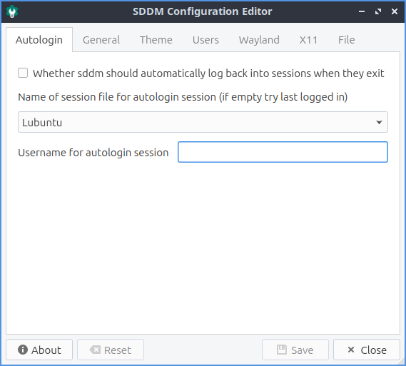
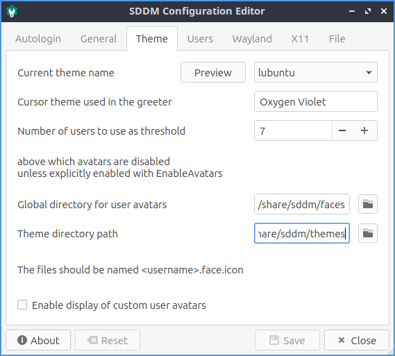
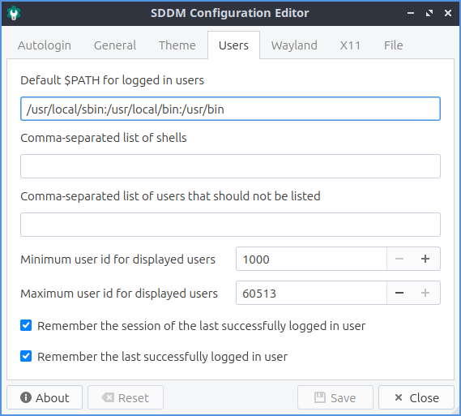
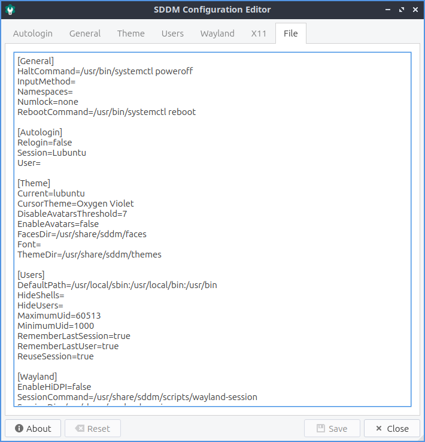

Chapter 2.4.9 SDDM-Configuration
================================
SDDM Configuration lets you customize the screen when you log in to Lubuntu.

Usage
-----
To change SDDM settings with autologin use the :guilabel:`Autologin` tab. To have SDDM log back in after a session exists check the :guilabel:`Whether sddm should automatically log back into sessions when they exit`. To change which session to automatically log into use the :guilabel:`Name of session file for autologin session` drop down. To choose which user to autologin as use the :guilabel:`Username for autologin session` field.

To save your changes for SDDM-Configuration use the :guilabel:`Save` button. After pressing the :guilabel:`Save` button you will need to enter your password as this changes the login screen for all users. To undo your changes press the :guilabel:`Reset` button.

The :guilabel:`General` tab has settings for turning off, rebooting, and keyboard input. To change what command to shut down your system use the :guilabel:`Halt command` field. To change what command to restart your system use the :guilabel:`Reboot command` field. To choose an input method module like an onscreen keyboard to be selectable on your login screen enter it in the :guilabel:`Input method module` screen. To change which state numlock is in when you login use the :guilabel:`Initial Numlock state` drop down.

The :guilabel:`Theme` tab has settings for your theming SDDM. To change your theme name change the current :guilabel:`Current theme name` drop down. To get more themes install packages with sddm-theme in the name. To preview your theme press the :guilabel:`Preview` button. To close your theme preview press the :guilabel:`Close Preview` button. To choose a cursor theme for SDDM use the :guilabel:`Cursor theme used in the greeter` field. The name to type in is the name of the cursor you want you can preview in the Appearance application documented in chapter 3.2.2. To change where to look for SDDM themes use the :guilabel:`Theme directory path` field. To use custom user avatars check the :guilabel:`Enable display of custom user avatars` checkbox. To change where to look for user avatar faces use change the :guilabel:`Global directory for user avatars` field.

To change settings on which which Users log in use the :guilabel:`Users` tab. To not have a user show up to be able to be logged in use the :guilabel:`Comma-separated list of users that should not be listed` field. To choose the minimum user id for users you can log in as change the :guilabel:`Minimum user id for displayed users` field. To change the largest user id to log in as change the :guilabel:`Maximum user id for displayed users` field. To remember who logged in last check the :guilabel:`Remember the session of the last logged in user` checkbox. To remember what session you logged into last check the :guilabel:`Remember the last successfully logged in user` checkbox.

To change settings with the Wayland display server use the :guilabel:`Wayland` tab. To use scale high dots per inch automatically in Wayland check the :guilabel:`Enable Qt's automatic high-DPI scaling` checkbox. To choose where to launch your Wayland startup use the :guilabel:`Path to a script to execute when starting the desktop session` field. To change where to log your Wayland session use the :guilabel:`Path to the user session log file` field. To change where SDDM looks for Wayland session use the :guilabel:`Directory containing available Wayland session` field. 

To manage settings related to the X11 display server use the :guilabel:`X11` tab. To automatically scale high dots per inch by Qt check the :guilabel:`Enable Qt's automatic high-DPI scaling` checkbox. To change which virtual terminal your desktop environment will launch on change the :guilabel:`The lowest virtual terminal number that will be used` field. To change what arguments to launch X server with change the :guilabel:`Arguments passed to the X server invocation` field. To change where SDDM looks for a list of sessions for the X11 display server change the :guilabel:`Directory containing available X sessions` field. To change where to look for a startup script for X11 change the :guilabel:`Path to a script to execute when starting the display server` field. To choose which script to use when stopping the X server use the :guilabel:`Path to a script to execute when stopping the display server` field. To choose where to launch your desktop session from use the :guilabel:`Path to a script to execute when starting the desktop session` field. To tell SDDM where to find the X11 binary change the :guilabel:`Path to X server binary` field. To change where X11 gets permission information change the :guilabel:`Path to xauth binary` field. To tell SDDM the path to Xephyr change the :guilabel:`Path to Xephyr binary` field. To change the path for the file for Xauthority change the :guilabel:`Path to the Xauthority file` field. To change where to log the user session change the :guilabel:`Path to the user session log file` field.

.. image:: sddm-x11.png

To view the config file that is generated by SDDM-Configuration look at the :guilabel:`File` tab.

Version
-------
Lubuntu ships with version 0.2.0 of SDDM-Configuration.

How to Launch
-------------

To launch SDDM-Configuration :menuselection:`Accessories --> SDDM Configuration` or run 

.. code:: 

   SDDM Configuration
   
from the command line.
   
