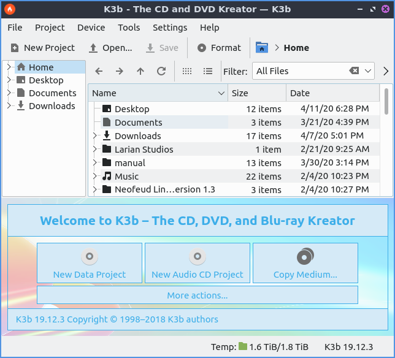

Chapter 2.5.1 K3b
=================

K3b is the default CD or DVD buring software on Lubuntu. 

Version
-------
Lubuntu ships with version 18.04.3 of K3b.

Useage
------
To start a new data project to save documents and other files :menuselection:`File --> New Project --> New Data Project`. To add files to a project :menuselection:`Add Files...`. After doing this a dialog to open files will open up. To select mulitple files to add at this time press :kbd:`Control+ Left click` on the files. To start an audio CD but this will not allow general files bnut will be played in a CD player as audio with :menuselection:`File --> New Project --> New Audio CD Project`. To create a new video DVD that goes in a DVD player :menuselection:`File --> New Project --> New Video DVD Project`.

Another way to add files is to left click on your files in the center of the window. To swtich to a folder double click on them with the left mouse button on a folder. To go up a level press the button that is an upward pointed arrow button. To go back to a previous folder press the leftward pointed arrow button. To go forward to a folder you went back from press the rightward pointed arrow. Another way to switch folders is to click on the folder names on the side pane to the left. To add all files recursively to be added to a project left click to select it and press :kbd:`Shift + Enter` to copy all files in a folder or right click and select :menuselection:`Add to Project`. To reload all files press :kbd:`F5` or right click and select :menuselection:`Reload`. 

To save your files from a project if you wish to burn it later press :kbd:`Control +S` or :menuselection:`File --> Save`. To have all the files from a project removed :menuselection:`Project --> Clear Project`.

The files you add to your project will now be shown at a pane towards the bottom of the screen. If you decide against adding a file after adding it you can select it by left clicking and pressing :kbd:`Delete` or right click and select :menuselection:`Remove`. To rename files to be burned to disc left click to select the file and press :kbd:`F2` or right click and select :kbd:`Rename`. 

To burn to an optical disc press :kbd:`Control+B` or :menuselection:`Project --> Burn`. After burning a popup will appear and the disc should eject when it is done. 

To eject the disc from your drive press :menuselection:`Device --> Eject`. To view information on the disc you have inserted :menuselection:`Device --> Media Info`. If you want to lower noise from the spinning of optical drives :menuselection:`Device --> Set Read Speed...` and set a lower number to make the disk spin slower in cd or dvd players for less noise.

If you have a rewriteable disc you can open the dialog to erase the data from it from the :guilabel:`Format` button or :menuselection:`Tools --> Format/Erase rewritable disk...`. 

If you want to Rip a cd or copy its contents to your computer :menuselection:`Tools --> Rip Audio CD`. Then the files will be selected and a button for :guilabel:`Start Ripping` will appear. To change what kind of file to save your files copied to your computer is under the :guilabel:`Filetype` drop down menu. To toggle whether to create a playlist based on the different tracks on the CD check/uncheck the :guilabel:`Create m3u playlist` for all the files on the disc. To choose where to save your files press the :guilabel:`Target Folder` or press the upward pointing arrow to bring a dialog box to choose where to save the file. To actually rip the media press the :guilabel:`Start ripping` button. 

Screenshot
----------

How to Launch
-------------
To launch K3b from the menu :menuselection:`sound and video --> K3b` or run 

.. code:: 

   K3b 
   
from the command line.
