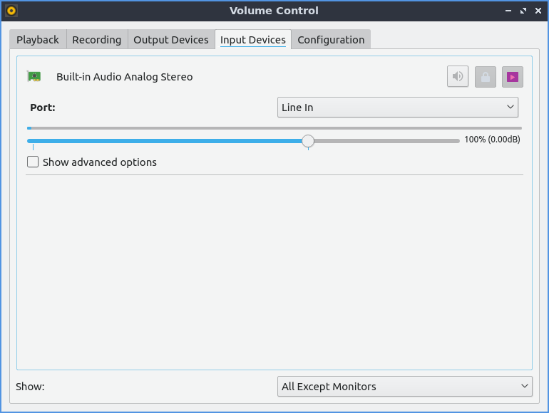
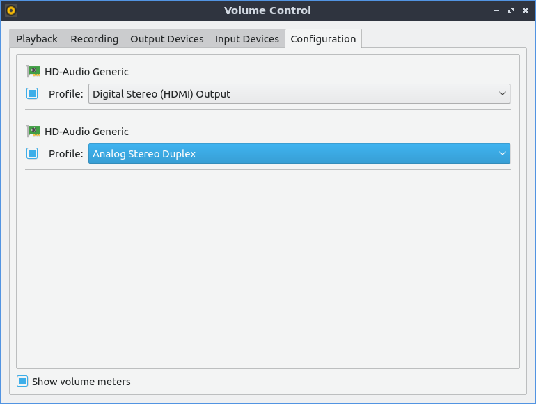

Chapter 2.5.2 PulseAudio Volume Control
========================================

PulseAudio Volume Control is the default volume mixer for Lubuntu.

Usage
------
The :guilabel:`Playback` tab of PulseAudio Volume Control gives you the ability to the control the output device, mute, or change the volume of each application. To change the Volume of each application on the playback slide the slider to the right for more volume or to the left for less volume. Above your volume slider the is a bar that shows how much volume is currently emitted by that particular application. The button with an X over the speaker is a mute button and if it is a darker gray that application is currently muted and can't make any sound. The drop down :guilabel:`Show` drop down menu lets you see your virtual streams and applications. In the bottom right hand corner is the current volume level viewed as a percentage. This program also in software allows you to go over 100 percent volume if it is too quiet. If you have multiple sound outputs plugged in you can change what output a particular application plays out of by checking the checkbox next to the :guilabel:`on` to change what the sound plays from.

.. image:: pavucontrol-playback.png

To view settings for applications recording audio use the :guilabel:`Recording` tab. To mute your recording press the button that looks like a speaker with an x over it. To increase the volume of recording move the slider to the right. To decrease the volume of recording move the slider to the left. 

The :guilabel:`Output devices` tab shows different output for different sounds. To mute one output such as a set of speakers press the button that looks like a speaker with an X on it. To increase the volume of an output slide the slider for that output to the right. To decrease the volume for each output slide the slider to the left. To see the sound output of each output device see the bar over the volume slider. To view more advanced options check the :guilabel:`Show advanced options` will show advanced options. The advanced option for :guilabel:`Latency offset` will be shown for for how long to shift offset for latency for say a badly synced video. To the right of the mute button there is a lock button where you can change the balance between the left and right speakers by sliding the sliders just like for volume. For stereo setup with a subwoofer for example will have channels :guilabel:`Front Left`, :guilabel:`Front Right`, and :guilabel:`Subwoofer` each having there own channels to adjust volume. To change back to a single slider for each channel press the lock button. To select another source to output audio use the :guilabel:`Port` drop down menu.  

.. image:: pavucontrol-qt.png

The :guilabel:`Input devices` tab manager your sound inputs. To mute your microphone in pulseaudio toggle the button that looks like a speaker. To adjust input volume slide the slider to the right to increase volume or to the left to decrease volume. To select which audio input such as line in or microphone for your device is in the :guilabel:`Port` drop down but this menu is hidden if you do not have inputs. To change left and right channels separately press the lock button. To change your volume on each channel drag to the left for more volume or to the right for less volume. To get back to one volume slider press the lock button again. To mute your input press the button to the left on the right hand side. To toggle seeing more options press the :guilabel:`Show advanced options` checkbox. With this shown the :guilabel:`Latency offset` will allow you to change the latency offset.  

The :guilabel:`Configuration` tab has different sound profiles for each different output device. To change how sound comes out of your speakers or headphones  varying for example the number of speakers for each device change the :guilabel:`Profile` drop down menu. Choosing for example an :menuselection:`Analog Surround 2.1 Output` will let you not just change stereo but also control the volume of the subwoofer. To enable or disable an audio output press the checkbox to the left of :guilabel:`Profile`. 

Version
-------
Lubuntu ships with version 0.4.0 PulseAudio Volume Control. 

How to Launch
-------------
To launch PulseAudio Volume Control from the menu :menuselection:`Sound & Video --> PulseAudio Volume Control` or run 

.. code:: 

   pavucontrol-qt 

from the command line. Another way to launch PulseAudio Volume Control is to  left click on the volume applet in the panel and click the :guilabel:`Mixer` button.

