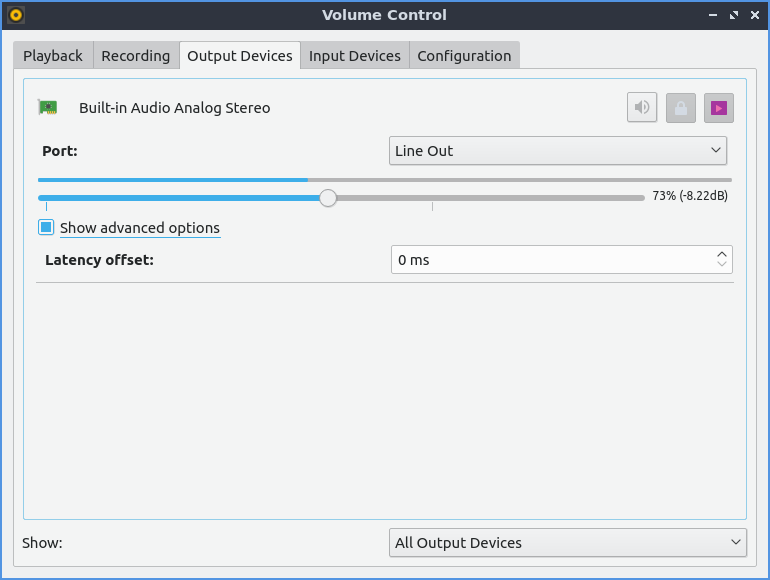

Chapter 2.5.2 Pulse Audio Volume Control
========================================

Pulse Audio volume control is the the default volume mixer for Lubuntu.

Useage
------
The playback tab of pulseaudio volume control gives you the ability to the control the output device, mute, or change the volume of each application. To change the Volume of each application on the playback slide the slider to the right for more volume or to the left for less volume. The button with an X over the speaker is a mute button and if it is a darker gray that application is currently muted and can't make any sound. The drop down menu has next to the word on shows the output source.
.. image:: pavucontrol-playback.png

The output devices tab shows different output for different sounds. To mute one output such as a set of speakers presss the button that looks like a speaker with an X on it. To increase the volume of an output slide the slider for that output to the right. To decrease the volume for each output slide the slider to the left.

To mute your microphone in pulseaudio toggle the button that looks like a speaker. To adjust input volume slide the slider to the right to increase volume or to the left to decrease volume. To select which input such as line in or microphone for your device is in a drop down menu.  

Version
-------
Lubuntu ships with version 0.4.0 Pulse Audio Volume Control. 

How to launch
-------------
To launch pulse audio volume Control from the menu :menuselection:`Sound and video --> Pulse Audio Volume control` or run 

.. code:: 

   pavucontrol-qt 

from the command line. Another way to launch Pulse audoio volume control is to click on the volume applet in the panel and click the mixer button.

