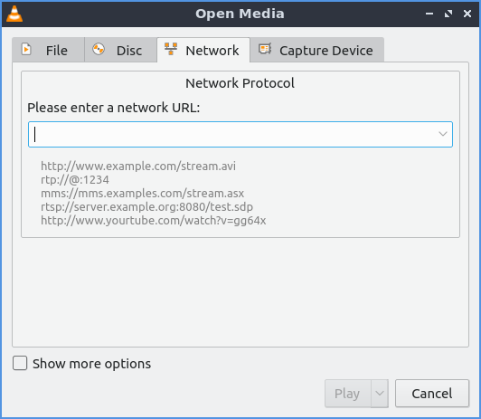
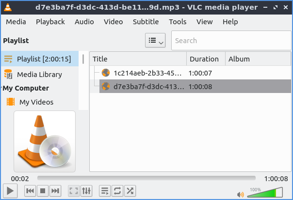
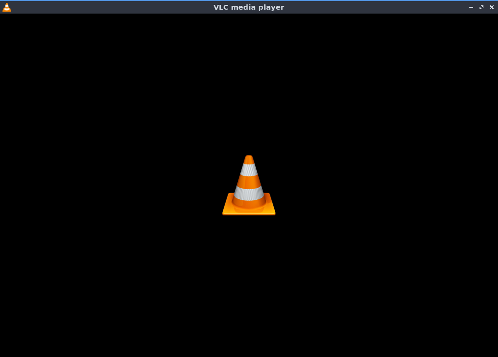
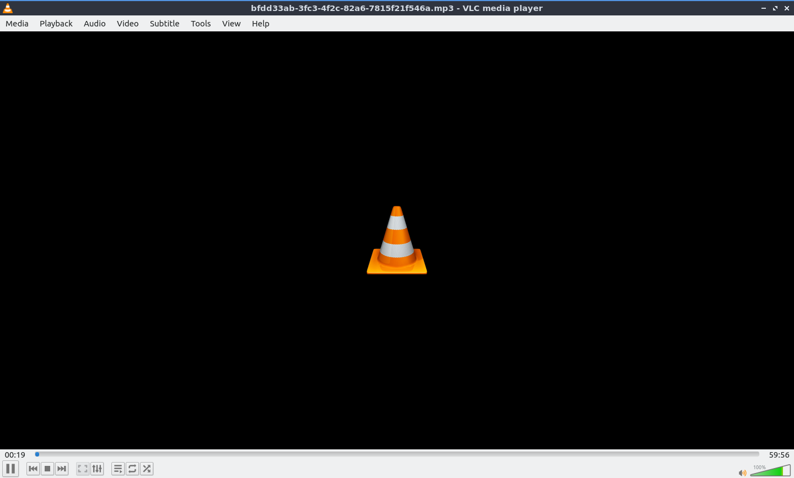
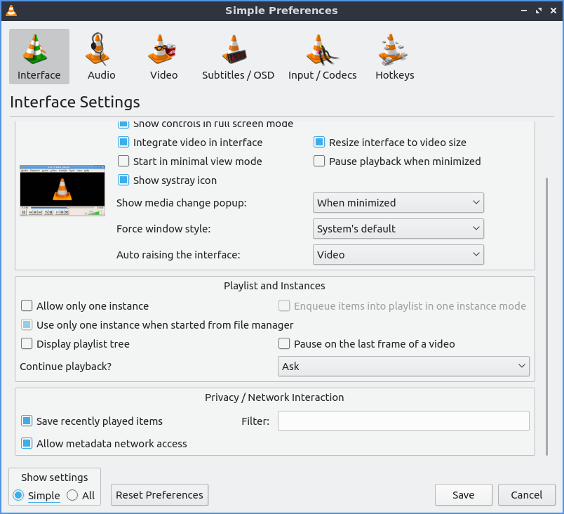
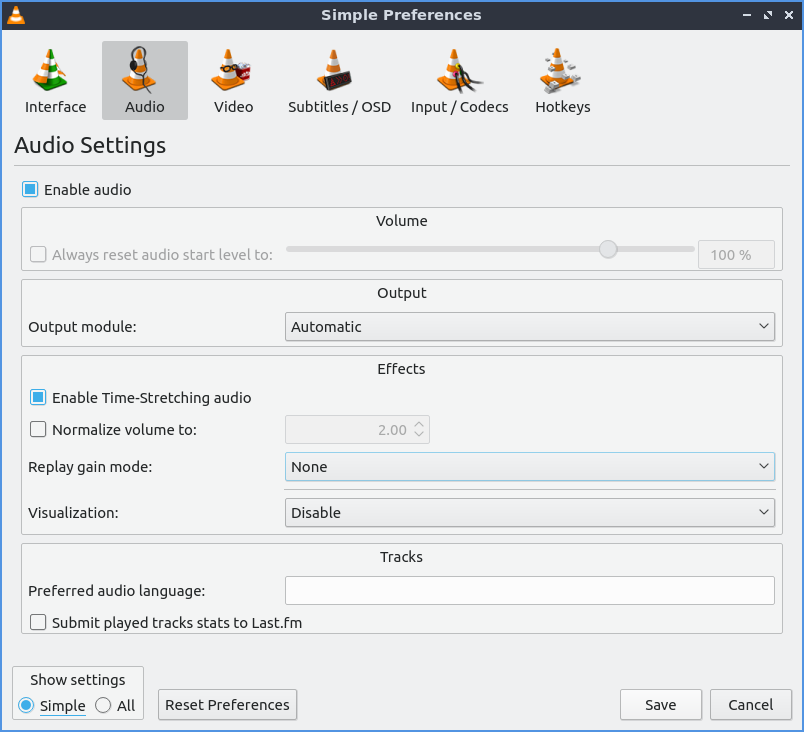
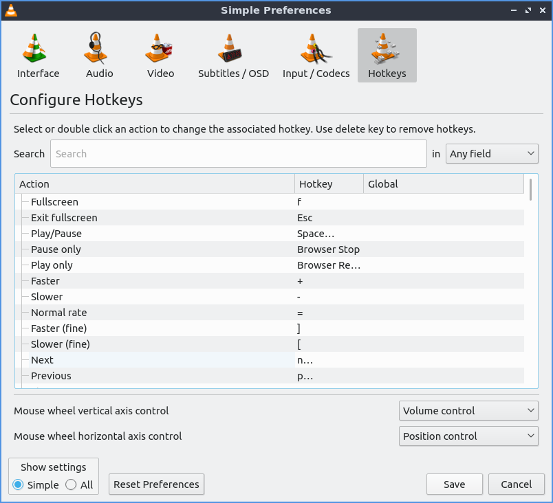
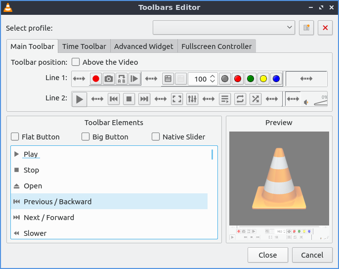

Chapter 2.5.3 VLC
=================

VLC is the default media player for Lubuntu that can open both audio and video files.

Usage
------
To open media stored locally on your system click media open :menuselection:`Media --> Open File` and navigate your local files or press :kbd:`control +o` on the keyboard to open files stored locally on your machine. If you wish to open media from somewhere on the internet on :menuselection:`Media --> Open Network Stream` or press :kbd:`Control + N`. To open a whole directory use :menuselection:`Media --> Open Directory` or press :kbd:`control +F`. VLC also keeps track of recently opened media in case you want to view media again in :menuselection:`Media --> Open Recent Media --> file name`. If you have copied a path in your clipboard or something you can press :kbd:`Control +V` or :menuselection:`Media --> Open Location from clipboard`.   

To pause playback of a file press the button that look like two vertical lines or :menuselection:`Playback --> Pause`. To resume playback press the right playback button. To toggle fullscreen press the button which has the four corners of the screen or :menuselection:`Video --> Fullscreen` to make it fullscreen and the four screens to have it back into windowed mode. To have vlc always on top :menuselection:`View --> Always on top` and check the checkbox in the menu. 

On the bottom right of vlc there is a bar that gets wider for volume. Click farther to the right to increase volume within vlc or press :kbd:`Up arrow` to increase volume or :kbd:`Down arrow` to decrease volume. Or hover the cursor over this bar and use the mousewheel to control volume. The button that looks like a speaker next to this toggles mute in vlc. Another way to mute the volume is to :menuselection:`Audio --> Mute`. 

To see how long you have been watching the current piece of media counts up above the play pause button in a time. At the other side a number will show the length of the media you are playing and inbetween is a slider with the current time. Moving the slider to the left will rewind playback while moving it to the left will fast forward playback. When you mouseover the progress for playback it will show the time at that point and that will jump to that time when you left click. Another way to jump to a specific time is to press :kbd:`control +T` or :menuselection:`Playback --> Jump to Specific Time`. To move back 10 seconds in playback press :kbd:`Left arrow`. To jump forward 10 seconds in playback press :kbd:`Right arrow`.

To move to the next item in a playlist press the button that has two arrows pointing to the right and a vertical line or :menuselection:`Playback --> Next`. To move to the previous item in a playlist press the button with two leftward pointing arrows and a vertical line or :menuselection:`Playback --> Previous`.

To make the same sound come out of both speakers go to :menuselection:`Audio --> Stereo mode --> Mono`. The sound to make a different left and right channel on each speaker will be :menuselection:`Audio --> Stereo Mode --> Stereo`. To make all sound come from the left channel :menuselection:`Audio --> Stereo Mode --> Left` and likewise for Right. To change what device audio from vlc come out :menuselection:`Audio --> Audio Device --> output device you want`. 

To open an equalizier press the button that looks like several physical slider switches, press :kbd:`Control+E` or :guilabel:`Tools --> Effects and filters` and use the :guilabel:`Audio effects` tab and :guilabel:`Equalizer` subtab. To enable the equalizier check the :guilabel:`Enable` checkbox. Then to increase or decrease the sound at each frequency up to increase the volcume at that frequency. To select an equalizer preset use the :guilabel:`Preset` drop down menu. On the :guilabel:`Advanced` tab of audio effects there is a meter to adjust the pitch of the currently playing audio. To enable this effect check the :guilabel:`Enable` checkbox. To increase the pitch of the audio move the slider up. To decrase the pitch of the audio move the slider down.

To change how the audio and video synchronize with the rest of the file use the :guilabel:`Synchronization` tab. To change the synchronization of your audio with the video change the :guilabel:`Audio track synchronization` field to get it to match with your video. To change the synoronization of subtitles use the :guilabel:`Subtitle track synchronization` field.

To view a playlist of music or videos you can view press the button that is several horizontal lines and then a triangular play button on it or press :kbd:`Control + l`. This will bring up a whole view of your playlist. To return to your original view press :kbd:`Control + l`. To add more files to your playlist right click on the bottom of the playlist window and click add file to add an additional file. To play a particular file from a playlist double click on the file. To remove a file from a playlist right click on it and select :menuselection:`Remove Selected`. To remove all files from a playlist right click and select :menuselection:`Clear the playlist`.  

To change the view of the playlist right click playlist view mode to the version of the playlist you like the look of the best. To switch to where to find your music left click the :guilabel:`My Music` on the left side pane. To switch to where you find your videos on the left side pane click the :guilabel:`My Videos` side pane. If you wish to save a current playlist to a file :menuselection:`Media --> Save Playlist to File` or press :kbd:`Control +Y`. To change how to sort your playlist right click on the playlist and select :menuselection:`Sort by` and select how you want to sort your checklist.

To change the view mode of the playlist :menuselection:`View --> Playlist View Mode`. 

To loop the current playlist over and over press the button with an arrow pointing to the right and then another arrow below it pointing to the left. To randomize your playlist press the button with two crossing arrows on it.

To speed up playback faster than normal press the :kbd:`+` key or use :menuselection:`Playback --> Speed --> Faster`. To slow down playback slower than normal press the :kbd:`-` key :menuselection:`Playback --> Speed --> Slower`. If you want to reset your speed to normal :menuselection:`Playback --> Speed --> Normal speed`. If you want to have vlc end at the end of the playlist click the checkbox :menuselection:`Media --> Quit at end of playlist`. 

To view info on your media press :kbd:`Control + I` or click :menuselection:`Tools --> Media info`.

If you want a minimal interface that hides menubar and toolbars press :kbd:`Control +H` or :menuselection:`View --> Minimal View`. To access the fucntionality of the menubar you can right click on where the video will play. To get back to the default view press :kbd:`Control+H` again or right click and then :menuselection:`View --> Minimal View`. 

To view more advanced controls :menuselection:`View --> Advanced Controls`. To view to a status bar with what is playing and the speed with :menuselection:`View --> Status bar`. 

To change the aspect ratio of a video :menuselection:`Video --> Aspect Ratio` and select the one you wish. To crop a video to only part of your screen :menuselection:`Video --> Crop` and select the aspect ratio you want to crop the video to. To take a screenshot of the currently playing media :menuselection:`Video --> Take Snapshot`. 

If you are playing audio and want a visualization while listening to an audio file :menuselection:`Audio --> Visualizations` and choose the one you want.

Screenshot
----------

Customizing
-----------
To view your preferences of VLC press :kbd:`control +P` or :menuselection:`Tools --> Prefrences`. To choose to use a custom skin for vlc press the :guilabel:`Use custom skin` radio button. To toggle showing the controls for pausing playback and other things check/uncheck the :guilabel:`Show controls in full screen mode` checkbox. To have the video display in its own window uncheck the :guilabel:`Integrate video in interface` checkbox. To start vlc in a minimal view mode check/uncheck the :guilabel:`Start in minimal view mode` checkbox. To have vlc pause playback when the vlc window is minimized check/uncheck the :guilabel:`Pause playback when minimized` checkbox. To toggle showing an icon in the system tray check/uncheck the :guilabel:`Show systray icon` checkbox. To change vlc showing a popup when the media changes like when having multiple files in a playlist change the :guilabel:`Show media change popup` menu. The :guilabel:`Force window style` changes the way vlc windows are drawn if you want a custom layout for just vlc. To allow only one window of vlc check the :guilabel:`Allow only one instance` checkbox. If you have only one instance check the :guilabel:`Enqueue items into playlist in one instance mode` checkbox to add new files to play at the end of the playlist.  To have vlc continue playback of files changes change the :guilabel:`Continue playback?` menu and select Always to always playback or ask to ask for playback.

To cancel your changes in this window and close it press the :guilabel:`Cancel` button. To Reset your prefrences to press the :guilabel:`Reset Prefrences` button. To Save your prefrences and close the window press the :guilabel:`Save` button. 

To manage your audio settings use the :guilabel:`Audio tab`. To disable audio entirely uncheck the :guilabel:`Enable audio` checkbox. To change the output of audio type change the :guilabel:`Output module` menu. To add a visualization of Audio change the :guilabel:`Visualization:` menu. To change replay gain mode change the :guilabel:`Replay gain mode` menu. To allow playing audio at different speeds without changing the pitch is to check the :guilabel:`Enable Time-stretching audio` checkbox.

To change settings with how vlc deals with video use the :guilabel:`Video` tab. To disable video and thus save some processing power uncheck the :guilabel:`Enable Video` checkbox. To have window decorations on a seperate video window check the :guilabel:`Window decorations` checkbox. To automatically have fullscreen video check the :guilabel:`Fullscreen` checkbox. The menu :guilabel:`Fullscreen Video Device` menu lets you select which monitor to play the full screen video. To change the backend for vlc to play videos change the :guilabel:`Output` menu. To turn deinterlacing on or off change :guilabel:`Deinterlacing` menu. The mode :guilabel:`Mode` changes the mode to deinterlace the frames of video. The guilabel:`Directory` is what directory to save snapshots of videos in and to choose one in a pop up window press the :guilabel:`Browse` button. The :guilabel:`Prefix` field lets you have a preshot to the snapshot file name. You can choose the format of the snapshot in the :guilabel:`Format` menu.

To change settings with codecs choose the :guilabel:`Input/codecs` tab. To change your settings for hardware-accelerated decoding use the :guilabel:`Hardware-accelerated decoding` which you can choose a specific kind of decoding. To change your default optical device the drop down menu next to :guilabel:`Default optical device` to change your default optical device.

To view your settings for subtitles and on screen display choose the :guilabel:`Subtitles/OSD` tab. To disable the On screen display uncheck the :guilabel:`Enable On Screen Display` checkbok. The checkbox :guilabel:`Show media title on video start` shows the video title at the start of a video. The :guilabel:`Position` menu lets you choose where to show the media title. To toggle showing subtitles check/uncheck the :guilabel:`Enable subtitles` checkbox. The :guilabel:`default encoding` Lets you change how the subtitles are stored and resented as characters on this. To change the font of your subtitles type in the name of your font in the :guilabel:`Font` field. To change the font size of your subtitles change the :guilabel:`Font size` menu. The button :guilabel:`Text default color` lets you change your subtitles.To change the outline thickness of subtitles change the :guilabel:`Outline thickness` menu. To change the color of the outline press the :guilabel:`Outline Color` button to bring up a popup to select a color. To add a shadow to subtitles check the :guilabel:`Add a shadow` checkbox. To add a background check the :guilabel:`Add a background` checkbox.
 

To view your hotkey settings use the  :guilabel:`Hotkeys` tab. The column :guilabel:`Action` describes what your keyboard shortcut will do. The Column :guilabel:`Hotkey` is the keyboard shortcut to do what is said in the :guilabel:`Action` column. To change your keyboard shortcut double click on the shortcut in the :guilabel:`Hotkey` column and press the keyboard combination you want to set it to. To change what scrolling vertically does for use the :guilabel:`Mouse wheel vertical axis control` menu.

To change how the user interface of VLC appears :menuselection:`Tools --> Customize Interface`. To select a profile that works as a default some ones for older versions of VLC choose the :guilabel:`Select profile:` drop down menu. To create a new profile press the button to the right press the paper with a sun on it. To move the main toolbar above the video check the :guilabel:`Above the video` checkbox. Below will be the lines of each toolbar for example :guilabel:`Line 2` for each line of toolbar. To see a summary of what each button does hover the mouse over it and a description will pop up.To move a button to the left or right left click and drag to the left and right the button to the desired position. To see a preview of how this will effect the media player and see it press the :guilabel:`Preview` section of the window.

To change the elements for the time toolbar use the :guilabel:`Time toolbar` tab. To move elements on the time toolbar left click on the element and drag it into place. To change the location of advanced features use the :guilabel:`Advanced Widget` tab. To move the elements on the advanced toolbar left click on the element and drag it into place.

To view plugins and extensions dialog window :menuselection:`Tools --> Plugins and Extensions`. To download more extensions press the :guilabel:`Find More Online` button. To view only plugins you have installed on your system check the :guilabel:`Only installed` checkbox. To view all addons click on the :guilabel:`All` tab of addons. To view only skins to view vlc differently press on the :guilabel:`Skins` tab. To view an extensions to add on click on the :guilabel:`Extensions` tab. 

To show your Active extensions use the :guilabel:`Active Extensions tab`. To reload to see if there are any more press the :guilabel:`Reload extensions` button. To see more information on an extensions press the :guilabel:`More information` button. To change how many frames per second are on the substitles change use the :guilabel:`Subtitle spped` field. To change how long the subtitles stay on the screen change the :guilabel:`Subtitle duration factor` field.

Version
-------
Lubuntu ships with version 3.0.4 of VLC.

How to launch
-------------
to launch vlc in the menu go to :menuselection:`Sound and video --> VLC media player` or run 

.. code:: 

   vlc 
   
from the command line.

