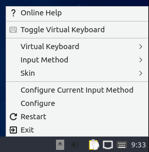

Chapter 3.1.1 Fcitx
===================

Fcitx is the default input manager for Lubuntu and shows as a tray applet in lxqt-panel. 

Version
-------
 Lubuntu ships with version 1:4.2.9.6-4 of Fcitx. 

Useage
------
To use a virtual keyboard right click on the tray icon in the system tray that looks like a keyboard and toggle virtual keyboard. 

To switch your keyboard method with the applet is to left click on the applet :menuselection:`Input Mehtod --> Desired keyboard layout`. 

To bring up a configuration dialog for input method right click on the panel applet and :menuselection:`configure current input method`. 

To restart fcitx right click on the applet and click :menuselection:`Restart`.

Screenshot
----------

How to launch
-------------
To launch the fcitx applet from the menu :menuselection:`system tools --> fcitx` with icon with a penguin with a paintbrush. If you wish to run the applet from the command line run 

.. code:: 

   fcitx

