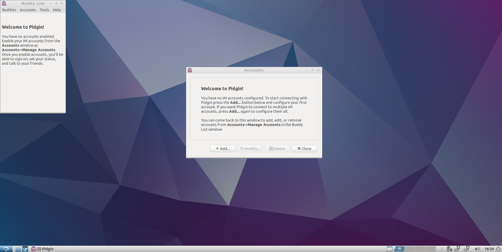

Chapter 3.1.2: Pidgin
==============================

Description
---------------
Pidgin is a chat program which lets you log in to accounts on multiple chat networks simultaneously. 
For example, you can chat with friends on MSN, talk to a friend on Google Talk, and sit in a Yahoo chat room all at the same time.

Pidgin has diverse features such as:
 - Allow connection to multiple chat networks simultaneously
 - File transfer
 - Away messages
 - Numerous plugins
 - System integration with GNOME 2, KDE 3, KDE 4, Windows
 - Translations

Usage/Screenshots
----------------------

Version
----------
Lubuntu currently ships with Pidgin 2.12.0.

How to launch
----------------
To open Pidgin, click on the Pidgin icon (light purple face of a bird) in the Lubuntu Menu.
You can also type and run `pidgin` in the terminal to open it.